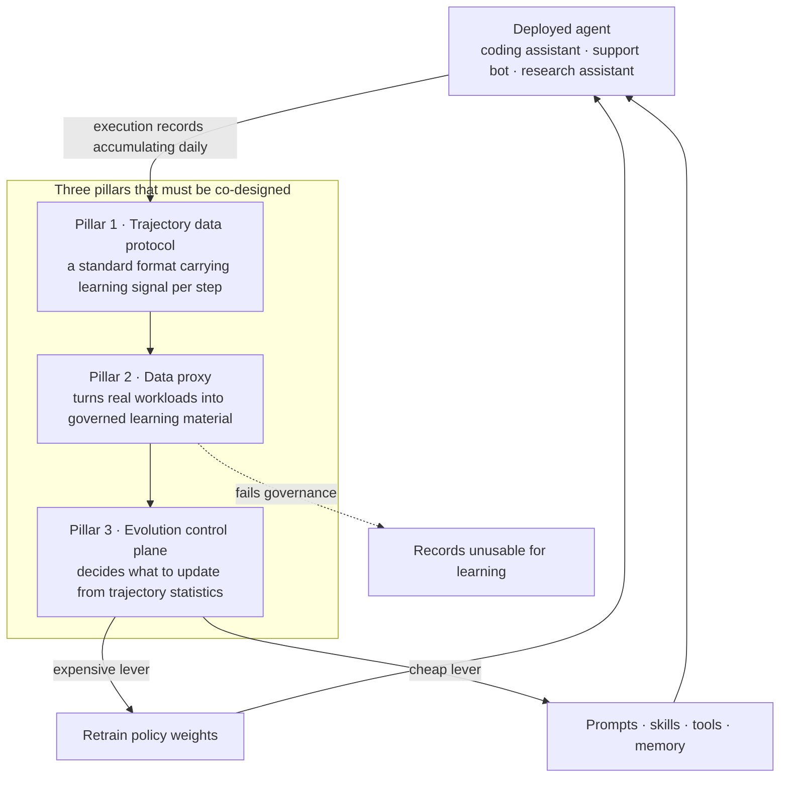

Something strange starts the day after you ship an agent to production. Users hit it every day, the agent handles thousands of tasks, and yet the agent itself has not moved an inch from the day it was deployed. Weights are frozen, the system prompt is frozen, the tool list is frozen. The only thing accumulating is logs, and those logs usually pass through an observability dashboard once and then disappear. A paper posted to arXiv on 1 July 2026 points at a slightly unexpected culprit for this frozen state. Not the model, not the algorithm. The plumbing.

*Records that pile up every day and flow nowhere are where this paper starts.*

## Why this is worth reading

This is for you if you have already deployed an agent, it has not improved with time, and you are waiting on the next model release. The conclusion up front: what you are waiting for is not a better model, it is a data pipeline you have not built yet. The execution records your agent produces every day are not in a form you can learn from, and converting them into a learnable form is a systems problem, not an algorithms problem.

## Overview

The paper is titled "Next-Generation Agentic Reinforcement Learning Systems Enable Self-Evolving Agents", arXiv number 2607.01120. It went up on 1 July 2026 with a revision the next day. The authors are affiliated with Ant Group, HKUST and Tsinghua University. The title reads like another RL algorithm paper, but it is not one. It proposes no new algorithm and boasts no new benchmark score. Instead it stakes out a position.

The position is this. The foremost bottleneck for enterprise-scale self-evolving agents is not the absence of more powerful LLMs, nor the absence of more effective RL algorithms, but the absence of a system substrate that can transform deployed agent experience into governed, credit-assignable and replayable learning material.

What makes the claim interesting is that it stands in falsifiable form. If the bottleneck were the algorithm, deployed agents would improve every time a better algorithm arrived. Reality does not work that way. RL algorithms and models have both improved over the past two years, yet most agents deployed in enterprises still improve only through a human reading logs by eye, editing a prompt by hand and redeploying. The paper argues that this slow manual loop persists not out of laziness but because the plumbing does not exist.

## The three gaps the paper identifies

The paper argues that current agentic RL systems and the surrounding observability stack fall short in three essential respects. These three form the spine of the argument, so it is worth taking them one at a time.

First, there is no standardized agent trajectory data protocol capable of carrying RL learning signals at step granularity across heterogeneous agent paradigms. The operative phrase is step granularity. The logs we normally keep sit at the request and response level. But when an agent produces a wrong answer after ten tool calls, the information learning needs is not that the result was wrong, it is which of the ten steps went off the rails. The claim is that no standard container exists for that information.

Second, there is no enterprise-grade comprehensive data proxy that converts real workloads into governed learning substrates. This part is closer to governance than to technology. You cannot feed execution records laced with customer data straight into training. They have to be cleaned, permission-checked and replayable when needed, and almost nobody ships that layer as a product.

Third, there is no unified agent evolution control plane that automatically decides, based on trajectory statistics, whether to update policy weights or evolve the in-context harness. This is the most operationally real of the three. When an agent underperforms you have several levers available. You can edit the prompt, add a skill, refresh memory, or retrain the model. Each differs in cost by two orders of magnitude or more. And yet the decision about which lever to pull is today made almost entirely by human intuition.

The paper proposes three co-designed pillars answering these three gaps: a standardized trajectory data protocol, an enterprise-grade data proxy, and a unified evolution control plane. It stresses that the three cannot be built separately. They have to be designed together.

## How the three pillars interlock

*Break the chain and records pass through a dashboard and vanish. Connect it and you get a loop.*

The part of this diagram worth staring at is the dotted line dropping to the lower right. If the data proxy cannot clear governance, those records cannot be used for learning. That is why the paper makes the data proxy a pillar of its own. The set of data you can technically collect and the set you may legally train on are different sets, and in an enterprise the latter is much smaller.

## AReaL as the precursor implementation

The argument is not pure thought experiment. There is a real system out of the same camp. AReaL, built jointly by the RL Lab at Ant Research and Tsinghua's Institute for Interdisciplinary Information Sciences, with the version tagged boba² billing itself as a fully asynchronous RL system.

AReaL's core design decision is to fully decouple generation from training. In traditional synchronous RL you collect rollouts and then run training, which leaves GPUs idling in alternation. Pull the two apart asynchronously and each side can run at its own pace. The project claims roughly 2.77 times the training speed of the synchronous approach with this structure, and reported state-of-the-art results at the time on LiveCodeBench, Codeforces and CodeContests. Read those numbers with the caveat that they are the project's own measurements.

The more practically important part sits elsewhere. AReaL lets you independently customize the dataset, the rollout behavior and the training algorithm, and drew the boundaries so that doing so does not require touching heavy system-level code. That is one of the paper's pillars in concrete form. The format of the learning material and the execution machinery of the system have to be separable before you can evolve by swapping material. Models at 8B, 14B and 32B are published, so the structure can be opened up directly.

## Holding the same ruler against our own policy file

This paper stung because the third pillar was not somebody else's problem. ThakiCloud's automation skills already have something control-plane shaped. A file at `scripts/skills/skill_model_policy.json` governs the model tier of eighteen scheduled skills, and `skill_retro.py` records the outcome at the end of every run and updates the policy.

The rule is simple. A skill starts on a cheap tier, gets promoted automatically once two consecutive bad runs accumulate, and the consecutive-failure counter resets on a clean run. There is no automatic demotion. In the paper's vocabulary this is a miniature control plane deciding what to update from trajectory statistics. Of the current eighteen, ten are tier-pinned and six are running on the upper tier.

Read that file through the paper's lens, though, and two failures come into focus. Both actually happened and both are recorded in the file.

The first failure is one of trajectory statistics quality. Several entries in the policy file carry notes that failures caused by hitting the account's weekly usage limit were miscounted as quality failures, pushing the tier up incorrectly. Two orchestration-flavored skills were promoted that way and were manually rolled back once the cause was understood. The paper's first gap points exactly here. If the signal is not differentiated at step granularity you cannot distinguish the kind of failure, and decisions made on statistics that cannot tell kinds apart come out wrong. Quota exhaustion and quality shortfall present as the same exit code, but the remedies are opposites.

The second failure is having only one lever. One entry in the policy file was promoted to the upper tier on 11 July 2026, and its consecutive-failure counter has climbed to twenty-one since. Promotion did not solve the problem. Because the only lever our control plane could pull was model tier, there was nothing to do once the cause lay elsewhere. That is precisely why the paper defines the control plane with weight updates and in-context harness evolution side by side. One lever does not make a control plane. It makes an auto-promotion switch.

## What this means for ThakiCloud

**Through the Paxis lens** this paper reads like a roadmap. Paxis is the Agent-Native Cloud control plane running on top of ai-platform, treating Skills, Tools, Policies and Audit Logs as first-class resources. Map those four onto the paper's three pillars and the picture lines up. Audit logs are where trajectory data is born, policies are the rules a data proxy applies when judging what may pass, and skills and tools are the cheap levers a control plane can pull instead of weights.

Separating what we already have from what we do not makes the next task obvious. We have audit logs, but not in a format that carries step-level learning signal. We have policy gates, but they do not connect to a path that promotes execution records into learning material. Defining skill execution logs as a replayable trajectory format is the first of the three pillars, and the other two can only be built on top of it. Knowing the order is the most practical thing this paper hands over.

**Through the ai-platform lens** the second pillar is an infrastructure requirement. Turning execution records into learning material means storing, cleaning and replaying those records somewhere, and when customer data is mixed in, that work becomes a question of which physical boundary the data stays inside. For customers with on-premise and sovereignty requirements this is not a negotiating point, it is a precondition. Layering trajectory collection and replay pipelines onto K8s-based multi-tenant isolation and Kueue GPU scheduling would not be selling an observability feature. It would be selling the precondition for self-evolution.

The two lenses point the same way. ai-platform physically guarantees the boundary the data stays within, and inside it Paxis enforces the policy that promotes trajectories into learning material. The paper's insistence on co-designing the three pillars shows up again in the relationship between these two layers.

## Limits and counterarguments

A few things are worth naming before taking this paper at face value.

First, this is a position paper, not a validated system report. The argument that three pillars are needed is persuasive, but there is no measurement inside the paper showing a system with all three actually achieving self-evolution at enterprise scale. There is a wide gap between an architecture proposal and a demonstration that it works, and this paper still stands on the near side.

Second, a standard protocol does not solve credit assignment for you. Building a container that holds signal per step and judging which of ten steps caused the failure are different problems. The latter is hard on its own terms and does not resolve itself once the container exists. The paper emphasizes the missing container but says relatively little about the difficulty that begins once it is full.

Third, governance costs can exceed the gains. Turning real work records into learning material means retaining customer data for a long time, and in regulated industries that is close to non-negotiable on its own. The data proxy is offered as the layer that resolves this, but in practice deciding not to use the data at all is often cheaper than building the proxy.

Fourth, automatic update decisions are themselves risky. As our two policy-file cases show, a decision made automatically on bad statistics quietly raises cost and obscures the cause. The smarter a control plane gets, the harder it becomes for a human to trace the basis of its judgment. The gain from automation and the loss in traceability have to be counted together.

Fifth, AReaL's performance figures are self-reported by the project. That an asynchronous structure beats a synchronous one is structurally plausible, but the specific 2.77x multiple comes from the developers rather than an independent reproduction. Safer to cite it with the source attached.

## Wrapping up

The value of this paper lies not in a new technique but in a relocation of the problem. It turns a gaze that looked for the reason agents fail to improve in models and algorithms toward the execution records that pile up daily and flow nowhere.

That was the conclusion stated at the top: what you are waiting for is not a better model, it is a data pipeline you have not built yet. We only confirmed, after holding the same ruler against ourselves, that the control plane we thought we had was in fact a one-lever promotion switch, and that the switch had spun twice on bad signal. Until then it looked like automation working fine.

If the agent you deployed has been unchanged for months, try one question before checking the next model release date. Where are the execution records that agent produced yesterday, and what can you change with them? If the answer ends at a dashboard, the bottleneck is not the model.

## Sources

- [Next-Generation Agentic Reinforcement Learning Systems Enable Self-Evolving Agents (arXiv:2607.01120)](https://arxiv.org/abs/2607.01120)
- [Revised version of the paper (arXiv:2607.01120v2)](https://arxiv.org/abs/2607.01120v2)
- [AReaL open-source repository (inclusionAI/AReaL)](https://github.com/inclusionAI/AReaL)
- [AReaL-boba-2-32B model card (Hugging Face)](https://huggingface.co/inclusionAI/AReaL-boba-2-32B)
- [AReaL: A Large-Scale Asynchronous Reinforcement Learning System for Language Reasoning (arXiv:2505.24298)](https://arxiv.org/abs/2505.24298)
- [Coverage of the Ant Group and Tsinghua AReaL-boba² release (DeepNewz)](https://deepnewz.com/china/ant-group-tsinghua-launch-open-source-areal-boba2-async-rl-system-2-77x-faster-24c514e7)
