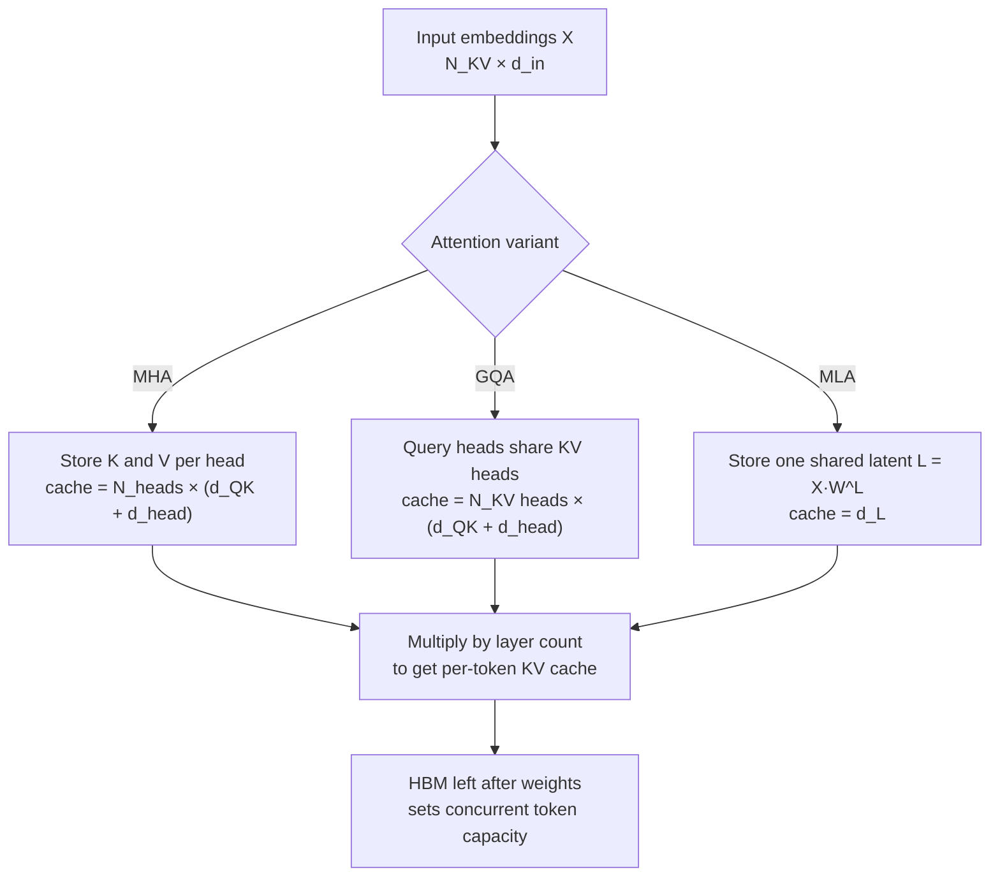

*Many per-head key/value caches compressing into one shared latent vector.*

## Why read this

This is for infrastructure engineers who serve open-weight LLMs with vLLM or SGLang and have to answer "how many GPUs does this model need?" The conclusion first: per-token KV cache is almost independent of parameter count. It is determined by three things only, namely layer count, KV head count, and head dimension. That is why a 27B model can genuinely consume more cache per token than a 70B one.

This post does that calculation by hand. The basis is [Understanding Transformers and Attention Mechanisms: An Introduction for Applied Mathematicians](https://arxiv.org/abs/2604.00965), posted to arXiv in April 2026. It is a 13-page introductory paper by Michel Fabrice Serret of the Paul Scherrer Institute in Switzerland, written as a presentation for the "Randomization in Transformer models" project at IPAM's "Randomized Numerical Linear Algebra" workshop. Its arXiv classification is numerical analysis (math.NA), not machine learning.

## Overview

Transformer explainers are not scarce. What makes this paper different is that it addresses applied mathematicians. Instead of building intuition through analogy, it pins down in tables what dimension each matrix has and what stays resident in memory. That is exactly the useful part for practitioners. Capacity planning reduces to "how many floats stay in memory," and Tables 1 and 2 of the paper answer that directly.

The paper starts from tokenization and embedding, then defines attention by analogy to a database lookup. You query a database of key-value pairs and get values back, except attention returns a similarity-weighted linear combination rather than an exact match. From that base it moves to multi-head attention, and the final section covers three techniques for cutting compute and memory: KV caching, Grouped Query Attention (GQA), and latent attention (MLA). That final section is what this post digs into.

## What attention actually caches

In autoregressive generation the model emits one token at a time. Every new token needs the key and value vectors of all preceding tokens, and recomputing them each step is wasteful, so they accumulate in memory. That is the KV cache. The paper notes this makes the cost of appending one token linear in token count, giving `O(N_tokens² · d)` overall. The price is memory: because key and value vectors must be held per layer and per head, the cost is `2 · N_L · N_h · N_KV · d` multiplied by the bits per float. In the paper's words, this "can quickly become prohibitive, especially in the long-context case."

The first way to shrink that bottleneck is GQA. Several query heads share one key-value head, so the number of cached vectors scales with KV heads rather than query heads. The extreme case of a single KV head is Multi-Query Attention (MQA). The important consequence is that cache size is set by KV head count, not query head count. This is precisely where parameter count and cache size start to diverge.

The second is latent attention, introduced by DeepSeek. Rather than storing keys and values separately, it keeps one vector per token projected into a shared low-rank latent space, `L = X·W^L`. The paper describes it as "a single cache vector per token, shared between all heads." The latent form also permits merging weight matrices: latent-to-query and latent-to-key multiply into one, and latent-to-value merges with the output weights. Fewer matrices need to be resident at inference time.



*Tables 1 and 2 of the paper redrawn as a flow. All three branches end by multiplying through the layer count.*

## Porting the paper's formulas to code

Table 1 lists the tensors multi-head attention keeps in memory; Table 2 does the same for latent attention. Extracting only the cache terms: MHA and GQA hold `N_KV heads × (d_QK + d_head)` floats per layer per token, while MLA holds `d_L`. For GQA the paper states explicitly that you replace `N_heads` with the KV head count in the cache terms and in W^K and W^V.

Feed in the specs from Table 3 and the numbers fall out. The calculation went into a short script.

```python
BYTES_PER_FLOAT = 2  # fp16/bf16, the standard serving dtype

def cache_floats_per_token(m):
    """Total KV-cache floats held per token across all layers."""
    if m.kind == "mla":
        return m.layers * m.d_head          # one shared latent vector of dim d_L
    return m.layers * m.kv_heads * (m.d_head + m.d_head)   # K and V, per kv head
```

Rather than trusting Table 3 outright, the script cross-checks against public HuggingFace `config.json` files.

```python
url = f"https://huggingface.co/{repo}/raw/main/config.json"
# compare num_hidden_layers / num_attention_heads / num_key_value_heads (or kv_lora_rank) / hidden_size
```

The full script lives at `scripts/blog/_kvcache_math_20260803.py` and the raw output at `outputs/blog-impl/transformer-attention-kv-cache-math/run-1.log`.

## Results

Per-token KV cache for the three models, all fp16 and summed across every layer:

| Model | Attention | Layers | KV heads | Per token | At 128k context |
|---|---|---|---|---|---|
| Gemma 3 27B | GQA | 62 | 16 | 496 KiB | 62 GiB |
| Llama 3 70B | GQA | 80 | 8 | 320 KiB | 40 GiB |
| DeepSeek V2 | MLA | 60 | latent 512 | 60 KiB | 7.5 GiB |


*Computed by applying the Table 1 and Table 2 formulas to the Table 3 specs. The 128k context figure is a normalization for comparison and does not reflect each model's actual maximum context.*

The striking result is that Gemma 3 27B holds 1.55x more cache per token than Llama 3 70B, even though Llama is nearly 2.6x larger in parameters. The formula explains it. Cache is governed by `layers × KV heads`: Gemma 3 27B gives 62 × 16 = 992, while Llama 3 70B gives 80 × 8 = 640. Llama has more layers but cut KV heads far more aggressively, and that decision outweighed the parameter gap.

The same formula quantifies what GQA buys. Had Llama 3 70B given each of its 64 query heads its own key and value, it would need 2560 KiB per token; sharing across 8 KV heads brings that to 320 KiB, exactly an 8x reduction. The saving ratio is simply query heads divided by KV heads. Gemma 3 27B, with 32 heads over 16 KV heads, gets only 2x.

DeepSeek V2's latent attention operates on a different level: 60 KiB per token, 8.3x less than Gemma 3 27B, despite having the most heads of the three at 128. It keeps one shared 512-dimensional latent vector instead of per-head caches.

One honest note on verification. Of the three repositories, only `deepseek-ai/DeepSeek-V2` exposed its `config.json` without authentication, and there the values matched the paper's Table 3 exactly: 60 layers, 128 heads, `kv_lora_rank` 512, `hidden_size` 5120. Llama 3 70B and Gemma 3 27B are gated, the script returned `unreachable`, and their figures come from the paper's table as published.

## What this means for ThakiCloud

This calculation maps directly onto capacity planning for ThakiCloud's **ai-platform**, which schedules GPUs with Kueue on Kubernetes and serves models through vLLM. In a multi-tenant setting, how many concurrent sessions fit on one node drives unit cost, and the ceiling is set by exactly these KV cache figures.

Take a four-GPU H200 node with roughly 564GB of HBM. Llama 3 70B in fp16 occupies about 140GB of weights, leaving roughly 420GB. At 320 KiB per token that is arithmetically around 1.3 million tokens of cache, or about ten concurrent 128k-context sessions. Activation memory and page fragmentation cut into that in practice, but it fixes the order of magnitude. Put a latent-attention model on the same node and per-token cache drops by nearly an order of magnitude, raising concurrent sessions accordingly. In on-premise or sovereign deployments where you cannot simply add GPUs, that difference decides whether a deployment is viable at all.

Three practical consequences follow. First, do not estimate memory from parameter count when selecting a model; multiply `num_hidden_layers` by `num_key_value_heads` yourself. Second, the longer the context your service sells, the more KV head structure drives your cost base. Third, computing this theoretical ceiling before tuning vLLM's `gpu_memory_utilization` and `max_model_len` narrows the search space considerably.

There is a **Paxis** angle too. Paxis is the Agent-Native Cloud control plane running on top of ai-platform, and its skill harness picks which model to call each turn. Agent workloads accumulate long conversation histories and tool output, so context grows quickly, which means model choice affects cache occupancy as well as token price. That a latent-attention model supports more concurrent agents on the same node is a legitimate input to routing policy.

## Limits and counterarguments

These numbers are computed, not measured. They come from applying the paper's dimension tables to published specs, not from running a benchmark, so they will differ from what vLLM actually allocates. vLLM uses PagedAttention with block-level allocation, intra-block fragmentation occurs, and prefix cache sharing or quantized KV cache shift the figures again.

The paper has its own limits. It is a 13-page workshop presentation and the author calls it a brief introduction. It proposes no new technique and runs no experiments. The three models in Table 3 are examples rather than a survey, and Llama 3, Gemma 3, and DeepSeek V2 are all several generations old as of August 2026. What remains useful is not the specific numbers but the formula, which applies unchanged to any new model's `config.json`.

Concluding that latent attention always wins would also be hasty. The paper adds an important caveat: without positional encoding, latent attention can be expressed exactly as an equivalent GQA or MHA model through the low-rank factorization, but applying RoPE breaks that equivalence. RoPE is applied after the keys are constructed, and in the latent form that ordering blocks the matrix merge and adds the overhead of recomputing the positional encoding at each evaluation. Real implementations therefore append a separate "non-latent" component carrying the positional encoding, keeping the computational benefit while giving up mathematical equivalence. Cache size alone cannot decide an architecture.

Finally, KV cache is only one axis of inference memory. Weights remain the largest single block, and at small batch sizes the bottleneck shifts from capacity to bandwidth.

## Wrapping up

Per-token KV cache is set by `layers × KV heads × (d_QK + d_head)`, and parameter count never enters the equation. That is why Gemma 3 27B holds 1.55x more per token than Llama 3 70B and DeepSeek V2's latent attention holds 8.3x less. The claim made at the top, that cache does not scale with model size, holds across all three.

Choosing your next model to serve is then straightforward. Open `config.json`, multiply `num_hidden_layers` by `num_key_value_heads` by `head_dim`, double it, and multiply by the dtype byte width. That is your per-token cache; multiply by target context length and concurrent sessions to get required HBM. It takes five minutes before you request a GPU quote, and this paper is the derivation of why those five minutes are sound.

## Sources

- Paper: [Understanding Transformers and Attention Mechanisms: An Introduction for Applied Mathematicians](https://arxiv.org/abs/2604.00965) (arXiv:2604.00965, math.NA, submitted 1 April 2026, 13 pages)
- Author: Michel Fabrice Serret, Center for Scientific Computing, Theory and Data, Paul Scherrer Institute
- Cross-check: [deepseek-ai/DeepSeek-V2 config.json](https://huggingface.co/deepseek-ai/DeepSeek-V2/raw/main/config.json)
- Script and raw log: `scripts/blog/_kvcache_math_20260803.py`, `outputs/blog-impl/transformer-attention-kv-cache-math/run-1.log`
