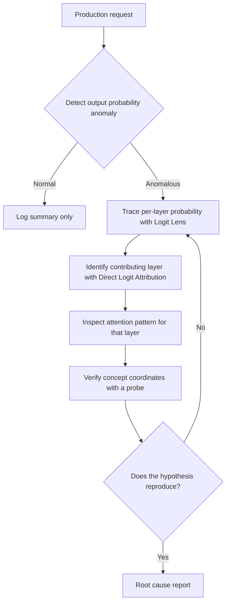

You've probably run into this before: a production model gives strange answers to one particular user segment, and all the log has left behind is a single final probability value. This post is for engineers who want to trace "why it turned out that way" directly inside the model when that happens. Whether the goal is regulatory compliance or plain bug reproduction, it covers what to open up when the outcome log alone can't give you the answer.

Ordinary software debugging starts by reading a stack trace and checking variable values. In a transformer, though, the input is a point in a high-dimensional vector space, and that point gets transformed by nonlinear functions at every layer it passes through. There's nowhere obvious to set a breakpoint. Worse, the same input can produce subtly different output depending on batch size or floating-point rounding, so it's often hard even to tell whether the anomaly you're looking at is a real bug or just noise. This is exactly why regulations like the EU AI Act require an explanation of decisions in high-stakes domains such as finance, healthcare, and hiring. The fact that a model got the right answer isn't enough on its own; you need to be able to trace the grounds on which it arrived there.

Most production systems don't keep the kind of logs that this requirement demands. What's left is only the final token's probability distribution, and what happened at each layer on the way to that value is already gone, unrecoverable after the fact. So none of the techniques covered in this post are things you learn in a panic after an incident; they're all about deciding, before something goes wrong, what signals to leave behind. Ways of looking inside a model fall into roughly three camps: a mechanistic view that traces which layer produced the answer, a representational view that uses statistics to understand the structure of the meaning space the model has formed, and a behavioral view that builds a behavioral profile by contrasting large volumes of input and output. The three aren't mutually exclusive; mechanistic tracing throws up hypotheses for representational analysis, and behavioral measurement then tests those hypotheses again, forming a loop.

## Watching the Answer Take Shape Layer by Layer

The most intuitive entry point is the Logit Lens. Each layer of a transformer passes a vector called the residual stream on to the next layer, and multiplying this vector by the weights of the final output layer, lm_head, tells you which word the model currently prefers as the next token at that point. Because lm_head is just a linear transformation, the key insight behind this technique is that you can decode not only the final layer's vector but the vectors from intermediate layers the same way.

If you feed in the sentence "The capital of France is" and decode each layer's output into vocabulary, you'll see surface-level words dominate the top ranks in the early layers, while the probability for the correct answer, "Paris," gradually rises as the layers get deeper. You're essentially watching, with your own eyes, from which layer onward the correct answer starts to form.

```python
import torch
from transformers import AutoModel, AutoTokenizer

def logit_lens(model, tokenizer, prompt, top_k=5):
    inputs = tokenizer(prompt, return_tensors="pt")
    with torch.no_grad():
        output = model(**inputs, output_hidden_states=True)

    lm_head = model.lm_head.weight.T  # (hidden, vocab)
    results = {}
    for layer_idx, hidden in enumerate(output.hidden_states):
        last_token = hidden[0, -1, :]
        probs = torch.softmax(last_token @ lm_head, dim=-1)
        top = torch.topk(probs, k=top_k)
        results[layer_idx] = [
            (tokenizer.decode([idx]), round(p.item(), 3))
            for idx, p in zip(top.indices, top.values)
        ]
    return results
```

If the Logit Lens shows how the entire probability distribution changes, Direct Logit Attribution goes a step further and decomposes why a specific token was chosen into a per-layer contribution. It starts from the fact that the final logit is the sum of each layer's individual contribution to lm_head. Taking the dot product of each layer's residual-stream output with the lm_head vector for the target token gives you, as a number, how much that layer pushed up the logit for the correct token.

```python
def direct_logit_attribution(model, tokenizer, prompt, target_token):
    inputs = tokenizer(prompt, return_tensors="pt")
    with torch.no_grad():
        output = model(**inputs, output_hidden_states=True)

    target_id = tokenizer.encode(target_token)[0]
    lm_col = model.lm_head.weight[target_id]  # (hidden,)

    contributions = {}
    for layer_idx, hidden in enumerate(output.hidden_states):
        last_token = hidden[0, -1, :]
        contributions[layer_idx] = torch.dot(last_token, lm_col).item()
    return contributions
```

This method quantitatively shows "which layer decided the answer," but its limits are just as clear. It ignores interactions between layers and assumes contributions are linear, so even though layers actually influence each other in practice, that part is missing from the calculation. And these numbers are only a correlation, not proof of causation. A high contribution from a given layer doesn't let you conclude that layer is the root cause of a problem. Drawing a conclusion from this number alone, without follow-up verification, leads you to fix the wrong layer.

## Finding Where Things Go Wrong in Attention and Activations

If the Logit Lens shows "what was chosen," attention patterns show "why it attended to that token." In HuggingFace Transformers, turning on `output_attentions=True` gives you the raw softmax output between queries and keys for every layer and every head.

Take, for example, a review-summarization model that turns the positive sentence "Delivery was fast" into a negative summary. Looking only at the final log, it's hard to even guess why this happened. But if you pull the per-layer attention for the problematic input and compare its distribution against a normal input, you can sometimes find that a particular head barely attends to the token "fast" at all and instead over-focuses on the nearby word "delivery." If this pattern repeats, you can start suspecting that in the training data, the word "delivery" frequently co-occurred with negative context.

```python
import numpy as np

def anomaly_score(anomaly_attn, normal_attn, eps=1e-10):
    """Measure how anomalous the input is relative to the normal attention distribution, using KL divergence"""
    p = normal_attn + eps
    q = anomaly_attn + eps
    return float(np.sum(p * np.log(p / q)))
```

Once this level of diagnosis has narrowed down the candidate causes, the next question is: "does actually manipulating that direction change the output?" This is where you gather sentences that activate the concept and sentences that don't, compute the mean hidden state at a specific layer for each group, and use the difference as a steering vector that you add back into the original input. If adding the vector actually moves the output in the intended direction, that's one more piece of evidence that this layer, in this direction, is related to the concept. Just be careful: scaling the vector up too aggressively makes the sentence itself sound unnatural, so it's safer to start testing with small scales. Keep in mind this experiment is a confirmation step that brings correlation a bit closer to causation; it isn't final evidence on its own.

The same approach can be used from a slightly different angle. Sometimes a model gives an outwardly innocuous answer while the activation in a specific direction of a later layer, related to a sensitive topic, runs unusually high. If you compute the per-layer contribution distribution separately for a normal input group and a suspicious input group and compare whether the difference is statistically significant, you can use that as a clue for gauging whether there's a gap between what the output shows on the surface and what actually got processed internally. But this too is only a statistical signal, so rather than jumping to a conclusion just because a significant difference showed up, it's safer to treat it as a candidate that needs further investigation.

## Mapping Coordinates in Semantic Space: Probes and Their Limits

The simplest way to check how clearly a given layer represents a specific concept is a linear probe. You train a linear classifier that takes the model's hidden state as input and predicts a particular label, and its accuracy gives you a sense of how linearly separable that layer's representation of the concept is.

```python
from sklearn.linear_model import LogisticRegression
from sklearn.metrics import accuracy_score
import torch

def extract_layer_vectors(model, tokenizer, texts, layer):
    vectors = []
    for text in texts:
        inputs = tokenizer(text, return_tensors="pt", truncation=True, max_length=128)
        with torch.no_grad():
            output = model(**inputs, output_hidden_states=True)
        vectors.append(output.hidden_states[layer][0, -1].numpy())
    return vectors

def train_and_score(model, tokenizer, texts, labels, layer):
    X = extract_layer_vectors(model, tokenizer, texts, layer)
    probe = LogisticRegression(max_iter=1000).fit(X, labels)
    preds = probe.predict(X)
    return probe, accuracy_score(labels, preds)
```

Comparing probe accuracy for the same concept across several layers lets you observe a rough trend. Information close to grammar tends to separate well in relatively early layers, sentence-level semantic information tends to separate well around the middle layers, and more abstract information such as sentiment or tone tends to separate well in later layers. Extending this to a company's internal knowledge, you can trace which layer a model has stored a particular fact in, giving you a lead on where to look when the model has learned incorrect information.

There's a limitation worth being honest about here. High probe accuracy isn't direct proof that the concept is actually separated out as an independent direction in that layer. It's entirely possible the classifier learned some complex combination of several features. Nor can you assume a fixed relationship between the coordinates the probe finds and the computation the model actually performs. Just because probe performance is high at a given layer doesn't mean it's too early to say that layer "processes" the concept, either way; it's also possible that a result processed earlier at a different layer is simply reflected in this one. All these techniques share a common limitation that ultimately comes down to one thing: interpretability tools are strong for generating hypotheses, but confirming those hypotheses requires separate verification, such as intervention experiments.

Running these diagnostics by hand every time isn't practical. So in practice, teams build a pipeline that, only for requests where an anomaly signal is detected, runs Logit Lens, attention analysis, and probe verification in sequence. Storing the internal state of every single request would make costs unmanageable, so a realistic compromise is conditional collection: keep only lightweight summaries like output probability under normal conditions, and log detailed attention and hidden states only for requests whose probability distribution deviates significantly from usual.



The real crux of this pipeline is the threshold. Set it low and you get more alerts, but a lower fraction of them are real problems; set it high and alerts drop, but you risk missing a genuine anomaly. There's no theoretical answer here; you can only find it by first collecting at least a few weeks of normal-operation data to understand the distribution, then tightening the threshold gradually based on points that deviate significantly from that distribution.

## From ThakiCloud's Perspective

We serve our K8s-based AI platform directly inside customers' on-premises environments. This condition turns out to be an unexpected advantage for interpretability work. In a setup where you call a model through an external API, there's no way to access the attention or hidden states covered in this post at all. When you operate the model-serving stack yourself, as we do, you can attach code that extracts intermediate forward-pass values directly into the serving pipeline, and use that data for diagnosis without ever sending it outside.

This advantage doesn't come for free, though. Storing every layer's activations for every single request is unmanageable in both storage and latency. So on our platform, we generally recommend a structure where lightweight signals such as the output probability distribution are monitored continuously, and detailed internal state is collected conditionally only for requests where an anomaly is flagged. If the goal is regulatory compliance, this logging scope should be designed from the start to match audit requirements; if the goal is plain debugging, a rolling buffer of the last few thousand requests is often enough. Setting the collection scope differently depending on the purpose is the balance point between cost and diagnostic power.

It also matters in practice that this balance point lands differently for each customer. On the same K8s cluster, workloads where regulatory compliance comes first, like hiring screening, run alongside workloads where plain debugging convenience comes first, like an internal chatbot. Rather than unifying the logging policy into one platform-wide setting, it ultimately reduces operational burden to have a structure that lets you define collection intensity per workload, the same way you split priorities at the GPU scheduling layer.

## Summary

A single final probability value left in a log can't tell you "why" a model answered the way it did. The Logit Lens shows the process by which the answer takes shape as it passes through layers, and Direct Logit Attribution breaks down, as numbers, which layer contributed most to that answer. Attention patterns show what the model attended to, and probes show how linearly a given layer separates out a specific concept. All these tools are powerful hypothesis generators, but they carry the limitation that they don't prove causation on their own. Only when you verify hypotheses with intervention experiments and weave them into a pipeline that conditionally collects detailed data solely when there's an anomaly signal do you get a diagnostic system that's actually usable in production.

This post is adapted for the blog from a section of our ebook, AI Interpretability Engineering: Reading the Decisions of Production Models.

## References

- [Eliciting Latent Predictions from Transformers with the Tuned Lens](https://arxiv.org/abs/2303.08112) (Belrose et al., 2023): the Logit Lens follow-up covering per-layer logit decoding and its limits
- [An Adversarial Example for Direct Logit Attribution](https://arxiv.org/abs/2310.07325) (Janiak et al., 2023): on the limits of DLA (correlation is not causation)
- [Steering Llama 2 via Contrastive Activation Addition](https://arxiv.org/abs/2312.06681) (Panickssery et al., 2023): the activation-addition steering method
- [What do you learn from context? Probing for sentence structure in contextualized word representations](https://arxiv.org/abs/1905.06316) (Tenney et al., 2019): a representative linear-probing study
- [EU AI Act (Regulation (EU) 2024/1689), EUR-Lex](https://eur-lex.europa.eu/eli/reg/2024/1689/oj): the regulation cited for decision-explanation duties

## Chapter Illustrations


