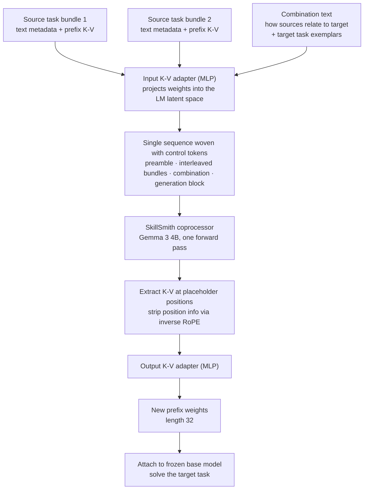

There have long been two ways to give an agent a skill. One is to write it down. You keep a task description, a handful of examples, and a reflection note about why the last attempt failed, then load that document into context when you need it. The other is to bake it into weights. For every recurring sub-goal you train a LoRA or prefix module, file it in an adapter drawer, and pull it out on demand. These two approaches have been discussed in separate conference tracks for over a decade, and in practice teams usually treat them as an either-or decision. A Google DeepMind paper posted to arXiv on 29 July 2026 revisits the choice itself.


*What happens when you put written-down skills and baked-in skills into the same forge is this paper's question.*

## Why This Matters

This is for people running a skill library behind an agent: you have accumulated hundreds of document skills like SKILL.md files, or you manage per-task LoRA adapters. The conclusion first: the two are not substitutes but complements that cannot cover for each other, and there is a real performance band that appears only when both are fed to one model at once. In the paper's ablation, the gap between text-only and both-modalities was more decisive than the gap between text-only and weights-only.

## Overview

The paper is titled "SkillSmith: Learning to Compose Parametric Skills and Textual Knowledge," arXiv 2607.27497. Lucio M. Dery and Benedict Aaron Tjandra are joint first authors, with Adhiguna Kuncoro, Arthur Szlam and others making seven contributors. It is filed under cs.CL, and the authors' own keywords are model merging, kv-caches, continual learning, and prefix tuning.

The situation the paper describes is this. LLM-driven agents learn from past experience along two routes: one synthesizes knowledge in natural language through self-reflection, structured memory, and prompt optimization; the other freezes the behavior of recurring tasks into module weights via PEFT. There is no bridge between them. The text route is flexible but bounded by inference-time context limits. The weight route is efficient at inference, but merging stays at arithmetic like averaging or concatenation and cannot use the semantic relationships between tasks at all.

The paper's example is intuitive. Suppose an agent trained a prefix cache for English-to-Twi translation in one session, and in another session compiled notes on analyzing English legal documents. Now a new task arrives: analyze a legal document written in Twi. The agent can state in words that this task is a combination of translation ability, Twi language modeling, and legal document analysis. What it cannot do is turn that statement into actual weights. Knowing in words and doing in weights are disconnected.

## What the Technique Is

SkillSmith's idea reduces to one sentence. Treat weights as another modality the LLM already knows how to read.

Concretely, parametric skills are instantiated through prefix-tuning. Choosing prefix over LoRA has a clear reason. A snippet of text becomes a K-V cache the moment you run one forward pass through the base model, which puts text-derived caches and trained caches in the same space. For a goal of bridging two modalities, no representation is more natural.

SkillSmith receives source task bundles. Each bundle is one trained prefix K-V cache plus textual metadata describing that task. On top of that comes combination text describing how the source tasks relate to the target capability. These ingredients are woven into a single sequence using control tokens and passed once through a coprocessor LLM.



The sequence has rules. A preamble describing the compositional objective comes first. Then, for each source bundle, the text begins with a `<src_start>` token and the projected K-V sits between `<kv_start>` and `<kv_end>`. After the bundles comes the combination text, and after `<gen_start>` follows a fixed-length run of placeholder tokens. After the forward pass, only the K-V at those placeholder positions is extracted, stripped of position information via inverse RoPE, and passed through the output adapter to yield the new prefix weights.

Training is end to end. The generated cache is attached to the frozen base model, cross-entropy loss on the target task is computed, and that loss is backpropagated through the base model into SkillSmith. The base model's weights stay fixed throughout.

The evaluation setup is worth noting. Source task prefix lengths are sampled at random from 32, 64, and 128 to inject diversity, and both the coprocessor and the downstream model are Gemma 3 4B. The number of source tasks is fixed at two. And prefix K-V is trained only on the global attention layers, because a prefix attached to a local attention layer eventually slides out of context.

## Installation and Integration

The paper released neither code nor checkpoints, so we could not reproduce SkillSmith itself. Instead we computed what it actually costs to carry one skill under the conditions the paper pinned down: a Gemma 3 4B base, global layers only, prefix length 32. Operationally this number is arguably the one you need before the paper's Elo figures.

First pull the real Gemma 3 4B settings.

```bash
curl -s https://huggingface.co/unsloth/gemma-3-4b-it/raw/main/config.json | jq '.text_config'
# num_hidden_layers: 34, num_key_value_heads: 4, head_dim: 256,
# sliding_window_pattern: 6, torch_dtype: "bfloat16"
```

Because `sliding_window_pattern` is 6, one layer in every six is global attention. Of 34 layers, five are global and the remaining twenty-nine are local. The paper pins prefix training to global layers only, so the parameters actually trained cover five layers.

The calculation script lives in the ThakiCloud repository.

```bash
.venv/bin/python scripts/experiments/skillsmith_prefix_budget.py
```

It measures two things together. One is the parameter count and byte size of a single prefix K-V under the settings above. The other is the real size of a local skill corpus. The ThakiCloud workspace currently holds 1,911 SKILL.md files under `.claude/skills/`. Loading a text skill into context means those tokens also become resident K-V, which lets us compare both approaches on the same unit.

## Measured Results

Our own budget first.

| Item | Value |
|---|---|
| Global layers in Gemma 3 4B | 5 (out of 34) |
| Prefix length 32, global layers only | 327,680 parameters |
| Same setting in bf16 | 640 KiB |
| Share of the base model | 0.0076 percent |
| At prefix length 128 | 1,310,720 parameters (2,560 KiB) |
| For reference, all 34 layers | 2,228,224 parameters (4,352 KiB) |

On the text side: the median of 1,911 local SKILL.md files is 6,173 characters, which at a conservative 4 characters per token is roughly 1,543 tokens. Keeping that resident in a Gemma 3 4B context puts K-V on all 34 layers, about 205 MiB. Against 640 KiB for the same skill carried parametrically, that is a factor of 328. By sequence position it is 1,543 versus 32, a factor of 48.


*Left is the ablation from the paper's Table 1; right is the residency cost computed by the script above.*

Now the paper's numbers. To check whether SkillSmith really uses the K-V caches, the authors removed inputs one at a time. Elo measured on the Composite-SNI meta-evaluation tasks:

| Input configuration | Elo |
|---|---|
| No inputs | 1209 |
| K-V caches only | 1455 |
| Everything except K-V caches | 1622 |
| All inputs | 1714 |

How to read this matters. Text only (1622) beats weights only (1455), meaning text is the richer signal. But both together reach 1714, which is 92 points above text alone. Those 92 points earned by adding weights are this paper's central claim. As the authors note, the K-V-only setting is effectively equivalent to the existing ATTEMPT approach of combining PEFT modules with a parametric function instead of arithmetic. So this table lays the ceiling of existing weight-merging methods along the bottom and shows the lift from adding text.

The authors also tested the obvious objection that the gain merely comes from having more text. They extracted all source text and combination text fed to SkillSmith, prepended it directly to the target task inputs, and trained an ordinary prefix cache. Auxiliary text did improve the baseline, but it did not catch SkillSmith. Text simply being present and text being synthesized together with weights are different things.

There is a generalization check too. The 15 meta-evaluation tasks were re-scored split by whether neither, one, or both parent tasks appeared in meta-training, and SkillSmith led in all three. Winning by a large margin even where it had never seen the parent tasks is the notable part.

It did not win on every dataset, however. On the real SNI dataset, once downstream fine-tuning was allowed, the win rate among the top three methods converged to 0.5. The authors attribute this to SNI having on the order of 1,000 instances per task and, having been built in 2022, consisting mostly of primitive work like sentiment classification and character concatenation that is trivial for contemporary models. On MMLU-ProX, with only about 250 tasks and higher difficulty, the gap reopened. There, the variant trained on MMLU-ProX alone without bootstrapping from a Composite-SNI checkpoint reached only 1736 zero-shot Elo.

## What This Means for ThakiCloud Products

This paper touches both ThakiCloud products.

**The Paxis lens** comes first. Paxis is ThakiCloud's Agent-Native Cloud control plane, treating Skills, Tools, Policies, and Audit Logs as first-class resources. At its center, the Skill Harness currently selects text skills via BM25 and runs them in an isolated sandbox. This paper touches exactly that structure's cost curve, and the factor of 328 measured above is the reason. As long as skills are carried as text, context budget decides how many can be active at once. That is why a router is needed, and when the router is wrong the turn simply fails.

Parametric skills move that constraint to a different axis. With a 32-position prefix, eight active skills is 256 positions and 5 MiB. To be honest, though, this is complementary rather than a replacement. The paper's own ablation says text-only beats weights-only, so abandoning text skills for weights is not a direction this paper supports. What it supports is placing a parametric counterpart alongside the text skill the router selected. Since Paxis's self-evolving skill pipeline already creates, revises, and evaluates skills, adding a prefix cache to that pipeline's outputs is an extension of an existing artifact list rather than a new architecture.

**The ai-platform lens** is about serving. A prefix cache is a per-request adapter, not a model. Keeping thousands of 640 KiB objects per tenant and attaching one on request is structurally the same as multi-adapter LoRA serving. ThakiCloud's ai-platform already runs multi-tenant vLLM serving on K8s and Kueue, so sharing one base model while attaching a different skill set per tenant does not depart far from the current design. This matters most in on-premise and sovereign environments. Instead of fine-tuning a separate model per customer and consuming GPUs for each, you share one base model and manage per-customer skills as KiB-scale objects, so GPU occupancy no longer scales with customer count.

The two lenses connect. When skills are cheap to carry (ai-platform), an agent can carry more of them (Paxis), and when it carries more, being wrong about which one to pick costs less.

## Limits and Counterarguments

The biggest constraint is reproducibility. Neither code nor checkpoints were released, and SkillSmith requires end-to-end meta-training that backpropagates through the base model. You must first build a per-task prefix library, and the combination text has to be generated with Gemini 2.5. The description of roughly 350K initial synthetic tasks suggests the preparation alone is a substantial investment. It is early to expect the same results in your own domain.

Second, the experimental scale is small. Both the coprocessor and downstream model are a single 4B model, and the meta-evaluation task counts are 15, 10, and 6. Elo is a relative metric that says nothing about absolute performance, and its values shift when the candidate set changes. The number of source tasks is fixed at two, so this paper alone cannot tell us whether the approach extends to the multi-skill compositions real agents face.

Third, the convergence seen on SNI narrows the applicable range. When data is plentiful and tasks are easy, direct training reaches the same place. SkillSmith earns its keep where tasks are hard and instances are scarce. Plenty of in-house domain work fits that description, but there is no reason to route every task through this method.

Finally, the factor of 328 computed above is a difference in storage and residency, not in capability. It absolutely does not mean a 640 KiB prefix does the same job as a 205 MiB text context. The paper's ablation says precisely the opposite, and the calculation here exists to put both approaches on the same ruler, not to justify a replacement.

## Conclusion

For a long time, giving an agent a skill meant choosing between documents and weights. This paper puts a third answer on the table. Make weights readable to an LLM, and the relationship descriptions you wrote down become instructions that produce actual weights. The 92 points in the ablation are evidence that those instructions were not empty talk.

If you are running a skill library today, check one thing. Do your skill documents contain a sentence describing how this skill connects to other skills? What SkillSmith actually consumed was not the task description but the description of relationships between tasks. If that sentence is missing, the most important ingredient will be absent when you later try to attach parametric synthesis. If it is already there, baking one more prefix cache into your skill pipeline is a closer next step than it looks.

## Sources

- Paper: [SkillSmith: Learning to Compose Parametric Skills and Textual Knowledge (arXiv:2607.27497)](https://arxiv.org/abs/2607.27497)
- Authors: Lucio M. Dery, Benedict Aaron Tjandra, Siavash Samiei, Adhiguna Kuncoro, Zohar Yahav, Jiajun Shen, Arthur Szlam (Google DeepMind), submitted 29 July 2026
- Base model config: [Gemma 3 4B config.json](https://huggingface.co/unsloth/gemma-3-4b-it/raw/main/config.json)
- Calculation script for this post: `scripts/experiments/skillsmith_prefix_budget.py` (ThakiCloud internal repository)
