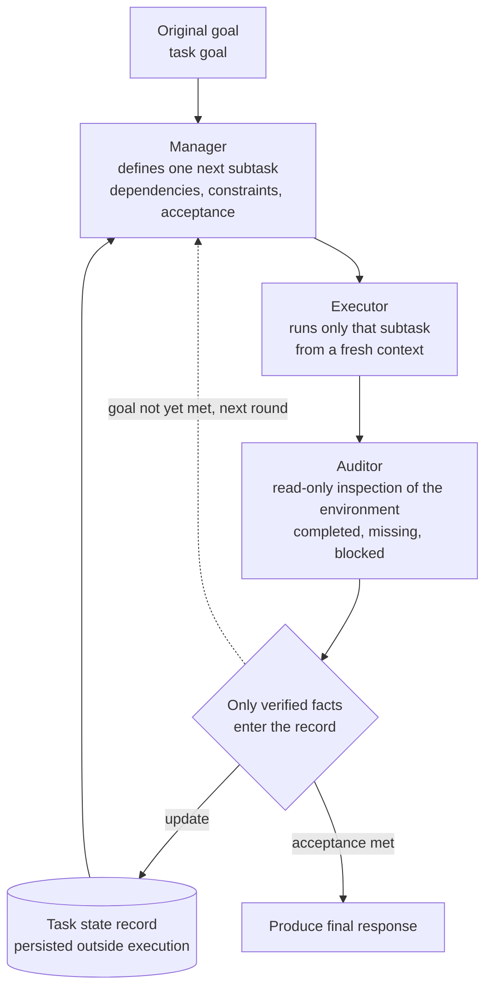

*Execution stretches out like a chain, and the state lives in a record outside that chain. That is the core idea behind LongHorizon-Harness.*

## Why this matters to you

If you run agents for hours or days rather than thirty minutes, this post is for you. Especially if you have watched an agent that worked fine for a while start forgetting what it already did around round twenty, redo finished work, or report completing something it never touched.

Here is the conclusion up front. The main reason long-horizon execution collapses is not the model's reasoning ability but the design decision to **keep task state inside the conversation context**. Pull the state out into an explicit record that lives outside execution, update that record only with facts independently verified against the environment, and performance rises sharply without changing the model. LongHorizon-Harness (arXiv:2608.01964) backs that claim with benchmarks, and it was open-sourced on August 6, 2026. We installed it in an isolated sandbox and checked the CLI surface, the config schema, and whether the discipline the paper describes is actually enforced in code.

## Overview

For the past year, agent harness discussions have mostly split two ways. One camp says use a better model. The other says grow the context window or summarize harder and push more in. Both share the same premise: that what the agent has done so far lives in the conversation history.

LongHorizon-Harness treats that premise as the bug. Conversation history records what the agent **said** it did, not how the environment actually changed. As rounds accumulate, the gap between the two widens, and at some point the agent starts reasoning on top of its own narration. A larger context window only preserves more of the bad record.

So the paper reframes long-horizon execution as a **state management problem**. Task state is held as an explicit record outside execution, that record is updated only with facts confirmed directly from the environment, and the next subtask is derived again from the record plus the original goal. The reported numbers suggest the reframing works. With the same Qwen 3.7-Plus, WeaveBench went from 51.8% to 80.7%, Terminal-Bench 2.1 from 69.7% to 77.2%, and OSWorld 2.0 from 2.8% to 8.3%. Claude Opus 4.7 rose from 20.0% to 34.3% on an OSWorld 2.0 subset.


*Left: figures reported in the paper (arXiv:2608.01964), not reproduced by us. Right: install footprint we measured directly in a local sandbox.*

What stands out is that the model did not change. Only the harness did.

## What this technology is

The core is the Manage-Execute-Audit (MEA) loop. Three roles run in sequence within a round, and none of them inherits another's context.

**The manager** reads the current task-state record and defines exactly one next subtask, spelling out its dependencies, constraints, and the acceptance criteria that decide what counts as done.

**The executor** performs only that subtask. Critically, it **starts from a fresh context**. Because it does not inherit the previous round's conversation, misunderstandings and bad self-reports do not propagate forward.

**The auditor** ignores what the executor claimed and inspects the environment itself, deciding what changed, what finished, and what remains. This auditor is read-only, because verification that can modify what it verifies is not verification.



*The MEA loop. State lives in a record outside execution, and only facts the auditor confirmed in the environment update it.*

This is where it diverges from the usual approach. A typical plan-execute loop has the executor report its own completion and the planner believe that report, so self-report becomes state. The MEA loop cuts that path: an executor's claim does not reach the state record until the auditor independently confirms it against the environment.

The data structures show what a round actually carries. `ManagedRound` in `types.py` holds the round index, plan text, executor output, and auditor report, and separately carries `task_state` and `task_contract` as their own fields. State and contract are not floating in conversation history but sitting in explicit slots on the round object. The presence of a contract is itself interesting: the auditor judges not only whether the result is complete but also whether it still aligns with the contract originally agreed.

Splitting executors into GUI and CLI variants is deliberate too. Driving a desktop app and finishing something in a shell fail in different ways and need different tools. The auditor splits along the same axis, so the GUI auditor observes the screen and saved screenshots while the CLI auditor confirms through the file system and a read-only shell allowlist.

## Installation and integration

Installation is surprisingly light. We built an isolated git worktree so the main working tree stayed clean, created a throwaway virtualenv inside it, and installed there.

```bash
uv venv .expenv --python 3.12
VIRTUAL_ENV="$PWD/.expenv" uv pip install lh-harness
```

Running with a cold cache produced this:

```
Resolved 2 packages in 139ms
Prepared 2 packages in 48ms
Installed 2 packages in 4ms
 + lh-harness==0.1.3
 + packaging==26.3
```

Two packages. Exactly one runtime dependency, `packaging`. Against agent frameworks that pull hundreds of megabytes on install, that is a conspicuous choice. It follows from the design: the tool ships no agent runtime of its own and acts as a thin coordination layer on top of an already-installed Claude Code or Codex CLI.

There is a dedicated environment check:

```bash
lh-harness doctor
```

Actual output on our MacBook:

```
LongHorizon-Harness doctor (0.1.3)
Platform: macOS-26.5.2-arm64-arm-64bit
[OK  ] Python: 3.12.3
[SKIP] Project config: .lh-harness/config.toml does not exist
[OK  ] claude_code: 2.1.224 (/Users/hanhyojung/.local/bin/claude)
[WARN] codex: `codex` was not found on PATH
[OK  ] npm: 11.3.0
[OK  ] Node.js: 24.1.0
[SKIP] open-computer-use: not installed; run `lh-harness plugin install open-computer-use`
[SKIP] Computer use (claude_code): no plugin installed; GUI subtasks will have no computer-use server
[OK  ] Update: 0.1.3 is the latest version
Doctor result: ready with 1 warning(s)
```

It detects the installed Claude Code version, says plainly what is missing, and tells you the command that fixes it. It also surfaces that GUI subtasks need a separately installed computer-use plugin.

Project defaults come from `lh-harness init`. The generated `.lh-harness/config.toml` is where the design intent shows most clearly.

```toml
[run]
agent = "codex"
model = "gpt-5.6-sol"
max_rounds = 30

[run.timeouts]
manager = 600
gui_executor = 1800
cli_executor = 1800
auditor = 600

[run.roles.manager]
[run.roles.gui_executor]
[run.roles.cli_executor]
[run.roles.gui_auditor]
[run.roles.cli_auditor]
[run.roles.final_response]
```

There are eight role slots, and each can name its own agent implementation and model. Running the manager on Claude Code, the CLI executor on Codex, and the auditor on yet another model is a single config file away. Timeouts are per role as well: executors get thirty minutes while the manager and auditor get ten. The roles that judge and the roles that work are given different time budgets on purpose.

## What we actually measured

One thing to state plainly first: we **did not run a full task episode end to end**. That would consume real agent tokens and require installing the computer-use plugin, which is beyond this pass. Instead we verified installation, the CLI surface, the config schema, and whether the discipline the paper claims is genuinely enforced in code. Every number below is one we measured locally.

| Item | Measured |
|---|---|
| Cold install (`--no-cache`) | 0.24 s |
| Packages installed | 2 (lh-harness 0.1.3 + packaging 26.3) |
| Runtime dependencies | 1 |
| Package size on disk | 532 KiB |
| Python source | 8,956 LoC across 37 files |
| CLI cold start | 733 ms |

The largest files are `manager.py` (1,339 lines), `cli.py` (1,147 lines), and `auditor_agent.py` (859 lines). That the auditor alone accounts for roughly a tenth of the codebase tells you what this project prioritizes.

Next we looked at the audit result's data structure. `AuditReport` in `types.py` looks like this:

```python
@dataclass
class AuditReport:
    round_id: str
    status: Literal["complete", "incomplete", "blocked"]
    completed: list[dict[str, str]]
    missing: list[dict[str, Any]]
    blockers: list[dict[str, str]]
    integrity_status: Literal["clean", "suspect", "violation"] = "clean"
    contract_audit_status: Literal[
        "aligned", "unknown", "needs_revision", "invalid"
    ] = "unknown"
```

There is nowhere for the auditor to write prose like "this looks fine." Status is a fixed enum, and completed, missing, and blocked items are separate lists. The presence of `suspect` and `violation` under `integrity_status` is especially notable: the auditor not only judges the result but flags, on a separate axis, the possibility that the result was fabricated.

We also checked whether read-only is merely a prompt instruction. It is enforced three ways.

First, in the prompt. The auditor prompt in `prompt_texts.py` instructs it not to click, type, scroll, drag, or modify task files, and adds that if it finds fabricated or untrusted artifacts it should report them but never repair, move, or delete them.

Second, through tool permissions. `adapters/claude_permissions.py` pins the write-tool set as a constant:

```python
_WRITE_TOOLS = ("Write", "Edit", "NotebookEdit")
```

Per-role deny lists are built from this, and the auditor policy carries `workspace_read_only=True`. Per the comments, these deny rules keep applying even under `--dangerously-skip-permissions`. On the executor side, the `Agent` tool sits in the deny list so an executor cannot recursively spawn another agent.

Third, by detecting violations after the fact. `auditor_agent.py` defines a `read_only_violation` finding, and if workspace files change during an audit it records that as integrity evidence. That covers the case where the prompt is ignored and the permissions are bypassed.

Context budgets are pinned as constants too. Auditor output is cut at 24,000 characters, per-role verified context at 60,000, and history at 100,000. Rather than growing context indefinitely, the harness names a ceiling and lets the auditor decide what earns a place inside it. Context management is handled by a deterministic character cap rather than being left to summarization quality.

Finally we skimmed the flags exposed by `lh-harness run --help`. There are more than a dozen that cross roles with models, such as `--manager-agent`, `--executor-agent`, `--gui-executor-model`, and `--cli-auditor-model`, with a stepwise fallback chain when you leave one unset. Pass only `--agent` and every role uses it; pass `--executor-agent` and both executors change; pass `--gui-executor-agent` and only that role splits off. Role-to-model placement follows the same rules from the config file and the CLI alike.

## What this means for ThakiCloud

We found this paper interesting because **Paxis** already stands in the same place. Paxis is ThakiCloud's Enterprise Agent Platform: it retrieves skills, runs them in isolated sandboxes, and passes every action through policy gates and audit logging (Signum). The seat the MEA auditor occupies is exactly the Paxis audit layer.

Three implications carry over to our design.

First, **separating the auditor into its own role and forcing it read-only** should be a permission-level guarantee, not a polite request in a prompt. We already gate execution results through deterministic checks, and this harness goes one step further by pinning the verifier's write tools into a deny list. When a verifier can fix what it inspects, pass rates go up and trust goes down. That approach maps directly onto Paxis policy gates.

Second, **per-role model routing is token economics**. That is why the config file opens eight role slots to eight different models. Running executors on a cheap model while reserving an expensive one for the manager and auditor falls out naturally. **Metis** absorbs this pattern through Dedicated Endpoints and Serverless, serving each role from a different model at a different cost. The token cost of completing one unit of work is decided less by list price than by which model you attached to which role. The same workload runs identically on a Telox GPU cluster or on Aegis inside a customer's air-gapped network.

Third, **audit logs are training data**. `AuditReport` leaves a structured record each round of what completed, what remained unmet, and what was blocked. That record is not a log for humans to read afterward; it is the input to the next round's decision. From a **Maxis** perspective the same record becomes material for fine-tuning and distillation, opening a path to feed execution results back into a smaller model specialized for a customer's workflows.

In short, this harness adds concrete implementation evidence to a direction we were already walking: reliability in work automation comes not from a smarter model but from where state lives and who holds the right to update it.

## Limits and counterarguments

A few things deserve to be stated clearly.

**The benchmark numbers are author-reported and we did not reproduce them.** We verified installation and code structure. Until independent replication exists, the right move is to cite them as reported figures rather than treat them as reproduced.

**The absolute numbers on OSWorld 2.0 are still low.** Going from 2.8% to 8.3% is nearly a threefold relative gain, but in absolute terms it means failing more than nine times out of ten. Long-horizon execution in GUI environments is not solved by this harness either. Reading only the relative improvement will lead you to overestimate it.

**The version is 0.1.3.** It has been public for days, and the defaults target Codex and `gpt-5.6-sol`, so a Claude Code-centric setup means filling in role slots by hand. The computer-use plugin is a separate install. This is safer to treat as a reference design than as something to drop into production today.

**Auditing costs money.** Each round runs a manager and an auditor on top of the executor, which raises calls per round. On short tasks that overhead exceeds the benefit. Preventing state collapse is worth it across thirty rounds; wrapping the same machinery around a three-round task is waste.

**A fresh context is not always a win either.** Cutting off the previous round's misunderstandings also cuts off its useful context. This harness bets that the quality of the task-state record covers that loss. If the record is thin, the executor restarts from a blank page every round.

## Wrapping up

If you operate long-running agents and quality degrades as rounds accumulate, the first thing to suspect is not the model tier but where you put the state. LongHorizon-Harness reports lifting WeaveBench from 51.8% to 80.7% on the same model purely by moving state outside execution and letting only a read-only auditor update it.

From what we verified directly, the tool backs that claim in code. The auditor's write access is blocked three ways through prompt, tool deny list, and post-hoc detection; audit results are pinned to fixed enums rather than prose; and installation finishes at 532 KiB with a single runtime dependency.

Two next actions are worth taking. One is to run `pip install lh-harness && lh-harness doctor` and find out in five minutes whether your current agent environment is ready for this structure. The other, independent of adopting the tool, is to check your existing pipeline for one thing: **can whatever declares a task complete also modify that result?** If the answer is yes, you already have something to fix regardless of any benchmark score.

## Sources

- Paper: [LongHorizon-Harness: Advancing Long-Horizon Agents for Real-World Tasks (arXiv:2608.01964)](https://arxiv.org/abs/2608.01964)
- Code: [github.com/AMAP-ML/LongHorizon-Harness](https://github.com/AMAP-ML/LongHorizon-Harness)
- Project page: [lh-harness.pages.dev](https://lh-harness.pages.dev/)
- Hugging Face paper page: [huggingface.co/papers/2608.01964](https://huggingface.co/papers/2608.01964)
- Local measurements: `lh-harness 0.1.3` install and CLI output captured in an isolated sandbox (macOS arm64 / Python 3.12.3)
