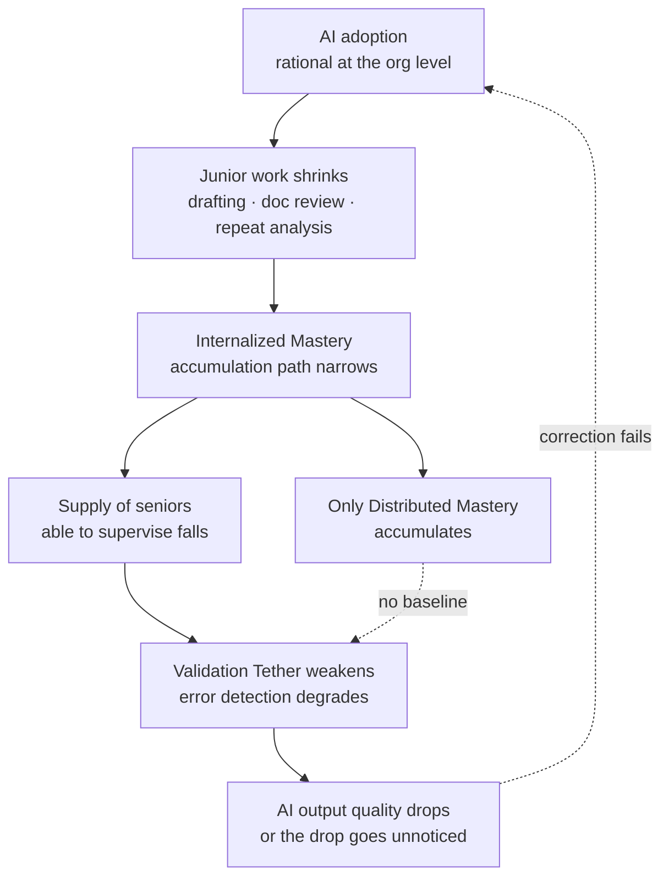

*Individually rational choices, added up, drain a shared reservoir.*

## Why This Matters to You

This is for technical leaders considering agent automation, and for the people rewriting their junior hiring plans. The short version: the quality of AI oversight depends on the overseer's expertise, and that expertise was formed by doing exactly the work AI has started doing instead. Break the loop and in a few years there is nobody left who can supervise. Adoption decisions therefore need more than a productivity calculation; they need a plan for preserving the path by which expertise regenerates.

This is not a comfortable topic for us. What we sell is precisely the platform that absorbs that junior work.

## Background

A paper went around X last week. Zara Zhangrui introduced it by writing that it gives a fancy name to a problem you can already feel in your bones. The name is the tragedy of the cognitive commons.

The paper is "The Tragedy of the Cognitive Commons: How AI Could Disrupt the Regeneration of Professional Expertise" by Nolan Lovett, posted to arXiv in July 2026 and also published in a SAGE journal. The author's framing: Human Resource Development scholarship has treated the AI transformation as an organizational training challenge, leaving the collective regeneration of professional expertise unexamined.

It transposes the familiar commons structure into the cognitive domain. On a pasture, one more cow is rational for each herder, and the grass dies when everyone reasons that way. Here the depleted resource is not grass but the shared pool of expertise a profession needs to renew itself. For any single organization, adopting AI to reduce junior workload is entirely rational. The problem is that those rational choices sum to a draining reservoir.

Multiple literatures are converging here. The same month, Maher Kallel and Mohamed El Louadi posted a differently argued paper under the same title, approaching it through economic modeling. Earlier, in February 2026, an MIT team including Daron Acemoglu published work on knowledge collapse. Independent fields arriving at the same point is itself a signal.

## Three Core Concepts

### Internalized versus Distributed Mastery

Lovett splits expertise in two. Internalized Mastery is deep domain knowledge accumulated through sustained practice. Distributed Mastery is the ability to orchestrate systems that mix humans and AI.

They look like substitutes and are not. Distributed Mastery only functions properly on top of Internalized Mastery. Noticing that a model's answer is plausible but wrong requires having produced that kind of answer yourself. Someone trained only in orchestration has no baseline for detecting when the thing being orchestrated is confabulating.

### The Validation Tether

This is the paper's central idea: effective AI oversight depends on the very expertise that AI adoption may undermine.

Stated plainly it sounds simple, and the implications are heavy. Most AI governance rests on the premise that a human makes the final call, expressed as human-in-the-loop, final approval authority, human oversight. The Validation Tether says that premise depletes over time. Today's overseers were trained before AI. The overseers of a decade from now will have grown up in an environment where AI already writes the first draft. There is little basis for expecting the same quality of supervision from them.

Looking at one organization, this loop is invisible. Each company sees this quarter's productivity gain, and struggling to hire seniors years later registers as a separate problem. It is a textbook commons externality with a long lag.

### Private and Public Signals

Kallel and El Louadi model the same problem economically. Their distinction is between private and public signals. The context-specific knowledge each of us produces while working is the private signal; the thin public signal that accumulates from all of it is the collective knowledge stock. Working contributes to both at once.

Their conclusion is that agentic AI can substitute for the private signal but cannot rebuild the public one. Add sufficiently elastic human effort, meaning there is an option that does not require the hard work of learning, and people take it. That path settles into a low-knowledge equilibrium. The word equilibrium matters: this is not an accident, it is where individually rational choices come to rest.

## How Much Evidence Exists

The paper is conceptual, and the author does not claim causal proof. It presents early labor market and clinical evidence suggesting possible disruption to expertise-regeneration pathways in highly AI-exposed sectors, while stating plainly that adoption is recent and the strongest signals come from leading sectors rather than all professions.

One set of figures circulates widely in secondary coverage. Between 2018 and 2024, the share of postings in AI-exposed fields requiring three years of experience or less reportedly fell from 43% to 28% in software development, 35% to 22% in data analysis, and 41% to 26% in consulting. We did not verify these against the paper's own abstract; we encountered them through commentary, so treat them as indicative until the primary data is checked. In law, automated document review has reduced the tasks first-year associates used to perform, and there has been reporting that at least one large firm made AI training mandatory for associates without counting it as billable hours.

Mapping this directly onto Korea would be premature. That said, entry-level hiring volume and required-experience distribution are observable domestically, and it is worth opening our own data with this frame.

## What This Means for ThakiCloud

Introducing this paper and then pivoting to a product pitch would not be coherent. Paxis does exactly what this paper worries about: it absorbs repetitive digital work at enterprises, and a good share of that work is what juniors have been learning on. So the honest question for us is where the people who will supervise our platform get made.

From the **Paxis** angle, what we actually do about it is leave the execution trail visible. Which skill the agent selected, in what order it ran, and where a human approved it all persist as a trace. That trace is cost accounting data, and it is also material a new hire can walk backward through to learn how the work flows. Automation that emits a result from a black box and automation whose execution path is open are completely different products where expertise regeneration is concerned. Keeping the Validation Tether intact requires the latter.

Human approval gates read differently under this frame too. We built them as risk controls; through the paper's lens they are also the point where a person practices judgment. When an approval request degenerates into a confirm button, you lose both the control and the learning. Deciding what evidence to surface on an approval screen turns out to be a more consequential design problem than it looks.

From the **Maxis** angle, there is something to watch. Feeding execution results back as training data to build smaller specialized models is a pillar of our product strategy, and in Kallel and El Louadi's terms that is a structure that keeps consuming the private signal. Rebuilding the public signal still sits on the human side. It would be a mistake to look at model metrics and conclude the loop is self-sustaining. That is why humans keep maintaining the eval sets and regression tests.

From the **Signum** angle, audit logs act as organizational memory rather than just a compliance artifact. A record of who approved what, and what they were looking at when they did, lets a later arrival reconstruct the context of a decision. It keeps the expertise reservoir topped up, however thinly.

Our conclusion is not to slow automation down. It is to automate while keeping the execution path open, designing approval points as learning points, and being explicit about what humans must keep touching.

## Limitations and Counterarguments

The strongest objection is that this worry recurs every generation. Calculators were going to end mental arithmetic, compilers were going to end assembly, search engines were going to end memory, and instead the jobs persisted at a higher level of abstraction. On this reading, Distributed Mastery is not a loss of Internalized Mastery but the next form of it.

The objection deserves serious treatment. Where Lovett's frame sidesteps it is the asymmetry of oversight. Compilers are deterministic, so when they are wrong they are usually visibly wrong. Language models are plausibly wrong. Catching a plausible error draws on the same faculty as producing the correct answer yourself, which is why the paper argues the lower layer of experience stays necessary even as abstraction rises. Whether that asymmetry is genuinely different in kind is still contested, and one conceptual paper does not settle it.

The second limitation is the thinness of the empirical base. The posting figures above cannot easily be separated from the business cycle; a good deal of the post-2022 tech hiring contraction is explained by interest rates alone. Claiming causation would require a far more careful identification strategy.

Third, the prescriptions are weak. The problem structure is sharp, but the "so do what" section is as abstract here as in adjacent papers. Kallel and El Louadi propose better aggregation of human knowledge as the remedy while leaving the concrete mechanism design as a research agenda. Reaching the classical commons solution of norms and institutions requires profession-level coordination, and individual firms have little incentive to move first.

## Wrapping Up

What this paper offers is not an answer but a usable vocabulary.

Separating Internalized from Distributed Mastery splits apart two things that AI adoption discussions routinely blur, and explains why "you just need to be good at orchestrating" is only partly right.

The Validation Tether is a concept worth putting into an AI governance document, because it means the sentence "a human makes the final call" now needs a second line explaining where that human's judgment is maintained.

And diagnosing this as a commons problem explains why goodwill at individual organizations will not resolve it. When individual rationality and collective outcomes diverge, what has to change is design, not resolve.

If you are evaluating agent automation, try adding one line to the current proposal: once this work is automated, where will people learn what they used to learn by doing it? Having no answer is not a reason to stop. It is a reason to put the answer into the design. We are asking our own product the same question.

## Sources

- [The Tragedy of the Cognitive Commons: How AI Could Disrupt the Regeneration of Professional Expertise](https://arxiv.org/abs/2607.29380) (Nolan Lovett, arXiv:2607.29380, 2026-07)
- [Journal version (SAGE)](https://doi.org/10.1177/15344843261470602)
- [The tragedy of the cognitive commons: collective intelligence beyond AI-induced knowledge collapse](https://arxiv.org/html/2607.13272v1) (Maher Kallel, Mohamed El Louadi, arXiv:2607.13272, 2026-07-14)
- [AI, Human Cognition and Knowledge Collapse](https://economics.mit.edu/sites/default/files/2026-02/AI,%20Human%20Cognition%20and%20Knowledge%20Collapse%2002-20-26.pdf) (MIT, 2026-02)
- [The Apprenticeship Severance: How AI Is Breaking the Expertise Pipeline](https://smarterarticles.co.uk/the-apprenticeship-severance-how-ai-is-breaking-the-expertise-pipeline) (secondary source for the posting figures)
- Original post: [@zarazhangrui](https://x.com/hjguyhan/status/2086425750685782023) (2026-08-09)
