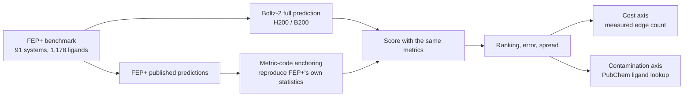

This post is for researchers evaluating whether to add an AI binding-affinity model to their drug screening pipeline, and for infrastructure engineers who have to decide where to run that workload. We predicted all 1,178 ligands on our own H200 and B200 clusters and scored them side by side against the physics-based standard, and we wrote up where the usual way of reading this kind of benchmark goes wrong.

Three conclusions. On the ranking task that decides which compound to make next, the two methods tied. The compute cost differed by at least 38x. And the commonly cited RMSE advantage did not come from accuracy.


*A visualization of the core concept of this post.*

## What We Compared

First, some terms.

In drug development, how tightly a compound binds a target protein is called binding affinity. The standard computational method for predicting this value is **free energy perturbation (FEP)**. You simulate, via molecular dynamics, a hypothetical transformation of compound A gradually into compound B, and integrate the energy difference along that path to get how much better B binds than A. Because it is grounded in physical law, it is highly reliable, but it costs hours of GPU time per transformation. The most widely used commercial implementation is Schrodinger's FEP+.

On the other side sits the **co-folding model**: a neural network that jointly predicts protein and compound structure, with an affinity-prediction head attached. MIT's publicly released Boltz-2 is the leading example. It produces a value in a single forward pass with no simulation, so it is incomparably fast. The question is whether that value is trustworthy.

As our comparison baseline, we used the FEP+ benchmark Ross et al. published in 2023. What makes this dataset good is that it publishes not only experimental values but FEP+'s own predictions alongside them, letting us line up both methods on the same ligands. We processed all 1,178 ligands across 91 systems from this set.

## How We Measured It

There were more traps in the scoring methodology than in the measurement itself, so we will walk through it in order.



We started by matching units. Boltz-2 outputs the log of IC50, while the experimental data is in binding free energy (kcal/mol), so a conversion is needed. But this conversion, which treats IC50 as if it were a dissociation constant, carries error. Fortunately that error tends to shift an entire series by close to a constant offset, so we gave up on absolute comparisons and trusted only relative comparisons within a series, which is what most practical use cases need anyway.

We verified the metric code first. We ran FEP+'s own published predictions through our scoring code and confirmed we could reproduce the statistics FEP+'s own paper reported, and only after that did we trust the Boltz-2 numbers. Even a small difference in how a metric is implemented can throw off a comparison like this entirely, and a comparison that skips this step is effectively measuring the difference between two pieces of code rather than the difference between the two methods.

We scored within series. Pooling predictions across different targets and computing a single correlation lets cross-target differences manufacture a signal. Real decisions get made within one target, one compound series, so we scored at that same unit.

## Result 1: Ranking Tied

Measuring the ability to correctly rank which compound within a series binds tighter, via rank correlation, gives us this:

| Metric | Boltz-2 | FEP+ (same ligands) |
|---|---|---|
| Spearman rank correlation | 0.676 | 0.684 |
| Kendall tau | 0.519 | 0.524 |

By system-level median, these are effectively indistinguishable. The work of deciding what to synthesize in the next round of lead optimization is done on order, not absolute value, so for this use case, the two methods can be read as standing in the same place.

## Result 2: The RMSE Advantage Is Not Accuracy

Looking at pairwise RMSE, a commonly cited metric on this same data, Boltz-2 leads at 1.062 versus FEP+'s 1.156. Smaller error sounds like good news.

But R-squared on the same table goes the other way: Boltz-2 at 0.528, FEP+ at 0.580. Smaller error paired with less explained variance, and there is really only one thing that produces this combination.

Here is the intuition. Say a series' true activity spans a wide range, from -12 to -8 kcal/mol. If the model lacks confidence, it pushes everything toward roughly -10. Individual errors shrink, because neither the strongest nor the weakest compound misses by much. But the information about "how much stronger is this than that" disappears. A predictor that hedges toward the mean mechanically does well on error metrics this way.

To check this, you can directly measure the spread of the predicted distribution. Divide the standard deviation of predicted values by the standard deviation of experimental values, per series. A faithful predictor should land near 1.0.


*Distribution across 66 series. The dashed line marks the same spread as experiment; the thick vertical lines mark each method's median.*

Boltz-2's median is 0.639, meaning it predicts only two-thirds of the spread shown by experiment. 28 of the 66 series fall below 0.6, compressed to half the true spread or less. FEP+, on the same ligands, has a median of 1.147, spreading out slightly wider than experiment, with only one series below 0.6.

There is one more piece. This compression gets worse as a series' true activity range gets wider. The correlation between a series' activity range and its spread ratio is -0.378, meaning the model pulls back harder exactly on the series with more to explain, the opposite direction from the interpretation that "this just happened to be an easy series."

So comparing the two methods on pairwise RMSE alone is misleading. The conclusion that ranking is tied still holds, but RMSE should not be cited as the evidence for it.

## Result 3: The Cost Difference Is an Order of Magnitude

Comparing cost first requires matching units. Boltz-2 costs money **per ligand**. Run one compound once and you get an absolute value. FEP+ costs money **per edge**. One transformation between a pair of ligands gives a relative value, and these are chained together to construct per-ligand values.

Simply comparing "cost per prediction" quietly assumes the two units are the same size. They are not, and the ratio between them is not even a fixed constant you could estimate, because it varies with each paper's own transformation map. So we counted the benchmark's edge files directly: across 87 systems, 1,099 ligands, 2,049 edges, or 1.864 edges per ligand.

The Boltz-2 numbers are our own measurements. On a single H200, 15.6 seconds per case, 4.76 GPU-hours for all 1,099. The FEP+ numbers are not something we ran; they are published third-party figures, and they come as a range rather than a single number.

We use the most defensible number as the headline. Against the fastest setting commercial engines advertise for themselves, 10 minutes per ligand, the ratio is **38.5x**. Against a widely used open-source implementation's default settings (3 hours per edge), the ratio climbs to 1,291x. We picked the lowest multiplier, not the one that favors us, because it is the hardest one to argue with.

That said, cost and accuracy are not separable. The tied ranking result above was measured against Ross et al.'s protocol, which typically uses about four times the sampling of a standard production setup. Part of why cheap FEP is cheap is that it samples less. So putting 38.5x and tied ranking in the same sentence is not quite accurate. The method ranking tied with is the expensive one.

## Result 4: We Actually Tested the Contamination Objection

A result like this always draws the same objection: didn't the model already see these compounds during training, and just memorize the answer?

The authors' defense is a 90%+ sequence-identity filter and a June 2023 PDB cutoff. But both of these are on the **protein** axis. The unit of the public bioactivity data the affinity head trains on is the ligand, and the sequence filter does nothing to stop measured values for benchmark ligands from having entered the training set.

We checked the protein axis first. All 92 systems' reference structures were registered before the cutoff, the most recent from 2018. It is reasonable to assume every protein has been seen. That leaves only the ligand axis.

We looked up 1,085 ligands in PubChem and split them into three buckets:

| Status | Meaning | Count |
|---|---|---|
| Public value exists | Exact structure registered, with a binding value like IC50/Ki/Kd publicly available | 560 |
| Structure only | Structure registered, but no binding value | 87 |
| Not found | Exact structure not in PubChem | 438 |

We kept the middle bucket separate for a reason: being cataloged and having a public number are different things, and only the number is something a model could memorize.

Comparing series-centered error, ligands with a public value score 0.432, and ligands without score 0.488. At first glance the public bucket looks better. But this gap can be manufactured entirely by series difficulty alone: proprietary macrocycle series from pharma companies tend to be both absent from PubChem and intrinsically difficult. When two conditions move together, you cannot tell which one is causing the effect.

So we re-compared only within series that contained both kinds. This is a comparison among series-mates that share the same target, the same assay, and the same chemotype.


*17 series that contain both types. A bar extending left means the publicly available ligands were more accurate.*

The median is +0.005 kcal/mol, and of the 17 series, 8 favor the public bucket and 9 favor the non-public bucket. The sign-test p-value is 1.0. There is no signal.

You may notice the two longest bars in the chart. Both extremes are the series with the smallest sample sizes: the left end is 4 public versus 2 non-public, the right end is 2 versus 5, six and seven compounds respectively. Looking only at the six series with at least five ligands on each side, all fall within plus or minus 0.25 kcal/mol. Given that both methods run around 1.0 in error, a difference that small does not amount to evidence.

We also closed off two paths that could manufacture a signal that isn't there. First, if a failed lookup is counted as "no match," those failures pad the non-public bucket, producing a fake conclusion pointed exactly toward "no contamination." We logged failures as a separate status and excluded them from the analysis. Second, PubChem enforces stereochemistry strictly, so a ligand whose flat structure is public but whose specific enantiomer is not could fall into the non-public bucket. This dilutes a real signal, which cuts against our conclusion, not for it. Sampling suggests it affects about 2% of the non-public ligands.

This result does not rule out the possibility of contamination. Being public and being in the training set are different things, and Boltz-2's training data list has never been published. But we can now say something sharper than "it might be contaminated": if it were contaminated, the effect should track availability of public data, and it does not. The claim has become falsifiable.

## What This Result Means from ThakiCloud's Perspective

We did not run this experiment to settle who wins between co-folding models. We ran it because a customer asked "can we put this in our pipeline," and we wanted a grounded answer. The results above break that answer into three pieces.

First, this becomes a batch inference problem. 15.6 seconds per ligand means a company's in-house compound library of tens of thousands can be swept in hours rather than a day. This is exactly what customers actually do on our inference platform, **Metis**: load a model onto a dedicated endpoint, push a library through as a batch, and pull back only the rankings. It attaches and detaches GPU capacity on demand rather than holding it continuously, which is a different cost structure from maintaining a simulation queue for days.

Second, the shrinkage is a fixable defect. The most valuable finding in this post is that the model hedges toward its own series mean, and that the degree of shrinkage varies widely by series. Turned around, that means a customer who has in-house experimental data for their own compound series has room to recover that spread within that series. Fine-tuning or distilling a domain-specific model on in-house assay results is the territory our training platform, **Maxis**, handles. But we will be honest here: we have not measured this correction yet, and what this post measures only points to the next experiment. We will not claim the spread can be recovered until we have.

Third, structures should not leave the building. For pharma and biotech customers, compound structure is a core asset. In most cases, sending the SMILES of an unpatented series to an external API is not an option. This is why we keep our on-premises private cloud, **Aegis**, as a separate product: run the same stack inside a closed network, and you get predictions out without structures ever leaving.

These three are not separate features but one loop: predict and rank a library, synthesize the top candidates, and feed the measured results back into training to improve the next round. Rather than having a person stitch scripts together every time, wiring this loop itself into an agent workflow is what our **Paxis** platform does, with the products above splitting the execution layer. The same principle applies here as everywhere else: it works wherever you run it, and it is optimized more deeply when you run it on us.

Finally, one thing a practitioner can take away from this post right now: **if you are evaluating a binding-affinity model, measure the spread of its predicted distribution alongside its error metric.** One line is enough. That one line is what separates "won" from "hedged."

## Reproduction

The measurement and scoring are all separated into deterministic scripts.

```bash
python score.py            # metric anchoring + per-series scoring
python spread_check.py     # variance shrinkage measurement
python cost.py             # cost axis based on edge counts
python corpus_proximity.py --fetch && python corpus_proximity.py --analyze
```

The numbers above are not simulated estimates. They are measurements from 1,178 actual runs on our own H200 and B200 hardware.
