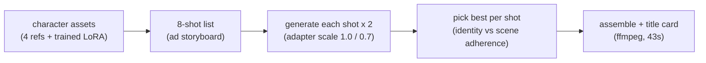

This post is for anyone wondering whether character-consistency video tech survives contact with actual ad production. We took the reference-conditioned LoRA measured in our previous post, cast the synthetic persona as the ambassador of a fictitious coffee brand, and produced a complete 43-second commercial end to end on internal GPUs. What you get here: the finished film, the full production pipeline, and the practical lessons learned along the way.

## The result first

<video controls muted playsinline style="max-width:100%">
  <source src="{{ site.url }}{{ site.baseurl }}/assets/videos/posts/nubo-film-a.mp4" type="video/mp4">
</video>

A 43-second commercial for the fictitious brand "NUBO COFFEE". The same person holds across all eight shots, from a morning kitchen through city streets, an office, a cafe, a park, and a rooftop, down to the closing close-up. The person is fully synthetic, the brand is invented, and every frame was generated on our internal GPU cluster with no external API.

*The eight shots in the final cut. Keeping one face across changing scenes and lighting is the whole reason this pipeline exists.*

## The production pipeline

We reused the assets from the previous experiment as-is: persona A's four reference stills and the LoRA trained for 800 steps. The new work was direction and selection, shaped by the deliverable being an ad.

The key design decision was generating at two adapter scales. As measured previously, scale 1.0 gives the strongest identity but pulls backgrounds toward the training data, while 0.7 recovers scene adherence at some identity cost. An ad has different requirements per shot: close-ups and emotional beats are all about the face, so 1.0 wins; shots where the location does the talking, like the cafe or the office, want 0.7. So we generated all eight shots at both scales, sixteen clips total, and picked per shot. The final cut uses 1.0 for five shots and 0.7 for three.

## What we learned making it

The most interesting discovery was a defect becoming a feature. At scale 1.0 the green shirt from the training data follows the persona into every scene; in the experiment report that was a prompt-following cost. In an ad context, the same person wearing the same outfit across scenes reads as a brand uniform. A metric failure became a directorial asset.

The cost profile is worth sharing. One clip takes about five minutes at 50 denoising steps; all sixteen clips took about eighty minutes on a single GPU, or forty-five minutes wall-clock with the two scales submitted as parallel jobs. Assembly is a few minutes of ffmpeg. Human hands touched exactly two places: writing the shot list and picking per shot.

The limits are equally visible. The rooftop shot failed to follow the background prompt at either scale, and we rescued it by redirecting the shot around motion rather than location. The prompt-following ceiling of 16-clip-scale training is a real production constraint, and knowing it at storyboard time is the current practical craft.

## The ThakiCloud angle

This one commercial is also a demonstration of a content pipeline where data never leaves. Character training (where Maxis sits) through shot generation and assembly (inference running on Metis) all closed inside customer-controlled infrastructure. A brand's character asset can drive campaign-scale video production without ever being uploaded to an external API, and this 43-second film is that claim made concrete.

The next installment takes on the harder question: a non-face subject. We are training a mascot character through the same pipeline for a second commercial, and we will publish it together with a controlled head-to-head against zero-shot reference conditioning measured under identical conditions.
