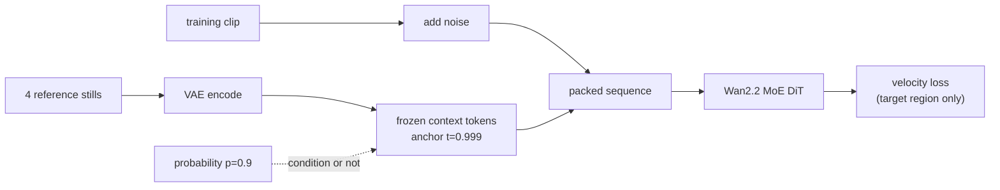
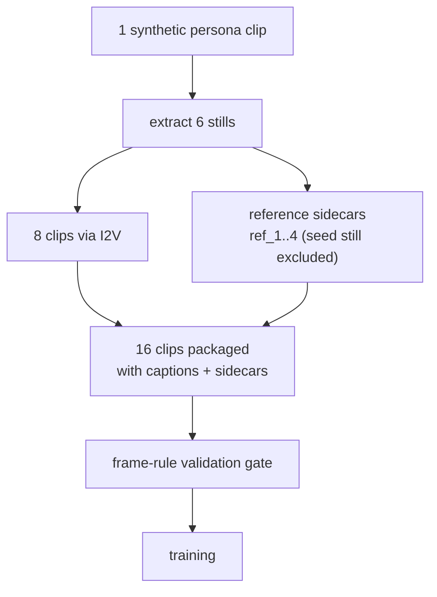

If you are an engineer who wants to fine-tune a video model so a brand mascot or virtual presenter stays recognizably itself in every clip, this post gives you two things: a concrete route for porting the reference-conditioned training recipe that commercial trainers keep behind their API onto an open-weight model, and a measured curve of how much identity that recipe buys and how much prompt following it costs.

*A visual metaphor for the article's key idea.*

## Why this experiment

Subject consistency is the gating requirement of commercial video generation. A mascot whose face changes between cuts is unusable. fal's MiniMax H3 Ref2VA trainer solves this well, but your training footage must leave for an external API, which is exactly where data-sovereign customers stop. So we inverted the question: can the same recipe be reproduced on infrastructure the customer controls, with open weights, and which of its components actually carry the effect?

Decomposed, the recipe has five components. Two of them are the heart of the port: encoding reference images into VAE latents and prepending them to the denoising sequence as clean, loss-excluded context (M1), and conditioning each training sample only with probability p, leaving the rest as plain training (M3). Our target model is Wan2.2 T2V A14B in Diffusers layout, a two-expert MoE split by a timestep boundary.

## Three contracts we found while porting

Contracts that live outside the docs only surface on the real architecture classes. Before spending any GPU time we built a smoke harness that instantiates the real config with shrunk dimensions, and it caught three of them.

First, the Diffusers Wan transformer takes per-token timesteps, not per-frame: one value per patch token, shaped (batch, n_tokens) in frame-major order. Feed it a per-frame tensor and capability detection silently fails back to broadcasting. Second, even in a bf16 checkpoint, the time embedder, scale-shift table, and norm layers stay fp32 by library contract; forcing uniform bf16 corrupts modulation. Third, MoE routing is per-step, not per-token. The 0.999 reference anchor never changes routing; it acts purely as a tag in the timestep embedding. The side effect is an imbalance the original single-expert recipe never had: under uniform sampling the high-noise expert receives only 12.5 percent of optimizer steps.

## The dataset: synthetic personas, no likeness rights

To keep the experiment publishable, both subjects are fully synthetic personas. From one generated clip per persona we extracted six stills, then animated those stills with image-to-video into eight training clips each. Everything ran on our internal platform and no real person appears anywhere. The training data's own identity self-similarity measures 0.712 and 0.606 in ArcFace terms, which becomes the ceiling reference for what training can reach.

## Results: identity gained, prompt following paid

Evaluation used 20 held-out prompts in contexts absent from training: beaches, libraries, subways. ArcFace scores whether the persona survives the new context; CLIP-T scores whether the prompt is followed. Gates were registered before the runs: identity must rise at least 0.10 over baseline (G1), and prompt following may drop at most 5 percent (G2).

The recipe kept its headline promise. The main run (p=0.9, 800 steps) reached 0.487 identity against a 0.286 baseline, a 70 percent gain and twice the pre-registered bar. The per-frame worst case moved from negative to positive: the baseline sometimes loses the subject entirely, the conditioned model does not. You can see it directly below; baseline on the left, reference-conditioned on the right.

<video controls muted playsinline style="max-width:100%">
  <source src="{{ site.url }}{{ site.baseurl }}/assets/videos/posts/ref2va-compare-pa.mp4" type="video/mp4">
</video>

<video controls muted playsinline style="max-width:100%">
  <source src="{{ site.url }}{{ site.baseurl }}/assets/videos/posts/ref2va-compare-pb.mp4" type="video/mp4">
</video>

The second gate, however, closed at no tested operating point. Every point that passed the identity gate lost 11 to 19 percent of CLIP-T. Lowering the adapter scale from 1.0 to 0.7 at inference recovers some prompt following but surrenders identity with it: you move along the frontier, you do not escape it.

The p sweep explains the mechanism. At p=1.0, with no unconditioned steps at all, identity collapses while prompt following survives. The 10 percent of unconditioned training the original recipe leaves in is not cosmetic; it is what lets reference conditioning bind at all. Identity peaks between p=0.8 and 0.9. The commercial service hints at this in a single documentation line; we now have the curve behind it in numbers.

The bottom line: on a 16-clip synthetic dataset, this recipe delivers subject consistency and charges a measurable prompt-following cost for it. Whether that trade is acceptable depends on the use case, and the frontier chart above is the decision surface. Untested mitigations remain, listed honestly as unmeasured: text-side guidance scaling, retraining at p=0.85, expert-balanced MoE training.

## The ThakiCloud angle: a pipeline where data never leaves

What this experiment proves, from the company's perspective, is a path rather than a single number. Dataset creation (synthetic persona I2V), LoRA training (including the MoE porting contracts), evaluation (ArcFace and CLIP-T gates), and sample generation all closed as jobs on our internal GPU cluster. A customer's subject footage never needs to leave for an external API. Maxis is the layer that offers this training pipeline inside the customer's data sovereignty, and Metis is where the trained adapter is served. The practical conclusion of this reproduction is a third option between commercial-API convenience and data sovereignty: you no longer have to choose.

Every measurement was pinned by pre-registered gates and deterministic evaluation code, and the failed gate is reported as-is. The next experiment checks whether a different architecture family (LTX) exhibits the same frontier.
