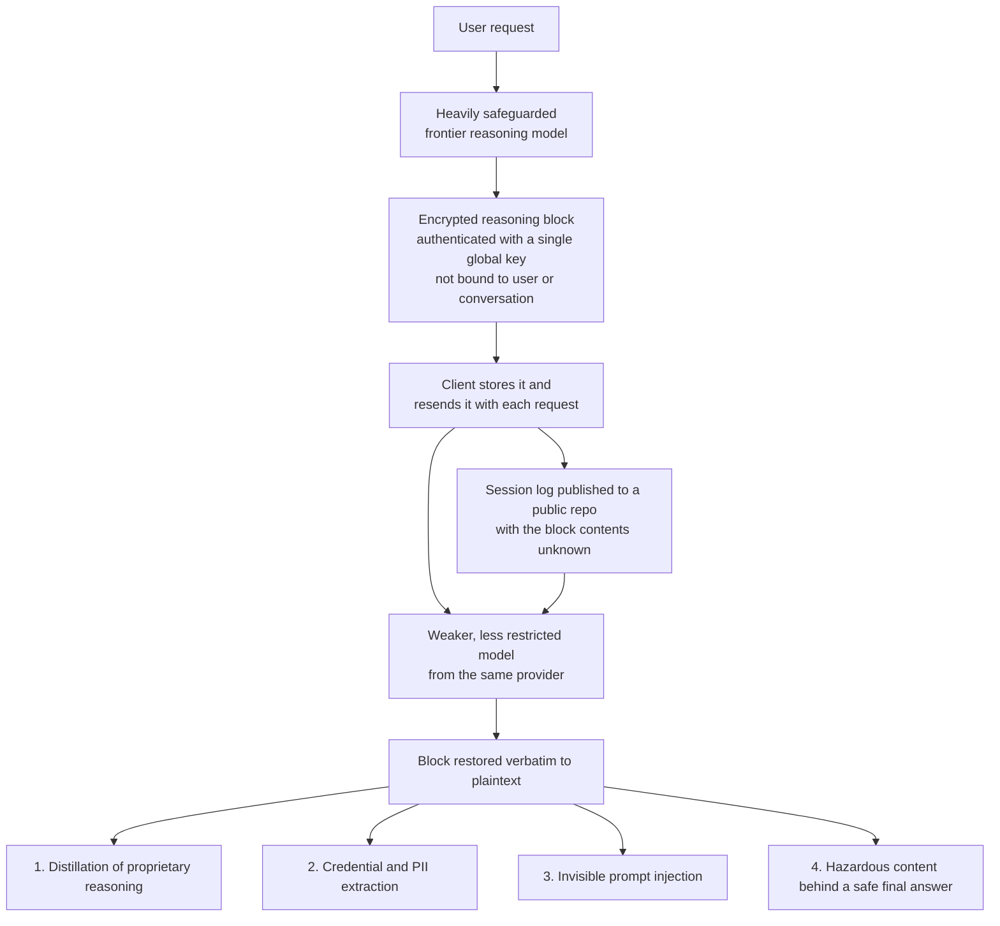

*Sealed and unreadable turned out not to be the same thing.*

## Why read this

This is for teams running LLM agents who store or publish session logs and traces, and for the security people who have to set the retention policy on those logs. The conclusion first: the encrypted reasoning blocks an API hands back could be restored to plaintext outside your control, which means those logs should always have been treated not as ciphertext but as **deferred plaintext**.

The flaw is not in the model. It is in how the blocks are handled. No amount of prompt engineering closes it, and conversely a single line of log retention policy closes a good deal of it. Below we cover why the architecture ended up this way, what damage was actually measured, and what an agent team should check today.

> 📄 **Full deep review (DOCX)**: [Download the detailed peer review on Google Drive](https://drive.google.com/file/d/1DCVHFJwh5UFaZYob2gZksfn9vK8Bm91y/view).

## Overview

On 10 August, "Stealing Reasoning Traces from Proprietary LLM APIs" (arXiv:2608.09867) went up on arXiv. It has eight authors, Alexander Panfilov, David Schmotz, Ilia Shumailov, Luca Beurer-Kellner, Joachim Schaeffer, Ameya Prabhu, Jonas Geiping and Maksym Andriushchenko, and is filed under cs.CR, cs.AI and cs.LG.

The background runs like this. Frontier reasoning models generate long internal chains of thought before producing a visible answer. Providers hide that reasoning to protect intellectual property and limit information leakage. How they hide it matters. Instead of storing traces server-side and returning an identifier, they wrap them in **encrypted text blocks handed back to the client, which the client returns with every subsequent request**. Keeping no state on the server is a reasonable choice for scalability.

The problem is how far those blocks travel. The architectural flaw the paper identifies is that these encrypted blocks are **fully compatible and interchangeable across sessions, across users, and across different models inside the same provider's ecosystem**. In the paper's words, providers appear to use a single global key to encrypt and authenticate every reasoning block. Nothing binds a block to a user or a conversation.

## How the attack works

Compatibility becomes the attack surface. Take a block produced by a capable, heavily safeguarded model and feed it into a weaker, less restricted model from the same provider. The weaker model decodes it and prints the trace verbatim in plaintext. The capable model is never jailbroken at all. The paper demonstrates this across Anthropic, OpenAI and Google.

The economics are worth noting. Using Claude Haiku 4.5 pricing at the time, with 12,000-token input and output windows, the paper estimates that decoding a corpus of 10,000 traces would cost roughly $720 at standard API rates. Price is not what stops large-scale extraction.

## Four attack vectors

The paper traces four branches from this one flaw.

**First, anti-distillation defences stop working.** The main reason providers hide reasoning is to block competitors from distilling it, and this route defeats that goal directly. Where prior work recovered surrogate approximations and lifted a fine-tuned Qwen2.5-7B-Instruct from 68.4 to 76.0 percent accuracy, this recovers the genuine reasoning verbatim.

**Second, large-scale private data extraction.** This is the part that lands most directly on practitioners. Developers publish session logs routinely for debugging, evaluation or dataset release, and they cannot see what sits inside the encrypted blocks. When the researchers decoded 315,320 blocks scraped from public repositories, they recovered 367 personally identifiable information artifacts and 182 credentials. From genuine user sessions alone that included 62 API keys, 33 passwords and 30 personal emails. The more uncomfortable detail is that some recovered PII **never appeared in the user's input at all**. It arrived in the reasoning from the model's memory.

**Third, hazardous content behind a safe answer.** A model can properly refuse a malicious request in its final visible output while the reasoning that led to the refusal still contains the material. Safety systems that only inspect what the user sees do not cover this channel.

**Fourth, invisible prompt injection.** Put a malicious payload entirely inside an encrypted block and anyone downstream sees nothing by eye. That becomes a route for poisoning published agentic rollouts. The practice of sharing traces for reproducibility turns into a supply chain.

The paper also leaves an interesting side observation. Prefilling a short fragment of decoded Opus 4.8 reasoning into Kimi-K3 and GLM-5.2 shifts their subsequent reasoning style, and the visible answer, toward Opus, while DeepSeek-V3.1 and Inkling show no comparable change. The authors explicitly call these results "suggestive but inconclusive", though. It is too early to cite them as evidence that a particular model was trained on particular data.

## Proposed defences

The researchers disclosed to the major API providers, Microsoft and Hugging Face before publishing, and the providers deployed server-side mitigations. The paper proposes five directions.

**Architectural revision** is the most fundamental. Store reasoning server-side and hand the client only a random identifier, and the extraction payload disappears entirely. The cost is database and storage overhead and significantly more API complexity.

**Cryptographic contextual binding** is the option if you want to keep a stateless architecture. Put the user identifier and conversation identifier directly inside the AEAD payload so the envelope is bound to its originating context. The paper notes, with some puzzlement, that it is unclear why this was not there from the start.

**Provider-side revocation** is the operational defence: detect anomalous replay patterns and invalidate the associated signature or key. Undoing already-published signatures, though, requires rotating the signing keys entirely, which also breaks legitimate resumption of past sessions. Given that enterprise customers need to resume paused agentic workflows, the paper suggests a bounded window during which both legacy and new envelopes are accepted, plus an opt-in batch re-signature endpoint.

The remaining two are infrastructure guardrails and model-level defences.

## What this means for ThakiCloud

This paper tests one of the assumptions we built Paxis on, head-on.

**Through the Paxis lens**, the essence of this incident is that an agent's execution trace is itself a sensitive asset. Paxis is our Agent-Native Cloud control plane, treating skills, tools, policies and audit logs as first-class resources, and leaving audit logs is central to the design. This flaw forces the question of who can read the logs we leave. If we preserve an opaque block returned by an external API verbatim in our logs, we are accumulating data our own policy gate cannot inspect, inside our own store. The practical implication is clear. Opaque blocks originating from external providers should be classified separately with short retention, and stripped by default on any path that shares traces outward. Data a policy gate cannot clear is closer to data a policy gate should block.

**Through the Metis lens** a different angle appears. The root of this vulnerability was a stateless design that pushed reasoning onto the client, chosen because server-side state costs money. That tradeoff simply does not exist in self-hosted inference. When the model and the inference server sit inside our own boundary, there is no reason to encrypt reasoning and ship it outward, and no round trip to make in the first place. Customers who require on-premise and sovereign deployment usually cite data sovereignty, and this case shows that argument was not an abstract worry but a measured leak. Inference that runs inside the control boundary never creates this class of attack surface at all.

The two meet at one point. The longer you run agents, the more trace you accumulate, and where you put that trace is your security design.

## Limits and counterarguments

First, the providers have already responded. This went through responsible disclosure and server-side mitigations are in place, so do not expect to reproduce the technique from this article. What remains practically risky is not future attacks but **the past logs already published**. Published material is not recalled, and retroactive invalidation breaks legitimate sessions along with it.

The measurement has limits too. The 315,320 blocks are a sample scraped from public repositories, and the researchers themselves note that local agent transcripts and internal services are likely to handle more sensitive material than public traces. The 182 credentials from a public sample is closer to a lower bound.

Decoding quality was not uniform either. The paper reports that obfuscated reasoning appears more often in GPT-family models with correspondingly higher decoding error rates. Not every block comes back as clean plaintext.

Finally, the opposing argument deserves a hearing. One could argue it is better not to encrypt reasoning at all. The hidden channel is precisely why safety filtering misses it, and exposing it transparently makes monitoring possible. The paper devotes a section to whether reasoning traces should be encrypted, and whether they should be ephemeral. That question is still open.

## Wrapping up

Your encrypted reasoning blocks were not your secret. Nothing bound the envelope to a user or a conversation, so blocks moved freely inside the provider's ecosystem, which means any block left in a published log could always be turned back into plaintext. The 182 credentials were the result.

Two things to do now. First, check whether session logs and evaluation traces your organisation has published or committed contain provider reasoning blocks. If they do, rotate the keys and credentials those sessions touched. Second, add a step that strips opaque blocks to any pipeline that stores or shares traces going forward. This is a line you hold on your side, independent of what the providers fix.

More broadly, one reclassification is worth making. Agent logs are not debugging output, they are sensitive data. File them that way and the next flaw of this shape finds you already prepared.

## Sources

- [Stealing Reasoning Traces from Proprietary LLM APIs (arXiv:2608.09867)](https://arxiv.org/abs/2608.09867)
- [Full paper HTML](https://arxiv.org/html/2608.09867v1)
- [HuggingFace Papers page](https://huggingface.co/papers/2608.09867)
- [alphaXiv discussion page](https://www.alphaxiv.org/abs/2608.09867)

Figures and quotations were verified on 13 August 2026 directly against the arXiv API metadata and the paper's full text.

> 📄 **Full deep review (DOCX)**: [Download the detailed peer review on Google Drive](https://drive.google.com/file/d/1DCVHFJwh5UFaZYob2gZksfn9vK8Bm91y/view).
