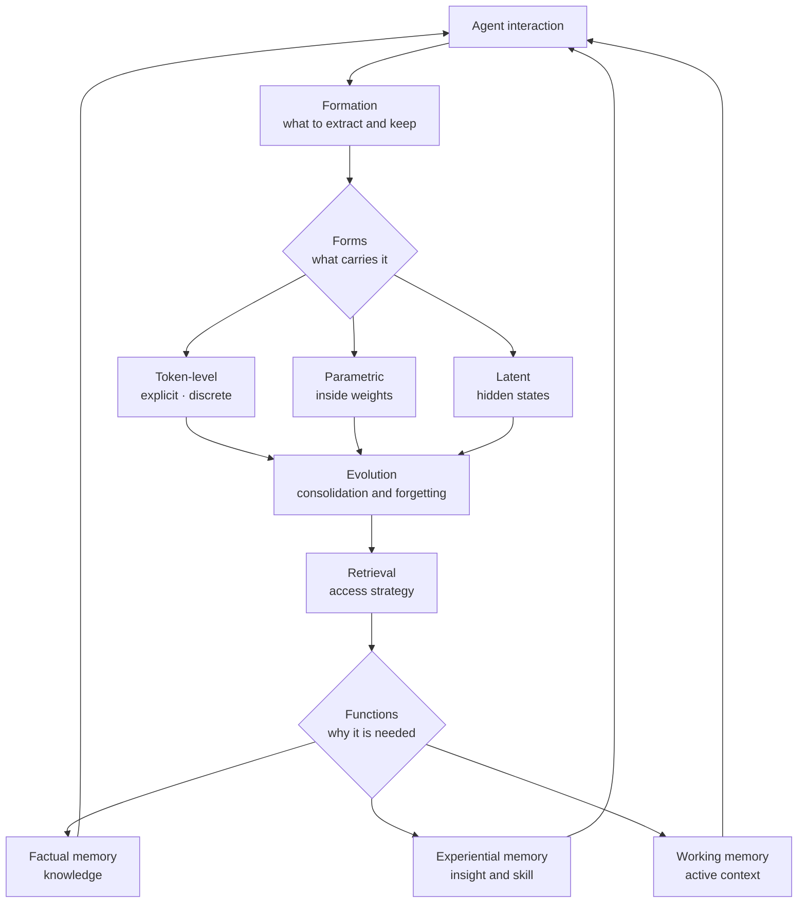

This post is for engineers adding memory to agents and for technical decision makers who have to pick which memory approach goes into a product. By the end you will know where agent memory research actually concentrates, where it is empty, and what that distribution implies for a system you design today.

Here is the conclusion up front. Agent memory looks like a broad research area, but the actual distribution of papers is heavily skewed. Putting 199 papers from a public list onto the taxonomy grid, 72 percent piled into one cell called token-level, while another cell held exactly one paper. Below I explain the axes the surveys propose, then argue from that tally what the skew means.


*What to keep and what to forget now decides how well an agent performs.*

## Overview

Two large surveys on agent memory appeared recently.

One is "Memory in the Age of AI Agents", written by 47 authors. It was published in December 2025, reached number one on Hugging Face Daily Papers, and a revised version incorporating recent work followed in January 2026. A companion repository runs alongside it and passed one thousand stars in January 2026.

The other is "Memory for Autonomous LLM Agents", published in March 2026. It covers work from 2022 through early 2026 and formalizes agent memory as a write, manage and read loop coupled tightly with perception and action.

What is striking is that both start from the same diagnosis. Research has exploded while terminology stayed loosely defined, so the field fragmented. The first survey states explicitly that the traditional long-term and short-term split is insufficient to capture today's diversity. In practice it is common for two systems carrying the same label to do entirely different things.

So this post does not stop at introducing the taxonomies. I took the grid and counted real papers into its cells.

## What the survey proposes

The first survey begins by drawing a boundary. It separates agent memory from LLM memory, retrieval augmented generation and context engineering. Why that matters in practice is plain: attaching a vector database does not give an agent memory. Retrieval augmented generation pulls external knowledge in at query time, while agent memory is the problem of managing, across interactions, what to keep and what to discard.

On top of that it offers three lenses.

Forms asks what carries the memory. Token-level is explicit and discrete, stored as text or structured records. Parametric holds it implicitly inside weights. Latent holds it in hidden states.

Functions asks why the agent needs memory. Factual memory is knowledge, experiential memory is insight and skill, and working memory is active context management. The point of this axis is moving from dividing by duration to dividing by purpose.

Dynamics looks at how memory changes. Formation is extraction, evolution is consolidation and forgetting, and retrieval is the access strategy.



The second survey draws its axes differently. It uses temporal scope, representational substrate and control policy, and examines five mechanism families in depth: context-resident compression, retrieval-augmented stores, reflective self-improvement, hierarchical virtual context, and policy-learned management. On evaluation it traces the shift from static recall benchmarks to multi-session agentic tests, noting that four recent benchmarks interleaving memory with decision making expose stubborn gaps in current systems.

Placing the two axes side by side shows where they overlap and where they split. Representational substrate and forms are effectively the same thing under different names, and control policy maps onto evolution and retrieval within dynamics. But the second survey's temporal scope axis is exactly the one the first survey deliberately discarded. That two syntheses published in the same year diverge at this point is itself evidence that the field has not reached consensus.

## Counting real papers into the grid

To see whether a taxonomy is useful, put real research into its cells. The companion repository of the first survey organizes its paper list as a grid of functions by forms. I fetched that list and counted entries per cell.

```python
FUNC_RE = re.compile(r"^###\s+(.+?)\s*$")     # functions: factual / experiential / working
FORM_RE = re.compile(r"^####\s+(.+?)\s*$")    # forms: token / parametric / latent
ENTRY_RE = re.compile(r"^\-\s*\[(\d{4})/(\d{2})\]")
```

As of 14 August 2026 the tally came out as follows, 199 papers in total.

| Function | Token-level | Parametric | Latent | Total |
|---|---|---|---|---|
| Factual memory | 84 | 16 | 8 | 108 |
| Experiential memory | 46 | 6 | 1 | 53 |
| Working memory | 14 | 2 | 22 | 38 |
| Total | 144 | 24 | 31 | 199 |


*Brighter cells hold more papers. The middle cell on the right is nearly empty.*

Three things stand out.

First, token-level accounts for 144 papers, 72 percent of the total. Storing memory as explicit text or structured records dominates. The reasons are not hard to guess. It is easy to implement, human-readable so it can be debugged, and it reuses existing retrieval stacks as they are. The single cell where factual memory meets token-level holds 84 papers, 42 percent of everything.

Second, the ordering flips only in working memory. In the other two functions token-level dominates, but in working memory latent leads with 22 papers against 14. Handling active context is a problem about model internal state to begin with, which is likely why. It is a domain where approaches that touch hidden states directly, such as context compression or KV cache management, come naturally.

Third, the most interesting finding is the empty cell. Exactly one paper out of 199 treats experiential memory through latent representation. Carrying the insight and skill an agent gains from what it has been through as hidden state rather than explicit text is a direction that has barely been explored. Adding parametric work, non-explicit representation of experiential memory amounts to just seven papers.

I looked at the time distribution too. Entries cluster in the second half of 2025, with October 2025 the heaviest at 23. That matches the surveys' diagnosis that the field grew sharply over the past year.

The limits of the measurement should be stated. This tally counts the companion repository list, not the survey body, and the list is continuously updated through community contributions. So the numbers are a snapshot as of today and cannot be guaranteed to match the paper's own classification exactly. Still, since the same team maintains the list under the same taxonomy, it is sufficient for reading the direction of the distribution.

## What this means for ThakiCloud

This distribution carries practical implications for anyone building an agent platform.

Paxis is ThakiCloud's Agent-Native Cloud control plane, treating skills, tools, policies and audit logs as first-class resources. In that structure memory is not a separate feature but the layer where skill selection and execution history accumulate. Holding the tally against our design settles a few things.

That token-level dominates is grounds for some reassurance. Explicit, human-readable memory ties directly to auditability. Memory held in hidden states is hard to explain after the fact, in terms of what was remembered and why. In an environment premised on policy gates and audit logs, explicit representation is the advantageous choice for regulatory response, and fortunately most of the research sits there.

That latent representation leads in working memory is a signal pointing the other way. Handling long context is likely a problem solved at the inference layer rather than the application layer. Context compression and cache management belong closer to the serving stack than to an agent framework. Having ai-platform absorb that problem in the layer handling vLLM-class serving, while Paxis above it concentrates on factual and experiential memory, is a division of labor that matches the research distribution.

The empty cell in experiential memory is both an opportunity and a warning. The part where an agent learns from failure and carries that lesson into the next run is what we handle through skill evolution and retrospective loops, and even in the research community explicit approaches dominate, 46 to 7. That means few methods are validated, so putting hidden-state experience accumulation into a product at this point is risky. Recording in text with the rules owned by code is the reasonable choice for now.

The engineering realities the second survey names are our problems verbatim. It lists write-path filtering, contradiction handling, latency budgets and privacy governance, and all four hit immediately in a multi-tenant environment. Contradiction handling in particular is guaranteed to appear in long-running agents. Without a rule for what to keep when yesterday's truth becomes today's falsehood, memory grows less trustworthy over time.

## Limits and counterarguments

How you read a survey needs care.

A taxonomy is a tool for organizing research, not a design document. That a cell holds many papers does not mean the approach is superior. As noted, a large part of why token-level is crowded is that it is easy to implement. Research volume is a function of difficulty and accessibility, not of effectiveness. By the same token, reading an empty cell as an opportunity is hasty. It may be empty because the direction is hard or does not work well.

That the two surveys chose different axes cuts both ways. This post counted against the first survey's grid, and classifying the same papers along the second survey's axes could produce a different picture. There is as yet no standard for judging which taxonomy is right.

And surveys look backward by definition. Both cover research through early 2026, and the list entries cluster in the second half of 2025. Given how fast this field moves, the most advanced work right now is probably not yet on any taxonomy grid.

Finally, a point both surveys make in common. Evaluation is still weak. Static recall benchmarks fail to measure the real value of a memory system, and moving to multi-session agentic tests exposes the flaws in current systems. It is too early to pick a memory approach on benchmark scores.

## Wrapping up

Agent memory carries one name but is really several different problems. The taxonomies the two surveys propose let you pull those problems apart, and putting 199 real papers into the cells shows in numbers where the research sits. Seventy-two percent in token-level, and 42 percent in the single cell where factual memory meets token-level.

So the posture for a team adding memory today is clear. Starting where validated methods are plentiful, meaning explicit text-based factual memory, is the reasonable move. It audits, it debugs, and the research behind it is deep. Active context management is better left to what the serving stack provides than built yourself. Experiential memory should be recorded as text with the rules owned by code, while attempts to move it into hidden states stay an experiment for now.

The next time you have to pick a memory library, ask this before reading the feature list. Which does this tool handle, factual or experiential or working memory, and what does it hold it in, token or parametric or latent. Answer both and the field of comparison shrinks considerably.

## Sources

- [Memory in the Age of AI Agents (arXiv:2512.13564)](https://arxiv.org/abs/2512.13564)
- [Memory for Autonomous LLM Agents (arXiv:2603.07670)](https://arxiv.org/abs/2603.07670)
- [Agent-Memory-Paper-List companion repository](https://github.com/Shichun-Liu/Agent-Memory-Paper-List)
- Tally script and log: `scripts/experiments/agent-memory-survey/`, `outputs/blog-impl/agent-memory-survey-2026/run-1.log`
