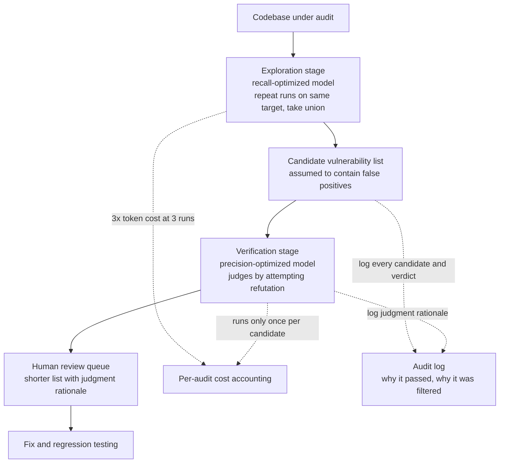

*A wide sweeping light and a sharp focused light are not the same light.*

## Why this matters

This is for security engineers and platform owners who are wiring language models into source code security audit pipelines. The short version: in this benchmark, the model that found the most vulnerabilities and the model whose reports you could trust most were two different models. So the practical question isn't which model is best, it's which model goes in which stage.

Handing an entire audit to one model doesn't hold up against these numbers. Pick the model with the highest recall and false positives come along for the ride. Pick the model with the highest precision and you miss more vulnerabilities. Below, we take the published numbers at face value and work out how to absorb that trade-off into the pipeline design itself.

## Overview

Security researcher Philippe Dourassov published results on August 13 from running DeepSeek V4 Pro 0813 through his team's cybersecurity benchmark. The model beat every other model on vulnerability discovery. At pass@3, it rediscovered 87.5% of the CVEs in the benchmark, while Opus 5 and Qwen 3.8 tied at 81.3% under the same conditions.

If you stop reading there, you have a clean headline about a new leader. But the same release includes two more numbers. Of the vulnerabilities this model reported, only 65.6% turned out to be valid, and GPT-5.6-Sol led on precision at 86.4%. And on a single run, the model averages just 58.3% recall.

Put the three numbers together and the picture changes completely. The 87.5% headline is a union across three runs. The expected value from a single run is about two-thirds of that. And one in three of the reported findings isn't real.

The model under test deserves a note of its own. DeepSeek V4 Pro 0813, formally released on August 12, is a Mixture-of-Experts model with 1.6 trillion total parameters and 49B activated per token. The developer reports Terminal Bench 2.1 climbing from 72.1 to 87.9, DeepSWE from 12.8 to 62.7, and an external metric, the Artificial Analysis Intelligence Index, rising from 45 to 53. Independent verification of these developer-reported numbers is still pending, and some coverage notes the model underperformed on general benchmarks. Against that backdrop, a third party's own benchmark result in the security domain carries different weight, because it wasn't a metric the developer chose.

*The leader flips between the two metrics of the same benchmark. Each panel only shows models with a published score for that metric.*

## What's actually being measured

Before interpreting the numbers, we need to separate what each metric measures.

Recall looks at how many of the real CVEs seeded in the benchmark the model rediscovered. From an auditor's chair, this is the inverse of missing something. If this number is low, vulnerabilities remain even after you've run the audit.

Precision is the share of the model's reported vulnerabilities that are actually real. If this number is low, the list of candidates a human has to check gets longer. A value of 65.6% means one in three reports is noise, and that cost scales linearly as the audit surface grows.

The pass@3 condition also can't be waved away. It counts a success if the model finds the CVE in at least one of three runs against the same target. A single-run average of 58.3% against a pass@3 of 87.5% tells you the set of findings varies quite a bit run to run. That variance is itself a trait of this model. The researcher described it as significantly more exploratory than other models, digging deeper into specific functions rather than sweeping broadly. It goes deep, but not down the same path every time.

Operationally, this condition translates directly into cost. Getting the actual 87.5% means running inference three times, which triples token cost and audit turnaround. On a benchmark table, pass@3 is one column. On a budget sheet, it's three times the spend.

The flip side of that high variance is that run count becomes a tunable dial. A model that finds the same things every time gains nothing from running twice versus ten times, so extra runs are pure waste. A model that explores different territory each run expands its union as you add runs. The jump from 58.3% at one run to 87.5% at three runs is the evidence. That kind of accumulation usually flattens out, though, so how much a fourth or fifth run adds needs to be measured separately. The public materials only report pass@1 and pass@3, so we can't see the shape of that curve.

In practice, it's reasonable to turn this dial to match how much a given audit target matters. Run more passes on modules where a single missed vulnerability is expensive, like payments or authentication, and settle for one pass on lower-risk areas that change often. Applying the same run count to everything loses on both cost and coverage.

Finally, remember what this benchmark actually measures: rediscovery. It tests whether a model can find a vulnerability that's already been found and assigned a CVE number. In practice, the point of running an audit is usually to find vulnerabilities nobody knows about yet, so the two tasks aren't quite the same. The patterns behind known vulnerabilities are scattered across public documentation, patches, and technical blog posts, and it's hard to rule out that the model saw traces of them during training. Strong rediscovery performance doesn't guarantee the same rate holds for undiscovered vulnerability detection.

That doesn't make the measurement meaningless, though. A model that can't even rediscover known CVEs is unlikely to find new ones, so it's a valid floor, and above all it's more than adequate for ranking models against each other under identical conditions. What this piece is about isn't absolute performance but the relative ranking across models, and the fact that ranking flips depending on which metric you read.

## A design that doesn't ask one model to carry both recall and precision

When the numbers split like this, the fix isn't picking a model, it's splitting the pipeline. Separate the broad-sweep stage from the filtering stage, and put the model that's strong on that stage's metric in that stage.

Put a high-recall model at the exploration stage. False positives here are fine. The point of this stage is not to miss a candidate, and an exploratory model like DeepSeek V4 Pro 0813 fits it well. If needed, run it multiple times against the same target and take the union.

Put a high-precision model at the verification stage. For each candidate the previous stage passes along, have this model judge it with the goal of refuting it as a real vulnerability. This stage only has to run once per candidate, so it's far cheaper than sweeping the whole codebase again.

A human looks at the result last. After the two stages, the list reaching a human is shorter, and each item comes with a note on why it passed.

What matters in this structure is that the two models fail differently. Use the same model twice and it lets the same blind spot through twice. You only get real filtering by putting models with different tendencies at exploration and verification.

A detail that's easy to miss when designing the verification stage is the direction of the question. If you hand a candidate to the model and ask whether it's really a vulnerability, the model tends to agree. That tendency is stronger if the prompt carries context that the previous stage already judged it to be one. So the verifier needs to be asked to refute: explain why this report is a false positive, and only pass it if that refutation fails. The same model's pass rate shifts depending on which direction you frame the question.

For the same reason, it matters that the verifier doesn't inherit the previous stage's reasoning. If you pass along a long explanation of why the exploration model judged something a vulnerability, the verifier's role shrinks to confirming that logic rather than judging independently. Passing only the candidate's location and code, and letting the verifier judge fresh, preserves that independence. The point of splitting the two stages is to get two judgments, not to get one judgment approved twice.

One more thing worth adding: this structure doesn't raise the final recall above what the exploration stage achieves. Verification only filters, so a vulnerability missed upstream doesn't come back to life downstream. That's why putting the highest-recall model at the exploration stage matters, and in this benchmark that's DeepSeek V4 Pro 0813. Precision can be recovered later, but recall can't, and that asymmetry decides the ordering.

## Implications for ThakiCloud's products

ThakiCloud automates enterprise work with agents centered on Paxis, together with the inference and infrastructure needed to run it. Security auditing is a task this structure fits particularly well.

From a Paxis standpoint, the two-stage pipeline above is essentially an agent orchestration design. Paxis treats skills, tools, and policies as first-class resources and routes every action through policy gates and audit logs. Wiring an exploration agent and a verification agent to different models, and logging the candidate list and verdict rationale to the audit trail, becomes default behavior rather than something you build separately. In security auditing, that log isn't a nice-to-have. If you can't retroactively trace why a vulnerability was missed or why a report was filtered, the audit itself has no credibility. Forcing the verification stage into a refutation posture is also something you can pin down as policy.

From an Aegis standpoint, it's clear why this work belongs on-premises. The input to a security audit is the entire source codebase, usually a company's most sensitive asset. Shipping that codebase to an external API to run an audit is a non-starter from the outset in finance, public sector, or defense. This pipeline only works if you can run the model inside a closed network, which makes open-weight availability matter as much as the performance numbers.

From a Metis standpoint, cost design is the challenge. pass@3 means running inference three times, and running an MoE model with 1.6 trillion total parameters and 49B activated three times isn't cheap. Metis is the layer that manages token cost through model routing and quantization, so it's possible to use a lower quantization tier at the exploration stage to absorb repeated runs, and a higher tier at the verification stage to protect precision. There's no reason to use the same serving configuration for both stages.

These two perspectives need each other, worth adding. The constraint of running on-premises narrows your usable models down to open-weight ones, and the fact that the top recall model in this result comes from within that narrowed pool is the real value of this outcome. A model that scores well but can't run in a closed network never makes it into a finance or public-sector customer's audit pipeline. The performance leaderboard and the deployability leaderboard are different tables, and what matters in practice is their intersection.

From a Signum standpoint, where the audit results go is the issue. Candidate vulnerabilities and their verdict history are sensitive information in their own right, and who viewed what and when needs to be recorded. Attaching access control and audit events to the audit pipeline's output deserves the same weight as building the pipeline itself.

## Limitations and counterarguments

A few things worth flagging so this result isn't over-read.

First, it's one benchmark. This result comes from a single research team's own CVE rediscovery benchmark and hasn't been independently reproduced. The ranking could easily shift depending on the type of CVE and the nature of the codebase in the benchmark. Rediscovery-style evaluation in particular can't fully rule out that a given CVE was included in training data.

Second, DeepSeek V4 Pro 0813's broader benchmark claims are still awaiting independent verification. The developer reports Terminal Bench 2.1 rising from 72.1 to 87.9, DeepSWE from 12.8 to 62.7, and the Artificial Analysis metric rising from 45 to 53. But external verification of these numbers is still called for, and some coverage notes the model actually underperformed expectations on general benchmarks. Its strength in the security domain shouldn't be read as a broader claim about the model overall.

Third, if you're weighing on-premises deployment, there's an item to confirm. The DeepSeek line has released weights under an MIT license historically, but weight availability for the 0813 checkpoint isn't confirmed in the official repository. That repository currently holds an April preview checkpoint, with no August commit or 0813 tag visible. Community GGUF conversions exist, but treating them as equivalent to an official release is risky. Confirm this before building a self-hosting plan around it.

Fourth, whether a 65.6% precision rate is workable in practice depends on audit scale. A few dozen candidates can be filtered by a human; a few thousand hits alert fatigue first. The two-stage pipeline reduces this problem, it doesn't eliminate it.

Fifth, the two-stage structure proposed here is a design derived from the numbers above, not something we measured ourselves. How much splitting exploration and verification actually raises final precision needs to be measured directly against your own codebase.

## Summary

What this benchmark leaves us with isn't a new leader, it's a leader split in two. DeepSeek V4 Pro 0813 found vulnerabilities best, and a different model was the one you could trust most on the reports. On top of that, the headline number is a union across three runs, and a single run drops to about two-thirds of that.

So back to the opening question: choosing a single model for an audit pipeline is a wrongly framed decision to begin with. The broad-sweep seat and the filtering seat demand opposite qualities, and nothing in these numbers suggests one model should be expected to excel at both at once.

If you're picking one thing to do next, count the false-positive rate coming out of the audit tool you're already using. If that number is at or worse than this benchmark's 65.6%, adding a verification stage should come before swapping models. Adding a stage is usually cheaper than swapping a model.

## Sources

- [Philippe Dourassov's benchmark result post](https://x.com/pilvar222/status/2087691659953815783)
- [DeepSeek launches an improved V4 Pro model, raises API prices, and makes its agent software open source, The Decoder](https://the-decoder.com/deepseek-launches-an-improved-v4-pro-model-raises-api-prices-and-makes-its-agent-software-open-source/)
- [DeepSeek V4 Pro 0813 goes GA with benchmark claims awaiting independent proof, TechTimes](https://www.techtimes.com/articles/324241/20260813/deepseek-v4-pro-0813-goes-ga-benchmark-claims-await-independent-proof.htm)
- [DeepSeek V4 Pro metrics analysis, Artificial Analysis](https://artificialanalysis.ai/models/deepseek-v4-pro)
- [Coverage of DeepSeek's updated V4 Pro model, South China Morning Post](https://www.scmp.com/tech/big-tech/article/3363895/deepseeks-updated-v4-pro-ai-model-struggles-benchmarks-shines-cybersecurity)
