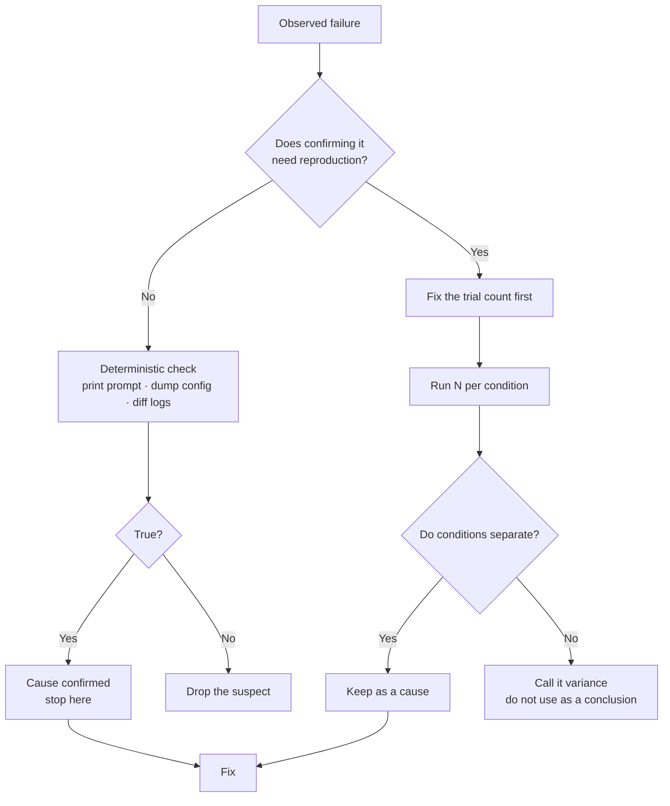

If you run an image generation pipeline, it is worth checking how far you can trust the
habit of naming a cause after seeing one failure. The short answer is: not very far. We
named two causes that way, and after three more runs of each condition we learned that
one of them did not exist.

This post covers three things that came out of it. Ordering suspects by verification
cost, the failure mode that similarity-based gates structurally cannot catch, and how to
find information that was never in the prompt at all. None of the three is specific to
character work.

## The problem

We generate several camera angles from a single character image. Games and animation call
this a turnaround: from one front view you produce three-quarter, profile, and rear views
so the character reads as the same individual from any direction.

Mechanically, we pass the base render to an image editing API as a reference and use the
prompt to change only the camera angle. Our settings were 1024 pixels at high quality, and
a single view took between 113 and 124 seconds. A four-view turnaround runs about eight
minutes.


*The finished set. Front, three-quarter front, profile, three-quarter rear, rear.*

Getting there, two of the four views failed. The three-quarter front barely rotated, and
the three-quarter rear kept the character facing the camera instead of moving behind it.

## Two suspects

The first suspect was prompt wiring. Our editing wrapper lets each input image carry a
role. "This image defines the character's identity, so reproduce its silhouette and
palette exactly and ignore its pose and camera angle" lives in that role paragraph. But
the paragraph was only attached when two or more images were passed. A turnaround passes
the base render alone, so the role silently vanished and the model was never told it was
allowed to move the camera.

The second suspect was the view wording. The two views that worked named a camera:
"full profile side view", "straight-on back view". The two that failed described a
rotation in degrees: "body turned 135 degrees from camera". The hypothesis was that the
degree phrasing is ambiguous and the model resolves ambiguity toward the safest answer,
which is something close to the original.

The second one looked far more compelling. It made a clean four-row table, and rewriting
the view definitions in terms of what should be visible made both views pass. We thought
that settled it.

## It did not reproduce

To produce a before image for publication, we ran the old wording once more. It came back
as a correct rear view.

So we ran three trials of each wording against the same base image.


*Old wording on top, new wording below. All six moved the camera behind the character.*

All six were correct. Measuring how far each frame drifted from the base render gives a
mean of 0.109 for the old wording and 0.113 for the new one, which does not separate the
two conditions. And the view that originally failed sat at 0.073, outside the 0.104 to
0.117 band that the six runs produced.


*Left: drift across the four final turnaround views. Right: the wording A/B. The dashed line is the single run where the camera never moved.*

It was not a wording effect. It was an unlucky draw. I had been confident enough to build
a table, and every cell in it was a single trial. Four cells shaped like data are not data.

## What separated the two was verification cost

The two suspects were equally plausible. They differed on exactly one axis: whether
confirming them requires reproduction.

The missing role is decided by printing the final prompt string. No model call, no
sampling, one look tells you whether it is true.

```
$ edit_image.py --input base.png --role identity --prompt "3/4 view" --emit-prompt
3/4 view
```

The role was passed explicitly and it is absent from the output. The angle wording, by
contrast, touches the part of the system that does not return the same output for the same
input, so the only way to claim anything is to accumulate trials.

The rule that follows is short. Order your suspects by verification cost rather than by
plausibility. Confirm the deterministic ones first and stop there. For the probabilistic
ones, fix the number of trials up front and do not write a conclusion until you have run
them.



The practical gain is the ordering. Handle the deterministic suspects first and, when one
of them turns out to be real, you never have to test the probabilistic ones at all. We
inverted the order and spent six extra images and twelve extra minutes. At scale that cost
grows linearly.

### So how many runs is enough

Telling someone to fix a trial count is easy; the number is the hard part. We used three
per condition, and that choice has clear limits.

Three trials only catch large differences. If the old wording had genuinely failed often,
say half the time, one of three runs would likely have failed and the hypothesis would
have survived. Instead all three passed and all three of the new wording passed, which
supports only the claim that the two conditions are not very different. A small gap, five
percent against three percent, will never be resolved by three runs. Claiming that needs
dozens, and at two minutes per image that is a multi-hour decision.

The practical compromise is to ask what you would do differently if you knew. If the
question is whether to keep a wording change, and changing it costs nothing, precision is
not worth buying. Use the version that reads better and write down that it is not a
measured improvement. That is what we did: we kept the new wording and put a comment in
the code stating outright that this is not a measured gain and must not be cited as one.

If the difference drives GPU hours or an architectural decision, measure it properly. Making
that distinction alone removes most of the "should we measure this" items, because measuring
something that changes no action is not worth doing.

One thing holds regardless of trial count. The failing run's value fell outside the success
distribution: 0.073 is nowhere inside the 0.104 to 0.117 band. Building the distribution
first means the next strange value announces itself immediately. That is less about
statistics than about having a baseline at all.

## When the gate points the same way as the failure

The more uncomfortable finding was that our verification gate caught none of this.

The pipeline has an identity gate. It compares palette and silhouette and scores whether a
generated frame is still the same character. Feeding it the four views returned 99.8 to
100 out of 100, silhouette agreement of 1.0, and zero flagged frames. A front view and a
profile cannot have identical silhouettes, so the metric is saturated and nothing usable
remains in a pass or fail.

Direction matters more than saturation. This gate rewards similarity. But similarity is
exactly the failure mode of a turnaround: a view where the camera never moved is nearly
identical to the original and therefore scores perfectly. The failure the gate should
catch points the same way as the gate's own reward. The view that came back unchanged
because the role had vanished would have passed it too.

This pattern lives everywhere in generative pipelines. Score summary quality by similarity
to the source and a verbatim copy wins. Score translation by source preservation and the
untranslated sentence wins. Score style transfer by identity preservation and the
unmodified image takes first place. The common shape is that when the axis the gate
measures runs opposite to the change you want, the gate turns the light green for doing
nothing at all.

The fix is a second axis. Ours compares a downscaled grayscale frame against the base
render and takes the mean absolute difference. That is the drift number in the chart
above, and it tracks rotation reasonably well.

Which makes it tempting to judge angles with it, and that would be a mistake. The failing
view measured 0.073, not 0.0. The only question this metric answers is whether the camera
moved at all; whether the angle is correct is beyond it. Promoting a correlation to a gate
means the next person who trusts that gate gets a false green light. Angle correctness is
still judged by a human, and we wrote that into the gate documentation rather than dressing
it up as an automatic pass. A gate that admits its hole beats one that hides it.

### What two axes actually means

In practice the split is this. One axis protects what must not change; the other checks
that what should change actually did. For a turnaround that is identity and camera. For
summarization it is factual preservation and compression. For translation it is meaning
preservation and the shift into the target language.

The point is to make it explicit in the design that the two axes pull against each other.
Drive identity to a perfect score and the camera axis goes to zero, because doing nothing
achieves it. Gate on one axis alone and the pipeline finds the cheapest route to a perfect
score on that axis, which is usually to do nothing.

And once both axes are in place, write down the hole that remains. Our second axis answers
"did it move" and not "is the angle right", and a human fills that gap today. Documenting
it keeps the next person from overtrusting the gate. Worse than a gate with a hole is a
gate documented as having none.

## What the prompt never said

Two more issues came out of the same work, and both were on the deterministic side, because
the information simply was not in the prompt.

One base render came back with the palette inverted. The character definition listed a
primary, a secondary, and an accent color as hex codes, but listing three codes does not
communicate which one dominates the surface area. The model painted the body in the
secondary color and used the primary as trim, and read against the definition, nothing is
wrong. Adding a sentence that the primary is the dominant color and must cover the largest
share of the body, and that this ordering must not be inverted, fixed it.

The same render put a hand prop in the wrong hand. "Held in the right hand" can mean the
character's right or the viewer's right. Putting a sentence up front stating that the
character's right hand appears on the viewer's left in a front view resolved it.

In both cases the spec file was fine. A human reading it has no problem. The problem is
that a human fills in information automatically and a model does not, so the stage that
flattens a spec into a prompt has to make the implicit explicit. Three hex codes were
information; their ordering was not. Left and right were words; the frame of reference was
not in the words.

## What this means for our platform

The story belongs to a character pipeline, but it is the same shape as a problem we meet
daily when **Paxis** hands enterprise work to agents. Agent workflows also produce
probabilistic output, and we attach verification gates on top of them. When the axis a gate
measures is misaligned with the change we actually want, the workflow passes while doing
nothing. That is why the first question in a Paxis approval and audit design is not
"is there a gate" but "what is the worst result this gate lets through".

Ordering suspects by verification cost transfers directly as well. When an agent fails,
dumping the prompt log and the tool call arguments settles a good share of cases without
any reproduction. Calling the model again comes after that. Running inference through
**Metis** means each of those reruns is metered in tokens and time, so inverting the order
leaves a visible number behind. The twelve minutes we spent here is one of those numbers.

## Closing

In a pipeline whose output varies, a single observation is the start of a hypothesis and
not a conclusion. Work your suspects in order of how cheap they are to confirm, and when
something is decidable deterministically, finish it there. Before attaching a verification
gate, picture the worst result it would let through. A gate that measures similarity likes
an output that changed nothing best of all.

Catching one misattributed cause before publishing was the cheapest thing we got out of
this work. Had it shipped, we would have written a wording rule and applied it to twelve
characters, and the fact that the rule does nothing would have gone unnoticed.

The numbers and images in this post come from actual runs, and the character shown is an
original design we own.
