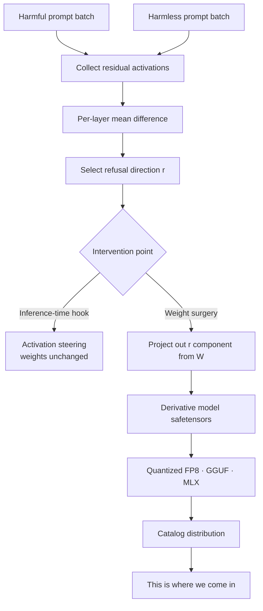

*Suppressing a single axis out of many that carry the signal. That is what abliteration does to the weights.*

Browse the Hugging Face model catalog for a while and you will keep running into models with `Uncensored` or `abliterated` tacked onto the end of their names. If your job is to bring models onto an internal platform, this forces a judgment call. What actually changed in this model? Can you trust it to perform the same as the original? Should it go into the catalog at all?

The short answer: these models are not the result of retraining on uncensored data. They are derivatives of the original weights with **the single direction responsible for refusal behavior erased via orthogonal projection**. It is closer to surgery than to training, which is why it takes hours instead of days, and why its side effects show up differently than a training run's would.

## Refusal is not a personality trait, it is one axis of the residual stream

The starting point is [Refusal in Language Models Is Mediated by a Single Direction](https://arxiv.org/abs/2406.11717), published by Arditi et al. in June 2024. The authors examined 13 open-source chat models up to 72B parameters and showed that refusal behavior is mediated by a **one-dimensional subspace**.

The claim is strong. You can find a single direction per model; erasing that direction from residual-stream activations makes the model stop refusing harmful instructions; and adding that direction back makes it start refusing harmless ones. The bidirectionality matters: it means this is a causal intervention, not a correlation.

Intuitively: a model has a circuit that judges "is this request dangerous" and a circuit that "therefore generates a refusal sentence," and the signal connecting the two is concentrated almost entirely on one axis of a high-dimensional space. What safety fine-tuning built was not a thick defensive wall but a single thin wire. The authors themselves write that this result exposes **a fragility in current safety fine-tuning techniques**.

## So removal is a projection, not retraining

Finding the refusal direction is conceptually simple. Feed the model a batch of harmful prompts and a batch of harmless ones, collect the residual activations at a given layer, and compute the mean difference between the two groups. Normalizing that difference vector gives the refusal direction $r$.

$$
r = \mathrm{normalize}\left(\mathbb{E}[h_{\text{harmful}}] - \mathbb{E}[h_{\text{harmless}}]\right)
$$

That much is activation-level, and it can be applied at inference time via a hook. But when building a model for deployment, the weights themselves get edited. Subtract the $r$ component from the matrix $W$ that writes into the residual stream, and that matrix can no longer produce output along that direction in the first place.

$$
W' = W - r\,(r^{\mathsf{T}} W)
$$

This is what people call abliteration, and at its core it is an **orthogonal projection**. No learning rate, no optimizer, no loss function. Instead of running a dataset through the model, it's a few matrix multiplications. For matrices with the opposite shape, such as the embedding matrix, only the side being projected changes, but the intent is the same.

The fact that the technique is this cheap is itself important information. Turning a model into an uncensored derivative requires no GPU cluster and no large dataset. In practice, tools like [Heretic](https://github.com/p-e-w/heretic) have fully automated the process, and as of August 2026 it has passed 27,000 GitHub stars. It is more accurate to say the barrier to entry has already disappeared.

## Quantization has nothing to do with being uncensored

This is where catalog confusion tends to arise, so it's worth spelling out. Seeing `MLX 4bit uncensored` in a name reads as if the MLX conversion removed the censorship, but that is not what happened. The two steps are entirely separate.

Removing alignment changes the **content** of the weights; quantization changes the **representation** of the weights. Quantizing an already-abliterated set of weights to 4-bit produces an uncensored 4-bit model. The quantization step itself is not removing anything.

What matters more in practice is the order of operations. Some community releases take an FP8 derivative, cast it back up to a BF16 representation, and quantize it to 4-bit again. Once you go through double quantization, the precision lost in the first quantization pass does not come back. This is not equivalent to quantizing once from the original BF16. When adding a model to a catalog, it is worth recording the derivation lineage down to this level of detail.

## Why you shouldn't take a vendor's reported refusal rate of 0% at face value

Take the recently discussed [orcarouter/Qwen3.8-27B-Uncensored-FP8](https://huggingface.co/orcarouter/Qwen3.8-27B-Uncensored-FP8) as an example. Here is what the Hugging Face metadata confirms: the base model is [Qwen/Qwen3.8-27B](https://huggingface.co/Qwen/Qwen3.8-27B), the license is Apache-2.0, the architecture is a multimodal model in the `qwen3_5` family, and the tags include `abliterated`, `uncensored`, along with `red-teaming` and `ai-red-team`. It has 60,000 downloads and 567 likes, so interest is not small.

But **the model card is gated**. Requesting the README without access permission returns a 401. The specific numbers cited in community discussion (which layer the direction was extracted from, how many weights were modified, how much the benchmark scores shifted), we were not able to verify directly as of this writing. That is why this post does not include those figures.

The situation itself is telling. Performance claims about derivative models are usually **the creator evaluating their own model with their own method**, and when the documentation needed to verify that is behind a gate, third-party reproduction can't even get started. On top of that, refusal is typically judged with rule-based heuristics, if the response doesn't contain a phrase like "I cannot" or "I'm sorry," it's counted as not refusing. This approach counts every case where the model gives an irrelevant or useless answer without a refusal phrase as a success.

So a reported refusal rate of 0% is closer to "the model does not output a rejection phrase" than to "the model answers competently on anything." Those are two very different claims.

## "Uncensored" is not to be taken literally

A follow-up study from February 2026, [There Is More to Refusal in Large Language Models than a Single Direction](https://arxiv.org/abs/2602.02132), points out that the single-direction hypothesis is incomplete. The authors examined eleven categories of refusal and non-compliance (safety, insufficient or unsupported requests, anthropomorphization, over-refusal, and more) and showed that these correspond to **geometrically distinct directions** in activation space.

Refusal is not one thing but many, and those many things sit on different axes. If that's the case, then a surgery that erases a single direction does not remove the phenomenon of refusal wholesale, it strongly suppresses the single most dominant expression of it.

The paper has a second finding that is easy to miss if you're focused on abliteration alone: steering along different refusal directions linearly produces **nearly identical tradeoffs between refusal and over-refusal**. The directions behave like a single shared 1-D control knob, and what changes when you switch directions is not whether the model refuses but **how it refuses**.

The expectation that finding more directions would enable more complete removal doesn't square well with this result. The fact that the geometry has multiple branches, and the expectation that handling those branches gets you a better knob, are separate claims, and the evidence so far does not support the latter.

## Distinguishing "won't" from "can't"

The most common misreading in evaluating derivative models is treating compliance rate as capability. [Willing but Unable](https://arxiv.org/abs/2606.05396), from June 2026, tackles this distinction head-on. The study grew out of a concrete problem: building training data for vulnerability detection requires asking a model to inject a specific CWE into code, and safety-aligned coding models systematically refuse these requests.

Testing Qwen2.5-Coder-Instruct models at 3B, 7B, and 14B, with three repetitions per condition, abliteration drove the refusal rate to zero or near-zero at every size while keeping syntactic validity above 93%. In this narrow setting, the conclusion is that refusal can be separated from measured code-generation capability.

The lesson here is about evaluation design. You cannot look at the refusal rate alone, you need to measure at least three separate axes: **refusal rate, attempt rate, and success rate**. Otherwise it's easy to arrive at the wrong conclusion that "benchmarks went up because the model became uncensored." A model that stopped refusing but attempts and fails vanishes from the statistics if you only track refusal.

## Where "precision removal" breaks down as a description

The most compelling argument for removing alignment is security work. When a model refuses because the phrasing of a legitimate, defensively-motivated security task sounds like misuse, the evaluation becomes ambiguous, you can't tell whether the failure to answer is a capability gap or a refusal policy.

[Ablating Safety](https://arxiv.org/abs/2605.17413), from May 2026, addresses this with a controlled protocol. It compares authorized-context prompting, reversible activation projection along the refusal direction, representation-control projection, and LoRA-based unalignment or task adaptation.

The results are interesting. Rank-4 refusal-subspace projection reached a security score of 0.51 while maintaining the same level of spillover as the aligned model. In contrast, **LoRA fine-tuned purely on task adaptation reached a security score of 0.87, a general score of 0.83, and unsafe compliance of only 0.13**, while refusal suppression with a retention constraint pushed spillover up to 0.27.

The upshot: the best way to get a model that is good at security work is not to remove refusal. It is **to teach the model the task**. The refusal-suppression path raised the target task score less while raising out-of-scope unsafe compliance more. The "precision surgery" metaphor does not hold up well under actual measurement.

## The ThakiCloud platform view

We sit on the side of hosting and serving models, which makes this a catalog policy question, not just an academic curiosity.

**Metis** is ThakiCloud's inference and token factory layer, registering and serving models in customer environments. When a derivative model enters the catalog, what we need to record is not the model name but its lineage: which base it was derived from, what operation was applied, and how many rounds of quantization were stacked on top. An abliterated model is an ordinary safetensors file at the format level, without metadata, it is indistinguishable from the original. If lineage isn't captured at registration time, there is effectively no way to recover it later.

**Aegis** covers on-premises and air-gapped environments, and that is exactly where demand for uncensored derivatives actually shows up. A security team that cannot use external APIs and wants a red-team evaluation model running internally is a legitimate need. But given the results from Ablating Safety above, the order we recommend is clear: before bringing in a general-purpose model with refusal removed, first check whether a model adapted to that specific task is the better choice. Within the range that has been measured, the adapted model performed better and had fewer side effects.

**Signum** is the shared foundation covering IAM, permissions, and audit events. If you operate a model with weakened alignment, control needs to live outside the model, not inside it. You need a structure that records who can call that endpoint and what requests went through it, so you can answer to an audit. Think of it as moving the controls that used to rely on the model's own refusal up to the platform layer.

For agentic workloads, **Paxis**'s policy gate plays the same role. In an architecture where tool calls and actions are filtered through policy and logged for audit, the request gets blocked at execution time even if the model itself doesn't refuse. A design that puts alignment in the model weights and a design that puts it in the execution path have very different levels of robustness.

## Summary

Abliteration is an orthogonal projection on the weights, not retraining, and that's why it's cheap and fast. It's also an interesting piece of interpretability research in its own right, since it reveals that what safety fine-tuning built was not a thick wall but a thin wire.

Still, for anyone running a catalog, three practical conclusions remain. A vendor's reported refusal rate counts the absence of a rejection phrase, not competence. Refusal is not one direction but several, and that fact doesn't make removal more complete. And for legitimate use cases like security work, teaching the model the task measures out better than erasing its refusal.

This isn't an argument for excluding derivative models. It's an argument for recording lineage, measuring refusal rate and capability separately, and keeping control outside the model.

## References

- [Refusal in Language Models Is Mediated by a Single Direction](https://arxiv.org/abs/2406.11717) (Arditi, Obeso, Syed, Paleka, Panickssery, Gurnee, Nanda, 2024-06-17)
- [There Is More to Refusal in Large Language Models than a Single Direction](https://arxiv.org/abs/2602.02132) (2026-02-02)
- [Willing but Unable: Separating Refusal from Capability in Code LLMs via Abliteration](https://arxiv.org/abs/2606.05396) (2026-06-03)
- [Ablating Safety: Mechanisms for Removing Alignment in Language Models for Security Applications](https://arxiv.org/abs/2605.17413) (2026-05-17)
- [p-e-w/heretic](https://github.com/p-e-w/heretic) (27.8k stars as of 2026-08-19)
- [orcarouter/Qwen3.8-27B-Uncensored-FP8](https://huggingface.co/orcarouter/Qwen3.8-27B-Uncensored-FP8) (model card gated, metadata verified only)
- [Qwen/Qwen3.8-27B](https://huggingface.co/Qwen/Qwen3.8-27B)
