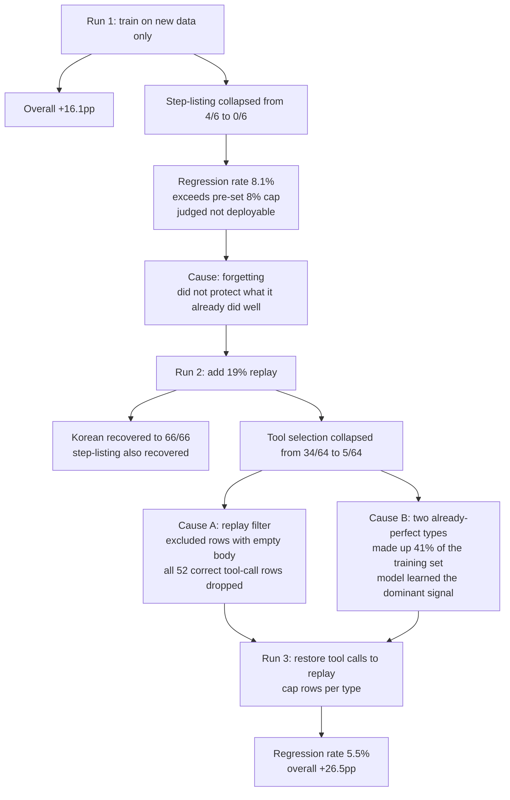

Run an agent platform for a while and you hit this question fast. Users keep building new agents
with the builder, and running all of them on a 27B model gets expensive. Drop to 8B and it gets
cheap, but quality drops with it.

Here is what we measured: **distilling an 8B model on execution logs from a 27B model raises
performance even on agents the training never saw.** Before training the score was 236/347, after
training it was 328/347, **+26.5pp.** Training took 770 rows and 14 minutes.

*A visual metaphor for the article's key idea.*

## What we measured

We built 1,176 cases across 221 agents, and pulled out **66 identities entirely** as a holdout.
None of the agents in the holdout overlap with the training set.

This split matters for a reason. By the end of training, final-step loss was 0.020 and token
accuracy was 0.995. Looking at the training set alone, you cannot tell good learning from outright
memorization. The fact that scores rose on agents the model had never seen is what makes that
distinction.

| | Before training | After training |
|---|---|---|
| Answering in Korean | 16/65 | **65/65** |
| Picking the right tool | 26/63 | **50/63** |
| Recognizing its own identity | 46/66 | **64/66** |
| Total | 236/347 | **328/347** |

On tool selection, the student, 50/64, beat the teacher, 48/64. It picks the right tool slightly
more often than the model it learned from.

## Scoring is done by code

We check eight things: whether it answers in Korean even when asked in English, whether the agent
calls the tool its own prompt tells it to, and conversely whether it holds back from calling a
tool when the question does not need one, whether it can read its own name out of the injected
spec, whether it avoids fabricating personal information, and whether it avoids claiming a step
that needs human confirmation is "done."

There is no LLM judge in the scoring path. Everything is regex and string comparison. And we
verified the scorer itself with deliberately wrong answers first: a fabricated email, an English
answer, an unnecessary tool call, a missing keyword, and a false completion claim all had to
register as FAIL before we ran the real measurement.

One design choice is worth calling out on its own. **We also check for not calling a tool.** If
you only measure the calling direction, over-calling stays invisible. An agent that calls a tool
in response to "what is your purpose" is violating its own prompt, and if that never shows up in
the metric, you would not know the model was drifting that way.

## We failed twice, and both times it was a data design problem, not a training method problem

We ran this three times. Each run fixed one thing and broke another, and both times the cause was
not the training method but the filter used to select the training set.

*If you read the three runs by overall average alone, both run 1 and run 2 look like successes.
The collapse only shows up once you split by category.*

**The first run forgot.** Training on new data alone pushed the overall score up by +16.1pp, but a
task that lists workflow steps dropped from 4/6 to **0/6**. It missed everything it used to get
right. The regression rate came in at 8.1%, above the 8% cap we had set in advance, so we judged
it not deployable.

**The second run broke the balance.** Adding 19% replay, meaning mixing in a slice of what it used
to do well, fixed the forgetting. Korean responses reached 66/66 and step-listing recovered too.
But this time tool selection collapsed from 34/64 to **5/64**.

There were two causes, and both traced back to a filter we had written ourselves. When picking
replay candidates we required a nonempty response body, but for tool calls, **the correct answer
has an empty body**, because calling the tool is the correct answer. So all 52 rows that passed
were filtered out, and that category alone lost its protection.

At the same time, two already-perfect categories made up 41% of the training set. Both carried a
"do not call a tool" signal, and the model learned the dominant signal.

**The third run fixed both.** We restored tool calls to the replay rows and capped the number of
rows per type so that perfect-scoring types could not dominate the training set. Regression
dropped to 5.5% and the overall score reached +26.5pp.

There is one takeaway here. **Neither failure showed up in the overall average.** The first run's
average went up, and inside it one category was wiped out. If we had not reported by category,
both would have been recorded as successes.

## What honestly remains

The overall number should not be read as pure gain as it stands. The largest share of the
increase, **+75.4pp in Korean response rate**, is close to fixing a single output-language bug.
The prompt says "always answer in Korean," and the 8B model was answering English questions in
English. That is an instruction-following problem, not a capability problem.

Tool selection also still carries a 34.6% regression rate. Net gain is +38.1pp, but it still
breaks a third of what it used to get right. That sits buried inside the overall 5.5%, so putting
a per-category cap on regression is next on the list.

Some categories have small samples. Step-listing and checkpoint compliance have 6 and 9 cases
respectively, not enough for statistical significance either way. We also used a single seed and
ran each configuration once.

Worth noting too: the teacher is not perfect. The 27B model got 1,108 of 1,173 right. The ceiling
here is the teacher's ceiling, not the task's.

## References

- [Distilling the Knowledge in a Neural Network](https://arxiv.org/abs/1503.02531): Hinton,
  Vinyals, and Dean (2015) laid out the knowledge distillation technique where a small model
  learns from a large model's outputs. It is the concept this post's approach, training an 8B on
  a 27B's execution logs, is built on.
- [LoRA: Low-Rank Adaptation of Large Language Models](https://arxiv.org/abs/2106.09685): Hu et
  al. (2021) proposed freezing the pretrained weights and training only low-rank matrices to
  adapt a model with few parameters. It is one reason this post's training could finish in 770
  rows and 14 minutes.
- [Experience Replay for Continual Learning](https://arxiv.org/abs/1811.11682): Rolnick et al.
  (2019) covered mixing past data into new training to reduce catastrophic forgetting of what the
  model already did well. It is the same family as the replay method used in this post's second
  and third runs.
