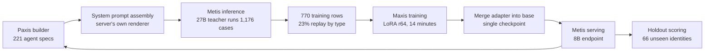
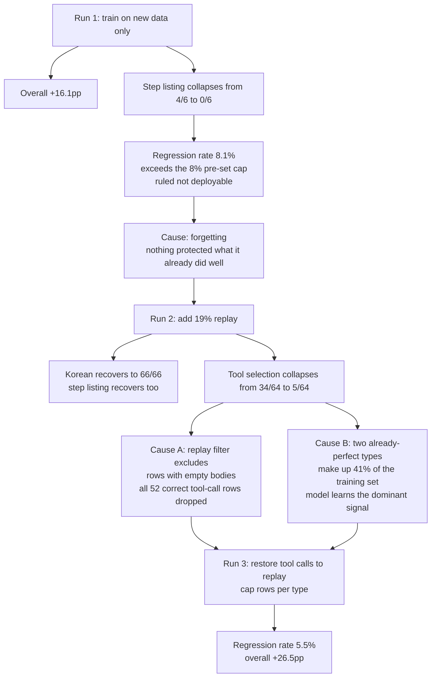

Run a platform where users build agents, and you hit the same wall quickly. Users keep making
new agents in the builder, but running every one of them on a 27B model makes token costs
unsustainable, and stepping down to 8B collapses quality.

Here is what we measured. **When a 27B model actually runs those agents and we train an 8B
model overnight on that execution record, the 8B improves even on agents the training never
saw.** Out of 347 cases, it moves from 236 correct to 328, a gain of **+26.5pp**. Training took
770 rows and 14 minutes.

What is interesting is not the number but where it came from. The place an agent gets built, the
place it actually runs, and the place it gets retrained from that execution record are three
different layers, and this result only shows up once all three complete a full loop.

*A visual metaphor for the article's key idea.*

## Three Layers, One Loop

On our platform this experiment passes through three products in sequence.

**Paxis** is where users build agents. What we used here were 221 agent specs actually published
in the builder. Each spec carries a name and title, a domain of expertise, the tools it can use,
and the workflow it must follow, and the server assembles all of that into a single system
prompt.

**Metis** is where that agent actually runs. We threw 1,176 cases at a 27B teacher model and used
its answers as the ground truth side of the training data. This is also where we later re-run the
trained 8B to measure it.

**Maxis** is where that execution record turns back into a model. We train the 8B with LoRA,
merge the resulting adapter into the base to produce a single checkpoint, and that checkpoint
goes back up to a Metis endpoint to serve the next agent a user builds. This is where the loop
closes.

*Because the place an agent gets built and the place it gets trained are different, if the
contract between the three layers slips even slightly, the result goes silently meaningless.
Both of this post's failure cases happened exactly there.*

## What We Measured

What needs proving is not that "the agents used in training got better." For the product to hold
up, an agent a user builds this morning has to work even on last night's training run. So we
pulled out **66 identities entirely** and used them as a holdout. None of the agents in that set
overlap with the training set.

That split actually earned its keep. By the end of training, the final step loss was 0.020 and
token accuracy was 0.995. Looking at the training set alone, you cannot tell a model that learned
well from one that just memorized everything. The fact that it improved on agents it had never
seen is what makes that distinction.

| | Before training | After training |
|---|---|---|
| Responds in Korean | 16/65 | **65/65** |
| Picks the right tool | 26/63 | **50/63** |
| Recognizes its own identity | 46/66 | **64/66** |
| Overall | 236/347 | **328/347** |

Measured side by side with the teacher, tool selection lands at 50/64 for the student and 48/64
for the teacher. The student picks the right tool slightly more often than the model it learned
from. As we cover later, though, this category also carries the biggest regression along with the
biggest gain.

## A Different Prompt Breaks the Whole Run

Of the contracts linking the three layers, the prompt is the one that breaks first. Write a
separate system prompt just for training, and it drifts subtly from what Paxis actually sends at
serving time, so the model ends up learning an input distribution it will never meet in
production. Worse, nothing catches this in any metric. Training loss looks normal and the holdout
score still comes out.

So instead of writing a new prompt, we called **Paxis's own server side renderer directly**,
invoking the exact assembly function the real serving path uses from the command line. To confirm
the output actually matched production, we compared it against 27 prompts we had captured live.
Setting aside the timestamp field, 13 were byte identical and the median similarity was 1.000.

## Code Does the Scoring

We check eight things: whether it answers in Korean even when asked in English, whether the agent
calls the tool its own prompt tells it to, whether it correctly avoids calling a tool when the
question does not need one, whether it can read its own name out of the injected spec, whether it
avoids fabricating personal information, whether it avoids claiming a step that needs human
confirmation is "done," and whether it states workflow steps in order.

There is no LLM judge anywhere in the scoring path. Everything is regex and string comparison.
And we validated the scorer itself by feeding it deliberately wrong answers first: a forged email,
an English reply, an unnecessary tool call, a missing keyword, and a false completion claim all
had to come back FAIL before we ran the real measurement.

One design choice is worth calling out explicitly. **We also check for tool calls that should not
happen.** Measuring only the calling direction hides over-calling. An agent that calls a search
tool in response to "what is your purpose" is violating its own prompt, and if that never shows up
in a metric, we would have no way to know the model was drifting that way.

## Why LoRA Instead of Full Fine-tuning

It was not about memory. Full fine-tuning of the 8B needs 122GiB, or 76GiB with an 8-bit
optimizer, both of which fit comfortably on a 180GiB card. The reason was regression.

Fine-tuning a 7B-class model commonly shows it forgetting things it used to do, and the effect is
reported to get worse with scale. That has a direct effect on how you design the experiment. If
regression sits around 15%, catching a +10pp improvement with statistical confidence needs a
holdout of 3,933 cases instead of 127. Low regression is not a result, it is a precondition for
measurement.

Instead we set the rank high and targeted **every linear layer**. Reports show that the rank of
the change full fine-tuning learns runs 10 to 100 times larger than a typical LoRA configuration,
so the default setup of low rank on attention only leaves too little room to learn.

We applied loss only to assistant responses. The system prompt runs 3.6k characters, and 46% of
that is a platform preamble common to every agent, so applying loss there would burn a large share
of training time memorizing a fixed prefix.

## We Failed Twice, and Both Times It Was a Data Design Problem, Not the Training Method

We ran it three times. Each run fixed one thing and broke another, and both times the cause was
not the training method but the filter that chose the training set.

*Read the scorecards of all three runs by overall average alone, and runs one and two both look
like successes. The collapses only show up once you split by type.*

**The first run forgot things.** Training on new data alone pushed the overall score up +16.1pp,
but the task of listing workflow steps in order collapsed from 4/6 to **0/6**. It got wrong
everything it used to get right. The regression rate hit 8.1%, over the 8% cap we had set in
advance, so we ruled it not deployable.

**The second run broke the balance.** We added 19% replay, mixing in a slice of what the model
used to do well, and that fixed the forgetting. Korean responses hit 66/66 and step listing
recovered too. But this time tool selection collapsed from 34/64 to **5/64**.

There were two causes and both traced back to a filter I had written. When selecting replay
candidates, I required "the body must not be empty," but a correct tool call is exactly the case
where **the body is empty**, because calling the tool is the answer. So all 52 rows that passed
got filtered out, and that one category lost its protection.

At the same time, two categories that were already at a perfect score made up 41% of the training
set. Both carried a "do not call a tool" signal, and the model learned the dominant signal.

**The third run fixed both.** We restored tool calls into the replay rows and capped each category
at 130 rows so no perfect-scoring category could dominate the set. The regression rate came down
to 5.5% and the overall score hit +26.5pp.

There is one lesson here worth keeping. **Neither failure showed up in the overall average.** The
first run's average went up, and inside that average one entire category went to zero. Had we not
reported by category, both would have been logged as successes.

## What We Learned From Serving

Getting the model out is not the end. Bringing the trained 8B up on a Metis endpoint taught us
three things.

**The path for attaching an adapter separately was closed.** vLLM's `--lora-modules` does not
accept `s3://` URIs, and the platform only pulls down a single model path, so the idea of a
second artifact did not exist at all. We worked around it by merging the adapter into the base to
make one ordinary checkpoint. As it turned out, this also simplifies the serving path.

**Endpoint status fields are not evidence.** For several minutes the API kept returning `creating`
while the pod did not exist yet. To confirm a workload is actually up, you have to look at the pod
directly.

**We confirmed the merge by weights, not by a success log.** A merge function exiting without an
exception is a different thing from the weights actually changing. An adapter that contributes
nothing merges perfectly cleanly and produces a model identical to the base. So we compared the
weights at six points directly before and after the merge: all six changed, and the delta on the
MLP side was about four times that of attention.

One more thing. Both arms were measured with **tuned serving settings**. The platform default has
compilation off and a concurrent sequence cap of 32, which makes it 18.8 times slower on a single
stream. Measure the baseline with default settings and you end up measuring the serving
configuration, not the model, and users blame that slowness on the model.

## What Honestly Remains

Read the overall number at face value and you get the wrong picture. The largest share of the
gain is **+75.4pp in responding in Korean**, which is closer to fixing a single output language
behavior. The prompt says "always answer in Korean," and the 8B was answering English questions in
English. That is an instruction-following problem, not a capability problem.

Tool selection still carries a 34.6% regression rate. The net gain is +38.1pp, but it still breaks
a third of what it used to get right. That sits buried inside the 5.5% overall figure, and
capping regression per category is the next piece of work.

Some categories have small samples. Step listing and checkpoint compliance are 6 and 9 cases
respectively, too few for statistical significance in either direction. The step listing drop of
16.7pp is a single case. We also used one seed and ran each configuration once. Of 349 holdout
cases, 2 came back with empty output and were excluded from pairing.

The case inputs deserve a note too. The answers came from a 27B model actually running the cases,
but **the questions were generated per task type from the specs**, not real user traffic.
Re-measuring against a real conversation distribution remains open work.

The teacher is not perfect either, and that is worth writing down. The 27B got 1,108 out of 1,173
right. The ceiling here is the teacher's ceiling, not the task's ceiling.

## What This Loop Means for the Product

It is one experiment, but the direction is clear. A user builds an agent in **Paxis**, **Metis**
runs that agent and accumulates an execution record, **Maxis** folds that record into a small
model overnight, and the result goes back up to Metis by morning. What matters is not each layer
being good on its own, it is this loop actually turning, because the training data comes from the
act of using the platform itself, not from something bought in from outside.

The cost implication is simple. If an 8B can take over a large share of what a 27B used to answer,
the same traffic needs fewer accelerators. That 8B can run on **Telox** GPU capacity, or, for a
customer whose data cannot leave the premises, the same loop can run entirely inside **Aegis**
on-premises. The fact that training took only 770 rows and 14 minutes matters here. At that scale,
baking a dedicated model overnight for a single customer is not an unrealistic idea.

But that is as far as this post can back up. One run, one seed, one holdout split.

## References

- [Distilling the Knowledge in a Neural Network](https://arxiv.org/abs/1503.02531): Hinton,
  Vinyals, and Dean (2015) laid out knowledge distillation, where a small model learns from a
  large model's outputs. It is the concept underlying this post's approach of training an 8B on a
  27B's execution record.
- [LoRA: Low-Rank Adaptation of Large Language Models](https://arxiv.org/abs/2106.09685): Hu et
  al. (2021) proposed freezing the pretrained weights and training only low-rank matrices to adapt
  a model with far fewer parameters. It is one reason training could finish in 14 minutes.
- [LoRA Learns Less and Forgets Less](https://arxiv.org/abs/2405.09673): Biderman et al. (2024)
  compared LoRA against full fine-tuning. They reported that the rank of the change full
  fine-tuning learns runs 10 to 100 times larger than a typical LoRA setup, which is where this
  post's choice of rank and target layers came from.
- [Simple and Scalable Strategies to Continually Pre-train Large Language Models](https://arxiv.org/abs/2403.08763):
  Ibrahim et al. (2024) prescribed mixing in 5 to 25% replay of prior data for continual learning
  under distribution shift. The forgetting in the first run happened under exactly the conditions
  this work predicts.
- [An Empirical Study of Catastrophic Forgetting in Large Language Models During Continual Fine-tuning](https://arxiv.org/abs/2308.08747):
  Luo et al. (2023) measured forgetting during fine-tuning across models from 1B to 7B. Their
  observation that forgetting worsens with scale is the basis for choosing LoRA over full
  fine-tuning in this post.
