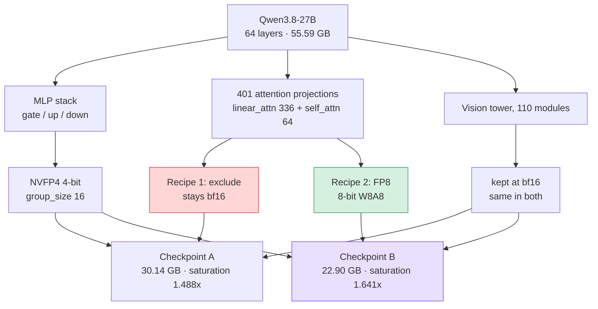

If you serve a 27B-class model on Blackwell and 4-bit did not buy you what you expected,
the thing to change is probably not the bit width but **which layers sit at which
precision**. Changing only the recipe on the same model moved our saturation throughput
from 1.488x to **1.675x** over bf16, and the checkpoint went from 30.14 GB to
**22.90 GB**. On a paired MMMU comparison it stayed indistinguishable from the original.


*A visual take on splitting precision layer by layer.*

## Excluding is not "leaving it alone", it is "leaving it at 16-bit"

Our quantization script excluded attention with `--extra-ignore`. The reasoning was that
4-bit might hurt attention quality, and that worry is reasonable on its own.

The problem is what exclusion means. Removing a layer from the quantization target does not
mean **not touching it**; it means **keeping it at bf16**. When the menu offers 4-bit, 8-bit
and 16-bit and you pick nothing, the most expensive option stays.

Qwen3.8-27B has 48 linear-attention layers out of 64, with the other 16 being full
attention. Excluding attention wholesale leaves 401 attention projections in the language
model at 16-bit. Our ignore list had 511 entries; only 110 of them were the vision tower,
and the remaining 401 were all attention.

The public checkpoint of the same model put **FP8** in that slot. Same "NVFP4" on the label,
a different recipe underneath.

## Where the two recipes diverge



*MLP and the vision tower are identical across both recipes. The only fork is those 401
attention projections, and that one choice decided 7.24 GB and the saturation figure.*

## What we checked in the source before building

One quantization run takes 47 minutes. If the path is closed you find out after burning
those 47 minutes, so we read the code first.

We started with whether llm-compressor can express different precisions per module. The
`scheme` argument turned out to accept a dictionary, not only a string. When targets
overlap, an exact name beats a regex and a regex beats a class name, which means a regex
naming attention automatically wins over a blanket `Linear` target. On the serving side,
vLLM reads a per-group format field and handles mixed-precision checkpoints.

All three were open, so a recipe that puts NVFP4 on the MLP and FP8 on attention held up.

## We opened the tensors, not the config

After the build we read the saved weights directly.

```
linear_attn.weight    F8_E4M3     ← previously all BF16
self_attn.weight      F8_E4M3
mlp.weight_packed     U8          ← NVFP4, unchanged
```

A config file saying "mixed precision" and the tensors actually being FP8 are two different
claims. To say you verified it, you have to look at the second one.

## We nearly drew the opposite conclusion

The first size measurement came back at **49.37 GiB**. Against a 51.77 GiB original that
reads as "compression barely did anything".

What actually happened was that the uploader did not clear the destination, so **seven
shards from the previous build and five from the new one shared one directory**. The index
file pointed at the new ones and the real size was 21.34 GiB.

Directory size is not build size. And overwriting the same path changes the checkpoint that
is being served. We changed the build script so a different recipe lands on a different path.

## Throughput has to be measured this way to be quotable

A smaller checkpoint does not entitle you to say it is faster. And with serving throughput,
how you measure changes the result.

Measure one concurrency level and the number you get is single-stream decode latency, not
serving throughput. Whether the advantage survives at saturation only shows up when you walk
the ladder. And if you do not set `--max-num-seqs`, vLLM never prints it, which means there
is **no way to prove afterwards what you measured under**. A measurement that cannot name its
knobs has no standing to attribute a difference between arms to anything.

So we walked concurrency 1, 8, 32 and 128, three repeats per level, taking medians. The
serving config (`max_num_seqs=256`, `max_model_len=32768`, `gpu_memory_utilization=0.90`,
`CompilationMode.VLLM_COMPILE`) was identical across arms, and rather than trusting that we
passed it, we **compared the config line each engine printed for itself**.


*The mixed recipe leads at every level, and the gap widens as concurrency rises.*

| Concurrency | bf16 original | NVFP4 (MLP only) | Mixed (attention FP8) | Mixed + KV FP8 |
|---|---|---|---|---|
| 1 | 86.5 | 126.3 | 138.8 | **138.9** |
| 8 | 565.4 | 814.4 | 887.4 | **899.1** |
| 32 | 1,382.4 | 2,013.1 | 2,189.8 | **2,230.2** |
| 128 | 2,141.4 | 3,186.2 | 3,513.3 | **3,586.3** |
| **Saturation ratio** | baseline | 1.488x | 1.641x | **1.675x** |

Output tokens per second, 2,048 in / 256 out, one B200.

**The advantage survives at saturation.** A single-stream figure cannot tell you that, and
serving does not live at concurrency 1.

The FP8 KV cache gain has a different shape. At concurrency 1 it moves 1.605x to 1.606x,
effectively nothing, and at concurrency 128 it takes 1.641x to 1.675x. A KV cache is only a
bottleneck when many sequences are in flight, so that is the shape it should have. Getting
the predicted shape is itself a sign the measurement was sound.

The arithmetic explains why attention was holding so much. During batch-1 decode a GPU
spends its time **fetching weights**, not computing. With 401 attention projections still at
16-bit, those bytes have to cross from memory to the compute units on every token, and
shrinking only the MLP to 4-bit leaves that traffic untouched. Moving them to FP8 halves the
bytes for those layers, and on Blackwell that slot is also an FP8 tensor-core path. The
7.24 GB of size and the 0.15 of saturation ratio have the same cause.

## The same recipe produces the same number

We measured the public checkpoint separately on our serverless path in the same week. Under
a tuned configuration its single-stream figure was **138.9 tokens/sec**. Our mixed build is
**138.9 tokens/sec**.

What put our published build behind the reference checkpoint was recipe selection, not
quantization quality. Matching the recipe made the numbers line up to the first decimal.

At concurrency 128 they do separate, 3,845 on their side against our 3,586. Theirs bakes
calibrated static FP8 KV scales into the checkpoint while ours are dynamic at serve time.
That may be the cause, but we have not isolated it, so we will not call it the cause.

## Quality is indistinguishable from the original

Speed alone is not enough to ship on. We scored six arms together on the multiple-choice
items of MMMU validation, with a 16,384-token generation budget, temperature 0, and one
prompt shared across arms.

Arms lose different items to truncation. Subtracting accuracies directly would therefore
compare different subsets, which is why we restricted to the **232 items that produced a
verdict in all six arms**.

| Build | MMMU multiple-choice (232 items) | McNemar | Discordant pairs |
|---|---|---|---|
| bf16 original | 0.8836 | baseline | baseline |
| NVFP4 (MLP only) | 0.8922 | p = 0.688 | 6 |
| Mixed (attention FP8) | 0.8707 | p = 0.581 | 13 |
| Mixed + KV FP8 | 0.9009 | p = 0.344 | 10 |

**No arm separates from bf16.** While moving attention to FP8 and the KV cache to FP8 pushed
saturation throughput to 1.675x, no measurable quality loss appeared.

Do not read this as "quantization won". Four-bit does not add knowledge, and at 232 items a
gap this size sits inside the noise. What the table says is that **it did not break**.

One thing is worth stating plainly. The mixed arms have verdict rates between 0.896 and
0.899 against 0.953 for the original: 21 to 22 items failed to finish reasoning within
16,384 tokens, against 13 for the original. The pairing absorbs that difference, so the
comparison above holds, but **we cannot explain why it reasons longer.** We are leaving that
open.

## Why we wrote our own scorer

We started with a standard evaluation tool and could not trust the result. The
`mmmu_val_reasoning` task scores through an LLM judge, and when the judge call fails it
swallows the exception and **writes a zero**. With no judge server every item scores zero,
and nothing surfaces beyond one log line.

On that same path a benchmark once returned **exactly 0.0**. Exactly 0.0 is not a value a
model can produce. We still read it as the model's fault for a day.

So we built a scorer where code owns the verdict and no judge is involved. It scores
multiple choice only and skips the 53 open-ended items rather than guessing at them. It
gives the same 16,384-token budget the official task gives, extracts answers with the same
`<answer>` tag and trailing-letter rules, and reports **accuracy and verdict rate
separately** so a budget problem cannot pose as a quality difference. Extraction failed on
zero items across all six arms.

Worth adding: with a short budget this model looked like it could not answer. It reasons for
more than 12,000 characters before answering, so the output was simply being cut. A short
budget measures the budget, not the model.

## What this means for the ThakiCloud platform

The result maps straight onto Metis, our AI inference and token factory layer. A 1.675x
saturation figure on the same single B200 means that much more request volume on the same
hardware, and a 22.90 GB checkpoint leaves room on the card for longer context or more
concurrent sequences. Our serverless endpoint runs this checkpoint at the model's native
262,144 context, and even at that length the KV cache holds 1.91M tokens, admitting 7.29
maximum-length requests at once.

Agent workflows in Paxis, where a run loops through many tool calls, are far more sensitive
to **throughput at saturation** than to single-response latency. That is why the number we
cared about here was not 138.9 at concurrency 1 but 3,586 at concurrency 128.

Context length taught us something too. We first stood this endpoint up at 131,072. That
value is not a serving recommendation; it is a control pinned across arms in a different
experiment to hold the axis fixed, and it followed along when we copied the configuration.
The model's native length is 262,144, and since only 16 of 64 layers grow KV on this hybrid,
256k costs around 8.6 GB. After rebuilding, the engine reported 1.91M KV tokens and 7.29
concurrent maximum-length requests. Moving a control value into a production setting is how
you reproduce the defect you just reported yourself.

## What we did not measure

Quality was only examined on 232 multiple-choice MMMU items. That can show the absence of a
large effect but not of a small one at this sample size. Code, long context, multilingual
behaviour and video were not measured.

Throughput was measured at one shape only, 2,048 in and 256 out. Prefill-heavy or
decode-heavy workloads may look different.

The FP8 KV cache uses dynamic scales set at serve time. It is not the calibrated static
scales the reference checkpoint bakes in, so that axis remains uncontrolled.

The remaining size gap against the public checkpoint is `lm_head` and the vision tower. They
quantize both and we left both alone. `lm_head` sits on a 150,000-entry vocabulary and feeds
logit quality directly, and matching pass rates alone did not seem like grounds to take it
to 4-bit.

## What we published

The mixed build is out as
[ThakiCloud/Qwen3.8-27B-NVFP4-FP8ATTN](https://huggingface.co/ThakiCloud/Qwen3.8-27B-NVFP4-FP8ATTN).
The earlier MLP-only builds
([-GPTQ-mm](https://huggingface.co/ThakiCloud/Qwen3.8-27B-NVFP4-GPTQ-mm) and
[-GPTQ-txt](https://huggingface.co/ThakiCloud/Qwen3.8-27B-NVFP4-GPTQ-txt)) are still up,
because they are the evidence that calibration data made no difference on this benchmark.
For serving, take the mixed build.

```bash
vllm serve ThakiCloud/Qwen3.8-27B-NVFP4-FP8ATTN \
  --max-model-len 262144 --max-num-seqs 256 --kv-cache-dtype fp8
```

## References

- [vLLM](https://github.com/vllm-project/vllm): the serving engine whose mixed-precision checkpoint support we verified here.
- [LLM Compressor](https://github.com/vllm-project/llm-compressor): the tool used to assign different precisions per module.
- [NVFP4: A 4-Bit Floating Point Format for AI Inference](https://developer.nvidia.com/blog/introducing-nvfp4-for-efficient-and-accurate-low-precision-inference/): NVIDIA's own description of the 4-bit floating point format introduced on Blackwell.
- [FP8 Primer](https://docs.nvidia.com/deeplearning/transformer-engine/user-guide/examples/fp8_primer.html): NVIDIA Transformer Engine documentation on 8-bit floating point scaling.
- [MMMU](https://huggingface.co/datasets/lmms-lab/MMMU): the multimodal evaluation dataset used for the quality comparison.

*The throughput and quality figures in this post were measured on a single B200 on
2026-08-19, and the ledger and per-item scoring results are preserved together in our
internal repository.*
