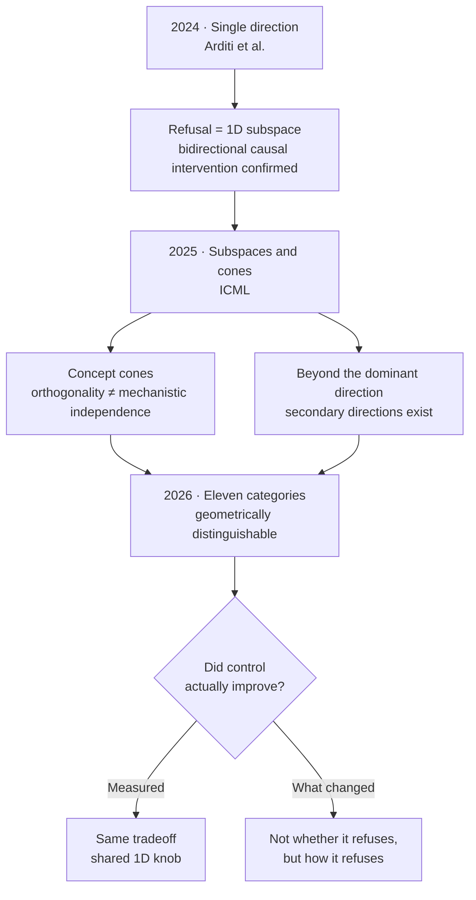

*What looked like a single axis keeps splitting into more, yet the control knob stays one.*

If you evaluate derivative models for a living, it helps to know how refusal-direction research has moved over the past two years. A conclusion flipped once, and that flip changes how you should design your evaluation.

The short version: the 2024 finding that refusal is mediated by a single direction expanded into subspaces and cones in 2025, then split into eleven categories in 2026. But the number of control knobs did **not** grow along with the number of directions. That asymmetry is the point of this post.

## 2024: A single direction looked like enough

It started with [Refusal in Language Models Is Mediated by a Single Direction](https://arxiv.org/abs/2406.11717). Arditi et al. showed across 13 open-source chat models, up to 72B, that refusal is mediated by a one-dimensional subspace in the residual stream. Erase that direction and the model stops refusing even harmful instructions. Add it and the model refuses even harmless ones.

What made this result strong was causality. The authors didn't just observe a correlation, they intervened and moved behavior in both directions. And the paper itself framed the finding as exposing **a fragility in current safety fine-tuning**, not as a jailbreak recipe. It's less "here's how to break the defense" and more "the defense is thinner than you'd think."

The community turned this into a tool. [Heretic](https://github.com/p-e-w/heretic) fully automated the process and has passed 27,000 stars as of August 2026. What matters technically about Heretic isn't the automation itself, it's that the **objective is dual**. It doesn't just minimize refusal count, it jointly minimizes KL divergence against the original model. In other words, it tracks both "how much less does it refuse" and "how far has it drifted from the original" at the same time. Whether that second axis exists or not becomes the fork in the road for evaluation later on.

## 2025: Not one direction, a cone

Two papers at ICML 2025 directly extended the single-direction hypothesis.

[The Geometry of Refusal in Large Language Models: Concept Cones and Representational Independence](https://proceedings.mlr.press/v267/wollschlager25a.html) argues, as the title says, that refusal can show up as a **concept cone** rather than a single vector. This also raised the representational independence problem: two directions being mathematically orthogonal doesn't guarantee they're mechanistically independent. Orthogonality is a geometric property, independence is a circuit property, and treating them as the same thing produces wrong analysis.

[The Hidden Dimensions of LLM Alignment: A Multi-Dimensional Analysis of Orthogonal Safety Directions](https://proceedings.mlr.press/v267/pan25f.html) points the same way. It finds that beyond one dominant safety direction, there are secondary directions tied to things like roleplay or hypothetical framing.

Following this thread naturally raises an expectation: if there are multiple directions, finding and handling all of them should give finer control. And in fact the next generation of community tools moved exactly in that direction.

That expectation didn't hold up in 2026.

## 2026: More branches, same knob

In February 2026, [There Is More to Refusal in Large Language Models than a Single Direction](https://arxiv.org/abs/2602.02132) came out. The title reads like it's rejecting the single-direction hypothesis in favor of multi-directional control, but the actual content is more nuanced than that.

The authors examined **eleven categories** of refusal and non-compliant behavior, including safety, insufficient or unsupported requests, anthropomorphism, and over-refusal, and confirmed these correspond to geometrically distinguishable directions in activation space. So far, this is a continuation of the 2025 line.

Here's the key part. Despite that diversity, steering along **any** refusal-related direction produced nearly the same refusal-versus-over-refusal tradeoff. The different directions behaved like a shared one-dimensional control knob. What changed when you switched directions wasn't whether the model refused, it was **how** it refused.

This has real practical weight. The fact that refusal has a multi-branched representation and the expectation that handling those branches gives you a better knob are two separate claims, and the evidence so far doesn't support the second one. More sophisticated geometric analysis didn't automatically translate into better control.

## Evaluation is half the project

If geometric analysis doesn't improve control, the weight of judging a derivative model shifts onto evaluation. There are at least four axes you need to check separately.

**First, separate compliance from capability.** This is the axis that gets conflated most often. [Willing but Unable](https://arxiv.org/abs/2606.05396) (June 2026) tackled this distinction head on. Building training data for vulnerability detection means asking a model to inject specific CWEs into code, and safety-aligned code models systematically refuse this kind of request. The authors evaluated Qwen2.5-Coder-Instruct at 3B, 7B, and 14B, three runs per condition, and found that abliteration drove refusal rate to zero or near-zero at every size while keeping syntactic validity above 93%.

The lesson here is the design, not the result. If you only look at refusal rate, "didn't do it" and "couldn't do it" get mixed together. Measuring refusal rate, attempt rate, and success rate separately is what keeps you from drawing the wrong conclusion that "the benchmark went up because the model is uncensored now."

**Second, measure distribution damage.** KL divergence against the original model, perplexity shift, embedding drift. Without this axis, you can't tell a model whose refusal rate was cosmetically fixed apart from a model that's actually still intact. This is exactly why Heretic gets cited so often as a reference point: it built this axis into the optimization objective explicitly.

**Third, watch for behavioral regressions.** Tool calling, JSON compliance, long context, multilingual behavior, coding, instruction following. A model whose weights got edited can keep its benchmark scores while these practical behaviors quietly break, because whatever function was riding on the projected-out direction goes with it.

**Fourth, check for spillover.** This is the axis that gets skipped most often.

## Where the "precision surgery" metaphor breaks down against real numbers

[Ablating Safety](https://arxiv.org/abs/2605.17413) (May 2026) treated alignment removal as a controlled transformation with an evaluation protocol. The starting motivation is legitimate: for authorized, defense-purpose security work, if the wording reads like misuse and the model refuses, you can no longer tell whether a failure comes from lack of capability or from refusal policy, and that makes security evaluation ambiguous.

The authors compared authorized-context prompting, reversible refusal-direction activation projection, representation-control projection, and LoRA-based unalignment or task adaptation. Here's what came out.

| Approach | Security score | General score | Unsafe compliance |
|---|---:|---:|---:|
| Rank-4 refusal subspace projection | 0.51 | not reported | same level as aligned model |
| Task-adapted LoRA (no refusal removal) | **0.87** | 0.83 | **0.13** |
| Retention-conditioned refusal suppression | not reported | not reported | 0.27 |

Read it this way: the approach best at the target task wasn't the one that removed refusal, it was the one that **taught the task**. The refusal-suppression path scored lower on the target while more than doubling out-of-scope unsafe compliance.

"Precision surgery" implies you remove exactly what you targeted and nothing else. What the measurements actually show is that a narrowly aimed intervention spread widely. Refusal looks like local wiring, but cutting that wiring didn't produce a local effect.

## The same surgery doesn't work the same way across languages

If your organization operates in Korean, there's one more axis you need to check specifically. Refusal directions are typically extracted from English prompt sets. AdvBench and Alpaca function as the de facto standard, and both are English.

That leaves an open question of how much that direction overlaps with the refusal circuitry of other languages. The community is starting to ask this. For instance, [gustipardo/gemma4-abliteration](https://github.com/gustipardo/gemma4-abliteration) titled its repository "One Direction to Break Them All: Does Abliteration Remove Safety Uniformly Across Languages in Small Language Models?" It's still a small-scale experiment and not something to cite as a conclusion, but the question is aimed at the right place.

The practical implication cuts both ways. A model that had its English-derived direction removed might have retained more of its safety behavior in Korean than expected, or it might have broken down further in some other language in ways English evaluation never catches. **Either way, you can't know from English benchmarks alone.** If you run a multilingual service, you need to re-run safety evaluation in your service language, and this applies equally to the original model, not just derivatives.

## Where is alignment actually stored

One last question this line of research raises, and it's the one most useful to the defensive side: where in the model is safety alignment actually stored.

Most interventions so far have operated at the layer level, and within a few kinds of weight matrices that write into the residual stream. But recent models aren't structurally homogeneous anymore. Hybrids mixing full attention with linear-attention families are now common, and MoE splits roles across experts. How much of the alignment signal lives where, and in what proportion, isn't well mapped out yet.

What makes this interesting isn't the removal side, it's the **reinforcement side**. If safety fine-tuning only manages to build one thin wire, you can ask whether there's a training method that thickens that wire or distributes it across multiple pathways. The fragility that the 2024 paper pointed out is both an attack opportunity and an improvement target. The fact that refusal concentrates on a single axis is itself a sign that safety training is still at a crude stage, and the direction of distributing that axis hasn't been explored enough yet.

## The ThakiCloud platform view

We register and serve models, so this topic comes to us as an evaluation-gate design problem.

**Metis** is our inference and token factory layer. When a derivative model enters the catalog, we set the minimum gate it must pass using the four axes above. We measure compliance and capability separately, log distributional shift against the original, run regression tests on practical behaviors like tool calling and JSON compliance, and check whether out-of-scope compliance has increased. The point is that we don't register a model based on a refusal rate the vendor announced. Recording lineage at registration time also lives here, since abliterated weights are, in file format, plain ordinary safetensors, and there's effectively no way to tell them apart later.

**Aegis** covers on-premises and air-gapped deployments. This is where real demand for alignment-weakened models shows up, usually for security-team red-team evaluation. That's a legitimate need. But based on the numbers in Ablating Safety, what we recommend first is reordering the approach. Before bringing in a general-purpose model with refusal removed, evaluate a task-adapted model against the same task. Within the range that was measured, that path scored higher on the target and produced fewer side effects.

**Signum** handles IAM and audit events. If you're operating a model with weakened alignment, control has to live outside the model, not inside it. This means moving controls that used to rely on the model's own refusal up to the platform layer, and keeping a record of who called what and what passed through, so you can answer to an audit.

For agentic workloads, **Paxis**'s policy gate occupies the same spot. In a design where tool calls and actions are filtered by policy and logged for audit, execution gets blocked even when the model itself doesn't refuse. A design that puts alignment in the weights and a design that puts it in the execution path have different robustness properties, and the last two years of research point toward the former being thinner than it looks.

## Summary

The single-direction hypothesis from 2024 wasn't wrong so much as incomplete. The cones and subspaces of 2025 and the eleven categories of 2026 filled in the picture.

But the picture getting more complex didn't make control any more precise. Different refusal directions ended up behaving like the same one-dimensional knob, and what changed wasn't whether the model refuses but how it refuses. A narrowly targeted intervention spread widely, and teaching the target task beat removing refusal at actually improving performance on that task.

If you're the one evaluating derivative models, there are four things to check in the end: separate compliance from capability, measure distributional damage, watch for practical behavioral regressions, and check for out-of-scope compliance. And you have to re-measure in your service language. Safety measured in English is not safety for a Korean-language service.

## References

- [Refusal in Language Models Is Mediated by a Single Direction](https://arxiv.org/abs/2406.11717) (Arditi et al., 2024-06-17)
- [The Geometry of Refusal in Large Language Models: Concept Cones and Representational Independence](https://proceedings.mlr.press/v267/wollschlager25a.html) (ICML 2025)
- [The Hidden Dimensions of LLM Alignment: A Multi-Dimensional Analysis of Orthogonal Safety Directions](https://proceedings.mlr.press/v267/pan25f.html) (ICML 2025)
- [There Is More to Refusal in Large Language Models than a Single Direction](https://arxiv.org/abs/2602.02132) (2026-02-02)
- [Ablating Safety: Mechanisms for Removing Alignment in Language Models for Security Applications](https://arxiv.org/abs/2605.17413) (2026-05-17)
- [Willing but Unable: Separating Refusal from Capability in Code LLMs via Abliteration](https://arxiv.org/abs/2606.05396) (2026-06-03)
- [p-e-w/heretic](https://github.com/p-e-w/heretic) (27.8k stars as of 2026-08-19)
- [gustipardo/gemma4-abliteration](https://github.com/gustipardo/gemma4-abliteration) (small-scale experiment, question stage)
