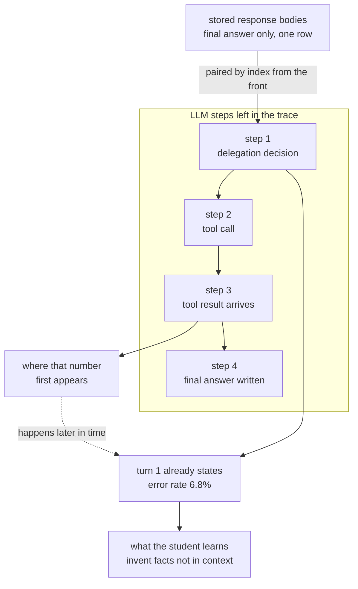

If you are distilling agent behaviour into a small model, delegation does not come along for the
ride. Our 8B had learned which agent it is. It had not learned when to hand a task to a different
one. We spent a day measuring twelve arms against the same holdout, and exactly **one** of them
bought delegation without giving back what the model already did well.

| | previous default | new default | |
|---|---|---|---|
| regression holdout, 349 cases | 329 | **326** | statistically not separable (p=0.7111) |
| delegation accuracy | 63.8% | **78.8%** | +15.0pp |
| delegation recall | 53.3% | **76.5%** | +23.2pp |
| restraint | 75.0% | **81.2%** | +6.2pp |

And we only found the real obstacle after eight arms had already run. It was neither the model nor
the data mix ratio. The code that assembles training trajectories was **pinning the final answer to
the first turn.**

## Delegation is usually a trade

Two behaviours have to move together. Handing off when a task needs it (recall), and not handing off
work you should just do yourself (restraint). Lifting either one alone is easy. Add delegation
examples and recall climbs, and the model starts handing off everything.

Horizontal axis is delegation accuracy, vertical axis is how much of the model's prior ability
survives. Up and to the right is where you want to be, and most arms move right by falling down.
They bought delegation by breaking things the model already had, like answering in the requested
language or picking the right tool.

The most extreme case was a delegation-only adapter. Train a separate LoRA on 118 orchestration rows
and route to it at serving time. It is an attractive idea. It scored 213 on regression, 0/66 on
language, and 18.8% on restraint.

**What not to do is only learnable among examples of doing.** Restraint emerges from balance against
ordinary task data, so isolating the delegation rows removes the very signal you are after.
Multi-LoRA serving is a technique for reducing serving cost, not for mixing behaviours.

## Eight arms ran on broken data

We had swept the mix ratio from 7.8% to 21.9%, plotted the curve, built contrastive pairs of
delegate and restrain cases from the same persona, and were starting to suspect training dynamics
because restraint still would not stick.

The cause was in the data, not the training.

The code that turns agent execution records into training trajectories paired stored response bodies
to trace steps **by index, from the front**. But a streaming orchestration run persists exactly
**one** response row, the final answer, while the trace holds one step per turn.

The measurement: **200 out of 200** orchestration runs placed the final answer ahead of the tool
call, and **118** of those had that first turn quoting numbers that exist only in a later tool
result. A first turn says "error rate 6.8%, p99 latency 2,400ms" when those values first appear in
step three.

Train on those trajectories and the student learns to **state facts that are not in its context.**
It was a dataset that taught confabulation on purpose, and not one of our metrics caught it.

The fix is close to a single line. Align the response bodies from the back instead of the front, and
keep the old behaviour when the counts happen to match. After re-exporting, runs with prose in first
position went from 200 to 0, and answers landing after their tool result went from 0 to 195.

### If a regression test passes against the buggy code, the fixture is wrong

Writing the test caught us once more. The first fixture passed, and it kept passing after we reverted
the fix. It had left the tool-call message as a response row, so there were two bodies, the offset
was zero, and the bug never fired.

Only after querying the real database and confirming that a session holds exactly one response row
did the fixture reproduce the incident. **A regression test is not finished until you revert the fix
and watch it fail.**

## Two more were rotting where the metrics do not look

The first was a conditioning mismatch. Evaluation exposes 24 tool schemas to the model. Training rows
carried **none**. We were teaching the student under one condition and testing it under another.
Attaching the schemas took language leakage from 39/66 to 66/66.

Then we overshot in the other direction. Attaching schemas to every row collapsed tool use to
**0 of 64**. Matching the condition and drowning the signal turned out to be different acts.

| schema attachment | prose to tool ratio | regression | tool selection |
|---|---|---|---|
| every row | 59.7 to 1 | 274 | 0/64 |
| prose kinds only | 43.4 to 1 | 281 | 8/64 |
| **label-correct rows only** | **4.6 to 1** | **326** | **52/64** |

The second was quieter. The parser storing teacher responses kept tool-call **names and discarded the
arguments**. 93 of 103 targets carried empty arguments. Nobody noticed for weeks for a simple reason:
our grader scores tool **names** only.

We fixed the parser and re-asked the teacher for 92 rows. Two minutes at eight-way parallelism, 93%
recovered real arguments. And that arm **lost**, 320 against 326. Policy judgement recovered from 4/9
to 6/9 exactly as predicted, and tool selection fell from 52 to 44. The two arms differ at p=0.3075,
so read honestly, **the arguments made no reliable difference and may have hurt.**

## We wrote the gate as an absolute number, and that was the mistake

We pre-registered a pass threshold: regression at 327 or above. The final candidate scored 326.

One case. But one case out of 349 paired comparisons is noise. Put 326 against 329 in a McNemar test
and you get p=0.7111, which means **the test cannot tell the two models apart.** What we actually
wanted to protect was "not significantly worse than baseline," and we had written it as an absolute
floor.

**We did not rewrite the gate after seeing the result.** Rewriting it would make it not a gate. We
recorded the candidate as failing and filed the mis-specification separately. The next
pre-registration uses a paired test against baseline, plus per-kind floors. One arm scored 274 overall
with tool selection at 0/64, and the total alone does not show you that an entire kind collapsed.

## Three predictions missed

Worth recording.

First, we thought the targets were wrong and that was causing the language leakage. Fixing the targets
made the leakage **more accurate**. It moved from calling an irrelevant tool to calling a plausible
one, and the total stayed put.

Second, we thought the intervention was too broad. Narrowing it made tool selection worse, 8/64, which
confirmed the opposite diagnosis: there were too few positive examples.

Third, we thought real arguments would restore policy judgement. They did, and lost more elsewhere.

All three were plausible mechanisms and all three were overturned by measurement. Measuring twelve
arms against a single holdout is itself a way to select on noise, and our top three arms do not
separate from each other at any p below 0.2. We picked the final arm not because it scored highest
but because it was **the only one that lifted all three delegation metrics while its regression stayed
indistinguishable from baseline.**

## The ThakiCloud angle

This experiment ran on **Paxis**, our agent control plane, and went back into it.

Paxis treats skills, tools, policies and audit logs as first-class resources. When a user builds an
agent, its execution trajectory is retained in an auditable form, and we turn those trajectories into
training data. In this round the new default model was registered in the catalog, the serving endpoint
was swapped, and it was wired in as the sub-agent model inside Paxis. Putting what you made back
inside itself is what closes the cycle.

**Auditable trajectories were the concrete win here.** We found the confabulation defect not by
inspecting the model but by counting, in the assembled trajectories, how many runs answered before
their tool result arrived. Had execution been retained as anything less than ordered events, that
defect would have stayed invisible to every metric we had.

Serving runs on **Metis**. Every arm was measured under identical serving settings, which is a
requirement rather than a preference. We have measured up to an **18.8x** throughput gap between the
platform default and a tuned configuration. If serving settings differ per arm, the comparison
measures the configuration rather than the model.

The two products being adjacent was the premise of the experiment. Trajectories have to be retained
before you can train (Paxis), and serving has to be identical before you can compare (Metis). The same
structure runs on-premises and in sovereign environments.

## What we still cannot do

**The holdout is small.** Nine cases for policy judgement, six for step order, six for citation. You
cannot claim anything at that size. The "policy judgement recovered from 4/9 to 6/9" above is, in
truth, two cases.

**The grader only looks at tool names.** Whether the handoff reached the right sub-agent with the right
arguments is measured by nobody. That is why empty arguments survived for weeks.

**We could not measure the teacher axis.** We issued requests across three models and all 149 resulting
training rows came from the same one. The model field in the request body is ignored, and a value
pinned on the agent wins. The workaround is implemented and has never been run.

**One seed, one run per arm.**

So the next step is not more arms. Adding arms while the top three do not separate is tuning on noise.
Growing the holdout and teaching the grader to look at arguments and targets comes first, and the gate
gets rewritten as a paired test.

Fix the measuring instrument before scaling the measurement.
