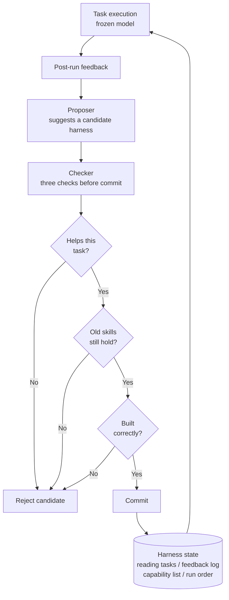

> 📄 **Full deep review (DOCX)**: [Download the detailed peer review on Google Drive](https://drive.google.com/file/d/1rVrbakfFrzsAn6bIxcOzUdST8qiemxw5/view).

What gets better when you run an agent for a long time might not be its brain. The notes and boards taped up around the brain often get rewritten, and that is where the improvement comes from. This paper checks that idea with an experiment, and it also catches the side effect in numbers.

This is worth your time if you run several unattended agents or own their running cost. The paper is called Harness Continual Learning, and it is about leaving the brain untouched while rewriting everything around it.

*A frozen core wrapped and circled by layered waves.*

## In plain terms

Picture a football coach. The coach's own skill and the team's basic technique stay the same all season. What sits on the locker-room wall is a tactics board, and the coaching staff rewrites it a little after every match. It holds a slot for today's opponent and a notebook for what was learned last match. It also holds a list of plays the team can run and a game plan for which play to use, in what order.

The trouble is you cannot just slap a new play onto the board. Erase a play that worked last month and swap in something untested, and the team suddenly loses the next match. So the paper proposes a check before any new play goes on the board. Does it help this match. Does the play that used to work still work. Is the play itself drawn correctly. Only if the answer is yes to all three does it go on the board, and if even one fails, the board stays as it was.

**The brain is the model, and the tactics board is the harness.** This paper experiments with evolving only the harness, under this kind of review, while leaving the model untouched.

*The left panel wraps the frozen model in four core components (task interface, experience memory, capability map, adaptive router); the right panel shows the device that proposes new harness candidates, the device that checks them, and a performance gain of over 10 percent.*

## What We Did

Six researchers at Nanjing University wrote this paper. They treat the harness, the tactics board, as one state split into four slots. One slot reads today's task and environment. One slot stores feedback after each run. One slot lists usable procedures and capabilities. The last slot decides what to bundle together for the next run. When a failure happens, the paper tracks which of the four slots got revised.

The evolution procedure separates proposing from committing. Once a run finishes, one device proposes a new harness candidate based on the feedback. That candidate is only a candidate. Another device commits it to the real state only after it passes the three checks above.

The second check carries the most weight. You can set, as a single number, how much the team is allowed to get worse at problems it used to solve. Pin that number to zero and the rule becomes "do not get any old problem wrong," so you barely lose skill but you also barely gain new skill. Push the number way up and aggressive changes all get accepted, and mistakes on old problems climb. In plain terms, this one number lets you decide ahead of time whether to play it safe or push hard.

Drawn as a diagram, the loop looks like this. Execution stays with the brain; only the harness state, the tactics board, changes.

The experiments ran across four kinds of settings. There was a text-only escape-room game, a Minecraft curriculum that clears tasks in order, a batch of reading-and-answering problems, and a batch of picture-and-answer problems. Within each setting every method shares the same brain, so any difference comes only from how the harness was evolved.

## What Came Out

All the numbers below are as the paper reports them; this post did not re-measure them independently.

### Skill Climbed a Lot Even With the Brain Left Alone

The two longest-running settings show the gap most clearly. The escape-room game teaches six categories in order and tests at the end. Minecraft has fifty tasks to clear in order.

| Environment (frozen model) | Static | RAG | MemP | MemRL | Stability-HCL | Plasticity-HCL |
|---|---|---|---|---|---|---|
| Escape-room 6-category final avg (Qwen3.5-9B) | 47.12 | 55.56 | 53.15 | 51.51 | **61.74** (Fgt 2.64) | **62.98** (Fgt 10.94) |
| Minecraft 50-task completion (Qwen3.6-27B) | stalls at 15 | - | 91 actions | 88 actions | **50/50, 83 actions** | - |

The team that kept rewriting its tactics board scored around 62, while the team that never touched the board stayed at 47. In Minecraft, the team that never touched the board stalled at the fifteenth task, but the team that kept rewriting cleared all fifty. It cleared them with fewer mistakes, too. In plain terms, leaving the brain alone and only rewriting what is around it clearly grows skill.

### One Tolerance Number Struck the Balance

Next, the paper ran reading-and-answering problems and picture-and-answer problems, each in a fixed order. Every task got the same number of examples for learning, checking, and testing.

| Stream (frozen model) | Zero-shot | DGG | Stability-HCL | Plasticity-HCL |
|---|---|---|---|---|
| Textual reasoning final avg (DeepSeek-V4-Flash) | 45.50 | - | 52.20 (Fgt 0.00) | **64.70** (Fgt 0.07) |
| Multimodal perception final avg (Qwen3.6-27B) | 39.40 | 42.73 (Fgt 0.26) | **68.92** (Fgt 0.22) | 67.96 (Fgt 0.81) |

In reading-and-answering, a score in the mid-40s with no learning climbed to near 65. In picture problems, the score climbed highest into the high 60s, and one detection task jumped from the low single digits into the mid-60s. Answering questions about a picture was the one exception, where the version with no learning at all stayed the strongest. In plain terms, the harness cannot force the brain to get better at something it was already good at.

Sweeping the tolerance number through zero, one, three, and infinity showed a clear direction. The final score wobbled between 61.25 and 63.46, while the skill lost climbed steadily from 0.39 to 3.45. In plain terms, sitting the tolerance somewhere in the middle is the spot that balances score against safety best.

### It Also Showed Which Slot Matters Most

Blocking each of the four board slots from updating showed that blocking the feedback-log slot and the today's-task slot hurt the score the most. Freezing the feedback log also raised how much skill got lost, up to 0.83. In plain terms, a notebook that keeps learning both grows skill and protects old skill at the same time.

*A flow where model weights stay fixed while only prompts, capabilities, and routing rules update; a funnel where a new update must pass both a performance check and a retention check before it counts as accumulated knowledge; and a bar chart showing a gain of more than 10 percent over baseline.*

## What to Change

First, if you run self-evolving skills, memory, or routing, put a review step in front of any new candidate before it takes effect. Check in order whether it helps right now, whether old skills still hold, and whether the candidate itself was built correctly. If any one check fails, do not commit it, leave things as they were.

Second, turn the check that protects old skill from a sentence into an actual regression test you run. In our Paxis environment, skills escalate after repeated failures, user feedback lands as improvement tasks, and what a session learns carries into the next one. That whole loop is a harness that evolves on its own. So you can insert a step that actually re-runs a few old tasks before a new skill goes live.

Third, write the tolerance down as a number, not a sentence. We already have a rule for how many failures trigger escalation, and that is a form of tolerance too. This paper reframes it: not "how many failures," but "how much old skill are we willing to lose in order to evolve." That lets us tune the trade-off between safety and progress far more precisely.

Fourth, leaving the model alone and only fixing what is around it also helps the cost structure. The served model and its version-management burden stay exactly as they are while agent behavior keeps improving. It is a way to gain skill without burning a new GPU-hour.

## What Not to Trust

First, what protects old skill is checked against a finite set of problems. Even with the tolerance pinned to zero, the text stream still showed 0.39 of lost skill. Protecting the problems you are solving right now is not the same as staying good at everything you might face later.

Second, checking old skill costs something on its own. Every time a new candidate is considered, the old problem set has to be run again for real. The paper leaves this cost an open problem. As the set of problems to check grows, this step is likely to become the slowest part of the whole loop.

Third, the testing stayed inside academic benchmarks: an escape-room game, Minecraft, and picture-and-reading problems. There is no check yet in the kind of environment a real company runs. State is scattered across many places there, a single mistake is hard to undo, and it is even hard to define what must be protected. The one case where the version with no learning won, on picture-and-question problems, also shows the harness does not always come out ahead.

Fourth, whether this approach fully replaces retraining the brain itself, or only complements it, is a question for more experience, not for logic alone. This paper only covers learning while you leave the brain untouched. When the work itself changes fast enough, retraining the brain can still be the right call.

If you run agents for a long time, there is one thing worth checking. If the skills, memory, or routing you use are evolving on their own, look first for whether that evolution has a check before it takes effect. Then look for whether that check's tolerance can be written down as a number.

## Sources

- [arXiv 2608.19013: Harness Continual Learning: Continual Adaptation Beyond Model Parameters](https://arxiv.org/abs/2608.19013) (Borui Kang, Jinrui Gu, Junhan Lv, Wenbin Li, Lei Wang, Yang Gao. State Key Laboratory for Novel Software Technology, Nanjing University; University of Wollongong. v1, 2026-08-19, cs.LG/cs.AI)
- Intro tweet: [@omarsar0 (elvis, D.AI)](https://x.com/hjguyhan/status/2090841745793982600)
- 📄 Full deep review (DOCX): [Download from Google Drive](https://drive.google.com/file/d/1rVrbakfFrzsAn6bIxcOzUdST8qiemxw5/view)
