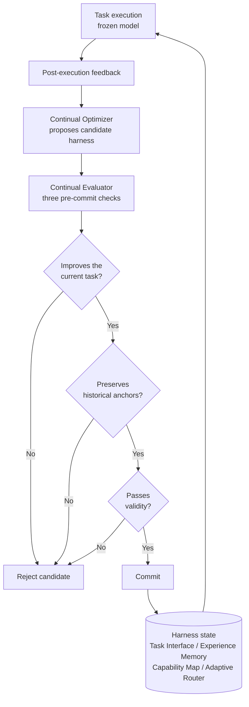

> 📄 **Full deep review (DOCX)**: [Download the detailed peer review on Google Drive](https://drive.google.com/file/d/1rVrbakfFrzsAn6bIxcOzUdST8qiemxw5/view).

## Why Read This

If you run agents in production and let them update their own skills, memory, prompts, and routing rules, the problem this paper addresses is the problem your system will have tomorrow. 'Harness Continual Learning: Continual Adaptation Beyond Model Parameters' (arXiv 2608.19013), written by six researchers at Nanjing University, formalizes a learning paradigm in which the harness evolves on sequential experience while model weights are never touched. The core conclusion up front: updating only the harness around a frozen model yields more than 10% relative gains over baselines in several settings, and the cost of that, harness-level forgetting, is explicitly controllable through guarded evolution (separating proposal from commit) plus a single historical-loss tolerance number.

<!-- nlm-visual -->

*Infographic generated by NotebookLM from the sources.*

## Overview

Most of the continual learning literature is model-centric. The state that changes is the model's parameters, weights are updated with sequential experience, and how much prior-task performance survives defines forgetting. But modern agents adapt on the outside of the model, too. Prompts get revised, memory accumulates, tool and skill lists grow, routing rules shift. These contents jointly shape later execution, so a harness update can disrupt previously reliable behavior even when the model is frozen.

The paper places a new question at that point: how do you keep improving the state outside the model while retaining the behavior you acquired earlier? HCL is the paradigm built to answer it. The harness evolves around a frozen foundation model, and the loss of earlier behavior that this causes is named 'harness-level forgetting'. Naming it is the first contribution. When harnesses were thin, this kind of regression got lumped under "the model forgot." Now the changing thing is not the model, so regression can be attributed to harness updates and measured as such.

## What the Paper Is

HCL treats four execution-facing components as one evolving state. The Task Interface defines how the agent reads tasks and the environment, Experience Memory accumulates post-execution feedback, the Capability Map catalogs reusable procedures, and the Adaptive Router decides what gets bundled how in the next run. The paper treats these four not as independent devices but as a single mutable state, tracking which component gets revised when a failure occurs.

The evolution mechanism is designed as a split between proposal and commit. After execution finishes, a Continual Optimizer proposes a candidate harness based on the feedback. A proposal is only a candidate. A Continual Evaluator commits a candidate to state only after it passes three checks. First, does it actually improve the current task. Second, does it preserve the performance of the validated anchor set kept from the past. Third, is the candidate itself valid. If any gate fails, the candidate is discarded and the harness keeps its previous state.

The second gate carries the real weight. The historical-loss tolerance, the ceiling on acceptable performance drop over the anchor set, is exposed as a single parameter. Set it to zero and "preserve every anchor currently solved" becomes the rule, average forgetting converges to near zero, but adaptation shrinks sharply. Push it to infinity and the most aggressive updates are accepted, and regressions on earlier tasks grow. The paper confirms across several streams that this one knob lets you deliberately pick the point on the stability-plasticity balance.

## Architecture

The full guarded-evolution loop as a diagram. Execution is done by the frozen model; change is committed only to harness state.

Compressed to one line: "separate the side that learns from the side that accepts, and put a retention check on the accepting side." No matter how good the Optimizer's revision is, if it does not pass the Evaluator's three gates the system state does not change. This split is rare in agent systems. Usually learning and deployment are bound in one stream, and rollback happens only after a regression is discovered. HCL moves rollback from after-the-fact to a pre-commit condition.

## Results (as reported by the paper)

All numbers below are as reported by the paper; this post does not independently reproduce them. The setup splits into four lines by frozen model. ALFWorld text environments use Qwen3.5-9B, the Minecraft curriculum and the multimodal stream use Qwen3.6-27B, the textual reasoning stream uses DeepSeek-V4-Flash, and the component ablation uses Qwen3.5-4B. Within each setting, every comparison shares the same model.

The evolution range shows most clearly in the long-horizon open-world experiments.

| Environment (frozen model) | Static | RAG | MemP | MemRL | Stability-HCL | Plasticity-HCL |
|---|---|---|---|---|---|---|
| ALFWorld 6-category final avg (Qwen3.5-9B) | 47.12 | 55.56 | 53.15 | 51.51 | **61.74** (Fgt 2.64) | **62.98** (Fgt 10.94) |
| Minecraft 50-task completion (Qwen3.6-27B) | stalls at 15 | - | 91 actions | 88 actions | **50/50, 83 actions** | - |

ALFWorld teaches six categories in order (Pick, Look, Clean, Heat, Cool, Two-object) and scores on 134 official evaluation episodes at the end. Memory-based baselines (MemP, MemRL) lift individual categories but vary considerably across the stream, and RAG hits a ceiling because retrieval alone cannot revise reusable procedures or routing rules. Plasticity-HCL solved all Two-object episodes but carried forgetting of 10.94; Stability-HCL reached 61.74, close behind, while pulling forgetting down to 2.64. In Minecraft, the Static harness stalled at 15 tasks while HCL completed all 50, using 83 cumulative environment actions versus 88 for MemRL and 91 for MemP. The same curriculum, solved with fewer wasted actions.

The controlled-stream experiments quantify the tolerance b. Under an identical allocation of 250 adaptation, 50 validation, and 500 test examples per task, the text stream (MuSiQue, ProofWriter, GSM8K, HotpotQA) and the multimodal stream (COCO detection, COCO captioning, RefCOCO grounding, VQAv2) are run in sequence.

| Stream (frozen model) | Zero-shot | DGG | Stability-HCL | Plasticity-HCL |
|---|---|---|---|---|
| Textual reasoning final avg (DeepSeek-V4-Flash) | 45.50 | - | 52.20 (Fgt 0.00) | **64.70** (Fgt 0.07) |
| Multimodal perception final avg (Qwen3.6-27B) | 39.40 | 42.73 (Fgt 0.26) | **68.92** (Fgt 0.22) | 67.96 (Fgt 0.81) |

In the text stream, Plasticity-HCL lifted the final average from 45.50 zero-shot to 64.70, about a 42% relative gain. In the multimodal stream, Stability-HCL topped the final average at 68.92, and detection jumped from 4.27 to 65.34. VQAv2 was the one exception where Zero-shot stayed strongest, because the frozen model was already good at direct image-question answering. The recent sequential learning method DGG also trails HCL. The b sweep stays consistent in direction: with b fixed at 0, 1, 3, and infinity, the final average runs 61.25, 63.46, 62.04, 60.13 while average forgetting climbs monotonically from 0.39 to 3.45. A mid-range tolerance is where the performance-forgetting balance lives.

To summarize the ablation: disabling updates to Experience Memory or the Task Interface produces the largest final-performance drops, and freezing Memory also raises forgetting to 0.83. Evolving memory supports both acquisition and retention. The paper is explicit, though, that lower-forgetting ablation variants are not better harnesses. They simply adapted less.

## What This Means for ThakiCloud

Where this paper touches Paxis directly is the question: "do the self-updating agent assets have a commit gate?" Paxis is an Agent-Native Cloud that treats skills, tools, policies, and audit logs as first-class resources. Skills escalate past failure streaks, feedback findings land as improvement tasks, session learnings get routed into the next session as a hot brief. This entire structure, in which only the harness changes, is HCL-style harness updating. Model weights stay fixed; what changes is skill bodies, memory, and routing state.

Translating the paper's formalized guarded evolution into Paxis practice yields three items. First, the split between proposal and commit. A skill-evolution candidate is born as a "proposal from execution feedback," and until it is committed it is only a candidate. The paper names the three gates that candidate must pass: current improvement, historical anchor retention, validity. Second, regression-testing the retention check. The condition "if this skill changes, tasks that used to work must keep working" can be implemented as an anchor set that is actually executed before commit. That is exactly what Stability-HCL's 2.64 forgetting on ALFWorld is in substance. Third, the tolerance as a number. Our skill-retro streak caps and escalation thresholds already play the role of a tolerance. HCL promotes that tolerance into a knob for deliberately adjusting the stability-plasticity trade-off. The question changes from "after how many failures do we escalate" to "how much past performance are we willing to lose in order to evolve."

There is an ai-platform lens too. If the served model stays put and only agent assets evolve, the inference cost structure and the model versioning burden stay intact while agent behavior keeps improving. The cost of learning moves from weight updates to validation of harness assets. Continual learning that does not burn GPUs. That is the execution economics HCL opens.

## Limits and Counterarguments

First, the finiteness of the anchor set. Even with the tolerance set to zero, the paper reports residual forgetting of 0.39 on the text stream. The anchors to preserve are a finite validation set, while forgetting is measured on separate historical tests. "Every solved anchor is preserved" does not guarantee "all past behavior is unchanged." A zone of regression that the commit gate structurally cannot cover remains.

Second, the cost of retention evaluation. Every candidate commit requires actually running the anchor set. The paper names this cost an open problem in its conclusion. As anchors grow and environments become non-deterministic, the second gate becomes the most expensive stage. The practical ceiling of HCL will likely be bound by "how cheaply can you re-verify the past."

Third, the evaluation range stays within academic benchmarks. ALFWorld, Minecraft, the COCO family, reasoning Q&A. Verification in environments where state is scattered, failures are irreversible, and anchors are hard to define, the kind of environment an enterprise workflow actually is, has not been done yet. The VQAv2 case, where Zero-shot won, also shows the harness does not always win.

Fourth, whether this paradigm replaces or complements model-centric continual learning is a matter of experience, not logic. HCL addresses learning "when you do not touch the model." At the point where the domain shifts fast enough to justify retraining, parameter updates still have their place. The paper positions HCL as a new axis, learning of the state outside the model, not as a replacement for model learning.

## In Summary

In a system where you run agents long, the thing that must change is the harness, not the model, and when the harness changes, past behavior wavers. That is expected. The paper's contribution is formalizing this as a paradigm, making past retention a commit condition through guarded evolution that separates proposal from commit, and letting a single tolerance number deliberately set the stability-plasticity balance point. The experiments show that design produces capability accumulation and failure recovery even with a frozen model, and turns forgetting into a measurable, tunable quantity.

The takeaway for us is clear. If you run self-evolving skills, memory, and routing, check first whether that evolution has a "verify past retention before commit" gate. Then make that gate's tolerance expressible as a number. A harness update that passes on "it will probably be fine" will, someday, produce the quietest regression on your oldest task. HCL is the paper that named that regression, put the named regression behind a gate, and made the tension of that gate tunable with one parameter.

<!-- nlm-visual -->

*Infographic generated by NotebookLM from the sources.*

## Sources

- [arXiv 2608.19013: Harness Continual Learning: Continual Adaptation Beyond Model Parameters](https://arxiv.org/abs/2608.19013) (Borui Kang, Jinrui Gu, Junhan Lv, Wenbin Li, Lei Wang, Yang Gao. State Key Laboratory for Novel Software Technology, Nanjing University; University of Wollongong. v1, 2026-08-19, cs.LG/cs.AI)
- Intro tweet: [@omarsar0 (elvis, D.AI)](https://x.com/hjguyhan/status/2090841745793982600)
- 📄 Full deep review (DOCX): [Download from Google Drive](https://drive.google.com/file/d/1rVrbakfFrzsAn6bIxcOzUdST8qiemxw5/view)