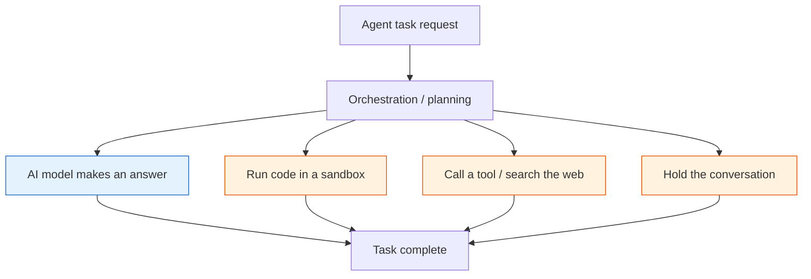

When you give an agent a job, the thing that eats the most time is usually not the AI model. This is worth reading if you run several agents or own the cost of routing them. Today we walk through a paper that actually measured where that hidden time goes.

## In plain terms

Order a coffee. The barista pulls the shot in a few seconds. But you still wait much longer for the cup, because someone has to grind beans, warm up the machine, check stock, and write your name on it.

Agents work the same way. The AI model making an answer, the moment the shot gets pulled, is already fast enough. What eats most of your wait is everything around the model: setting up a workspace, calling a tool, searching the web, and remembering the earlier conversation. In the coffee shop, that is grinding beans, checking stock, and writing your name on the cup.

The barista is fast. The shop is slow. The paper we cover today measures, for the first time, the whole wait from the line to the cup in your hand.

## What we did

The research team looked at a paper from Alibaba and ByteDance. It is called AgentSysBench, and it measured, on 10 agent apps actually running in production, exactly where the time goes.

Most work on fast AI serving has focused on one thing: how fast can you answer one question. But what an agent actually does is search, run code in a sandbox, read the result, and call the next tool, one step after another. Making a single question fast tells you nothing about why the whole shop is slow.

So the team broke one agent task apart the way you would break down a coffee order. They timed the AI model separately from the time spent running code in a sandbox, calling tools or searching the web, and holding the earlier conversation in memory.

*The blue box (the AI model) is already served well. The orange boxes (sandbox, tool calls, memory) are what this paper targets.*

## What we found

### Half the shops are slow in the back room

In 5 of 10 measured agent apps, most of the customer's wait came not from pulling the shot but from work in the back room. In plain terms, in half of the shops we measured, the real bottleneck was not the AI model but everything around it.

The back-room workspace also stacked up as much as 28GB of stuff per customer session. Depending on how a shop mixed its GPU, memory, and CPU, the time to serve one customer swung by as much as 32x. In plain terms, where the bottleneck sits keeps moving depending on which shop and which customer. The assumption that "the bottleneck always sits in the same place" simply does not hold.

### Seeing the whole shop shaved off 3 to 4 tenths

Based on that, the team tried a few ways of planning the whole shop's flow instead of one step at a time.

The first plans the whole task ahead of time, the same as pulling out cups and ingredients while the shot is still brewing. That alone cut the time to serve one customer by 29 to 40 percent.

The second flexibly decides which shop serves the customer, and the third stores the customer's bags in a separate room instead of behind the counter. Those two lifted throughput by about 4.5x and 4.6x respectively. Add a way to check stock notes instead of walking back to the stockroom every time, and about 35 percent of repeat searches and tool calls simply disappeared.

In plain terms, none of this made the shot itself pour faster. It made the back-room prep and cleanup efficient enough that the customer's wait got shorter.

## What to change

First, reuse the result of a tool call or a web search whenever you can. Not walking back to the stockroom every time cuts both wait time and cost on its own. The payoff grows for agents that lean on search or outside data.

Second, if your agent takes several steps, plan the whole flow ahead instead of one question at a time. Pull out the cups while the shot is still brewing: get the next tool or workspace ready while the AI model is still working on an answer.

The same story applies to our two products. Metis, our inference service, has been tuned around processing tokens fast; for agent workloads it needs to shift the yardstick from one question to the whole task. Paxis, our agent platform, runs tools in isolated workspaces. This paper gives us measured evidence that reusing that workspace and its tool-call history is what actually decides operating cost.

We have picked two follow-up experiments. One breaks down the timing of a Paxis workflow step by step to see where it leaks. The other adds tool-call result reuse to an agent running on Metis and measures the before and after. Neither changes the AI model; both fix what is around it, so we can validate them on the models we already run.

## What not to trust

This measurement rests on records from three production services. With only three shops, we do not yet know whether the same picture holds for other kinds of agents or other model combinations.

The "5 of 10 shops slow in the back room" figure comes from a sample of only 10. What counts as an "agent app" is also a call the research team made, so that ratio could differ elsewhere. The 4.5x and 4.6x gains also depend on what they were measured against, so read the setup along with the multiplier rather than the multiplier alone.

Planning the whole shop's flow also means more to build and maintain: something to recognize the task, a room to hold bags, and a record to reuse. For a simple shop where every customer just orders one coffee, this can be a net loss. The payoff only shows up once an agent takes several steps and traffic is large enough.

---

*Full paper: [AgentSysBench, arXiv 2608.15127](https://arxiv.org/abs/2608.15127) (first author Chaokun Chang and 22 co-authors, posted 2026-08-15). The figures in this post were verified against the paper through our internal deep-research record. We could not re-fetch the primary source for this pass, so the numbers are cited as the paper's own reported values.*
