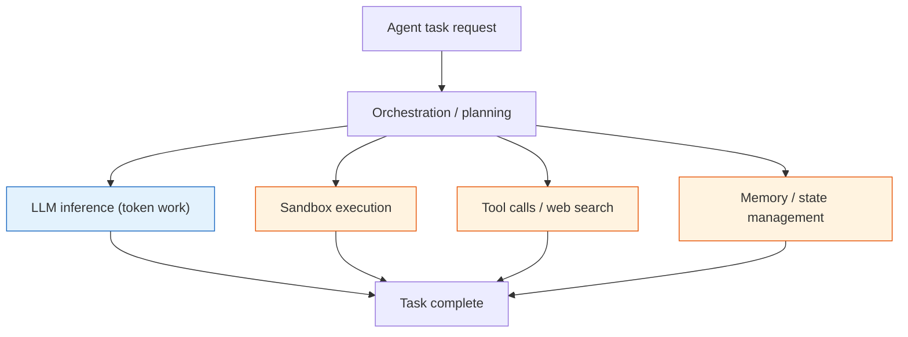

## Why read this

If you optimize serving latency or operating cost for multi-agent workloads, or you build the execution environment that agents run in, read this paper. The bottom line up front: in half of the agent apps measured, latency was dominated not by LLM inference but by non-LLM components - sandbox, memory, tool calls - and recognizing that lets "task-aware serving" cut task latency by 29-40% on production traces. It is the evidence base for moving your serving-optimization view up one level, from per-token throughput to per-task cost and latency.

## Overview

The inference-serving field has nearly solved "serve a single LLM request fast" over the past few years. Continuous batching, paged KV cache, chunked prefill, prefill/decode disaggregation: per-request optimization is mature. But the work AI actually takes on in production is increasingly not "one request" but "a task that walks through several steps" - search, run code in a sandbox, read the result, call the next tool. If you keep optimizing only at the request level, a large part of the latency your users feel is happening somewhere you are not looking.

AgentSysBench (arXiv 2608.15127; first author Chaokun Chang and 22 co-authors; posted 2026-08-15), from Alibaba and ByteDance research groups, is a benchmark that measures exactly this, including three production traces. Its core message is simple: in agent serving the bottleneck moves with the request, the model, and the deployment, and a large share of it sits in non-LLM components.

## What AgentSysBench shows

An agent task does not end in one LLM call. The diagram below shows the structure: orchestration drives both LLM inference and several non-LLM components (sandbox execution, tool calls / web search, memory / state management) in parallel, and together they complete the task.

The color split is the point. The blue LLM inference is already well served; it is the orange non-LLM components that dominate the latency.

The measurement covered 10 agent apps. In 5 of them, latency was dominated by non-LLM components. Sandbox worksets used up to 28GB of memory per session, and in mixed GPU / memory / CPU configurations task latency varied by up to 32x. Where the bottleneck sits changes with the shape of the request, the model used, and the deployment. The premise that "the bottleneck is one fixed point" simply does not hold.

## What task-aware serving recovers

On top of that observation, the paper proposes and measures serving techniques that treat the task as the unit. Three strands:

Task-aware serving, which schedules by understanding the task's steps and resources, cut overall task latency by 29-40%. Placement virtualization, which abstracts where a task runs, reported a 4.5x improvement factor; state offloading, which moves agent state out of the serving tier, recorded a 4.6x factor. On top of that, tool-result caching removed 35.2% of duplicate search / tool calls.

Read the numbers correctly and they are a correction to "we were spending the time somewhere other than the model." The 29-40% and the 4.5x / 4.6x are not about making the model stronger; they are about the fact that time was being burned in the surroundings. The 35.2% from tool-result caching lands directly on operating cost for agents that lean on RAG or web search: not re-searching the same question or re-calling the same tool is a large per-task cost reduction by itself.

## ThakiCloud product implications

The implications reach both ThakiCloud products, Metis and Paxis.

From a **Metis** (token factory / AI inference) view, there is now a basis to reset the serving-optimization axis. Metis serverless and dedicated serving has been tuned around per-token throughput, KV cache, and batching, and we have even measured and recovered the platform default "configuration tax." AgentSysBench points at the next step: for agent workloads, task-level scheduling, state offloading, and tool-result caching matter more than per-token throughput. Adding task-aware scheduling and tool-result caching to the Metis serving layer becomes the next optimization axis for agent customers.

From a **Paxis** (agent platform) view, the finding that multi-agent execution cost and latency are set by sandbox / memory / tool calls rather than tokens maps directly onto product design. Paxis runs skills in isolated sandboxes and calls tools through MCP connectors; this paper pins down exactly where that structure's bottleneck is. Sandbox workset memory (up to 28GB per session) and tool-call caching become the key variables of Paxis execution economics, now with a measured basis.

Two concrete experiments follow. First, decompose and measure non-LLM component latency in Paxis workflows to reset the serving-optimization axis. Second, A/B tool-result caching on a Metis demo agent workload to measure latency and cost. Both are "change the serving / execution layer," not "change the model," so they validate on top of existing checkpoints.

## Limitations and counterpoints

The measurement rests on three production traces, so extrapolating to a wider range of workloads and models needs care. The "5 of 10 apps non-LLM dominated" ratio comes from a small sample, and the definition of "agent app" is the authors' - in other environments the non-LLM share could differ. The 4.5x / 4.6x factors also depend on the baseline they are measured against, so read the assumed configuration together with the number rather than the multiplier alone.

Task-aware serving also adds layers (task recognition, state store, cache) to the serving path, which can be pure overhead for a simple single-request workload. The win only clears the cost when agent traffic is large enough and staged enough.

## Takeaway

Serving an agent is not "put the request into a fast LLM." It is a question of how well you schedule a task made of sandbox, memory, and tool calls, where you keep state, and what you cache. AgentSysBench shows that much of the bottleneck sits outside the model and that task-aware serving recovers 29-40% on production evidence. For ThakiCloud, that evidence is a signal to point Metis's serving-optimization axis from per-token to per-task, and to read Paxis execution economics through sandbox and tool-caching variables. The next experiment is not a new model benchmark; it is non-LLM latency decomposition and a tool-result caching A/B on a demo agent workload.

---

*Source: [AgentSysBench, arXiv 2608.15127](https://arxiv.org/abs/2608.15127) (first author Chaokun Chang and co-authors, 2026-08-15). The figures in this post were verified against the paper in our internal deep-research record; the primary source could not be re-fetched in this session, so they are cited as the paper's own measurements.*