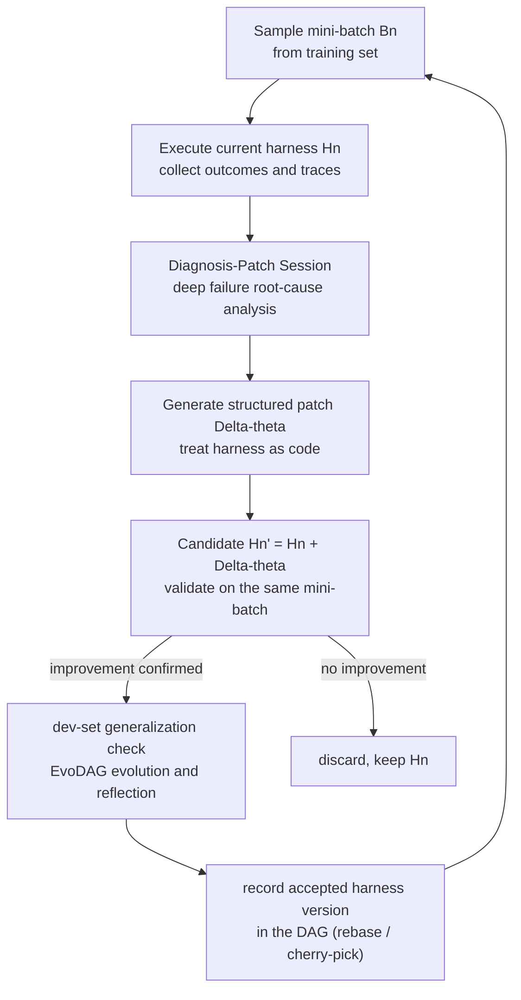

## Why read this

If you design agent execution environments, or you have been hand-tuning the harness (prompts, tool configuration, control logic) of agents you operate, read this paper. The bottom line first: an offline optimization loop that treats the harness as code and uses only failure traces as learning signal delivers 9.0, 9.6, and 10.0 point gains over base harnesses on three agent benchmarks, with roughly 10x rollout efficiency over existing automation baselines. It is the most concrete evidence so far that automating harness tuning is the right direction, and how to design it.

## Overview

LLM agents remain unreliable on long-horizon tasks. Small local failures compound over extended interactions and become whole-task failure. External harnesses cut this fragility substantially, but harness design itself is manual and expensive. You have to search a large space of prompt specifications, tool configurations, and system-level choices, and evaluating each candidate costs rollouts until the agent has run many steps and a success or failure is decided.

AutoSaddler (arXiv 2608.23041, submitted 2026-08-24, 44 pages), co-authored by 13 researchers from KAIST (Wonjoong Kim, Chanyoung Park), POSTECH (Sungho Park, Wook-Shin Han), and Microsoft Research (Jue Zhang, Dongmei Zhang, and others), recasts the problem as an offline learning problem. The name means a device that automatically adjusts the saddle; the substance is a mini-batch optimization loop that patches the harness like code and uses only failed execution traces as the learning signal. On GAIA2, SWE-Bench Pro, and Terminal-Bench 2.0 it improves over the base harnesses by 9.0, 9.6, and 10.0 points, and over the strongest automated baseline on each benchmark by 7.4, 4.4, and 6.7 points.

> 📄 **Full deep review (DOCX)**: [Download the detailed peer review on Google Drive](https://drive.google.com/file/d/1rZ60AlAHZBBNcKjWuIxASN2NMC2d7t6Y/view).

## What AutoSaddler does

AutoSaddler is a budget-constrained optimization problem: partition the task set into training, development, and test sets, then search candidate harnesses within a rollout budget K. The loop is identical in shape to mini-batch learning.

The core design compresses into three ingredients. The paper ablates each one, and all three are mandatory.

### First, deep diagnosis

Instead of a single LLM call that reflects on a failed trace, a Claude Agent SDK session actively explores both the execution trace and the harness source code to find the root cause. The diagnosis-patch session makes on average 6.2 more tool calls and 5.8 more file accesses than a patch-only session. That extra investigation effort pays off: removing deep diagnosis drops GAIA2 test-set Pass@1 from 62.0 to 57.8. When failure reflection stays surface-level, the patch never sees the cause.

### Second, structured patches

Patches are not written freely; they are generated inside a taxonomy with two major classes.

- **Capability patches**: change executable code or orchestration logic. Tool implementations, tool arguments, infrastructure settings, and agent-loop logic are in scope. They change what actions the agent can perform, or how the harness executes them.
- **Steering patches**: text edits that leave executable code untouched. Prompts, tool descriptions, and hook reminder texts are in scope. They refine which existing capability the agent picks and which constraints it follows.

The distinction mirrors large versus small learning-rate steps in gradient optimization. Capability patches are large steps - new functionality, changed control flow. Steering patches are small steps - behavior selection within an established capability set. AutoSaddler manages their order with a phased schedule. Remove the structure (unconstrained editing, the Meta-Harness style) and patches collapse 91.5% onto steering, with GAIA2 Pass@1 dropping further to 56.9. The high-value infrastructure and tool interventions are simply never explored.

### Third, generalization-aware selection

A generated patch survives only if it passes three checks: real improvement on the same mini-batch, generalization on the dev set, and a reflection session that abstracts the concrete fix into a general principle. Accepted harness versions are recorded not as a linear chain but as a DAG (EvoDAG): cherry-pick validated fixes from earlier versions, rebase away patches that caused regressions. In the full GAIA2 run (50 iterations, 2 epochs), only 21 of 51 candidates passed dev evaluation. Remove generalization-aware selection and Pass@1 falls to 50.6, the largest drop of any ablation (11.4). A repair fitted to one specific trajectory causes regressions on other tasks, and the dev gate blocked most of them.

## Experimental results

The three benchmarks probe different axes of agent ability. GAIA2 covers general assistant tasks across 10 universes of a simulated smartphone environment (base: the default ReAct agent), SWE-Bench Pro covers enterprise-scale software engineering tasks (base: SWE-agent), and Terminal-Bench 2.0 covers 89 tasks across system administration, machine learning, and cybersecurity (base: Terminus 2). Both the optimizer and the agent backbone were fixed at Claude Opus 4.6.

| Benchmark | Base harness | vs base | vs strongest automated baseline |
|---|---|---|---|
| GAIA2 | GAIA2 default ReAct | +9.0 | +7.4 |
| SWE-Bench Pro | SWE-agent | +9.6 | +4.4 |
| Terminal-Bench 2.0 | Terminus 2 | +10.0 | +6.7 |

Efficiency matters more. On GAIA2, AutoSaddler reaches 72.3% dev accuracy with about 1,000 rollouts, while GEPA and Meta-Harness saturate at 64.6% and 61.5% after roughly 2,800 task executions. Measured by rollouts actually leveraged for learning, the gap is sharper: AutoSaddler records its best dev score after consuming 147 rollouts; Meta-Harness takes 1,400. About 10x. Terminal-Bench 2.0 repeats the picture. From a common 52.6% start, AutoSaddler reaches 73.7% dev after 31 task executions and 12 leveraged traces, well ahead of Meta-Harness (63.2%, 98 traces) and GEPA (57.9%).

The ablation numbers together show the value of each ingredient (GAIA2 test Pass@1).

| Setting | Pass@1 |
|---|---|
| AutoSaddler (full) | 62.0 |
| w/o deep diagnosis | 57.8 |
| w/o structured intervention | 56.9 |
| w/o generalization-aware selection | 50.6 |

The paper also records an interesting execution trace. In the full GAIA2 run, iteration 20's patch - a hook on a high-frequency tool - caused a catastrophic regression (33.8%); the evolution session rebased to iteration 13 (67.7%) and cherry-picked only the fixes validated at iterations 13-14. Iteration 27 records the global peak of 72.3%. A linear chain would have contaminated all subsequent history with one bad patch; the DAG structure localized the regression and kept the validated parts.

Cross-model transfer was checked too: with Claude Haiku 4.5 as the task agent and the harnesses kept exactly as optimized by Opus 4.6, the improvement of +5.6 points over the default agent holds. The effect of harness optimization does not stick to the model; it remains in the execution environment around the model and transfers with it.

## ThakiCloud product implications

**Paxis lens.** This paper is a design reference for the Paxis self-evolution skill loop. If Paxis has been considering generating skill patches from failure traces and reflecting only through a validation gate, AutoSaddler validates that design on three axes. First, diagnosis depth determines patch quality (4.2 points). If trace review stops at "look once and reflect," patches skew steering and never touch the cause. Second, the validation gate is not a choice but a survival condition (11.4 points). The largest ablation drop came from removing the dev gate. A repair fitted to one execution causes regressions on unseen tasks, and the gate blocked it. Third, patch history must be a DAG, not linear. The way rebase and cherry-pick localize regressions is a proposal to design the skill patch ledger as a graph of fix history.

**ai-platform lens.** Rollout efficiency is serving cost. Agent optimization burns inference executions by construction, and the gap of 1,000 vs 2,800 on GAIA2 (147 vs 1,400 by leveraged rollouts) is the difference in Metis inference cost for the same optimization outcome. The design of "use only failure traces as learning signal" means success cases do not need re-execution, which changes the cost structure of the agent evaluation pipeline itself.

A related post, [The Model Is Frozen, the Harness Learns: Harness Continual Learning](/en/research/harness-continual-learning/), covers the same "harness learns" theme. AutoSaddler is offline (pre-deployment) optimization; that post covers post-deployment continual adaptation.

## Limitations and counterarguments

First, the backbone stays within a single model family. Both optimizer and agent were Claude Opus 4.6, and cross-model transfer was verified only within the Claude family (Opus optimization, Haiku application). Whether a harness optimized for GPT- or Gemini-based agents transfers is unverified.

Second, the validation gate presumes task-level deterministic metrics (pass/fail, accuracy). GAIA2, SWE-Bench Pro, and Terminal-Bench all have verifiable ground truth. How to define "dev-set generalization" in open-ended business domains without ground truth is a precondition for applying this design. The RLVR vs RLHF distinction reappears here.

Third, the offline formulation. Reflecting the real workflow of "tune in development, deploy to production" is a strength, but it does not address production distribution drift. After a model upgrade or domain shift, the budget must be spent again.

Fourth, depth costs money. The extra 6.2 tool calls and 5.8 file accesses are per-optimization-session cost. Given the efficiency results, the paper argues the trade-off pays off, but for small agents or tight budgets shallow reflection may be the rational choice.

## Conclusion

AutoSaddler shows what happens when the improvement target of an agent system is the execution environment (harness) outside the model rather than model parameters: environment improvement becomes a learning problem. The answer is three ingredients. Diagnose failures deeply, generate only structured patches, and record in the DAG only what passes validation and generalization gates. The 9-10 point gains over base on GAIA2, SWE-Bench Pro, and Terminal-Bench 2.0 and the ~10x rollout efficiency are the evidence for this design; the cross-backbone transfer (+5.6) shows the value of optimization persists outside the model.

If you are currently tuning harnesses by hand, the next experiment is putting a "failure trace to structured patch to validation gate" loop on one benchmark. Do not start with unconstrained editing. The cheapest lesson from this paper is that without structure, 91.5% of patches collapse into text edits.

---

*Source: [AutoSaddler, arXiv 2608.23041](https://arxiv.org/abs/2608.23041) (Sungho Park and 12 co-authors, 2026-08-24). Project site [aka.ms/AutoSaddler-website](https://aka.ms/AutoSaddler-website). All numbers in this post were verified directly against the paper (abs + HTML full text).*

> 📄 **Full deep review (DOCX)**: [Download the detailed peer review on Google Drive](https://drive.google.com/file/d/1rZ60AlAHZBBNcKjWuIxASN2NMC2d7t6Y/view).
