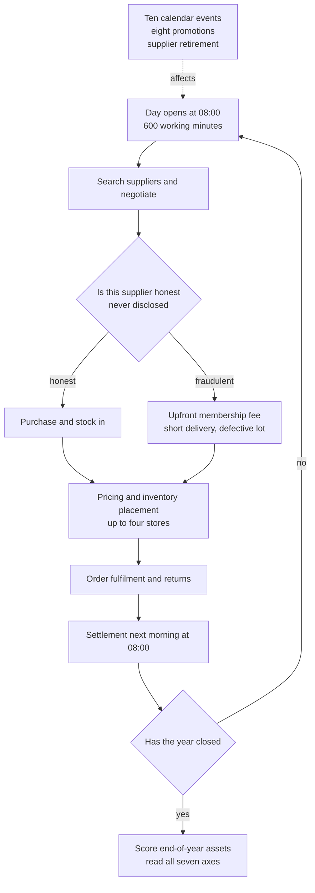

Someone finally measured what happens when you hand an agent a shop and walk away for a year. The results are unkind. The model that earned the most also lost close to the most to fraud, and most models never shaved a single yuan off a price they had already paid twelve months earlier.

This post is for teams deciding whether an agent gets a demo or a real operation. It matters most when you are the one drawing the line on how much autonomy to grant.

*A visual metaphor for the article's key idea. Same year, same shop, and one side stacks while the other collapses.*

## In plain terms

Say you are hiring. The person who aces the interview questions and the person you can trust with a shop for a year are not the same person.

Interview questions are independent. Finish one and the next has nothing to do with it. A shop is different. Buy the wrong stock today and you have nothing to sell tomorrow. Burn the cash this month and you miss next month's promotion. Each day's decision reshapes the next day's options.

Agent benchmarks have mostly been interview questions. This paper built the shop. It hands over a 365-day online store and scores the agent on the balance at the end of the year.

But the balance alone hides things. Get defrauded and cover it with revenue, and the balance still goes up. So the benchmark reads seven things rather than one: negotiation, fraud avoidance, cash flow, operating efficiency, execution quality, learning, and the final balance.

This post reads those seven as a first-year performance review. The employee who only brings in revenue and the employee who brings in revenue without getting scammed are different hires.

## What they did

The environment mirrors a Chinese online marketplace. There are 6,886 products, 60 categories, and 576 suppliers. Of those suppliers, 152 are fraudulent.

The agent starts with 100,000 yuan and opens up to four stores. A day begins at 08:00 and runs ten hours, and settlement lands the next morning. An episode runs up to 4,000 turns.

Fraud comes in two shapes. Before a deal, the supplier quotes roughly one and a half times an honest floor. After a deal, it ships sixty to seventy percent of the ordered quantity, or sends defective stock with a return rate above forty percent. Some demand a 1,000-yuan membership fee up front.

The world does not sit still either. Ten market events are fixed on the calendar, eight promotions arrive with seven days of notice, and suppliers quietly retire once they have filled a hidden number of orders.

The negotiation design is the most important detail in the paper. A deterministic kernel decides every price, concession, and acceptance. The model only voices those decisions as dialogue.

Put plainly: the benchmark does not measure eloquence. It measures the judgment of when to push and when to fold, and it is built so that the same judgment yields the same number no matter who makes it.

Eighteen models were evaluated, five episodes each, for ninety episodes in total. Proprietary and open-weight models split the field roughly in half.

## What came out

Start with the spread. First place closed the year with 1.43 million yuan and last place with 1,100. Same instructions, same market, and a factor of 1,264 between them.

Starting capital was 100,000 yuan, so the winner grew it fourteen-fold and the loser lost essentially everything. Ten of the ninety episodes ended in bankruptcy, six of them under proprietary models.

Put plainly: hand the same shop to different employees and one grows it fourteen times over while another closes the doors.

None of that is surprising. The real finding comes next.

*Values transcribed from Table 2 of the paper. The horizontal axis is the share of spending that reached fraudulent suppliers and the vertical axis is end-of-year assets. Top earner GPT-5.6 Sol sent 18.48 percent of spending to fraud, ranking 16th of 18, while Claude Opus 4.7 led fraud avoidance at 0.12 percent and finished with 259 thousand yuan. Not a ThakiCloud reproduction.*

The biggest earner was near the bottom on fraud avoidance. The best fraud avoider placed fifth on assets. The two axes barely move together.

That matters because we usually judge an agent by a single outcome number. Look only at the balance and you never see that a fifth of its spending went to con artists.

Efficiency tells the same story. Counting yuan earned per tool call, the best model returned 479 and the worst returned 36. The model that burned the most turns is the one earning 36. Moving more does not mean earning more.

The sharpest result is about learning. Agents made 8,647 repeat purchases of the same item from the same honest supplier. A year of repeat business is normally where you start winning discounts.

*The AnchorRatio column from Table 2. A value of 1.0 means paying exactly what the first order cost, and anything higher means paying more. Only Qwen3.8-Max-Preview at 0.834 and Gemini 3.5 Flash at 0.918 finished below 1.0; the other sixteen never worked the price down.*

Sixteen of eighteen sit above 1.0. A year passed, the same deal repeated thousands of times, and the price never came down. Some models ended up paying more than they did on day one.

Put plainly: experience accumulated and learning did not.

The paper also offers a clue as to why. Across the ninety episodes, the runtime evicted transcript 1,495 times. The model that burned the most turns discarded roughly nineteen windows' worth of its own history.

## What to change because of it

First, stop scoring autonomous agents on one outcome number. If the balance grows while fraud exposure and peak drawdown grow with it, that growth is borrowed. Read at least three axes together.

Second, do not delegate fraud avoidance to the model's judgment. In this environment fraudulent suppliers quoted conspicuously high floors, and that is a condition code can screen. Spending caps on new counterparties and a block on upfront fees belong in a gate, not a prompt.

Third, when a repeat purchase never gets cheaper, read that as missing memory. Write the last agreed price somewhere and feed it explicitly into the next negotiation, and you stop depending on the model to remember. The [execution-state paper we covered yesterday](/tech-blog/en/research/skill-state-long-horizon-agent-runtime/) prescribes exactly that.

Fourth, gate bankruptcy, because it is not reversible. When drawdown crosses a line you set, stop automatically and hand control to a person. Ten failures in ninety runs is not a low incident rate.

At ThakiCloud the paper lands on two products.

Paxis is an agent control plane that treats skills, tools, policies, and audit logs as first-class resources. Every failure in this paper is expressible as policy: a cap on new counterparties, a ban on prepayment, a drawdown ceiling, a ledger of prices already agreed. Putting rules in the control plane is easier to verify and to audit than making the model smarter.

Metis is the side that sells inference. Yuan per tool call is the number that gets multiplied by your serving price. Some models spend more than twice the calls to reach the same result. On long autonomous work, model choice is a unit-cost decision as much as a capability one.

## What not to trust

The biggest constraint is sample size. Five episodes per model, and the authors say plainly that this is small.

The spread makes that concrete. One proprietary model averaged 702 thousand yuan with a standard deviation of 616 thousand. Rerun those five and the ordering could change. Read this ranking as a tendency, not as a league table.

The negotiation score needs care too. A deterministic kernel sets the prices while the model writes the dialogue. So the score measures when to accept, not how well an agent argues. Do not carry it over to real supplier negotiations as-is.

It remains a simulation. Demand is deterministic and events are fixed on a calendar, which is a different kind of uncertainty from a real market. The data is grounded in a Chinese marketplace, so commercial norms elsewhere may differ.

The learning metric is narrow as well. The repeat-purchase ratio counts only honest supplier pairs, because fraudulent floors are inflated and offer no fair baseline.

Finally, the eviction policy is fixed: keep the system message, the first user turn, and the two newest groups. Change the memory design and the learning numbers could move, and the paper leaves that door open.

One thing is unambiguously good. The code is public, so anyone can measure these numbers again. Every figure here is paper-reported and is not a ThakiCloud measurement.

What transfers is not the ranking. It is that over a long enough horizon, discipline separates outcomes more than capability does.

---

- Paper: [E-Commerce Bench: Evaluating LLM Agents on Long-Horizon Autonomous Business Operation](https://arxiv.org/abs/2608.30730) (arXiv:2608.30730)
- Code: [QwenLM/E-CommerceBench](https://github.com/QwenLM/E-CommerceBench) (Apache-2.0)

*Body figures are mostly reduced to one or two decimals, with exact values kept in the figure captions.*
