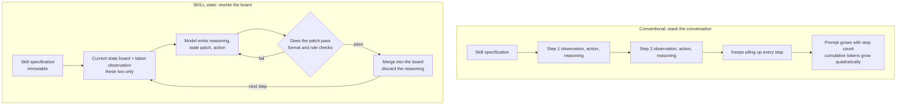

Hand an agent a long job and it gets slower, costlier, and wronger as it goes. The cause is not the model's reasoning. It is the habit of carrying every word ever exchanged. Swap the chat log for a board that holds only the current state, and token use drops by an order of magnitude while accuracy goes up.

This post is for teams that run agents long and unattended. It matters most when one person owns both the bill and the quality.

*A visual metaphor for the article's key idea. On the left, a log that only grows. On the right, a board you rewrite.*

## In plain terms

Move it to a kitchen. To do today's shopping you need to know what is in the fridge right now.

The first method is a transcript. You record every word your family said for a month. Before each shopping trip you replay the whole thing. Nothing is missing. The listening just gets longer every day.

The second method is a whiteboard on the fridge door. It lists only what you have and how much. When the milk runs out, you erase that line. A month later the whiteboard is still one page.

The runtime the paper proposes, SKILL.state, is the second method. Instead of stacking the conversation, it keeps rewriting one board that says what is true now.

Length is not the transcript's real problem. A sentence from a month ago saying you bought milk lives in that recording forever. One fresh line saying there is no milk today cannot outvote ten stale lines saying there is. This post calls that context poisoning.

## What they did

At each step the runtime hands the model exactly three things: the fixed skill specification, the board holding current state, and the observation that just arrived. Nothing from earlier turns goes in.

The model returns three things: its reasoning, a patch describing how to edit the board, and the action to take. Once the patch passes format and rule checks, it is merged into the board. The reasoning is then thrown away on the spot.

This is the crux of the paper. Nothing stops the model from thinking. Within a single step it can deliberate as long as it likes. Only the conclusion lands on the board; the deliberation does not.

The patch never rewrites the board wholesale. It overwrites or deletes individual entries, so only what changed changes.

The arithmetic makes the difference obvious. Stacking conversation lengthens the prompt every step, so cumulative tokens grow with the square of the step count. State-based execution keeps prompt length independent of step count, so cumulative tokens grow linearly.

Put plainly: one snowballs, the other walks at a steady pace.

There are four testbeds. Warehouse management and software repository operations are built by the authors. One moves stock across 500 shelves; the other handles branches, tests, and merges. The other two are public: 100 Linux security challenges, and customer service in retail and airline flavors.

Three baselines compete. One stacks the raw conversation. One keeps the last three steps plus a rolling summary. One uses a structured state block but still ships the full transcript alongside it. That last shape is what most teams run today.

## What came out

On the warehouse testbed at 100 steps, the state runtime scored 94 percent. The structured-block baseline scored 91 percent and the raw-conversation baseline 84 percent.

The token gap is wider than the accuracy gap. Over those same 100 steps the state runtime spent about 65 thousand tokens. The structured-block baseline spent about 1.06 million. That is a factor of sixteen.

Stretch to 200 steps and the gap widens. The state runtime held 94 percent while all three baselines fell. Tokens came in at about 122 thousand against about 5.04 million, a factor of forty-one.

Put plainly: as runs get longer the others get pricier and less correct, while this one holds both its price and its accuracy.

*Values transcribed from Table 1 of the paper. Left is cumulative tokens on a log scale; right is accuracy. At 200 steps the state runtime used 122,384 tokens against 5,041,164 for the structured-block baseline. These are paper-reported numbers, not a ThakiCloud reproduction.*

The second experiment injects noise. Events unrelated to the task get mixed into the environment. At five injected events the raw-conversation baseline was already at 68 percent, and at fifty it fell to 53 percent. Across that same range the state runtime held 100 percent and then 98 percent.

The third experiment is the striking one. Midway through, the world changes silently. Stock actually moves and nobody announces it. The authors counted how many steps it takes to abandon a stale belief after seeing the new observation.

The three history-carrying runtimes kept asserting the old fact for five to eight steps. The state runtime took zero. Rewriting the board erases the old fact outright.

Put plainly: a line you erased does not come back to argue.

Public benchmarks point the same way.

| Public benchmark | Raw-conversation baseline | SKILL.state |
|---|---|---|
| 100 Linux security challenges (InterCode CTF) | 43.2% · 977k tokens | **54.2%** · 387k tokens |
| Customer service, retail (Sierra tau-Bench) | 48.2% · 4.48M tokens | **58.3%** · 3.47M tokens |
| Customer service, airline (Sierra tau-Bench) | 21.8% · 4.85M tokens | **32.4%** · 2.88M tokens |

*Values from Table 4 of the paper, with Gemini-3-Flash as the primary model. Token counts are cumulative across the whole task set.*

Security challenge solving rose from 43 to 54 percent while tokens fell by roughly 60 percent. Airline customer service rose from 22 to 32 percent with tokens down by roughly 40 percent.

So far this could read as "shorter prompts helped". The paper attacks that reading directly.

Every runtime was capped near 1,800 prompt tokens and rerun. At 100 steps the state runtime scored 94 percent. Summarization scored 52 percent, a statistical compressor 22 percent, and a sliding window that keeps only recent turns 18 percent.

The telling number is that the uncapped raw-conversation baseline scored 84 percent. Shrinking carelessly is far worse than not shrinking at all.

*Values transcribed from Table 11 of the paper. Four of the five runtimes share the same 1,800-token budget. At 100 steps the state runtime scored 0.94 against 0.52 for summarization, 0.22 for statistical compression, and 0.18 for truncation, while the uncapped baseline scored 0.84.*

Put plainly: it did not win by being short. It won by having a different shape. A whiteboard is not a compressed transcript; it is a different object.

## What to change because of it

First, design the board's fields before you write the skill. List what has to be remembered for this job to finish. That list becomes the schema, and it simultaneously declares that nothing else needs remembering.

Second, let code validate every patch before it is applied. Bounce anything with a bad format or an unknown field. Handing that judgment to the model's own self-report removes the safety rail this design depends on.

Third, discard the reasoning but keep an audit log separately. Put an append-only record next to the board. It never enters the prompt and lives only on disk.

Fourth, do not swap in a small open-weight model right away. As the next section shows, this design discriminates between models.

At ThakiCloud the paper lands on two products in different ways.

Paxis is an agent control plane that treats skills, tools, policies, and audit logs as first-class resources. This paper argues for promoting one more thing to that list: execution state. Put the state schema next to the skill definition, and what a runtime will remember becomes a contract a human can read.

There is a tension, though. The paper says to throw history away, while auditing and traceability demand it. So our conclusion leans toward separation rather than deletion. The model sees the board; we keep the record. Storing both in one bucket was the mistake.

Metis is the side that sells inference. When cumulative tokens grow linearly instead of quadratically, the number of concurrent agents a given fleet can carry changes. On long unattended batch work, that difference lands directly on the invoice.

## What not to trust

The sharpest caveat is model dependence. Run the same 100 steps on open-weight models and Gemma-4-31B lands at 42 percent, Qwen3-8B at 34 percent. Against 94 percent for the primary model, that is less than half.

The error breakdown explains why. Sixty-eight percent of failures are premature deletion or overwriting of values still in use. The rest come from misreading the schema or emitting malformed output.

Put plainly: rewriting the board is itself a skill. A weaker model wrecks the board faster.

Prompts do not always get shorter, either. In retail customer service the state runtime averaged 3,325 prompt tokens against 2,819 for the raw-conversation baseline. A large state makes a large board. The savings come from the cumulative total across steps, not from any single step.

Each testbed also had one scenario that no runtime solved: a canceled order in one, a closed pull request in the other. The state runtime failed there too.

The authors name three limits of their own. The approach struggles when the schema cannot be known in advance, when an earlier observation turns out to matter only later, and when the trajectory itself is the objective. That last case is exactly what auditing and provenance debugging are.

There is a scope condition as well. The design assumes a single agent acting in sequence. Several agents writing to one board concurrently is out of scope.

Finally, reproduction. The headline experiments lean on one vendor's model, and we found no public code repository at the time of writing. Every figure above is therefore a paper-reported value rather than a ThakiCloud measurement.

What transfers is the shape rather than the numbers. When an agent breaks down over a long run, the failure is not in the model's intelligence. It is in the shape of the container holding its memory.

---

- Paper: [SKILL.state: Scalable Long-Horizon Agent Skills](https://arxiv.org/abs/2608.26263) (arXiv:2608.26263, accepted at EMNLP)

*Body percentages are mostly rounded to whole numbers, with exact values kept in tables and figure captions. All figures are paper-reported and are not ThakiCloud measurements.*
