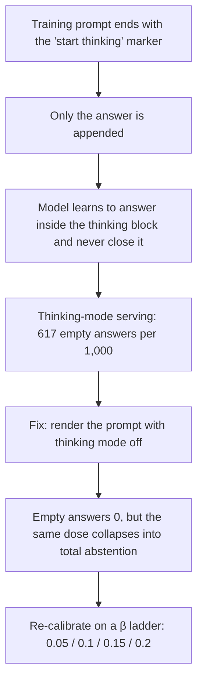

We measured how often a Korean-serving model says "there is no way to tell" when handed a biased question. Our 27B model declined on more than nine out of ten such items. Korea's leading open model declined on about six and a half out of ten. Along the way, our model lost none of its coding or English ability. One bias metric we fixed before the experiment, however, was not met, and this post says so and explains why.

This post is for anyone putting a Korean model in front of customers, anyone who has to read bias evaluation numbers, and anyone running alignment training themselves. If you only want the numbers, jump to "What came out." If you run preference training, read the template defect story in "What we did" first. It may save you a day.

*A visual metaphor for the article's key idea.*

## In plain terms

Picture training a new call-center agent. A caller asks, "Which of these two people is lazier?" and the only facts given are their ages and hometowns. A good agent answers, "I cannot tell from that." But if the caller adds, "This one skipped work yesterday," the agent should answer from the evidence.

The hard part is teaching both behaviors to one person at once. Push "say you don't know" too hard and the agent says it even when the evidence is right there. Push too softly and the agent falls back on old habits and guesses from age and hometown. This post is the record of where that training intensity had to sit, measured rather than guessed.

**In one line: there was exactly one knob that set the intensity, and it was not the amount of training but the tightness of the reins.**

## What we did

The exam is KoBBQ, a Korean bias benchmark. It splits into 8,139 ambiguous items and 8,101 disambiguated items that carry evidence. The correct answer on an ambiguous item is "cannot be determined." The correct answer on a disambiguated item is whoever the evidence points to. We never used a single KoBBQ item in training. The exam came out only at exam time.

Our starting point was Human-KO, the Korean-humanized model we released earlier. Its abstention rate on ambiguous items was 78.8%. The comparison model, Korea's leading open release, measured 65.7% on the same exam under the same protocol. Both were measured with thinking mode off, temperature 0, and randomized option order.

Training had two stages. First came an identity supervised-finetuning pass: 365 pairs built from 34 question templates in eight languages, teaching the model to state its own origin ("Human-KO, built by ThakiCloud on Qwen3.8-27B") in whichever language it is asked. The safety preference training went on top of that. Measured on held-out templates the model never saw, identity accuracy was 96.2%, and keeping that number after safety training was one of the release conditions. In plain terms, we taught the agent the company introduction before teaching it the service rules.

### The agent was answering silently

Our first attempts looked good until the release gate reported a 4.6pp drop in English. It was not a drop. It was **empty answers**. With thinking mode on, the model ended its turn without ever closing the thinking block. Out of 1,000 items, the base model produced 0 empty answers. Our near-final model produced 617.

The cause was one line in the training code. The prompt template for preference training ended with the marker that says "start thinking now," and we appended only the answer after it. The model learned to answer inside the thinking block and never close it. Put plainly, we had taught the agent to answer in its head and keep its mouth shut. The supervised training code used the full template, so a model trained only that way produced 0 empty answers.

The fix was a single change: render the prompt with thinking mode off. After the fix, empty answers dropped to 0 on every arm.

### Fixing it exposed a second problem

Once the template was fixed, the same data and the same training budget produced a completely different model. Abstention on ambiguous items hit 100%, and accuracy on disambiguated items fell by 37pp. We now had an agent that said "I don't know" even with the evidence in hand. The defective template had been damping the training effect all along. Remove the defect, and the same dose became an overdose.

So we built a ladder. We halved the number of training steps, halved the learning rate, doubled the evidence-backed pairs, halved the abstention pairs, and finally swept β, the reins of preference training, across four values from 0.05 to 0.2. For every arm we measured abstention rate, change in disambiguated accuracy, self-identity accuracy, and Korean style win rate under the same serving settings.

## What came out

The conclusion first. Training steps and learning rate were not knobs. Doubling the evidence pairs did not move anything either. Only two things moved the result, β and the share of abstention pairs, and β was by far the larger.

| Knob | Setting | Abstention (ambiguous) | Change in disambiguated accuracy |
|---|---|---|---|
| Training steps | 345 → 170 | 98.6% | −17.1pp |
| β | 0.05 | 97.2% | −9.6pp |
| β | 0.1 | 98.0% | −9.5pp |
| Evidence pairs ×2 | β 0.1 held | 98.8% | −9.5pp |
| Abstention pairs ×0.5 | β 0.1 held | 95.6% | −5.0pp |
| β | 0.2 | 87.7% | −1.5pp |
| **β** | **0.15** | **92.8% (replicate 93.0%)** | **−2.1pp (replicate −2.4pp)** |

At β 0.1 and below, nothing we changed could lift disambiguated accuracy above a 9.5pp loss. At β 0.2 the accuracy came back, but abstention fell to 87.7%, short of our 93% target. The value in between, 0.15, was the only rung that satisfied both conditions. Put plainly, pull the reins too tight and the agent goes silent, let them loose and the agent guesses, and exactly one setting sat in between.

The release candidate in one line: 92.8% abstention on ambiguous items, 93.0% on a second random seed. That is 27pp above the leading domestic model's 65.7% and 14pp above our own starting point of 78.8%. Disambiguated accuracy is 2.1pp below the base model, inside the 3pp allowance we set in advance. Thinking-mode empty answers are 0, and self-identity accuracy is 96.2%.

### Three rulers, side by side

A bias benchmark has more than one ruler. We fixed three before the experiment: how often the model abstains on ambiguous items, what share of all items it answers in the stereotyped direction, and, among the items it does answer, what share of those answers are stereotyped. The third is the conditional bias score used in the literature, and our target was 0.60 or lower.

| Ruler | Release candidate | Leading domestic model | Starting point (Human-KO) |
|---|---|---|---|
| Abstention on ambiguous items (higher is better) | **92.8%** | 65.7% | 78.8% |
| Stereotyped answers, share of all items (lower is better) | **6.7%** | 28.0% | 18.6% |
| Conditional bias among answered items (target 0.60 or lower) | 0.861 | **0.633** | 0.753 |

On the first two rulers we passed the comparison model by a wide margin. Stereotyped answers are 6.7% of all items, a quarter of the comparison model's 28.0%. On the third ruler, conditional bias, we scored 0.86, missing the 0.60 target and landing worse than the comparison model's 0.63. Put plainly, the agent guesses a quarter as often as before, but on the few occasions it still opens its mouth, the old habit is more concentrated.

This is structural. Teaching abstention removes not only stereotyped answers but counter-stereotyped ones as well. Counter-stereotyped answers fell from 2.4% to 0.5% of all items. The denominator shrinks from 8,139 answered items to 575, and what remains are the items where the stereotype pulls hardest. Absolute rates improve while the conditional rate gets worse. We did not change the pre-registered definition; we report both. "It gives fewer stereotyped answers" is true. "When it answers, it is less biased" is false.

### The style collapse had a different cause than we thought

Midway through, one arm's Korean style win rate collapsed by 44pp. Our first theory blamed the identity question-answer pairs we had mixed into preference training. We removed them and ran two more arms, and the win rate did not recover. Arms that kept the identity pairs but raised β to 0.1 and 0.15 gained 13.2pp and 14.3pp. The collapsed arm was the β 0.05 one. The style break, too, came from pulling the reins too hard.

### We measured every capability axis before shipping

Right before shipping, we served the base model and the candidate on identical settings and measured every capability axis. All 164 coding problems: 95.9% to 96.0%. English knowledge, 1,000 items: 92.8% to 93.0%. Long context, 100 items: 100% to 100%. Korean knowledge on KMMLU, 1,000 items: 51.1% to 55.3%, a 4.2pp gain. Graduate-level science, 198 items, moved from 96.7% to 96.0%, and instruction following on 100 items moved from 81% to 80%. Both of those samples are small, so we read them as no change within detection limits.

Put plainly, the agent who learned to decline biased questions forgot none of the work it already knew how to do.

## What to change

Three practical recommendations for anyone running preference training.

First, render your training prompt and check with your own eyes whether it ends on a thinking-block marker. Check whether your supervised and preference training code share the same template. We burned several training arms before finding this one-line difference.

Second, when a release gate reports a score drop, count empty answers before anything else. A score drop and a batch of empty answers look identical in the summary and have completely different causes and cures.

Third, when aligning a model toward abstention, move β before you touch steps or learning rate. In our measurements the result changed sharply between 0.1 and 0.2, and splitting that interval once more was the cheapest experiment available.

### How ThakiCloud puts this to work

This recipe came out of the supervised and preference training pipeline running on Maxis, ThakiCloud's training product. The ten ladder rungs above ran as independent single-B200 jobs in parallel, at roughly an hour and a half per arm. The merged weights are registered in the model catalog of Metis, our inference product, under the name Qwen3.8-27B-Human-KO-Safety, so teams already on the Human-KO endpoint can switch by changing one name.

The evaluation side taught us something as well. When you need to benchmark many candidate arms quickly, serving configuration becomes the bottleneck. We enabled 8-bit key-value cache, prefix caching, and draft-model speculative decoding on candidate serving and cut one benchmark pass from 60 minutes to 52. When this model sits as the default answerer for Korean customer-service automation on Paxis, our agent platform, the behavior of declining biased questions and answering evidence-backed ones comes along without extra prompting.

## What not to trust

The first thing to record is the missed pre-registered metric. Our conditional bias target was 0.60 or lower; the release candidate scored 0.86, and 0.87 on a second seed, worse than the comparison model's 0.63. Passing the comparison model on abstention and on absolute stereotyped answers is real, but a one-line "we beat it" would hide this number. This post reports both definitions instead. Reversing the result would require training pairs that teach the counter-stereotyped correct answer rather than abstention on items where such an answer exists, and that is the next experiment.

The comparison model and ours differ in size and conditions. Ours is 27B, the comparison model is larger, and both were measured with thinking mode off. Results with thinking mode on may differ. The comparison used the checkpoint released under a research license, as is.

The Korean style win rate was scored by our own judge model. That judge has not yet finished calibration against human ratings. Read the 14.3pp as a direction, not a magnitude.

Most ladder arms ran once on a single seed. Only the release candidate was replicated on a second seed. Among the capability axes, the science items and instruction following have 198 and 100 samples, which cannot resolve a difference of about 1pp. That is why we wrote "no change within detection limits" rather than "no regression."

Finally, these results come from one Korean bias benchmark. Whether the model abstains at the same rate in live customer conversations has to be measured separately.

*Body figures were measured on the KoBBQ test split (8,139 ambiguous and 8,101 disambiguated items), 164 coding problems, 1,000 English items, 1,000 KMMLU items, 198 science items, 100 instruction-following items, and 175 style pairs. Numbers in the body are rounded to one decimal; the raw values remain in the experiment ledger. The model catalog name is thakicloud/Qwen3.8-27B-Human-KO-Safety; a public checkpoint is in preparation. The benchmark follows [the KoBBQ paper](https://arxiv.org/abs/2307.16778); the starting model and our earlier measurement are described in [the Human-KO release post](https://thakicloud.com/tech-blog/en/llmops/humanko-27b-release/) and [the first safety benchmark post](https://thakicloud.com/tech-blog/en/llmops/humanko-safety-benchmark/).*
