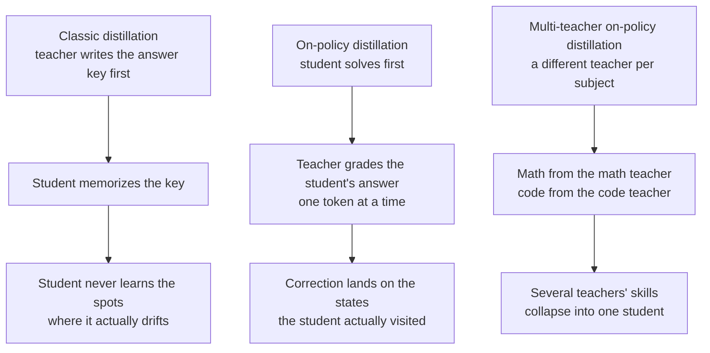
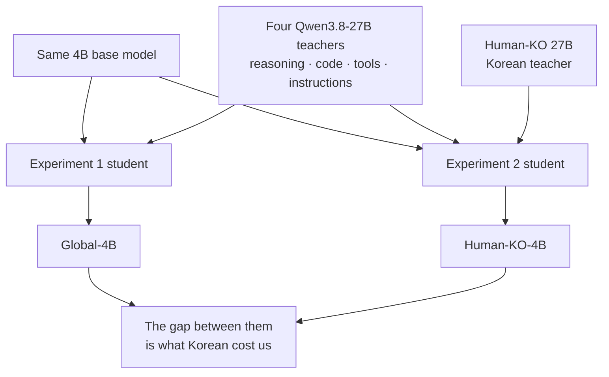

The way a big model's skill moves into a small model has flipped recently. It used to be that the big model wrote an answer key and the small model memorized it. Now the small model solves the problem first, and the big model corrects it at the exact spot where it goes wrong.

Add one teacher per subject on top of that, and you get the training method this post is about. It is worth reading if you build small models yourself, or if serving cost is pushing you down from a large model. Every number below comes from a public paper or model card. Our own experiment has not started yet, and we say so up front.

*A visual metaphor for many teachers feeding skill into one student.*

## In plain terms

Picture a cram school. There is one student, and a separate teacher for each subject. The math teacher, the coding teacher, and the writing teacher each watch only their own subject.

The old method worked like this. A teacher wrote out a book of problems and model answers, and the student memorized the whole book. But if the student went off script on the third line of the exam, there was nothing left to lean on. That situation was never in the answer key.

The new method reverses the order. The student solves first. The teacher sits beside them, follows every character the student writes, and points out a better move at the moment things drift. The whole point is that the student only learns at the places it actually visits.

Go one step further and you arrive at today's topic. When the student works a math problem, the math teacher sits beside it. When it works a coding problem, the coding teacher takes the seat. Skills grown separately per subject are gathered into a single student.

Put simply: do not make the student memorize an answer key. Sit a teacher beside them, and use a different teacher for each subject.

## What we did

### The old way made students memorize answer keys

You hand problems to a big model, collect its good answers as a dataset, and train a small model on it. This was widely used and it did work. One thing is missing, though.

The path a small model actually takes when it generates an answer is not the path a big model wrote down in advance. The big model walks cleanly from the first step to the last. The small model wanders off at step three. And it has never been shown how to find its way back from that detour.

### Letting the student solve first changes things

On-policy distillation reverses the order. The student produces its own answer. The teacher then grades that answer one token at a time. Because the teaching lands only on states the student actually visited, recovery after a detour becomes something the student can learn.

The contrast with reinforcement learning is sharp. RL tells you once, after the whole answer is written, whether it was good. On-policy distillation tells you at every character. The signal is far denser.

### One teacher per subject is the next step

It is hard for a single teacher to be best at math, coding, and writing all at once. Anyone who has trained a model knows the scene. Push math hard and the writing gets strange. Push coding with RL and instruction following wobbles.

Multi-teacher on-policy distillation splits the problem in two stages. First grow specialists per subject. Then, at the end, gather those skills into one student. Producing a capability and integrating a capability become separate jobs.

*The three approaches. Moving down the figure, more of the learning happens at places the student actually visits.*

## What came out

### Wiring teachers together straight loses more than half

A follow-up study released the whole structure openly. It attaches math, coding, and instruction-following teachers to a single three-billion-parameter student. Wiring the three teachers in without adjustment lifted the composite score from 25.7 to 28.1.

The problem starts there. Of the gains each teacher earned when grown separately, the student recovered only about three and a half out of ten. The rest leaked away during integration.

The leak was in the training budget. Run it without adjustment and the long-answer subjects, math and code, take most of the learning signal. Instruction following, whose answers are short, gets the same wall-clock time but learns far less.

The authors fixed three things. They balanced each subject's share of training tokens. They gave more budget to subjects where the student lagged its teacher the most. And they refreshed the grading as the student improved. The composite score reached 31.2, and the recovered share rose to roughly eight out of ten.

| Condition | Composite score | Recovery of teacher gains |
|---|---|---|
| Starting point (mixed SFT) | 25.67 | baseline |
| Three teachers wired in as-is | 28.05 | 35.6% |
| Training budget rebalanced per subject | 31.24 | 83.4% |

*Measured values from the Open-MOPD paper (arXiv 2608.19098). The student is SmolLM3-3B. Recovery is the share of the separately-trained specialists' gains that the integrated student gets back.*

*Composite score on the left, recovery on the right. The score moves a little; the recovery gap is wide.*

Put simply: attaching several teachers is not enough on its own. You also have to decide how much time each one gets.

### Sixteen questions were about as good as the full set

Another study in the same line is about data volume. It argues that what matters may be less the number of training problems and more how many distinct situations the student passes through while generating answers.

The authors report that sixteen semantically distinct questions per subject reached state coverage and performance comparable to using the full dataset. On the coverage measure that was 98.9 percent. One result is not enough to conclude that large datasets are unnecessary, but it does mean a small pilot can come first.

### It is already inside a shipping model

This method does not live only in papers. A recently released 4B model, Spark-X2.5-4B, states on its card that it used exactly this approach. It ran large-scale reinforcement learning across several capability domains to produce domain-specialized teacher policies, then consolidated their complementary strengths into one deployable model.

Two of its reported numbers stand out: tool calling and real repository edits. It scores 65.1 on the tool-calling benchmark and 44.4 on the benchmark that patches real repositories. Those come out of a 4B model, which is the surprising part. The team behind the original paper also says it applied the same method to its own frontier model.

## What to change

### We are building two 4B students to compare

We have already released Human-KO, a family built by aligning Qwen3.8-27B to natural Korean conversational style. Bullet-point overuse fell from 97.5 percent to 2.0 percent. In the safety-aligned build that followed, coding, English, and long-context ability showed no regression. Now we want to carry that 27B skill down into a 4B.

The point is that we build two models, not one. The first targets global capability only, with four teachers: reasoning, coding, tool use, and instruction following. The second has the same structure plus one more teacher for Korean.

*Both start from the same base and differ only in teacher composition. Holding everything else fixed is what lets us put a number on the price of adding Korean.*

Why two? Because without a control there is nothing to say. Adding Korean usually shaves a little off other abilities, and with a single model there is no way to know how much. Measure both on the same rulers and that cost becomes a number.

One thing needs to be stated precisely. The original method mostly addresses integrating several specialists built from the same lineage into one model. We want to add a size jump on top of that, from a 27B teacher down to a 4B student. Cross-scale multi-teacher work is already underway elsewhere. That study has the teachers debate each other and weights the supervision by how much agreement forms afterward.

### How ThakiCloud puts this to work

This experiment touches our products in three places. Growing teachers and training the student runs on Maxis, our training product. Because teachers are grown per subject, the work splits into several parallel jobs. If one fails, only that subject is rerun.

The resulting 4B student goes into the model catalog of Metis, our inference product. If a 4B takes over a slot that a 27B was serving, the same hardware absorbs many more requests. Our released 27B family is already in the catalog down to its quantized builds, so a team can switch by changing a name.

The last is Paxis, our agent platform. Agents do not work in a single reply. They work as a long chain of tool calls. The longer the chain, the more model calls and the more latency piles up, so a small fast model is the product experience. Being able to teach tool calling and instruction following as separate subjects is exactly why this method fits agent work automation.

## What not to trust

The first thing to say is that none of our experiment has run. The two models above are a design, not a result. Whether global capability holds and whether Korean actually improves are unknown until measured.

Every number quoted here is someone else's measurement. The recovery figure comes from one three-billion-parameter student and three subjects. There is no reason the same ratio should hold when going from a 27B teacher down to a 4B. The wider the size gap, the harder integration is likely to get.

The sixteen-question result also needs care. That figure comes from one specific coverage measure, and it shifts with the subject mix and the grading scheme. We treat it as grounds for running a small pilot first, not as a conclusion.

Our ruler for Korean is not finished either. Our Korean style win rate is scored by our own judge model, and that judge has not yet been calibrated against human ratings. Read it as direction only.

Finally, none of this says a 4B replaces a 27B. There is still a gap in absolute capability, and the question this experiment asks is how far it can be narrowed. If the narrowing is worth less than the serving cost saved, keeping the 27B is the better call.

*Sources for the numbers above. The original multi-teacher on-policy distillation paper is [MOPD (arXiv 2606.30406)](https://arxiv.org/abs/2606.30406). The open reproduction and the training-budget fixes are [Open-MOPD (arXiv 2608.19098)](https://arxiv.org/abs/2608.19098) and its [GitHub repository](https://github.com/BytedTsinghua-SIA/Open-MOPD). The question-count study is [arXiv 2609.04172](https://arxiv.org/abs/2609.04172), and the cross-scale multi-teacher work is [MAD-OPD (arXiv 2605.01347)](https://arxiv.org/abs/2605.01347). The conceptual framing of on-policy distillation follows the [Thinking Machines post](https://thinkingmachines.ai/blog/on-policy-distillation/). The 4B model's benchmarks and training description come from the [Spark-X2.5-4B model card](https://huggingface.co/XHToken/Spark-X2.5-4B). Our own 27B is public as [Qwen3.8-27B-Human-KO](https://huggingface.co/ThakiCloud/Qwen3.8-27B-Human-KO) and its [safety-aligned build](https://huggingface.co/ThakiCloud/Qwen3.8-27B-Human-KO-Safety), with earlier measurements in the [Human-KO release post](https://thakicloud.com/tech-blog/en/llmops/humanko-27b-release/). Body text rounds to one decimal place; the exact values stay in the table above.*
