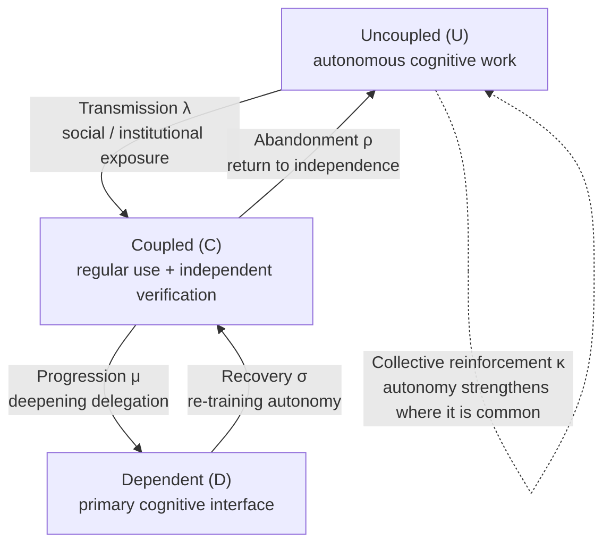

## Why Read This

This is for platform operators deciding the pace and shape of enterprise AI agent adoption, and for data scientists who want to treat "AI dependence" as an equation. The up-front conclusion: this paper models LLM adoption as a three-state epidemic and shows that dependence is a phase transition, not a linear function of usage. Once adoption pressure crosses a threshold, the whole population can shift abruptly into persistent dependence, and the reverse move is more expensive than it looks. For platform operators, "can you reverse it" is a design variable, not a usage statistic, and that is the takeaway of this post.

## What Happened

On September 3, 2026, a paper titled ["Large-Language Models as a Cognitive Virus"](https://arxiv.org/abs/2609.03344) (arXiv 2609.03344) appeared and quickly became a community debate. The author lineup is part of the story: David Krakauer and Michael Levin of Harvard's Wyss Institute, Ricard Solé of the IRB Barcelona, Giulio Ruffini of INFN, Manlio de Domenico of Boston University, and Luis F. Seoane and Santiago F. Elena of the University of Barcelona, nine researchers in all. It is a table where complex systems and epidemic modeling sit down with biology and cognitive science.

The "cognitive virus" title earns its attention because of the analogy itself. The paper treats LLMs as self-propagating informational entities that spread through social transmission and rewrite the host's cognitive practice. Like a virus, they carry infection, progression, and recovery states, and what matters more is that the model carries a tipping point that can flip the population's whole state at once.

## What This Paper Is

The model is a system of ordinary differential equations (ODEs) tracking three cognitive states.

- Uncoupled: individuals maintaining autonomous cognitive work
- Coupled: regular LLM users who still reason and verify independently
- Dependent: users for whom the LLM has become the primary cognitive interface and other routes have gotten hard

The time evolution of the state shares U, C, D is:

```
dU/dt = -λ·U·C + ρ·C + κ·U²·C
dC/dt = λ·U·C - (μ+ρ)·C + σ·D - κ·U²·C
dD/dt = μ·C - σ·D
```

The five parameters each own one process. λ is the transmission rate at which LLM practice spreads through social and institutional exposure. μ is the rate at which coupled users progress into dependence. ρ is the rate at which coupled users return to the uncoupled state, and σ is the rate at which dependent users return to coupled. κ is the collective-reinforcement term, the structural signature of this paper.



The κ term is the structural difference from a standard SIR epidemic model. In SIR, the susceptible state is eroded passively by transmission. Here the uncoupled state strengthens itself through the κ·U²·C term: when autonomous individuals are common, staying (and returning) autonomous is cheaper, and when they are rare it is more expensive. It is an Allee-like positive feedback, the device that produces the asymmetry below.

## How the Model Behaves

The headline result is the transcritical bifurcation. As adoption pressure (λ relative to ρ and σ) rises gradually, the population state changes discontinuously past a critical threshold. Below it, dependence stays a low share even as adoption grows. Above it, a small additional increase in adoption triggers a population-scale rapid shift, what the paper calls runaway dynamics. "A small increase in LLM adoption can produce abrupt losses in cognitive competence" is not rhetoric borrowed from elsewhere; it is a dynamical property the equation system has on its own.

The second result is hysteresis and lock-in. Once the population is in a dependence-dominated state, lowering adoption pressure does not immediately bring it back. The dependence state carries a memory effect that makes exit expensive, and the paper names this structure technological lock-in. The exit condition is not using less; it is raising σ, the investment in re-training autonomy.

The third is "cognitive immunization." The paper explores conditions that prevent the shift into dependence, in two directions. Lower the transmission rate λ (reduce the exposure density that makes dependence the default), and keep dependence reversible (hold ρ and σ high). The two strategies act on different targets: the former is a policy on the environment, the latter a policy on individual practice.

## Why the Framing Is Persuasive

The paper's strength is moving "dependence" from a qualitative debate into a quantitative structure with thresholds and memory. The AI-dependence discussion until now was an average-value fight between the camp that says AI extends cognition and the camp that says it atrophies it. The epidemic model asks about the distribution. Whether a population sits below or above the threshold is a question that changes the character of policy and design, and it is a question you can handle with parameters.

The κ term is also a defensible choice. The social practice of "verifying on your own" gets cheaper as it becomes common around you and more expensive as it fades; observed reality looks close to that. Casting it as a positive-feedback term builds the asymmetry where dependence is easy to fall into and hard to leave, matching the directional experience people describe in learning and work settings: once you start delegating, going back is the hard part.

## Implications for ThakiCloud Products

The model reads directly for an enterprise that operates AI agent platforms. An enterprise's adoption process is the same structure at a smaller scale. A tool enters, it spreads inside the team (λ), the habit of verifying on your own weakens (μ), and eventually the process depends on the agent's output (state D). Once that state is built, a "use it less" policy alone does not bring the practice back. What brings it back is σ, the investment in the ability to get out.

ThakiCloud's Paxis is an agent platform where human-in-the-loop approval, policy gates, and audit logs are first-class resources. This paper backs that composition in modeling language. A human approval step is, in the model's variables, a device that makes the transition from coupled to dependent (μ) conditional. An audit log is what makes recovery (σ) possible, because it preserves evidence of how far humans verified in past processes. Paxis's governance features can be read as "cognitive immunization" infrastructure, and enterprise AI adoption policy can be handled as three knobs, λ, μ, σ, instead of a single "how much to use" axis.

The lock-in point extends to infrastructure. When the model or tool an enterprise depends on has a hysteresis structure, the switching cost is not just migration effort but the atrophied verification practice. Portability of open formats (Apache 2.0, GGUF, standard APIs) is what keeps the route back to independence (ρ) cheap. The emphasis ThakiCloud puts on open standards and on-prem support is, from this angle, reversibility design.

## Limits and Counterarguments

The most important premise is the absence of calibration. Every parameter in this model is a structural assumption, not a value fitted to real data. The existence of a tipping point is a property of the model class; its location, the speed of the shift, and the size of the hysteresis depend on parameter values that have not been measured yet. "AI dependence has a tipping point" should be read as the structural hypothesis "epidemic-type models have this shape," not as a measurement result.

Second is the mean-field ODE's unit. The model tracks population shares, not individual heterogeneity. "A particular team drifting into dependence" and "a society drifting into dependence" are different processes, and the skill differences and verification-culture differences inside the population are outside the model. Placing the κ term as a uniform reinforcement of autonomy across the population is also a structure that, in reality, may reinforce only the local network around a person.

Third is the frame itself. Calling LLMs a "virus" carries the premise that the entity harms its host. If use produces cognitive extension rather than offloading, the U-C-D states are not an ordered line from good to bad, and the paper's immunization strategies can translate into "reduce the benefit of use." The center of the community debate was exactly this point. The model is a tool for asking questions, and whether LLMs are pathogens or prosthetics is the share of the calibration that has not been done yet.

## Wrap-up

One line for each kind of reader. For platform operators: dependence is a phase transition, not a linear function, and the variable that separates the regimes is reversibility (σ). Building reversibility design into adoption policy is the direct conclusion of this paper. For modelers: the three-state ODE with a collective-reinforcement term is a skeleton you can extend, and calibrating its parameters against real usage and verification data is the open problem, with enterprise process data as the material.

This post is based on the arXiv 2609.03344 paper and the community discussion around it; the equations and parameter interpretations follow the paper's model description.
