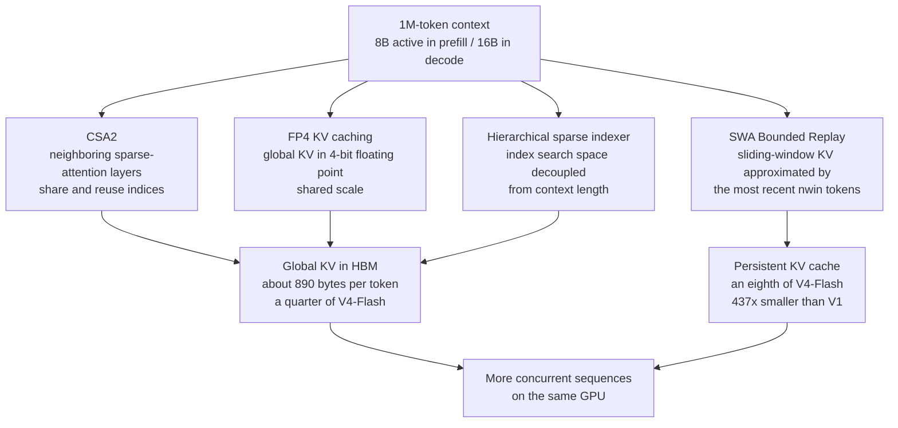

Run the same model twice and one side queues for a slot every turn while the other fills sequences with room to spare. When serving costs diverge with identical intelligence, the cause is usually the KV cache. As context gets longer, the KV hits the ceiling first, and that ceiling becomes throughput and unit price.

DeepSeek's V4.1-Flash, released on September 10, takes that ceiling head-on. A 552B-parameter MoE backbone carries a 1M-token context while the global KV cache shrinks to roughly a quarter of the previous V4-Flash. Coding benchmarks move clearly upward, and the weights ship under the MIT license. This post takes apart the four KV compression mechanisms, compares the coding numbers, and shows where this model forces serving teams to rewrite their cost math.

## Why read this

For engineers serving 1M-token-class long-context models, or recalculating token costs for agent workloads.

The core takeaway is one: the headline of V4.1-Flash is KV cache compression. Compressed KV is the same GPU's concurrency ceiling and token unit price. From a serving standpoint, this is not a smarter model but a cheaper one to run.

## What it ships

V4.1-Flash is a more efficient iteration of DeepSeek's V4 line. The architecture is a Mixture-of-Experts in a Causal Encoder-Decoder (CED) form, with a 552B backbone. Active parameters per token are 8B in prefill and 16B in decode. It supports a 1M-token context and accepts up to 384K output tokens. Native vision understanding is included.

The release also changes the deployment policy. The existing V4-Flash and V4-Flash-Vision-Exp are retired, and DeepSeek announced it will route V4-Pro requests to V4.1-Flash starting September 14. Until V4.1-Pro ships, flagship traffic lands on this model. Per external reporting, the reason is that V4.1-Flash outperforms V4-Pro.

Weights are released under the MIT license, with almost no restriction for serving or fine-tuning.

## The four KV mechanisms

The compression design is a combination of four mechanisms. None of them alone reaches a quarter.

The first is cross-layer KV reuse in CSA2 (Compressed Sparse Attention 2). Sparse-attention layers share and reuse indices. Neighboring layers tend to look at the same token sets, so keeping one set of indices and reusing it beats keeping a separate copy per layer. Where indices make up a large share of KV storage, sharing them cuts both storage and lookup cost.

The second is FP4 KV caching. The global KV cache is stored in 4-bit floating point (E2M1-style, shared scale). When KV is the bottleneck, dropping the bits per stored value is the most direct lever.

The third is SWA Bounded Replay. It approximates the sliding-window-attention KV state by replaying only the most recent nwin tokens. KV outside the window is not fully preserved; it is reconstructed from nearby tokens when needed again. It is a placement that weights storage over reconstruction cost.

The fourth is a hierarchical sparse indexer. As context grows, the attention-index search space expands and that search cost starts to shake compute cost. A hierarchy of indexers bounds the search space so it does not scale with context length. This is the device that keeps 1M-token serving from being dragged down by context growth.

The combined result is the global KV footprint in HBM: about 890 bytes per token, roughly a quarter of V4-Flash. The persistent KV cache in SSD or host memory is about an eighth of V4-Flash, and 437x smaller than DeepSeek V1.

The path from KV compression to serving cost: four mechanisms shrink the footprint, and a smaller footprint lets more sequences sit on the same HBM. The last box in the diagram is the practical content this release hands to serving teams.

## What the numbers show

Coding benchmarks are clearly up versus the predecessor. Against V4-Flash 0731, DeepSWE v1.1 (software engineering) moves from 54.4 to 74.2, a gain of 19.8 points. Terminal-Bench 2.1 moves from 82.7 to 90.6, a gain of 7.9 points. CyberGym goes from 76.7 to 88.1 (11.4 points), and AutomationBench from 25.1 to 54.8 (29.7 points). Codeforces rating is 3471, NL2Repo-Bench 65.4, and Vibe Code Bench 84.74, second among open-weight models.

One number deserves a careful look. Vals AI reports 74.53 on Terminal-Bench 2.1, more than 16 points below DeepSeek's stated 90.6. It may be a different evaluation run, or a subtle difference in benchmark version or setup. The same benchmark name can yield different numbers under different publishers, so any citation of this model's Terminal-Bench figure must state which run it is.

The pattern across benchmarks is concentrated in coding and terminal work. DeepSWE, Terminal-Bench, CyberGym, AutomationBench, Vibe Code Bench, and NL2Repo-Bench are all such benchmarks. The numbers say plainly what workload this release targets: agentic coding.

## Where it lands for ThakiCloud

On the Metis side, the question is clear: if the KV footprint drops to a quarter, how many more concurrent sequences fit on the same B200 or H200? In ThakiCloud's serving-tuning experiments, KV capacity was the resource that decided saturated throughput. Raising `max_num_seqs` does not help when KV builds the ceiling, and that ceiling is attributed to KV. A model that quarters the KV can push that ceiling up by roughly the same factor under the same engine settings.

This is a unit-cost story. When you serve a 1M-token context at about 890 bytes of KV per token, the number of long sequences one GPU can carry at once is a computed value, and that number maps directly to cost per token. DeepSeek's decision to route V4-Pro traffic to V4.1-Flash is, per external reporting, because the model is stronger. Internally, the same decision almost certainly includes the arithmetic that the same capacity carries more requests.

On the Paxis side, there is a landing point too. Paxis agent workloads are long-context by nature: every tool round adds observations, and context grows with turns. Being able to serve a 1M context at a quarter of the KV means agents can take more turns without serving cost jumping linearly. Agent economics is decided less by the per-token price than by how the KV grows as context lengthens. V4.1-Flash presses that growth curve down.

The two lenses meet at the same point. KV compression is the axis that changes serving concurrency and token unit price, and at the same time the axis that changes long-context cost for agent workloads. Both axes landing in one model is why this release reaches both serving teams and agent teams.

## What not to take at face value

First, the source of the numbers. At the time of writing, V4.1-Flash's tech report lives on the Hugging Face model card and DeepSeek's official news page, and no separate arXiv page has been confirmed. All benchmark and KV figures above are report values, cited without independent reproduction, and can shift with evaluation setup.

Second, the quality impact of FP4 KV. Storing KV in 4 bits necessarily introduces loss. Until the report shows that loss stays below threshold, serving teams must measure it themselves. 890 bytes per token is the cost gain, and the quality paid for it is not in the report.

Third, the Terminal-Bench 2.1 discrepancy. 90.6 and 74.53 are two runs of the same benchmark. Which one to trust depends on which run is closer to your own workload, and that is a call for serving teams.

Fourth, the meaning of V4-Pro routing. Pushing flagship traffic to V4.1-Flash is a signal that DeepSeek internally views it as capable of carrying V4-Pro-class load. But the basis of that capacity judgment, the internal concurrency and latency numbers, is not public. From the outside, only the fact is visible, not the arithmetic behind it.

## In short

The model is smarter, yes. But the real headline of this release is the KV cache. Serving a 1M-token context at a quarter of the KV means more concurrent sequences on the same GPU, and agents taking more turns without serving cost jumping linearly.

What serving teams should do is one thing: re-measure the KV footprint of the model you serve today, compare it against 890 bytes per token, and recompute the concurrency ceiling and token unit price. If KV compression was the bottleneck of your serving, this release loosens it from the model side. For teams who have been raising the KV ceiling only with engine settings, switching models may now be cheaper.

---

- Model card: [DeepSeek-V4.1-Flash](https://huggingface.co/deepseek-ai/DeepSeek-V4.1-Flash) (Hugging Face)
- DeepSeek official: [V4.1-Flash news](https://www.deepseek.com/news/deepseek-v4-1-flash/) · [API docs release note](https://api-docs.deepseek.com/news/news260910/)
- V4 series tech report: [DeepSeek-V4: Towards Highly Efficient Million-Token Context Intelligence](https://arxiv.org/abs/2606.19348) (arXiv:2606.19348)

*All benchmark and KV footprint figures in this post are report values from the DeepSeek tech report, not measurements reproduced by ThakiCloud.*
