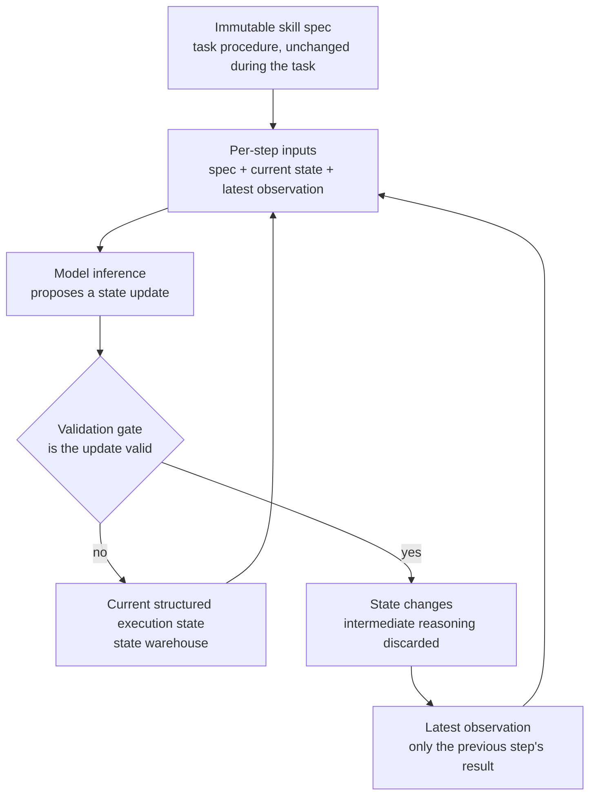

The longer an agent works, the slower it gets. Running the same job, each early action accumulates as history, the prompt grows, and the grown prompt makes the next inference slower and more expensive. As a task gets longer, intelligence stays the same and only cost climbs, and the cause is usually not the model, it is the structure that handles history.

SKILL.state, from Google LLC, restructures that structure. It drops the append-only conversation history and replaces it with an explicit, mutable execution state. Each step, the model receives only three inputs: the immutable skill spec, the current structured state, and the latest observation. Because history is not accumulated, prompt size is independent of turn count, and intermediate reasoning is discarded after a validated state update. This post takes apart the mechanism, compares the benchmarks, and shows where the design lands for ThakiCloud's agent platform.

## Why read this

For engineers building long-horizon agent runtimes, or recalculating the token cost of the agents they run.

The core takeaway is one: to separate an agent's prompt from turn count, you must go beyond compressing history and replace it with state, a different structure. SKILL.state shows, on a controlled testbed and public benchmarks, that this replacement pays off in both token consumption and accuracy.

## If history is the disease

Most agent runtimes record actions as history. Observations, actions, and reasoning accumulate in order, and the whole history is fed into the prompt at the next step. This structure has two costs that grow together.

The first is latency. As history grows, each step's input grows, and even the same model takes longer to process. The later half of a long task is slower than the first half, and that is the fate of this structure.

The second is context poisoning. History mixes correct reasoning with incorrect reasoning. If a wrong premise is set early, it stays in history and is re-read at every later step. The model has no chance to correct it on its own, and the premise comes back into the prompt every time. Combine the two, and an aging agent is slow, expensive, and repeats the same mistakes.

The existing responses fall into two camps. One is the history-based approach, which leaves history as is. The other is the compression-based approach, which summarizes or compresses it. Both take the existence of history as a premise. If summarization is weak, poisoned premises survive in the summary, and if compression ratio is low, latency stays as is.

## Three inputs, one state

The core of SKILL.state is limiting what the model sees each step to three things.

The first is the immutable skill spec. The procedural knowledge needed to perform the task, unchanged during the task. The model reads this spec at every step, but because the spec is immutable, the cost of reading it does not grow with turns like history does.

The second is the current structured execution state. An explicit state store representing task progress, a state warehouse. This state changes, and how it changes is the core of the paper. The model proposes a state update, the update is validated, and only the validated state is passed to the next step. An unvalidated update is not applied.

The third is the latest observation. The result the environment or a tool returned at the previous step. Past observations have already been reflected in state or discarded, so they do not re-enter the prompt.

The prompt built from these three is independent of turn count. Whether it is step 1 or step 100, the model sees the spec, the current state, and the latest observation. What matters in this structure is that state updates are validated. The model's proposal is not applied as is, and only the state that passes the validation gate advances to the next step. This validation is the device that prevents context poisoning.

The core of the diagram is that only the state passing the validation gate advances. Updates that fail are not reflected in state, and the model's intermediate reasoning is discarded after the state update. Together, what represents task progress changes from history to state.

## What the numbers show

The paper checks on three test fields. SkillExecBench is a controlled diagnostic testbed that includes a Warehouse Management environment. Running a 100-step task, it compares prompt size and token consumption between history-based approaches and SKILL.state.

The public benchmarks are InterCode CTF and Sierra tau-Bench. Both are long-horizon agent tasks where tools loop and observations accumulate.

Per the paper's report, SKILL.state beats both the history-based and the compression-based approaches. Because prompt size is independent of turn count, the cumulative token consumption of a 100-step task drops sharply, and accuracy rises. The token savings are tallied at about 16x in secondary coverage. This number is a secondary source's digest, not the paper's own report, so a citation must state that.

The pattern matters. Token savings and accuracy gains come in the same direction. Compressing history usually means gaining one while losing the other: a higher compression ratio may drop poisoned premises, but it may also drop correct ones. SKILL.state keeps both sides. Validated state holds only correct premises, and the validation gate blocks wrong ones. That is why tokens drop while accuracy rises.

## Where it lands for ThakiCloud

On the Paxis side, the question the paper raises is where to put the execution state. Paxis is the control plane that treats an agent's skills, tools, policies, and audit logs as first-class resources. The execution state SKILL.state proposes is exactly one of those first-class resources.

A similar structure already exists inside Paxis. When an agent performs a task, a state representing its progress exists, and changes to that state must pass the policy gate to be applied. SKILL.state generalizes this structure in the form of a paper, and shows that the generalization holds on token consumption and accuracy.

Two points touch Paxis's operating philosophy. One is the validation gate. Not applying the model's proposed state update as is, and passing only the validated one to the next step, is in the same register as Paxis passing actions through the policy gate and independent validation. The principle of not trusting the model's self-report applies to state changes as well.

The other is the audit log. Paxis's audit log does not record only accepted actions, it records why a state change was blocked. Updates that fail the validation gate in SKILL.state are not reflected in state, but the fact of rejection remains in the audit log. It is a structure where failed state changes become the basis of the next judgment.

On the Metis side, one thread is offered. When Paxis's agents are served by Metis, each step's prompt size is the KV cache occupancy. If SKILL.state separates the prompt from turn count, agents can run long without KV occupancy growing linearly. It reduces the serving cost of long-horizon agent workloads in the runtime structure, not in the model.

Compared with the WikiSkill post, these two papers deal with different layers of the same problem. WikiSkill deals with the persistent wiki that accumulates as experience across episodes, and SKILL.state deals with the execution state that represents task progress within an episode. The former makes the agent not forget, and the latter makes the agent not grow. Together, the memory problem of long-horizon agents can be split into across-episode and within-episode.

## What not to take at face value

First, the cost of the validation gate. Validating every state update takes cost. If validation means another model inference, part of the token savings is consumed by validation. The paper does not detail the validation structure, so it is unclear what share of the total savings validation takes.

Second, the loss of intermediate reasoning. Intermediate reasoning after a state update is discarded. This discard is the device that prevents context poisoning, but it also removes the target of debugging and audit. When a task fails, tracing why requires not only the state change log but also what the model reasoned at each step. Because SKILL.state discards that reasoning, failure investigation is left to the state change log alone.

Third, the source of the token-savings number. The roughly 16x figure is a digest of secondary coverage. Whether it matches the paper's own report requires checking the paper itself. This post states that it is a secondary number.

Fourth, the scope of the test fields. SkillExecBench is a controlled testbed that includes a warehouse management environment. The public benchmarks are long-horizon agent tasks, but they are far from real production workloads such as coding or operations automation. Whether token savings and accuracy gains hold at the same magnitude on such workloads cannot be answered from this paper.

## In short

What grows as an agent works longer is the size of history, not the intelligence of the model. SKILL.state removes this gap at the structure. It does not accumulate history, and represents task progress in a different structure called state. Each step, the model sees only three things: the immutable spec, the current state, and the latest observation, and only the state passing the validation gate advances to the next step.

The question this paper hands to Paxis is one: is the agent's execution state accumulated as history, or mutated as a validated state? Distinguishing the two is the branch point for recalculating the token cost of long-horizon agents.

---

- Paper: [SKILL.state: Scalable Long-Horizon Agent Skills](https://arxiv.org/abs/2608.26263) (arXiv:2608.26263, Google LLC, 2026-08)
- Secondary: [Daily.dev](https://daily.dev/posts/google-paper-structured-state-instead-of-full-history-cuts-agent-token-use-16x-fm42aw1fg) · [DAIR.AI Academy](https://academy.dair.ai/papers/explicit-execution-state-replaces-append-only-history-2608.26263)

*The token savings figure (about 16x) in this post is a digest of secondary coverage, and matching it against the paper's own report requires checking the paper itself. All other numbers are report values from the paper, not measurements by ThakiCloud.*
