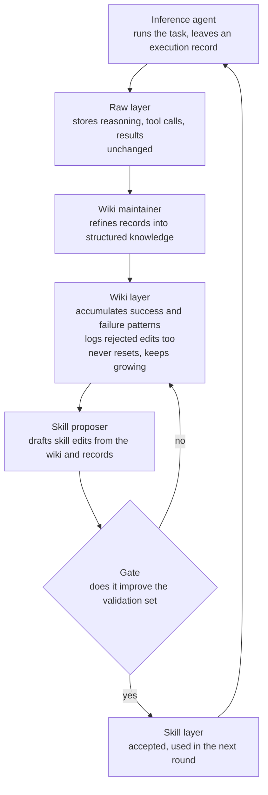

An agent finishes a problem and then forgets the whole process. What it did well vanishes by the next session, and yesterday's mistakes get repeated today. The model is the same, yet the more work it does the slower and costlier it becomes while accuracy stalls. The cause is rarely the model. It is how the experience is handled.

Google Research's WikiSkill answers this with a single structure. Instead of throwing away execution history, it accumulates it in a persistent wiki that never resets, and uses that wiki to evolve the agent's skills on its own. This post walks through that structure, the results across five benchmarks, and where it lands for ThakiCloud's agent platform.

*A visual metaphor for the core idea. The execution history accumulates in a wiki that never resets, and the skill evolves on top of it.*

## Why read this

This is for teams that build agent skills and want those skills to improve themselves in operation.

The core conclusion is one thing. Accumulating execution history in a persistent wiki and evolving skills on top of it produces three properties at once. It clearly beats a no-skill agent, the gain grows as the model gets larger, and the evolved skills transfer beyond the model that made them. These come from turning memory into a resource, not from shrinking the context.

## If forgetting is the disease

Most agents pour out what they learned the moment a task ends. The optimization history holds a mix of many successes and failures, but when the next task begins that history is gone and only the skill remains. So the same mistakes get relearned from scratch every time, and a pattern that worked does not carry over.

That is exactly where WikiSkill points. When you discard the history, what the experience taught never accumulates in the system. The paper proposes a three-layer structure that solves this: it keeps the execution record permanently while it updates the skill.

## Three layers, four roles

The structure splits into three layers.

The first is the raw layer. It stores the complete record of each run, the reasoning, tool calls, results, and final answer, unchanged. Like a diary, it is never rewritten. It simply accumulates.

The second layer is the heart of the paper. The wiki layer takes the scattered records in the raw layer and refines them into structured knowledge. It documents which failure patterns recur and which strategies worked, and it writes down the rejected edits as well as the accepted ones. Recording what did not work is what keeps the agent from repeating the same mistake. The wiki never resets. It stays through task and model changes and grows over time.

The third is the skill layer. These are the reusable skill files the agent actually reads. They are updated on the basis of the wiki and the raw records, and they roll back if they do not improve the validation set.

Four roles drive these three layers. An inference agent performs the task, a wiki maintainer organizes the records into the wiki, a skill proposer drafts skill edits from the wiki and the records, and a gate keeps only the edits that actually improve performance. What it cannot keep, it logs as a rejected edit in the wiki and hands to the next round.

One thing stands out. The rejected edit does not go to the skill layer. It goes back to the wiki. The failure is not discarded; it becomes the basis for the proposer's next judgment. That loop is what "the skill evolves by itself" actually means.

## What came out

The paper checks it on five benchmarks. Mathematical reasoning (LiveMath), web search (SealQA), spreadsheet manipulation (Spreadsheet), long-context document QA (OfficeQA), and interactive embodied tasks (ALFWorld).

With the primary model Gemini-3.5-Flash, the average accuracy across the five is 49.5 for a no-skill agent, 56.1 for the strongest competing skill-evolution method, and 68.1 for WikiSkill. That is 12 points above the best competitor and 18.6 points above no skill at all.

By benchmark the gaps are sharp. Mathematical reasoning goes from 33.0 to 72.6. Spreadsheet manipulation goes from 50.5 to 76.6.

The gain by model size is interesting too. In the Qwen family, the average improvement from skill evolution is 12.3 points at 4B, 17.5 at 9B, and 23.9 at 27B. The larger the model, the more an evolved skill pays off. The sharper result is a small model beating a big one. Qwen 9B with WikiSkill scores 47.4, while Qwen 27B without skill scores 39.4. The skill moved performance ahead of model size.

The paper also includes an ablation to confirm that the wiki accumulation itself is the deciding factor. Remove the persistent accumulation and the gain drops sharply. So "turning memory into a resource" is not a condition for the result. It is the mechanism.

Every number above is paper-reported, not a ThakiCloud reproduction.

## Where it lands for ThakiCloud

This paper overlaps directly with the structure ThakiCloud's agent platform Paxis aims for.

Paxis is an agent control plane that treats skills, tools, policies, and audit logs as first-class resources. Paxis already has a similar three layers in place. A raw layer that stores execution records as-is, a knowledge wiki that organizes and accumulates those records, and a skill that updates itself on top of that wiki. WikiSkill generalizes the arrangement of those three layers in the form of a paper, and shows that the generalization holds across five benchmarks.

Two of the details fit Paxis's operating philosophy exactly. One is logging the rejected edits as well. Paxis's audit record does not keep only the actions it accepted. It also keeps which attempt was blocked and why. The paper backs, with a performance result, the structure where a failure becomes the basis for the next judgment. The other is the gate deciding on the skill edit. Accepting an edit only when it improves performance on the validation set, rather than trusting the model's self-report, is in the same family as Paxis passing actions through a policy gate and independent verification.

Metis gets a signal as well. The fact that skill evolution complements model scaling hangs directly off cost routing that looks at both model tier and skill quality. If, at the same cost, a small model with well-evolved skills beats a large model without skill, that is an important sign for token economics.

## What not to trust

First, the code. At the time of writing we could not find any public implementation. So every number above is paper-reported. Because it is not confirmed by a reproduction, it can shift with benchmark setup and evaluation code.

Second, the scope of the benchmarks. All five tasks sit close to a single domain. Math, web search, spreadsheet, document QA, embodied task. There is no long-chain work like code writing or operations automation here. This paper does not answer whether skill evolution gives the same gain on those chains.

Third, the size of the wiki. The wiki never resets and keeps growing. As it grows over time, the cost of retrieval and injection grows with it. The paper shows the benefit of accumulation, but the upper bound of accumulation and the compression strategy are not yet answered clearly.

Fourth, the quality of the gate. The gate decides on skill edits using a validation set. If the validation set does not touch the task well, the wiki can accumulate bad edits too. So the gate's design matters more than "measuring actual performance." It has to stretch to "does the evolved skill actually help on the next task."

Fifth, the distribution of the gain. The effect of skill evolution grows with the model. That also means the absolute gain on a small model is comparatively smaller. The 12.3 points at 4B is about half of the 23.9 at 27B. Running skill evolution at scale on small models does not necessarily buy the same performance for the same cost.

## Bottom line

What transfers is the structure, not the numbers. When an agent breaks down over a long run, the failure is not in the model's intelligence. It is in the container that handles the experience. Keep the execution record, put a wiki on top of it that never resets, and the skill gets better in the next round. Write down what did not work too, and let the gate keep only real performance, and the experience becomes a resource.

The one question this paper gives Paxis is whether the record an agent leaves behind is actually wired into the resource that builds the next skill. Storing the raw record, refining it into a wiki, and evolving the skill from that wiki. Having the system hold those three steps explicitly is the dividing line for the maturity of an agent platform that runs long jobs unattended.

---

- Paper: [WikiSkill: Compiling Agent Experience into a Persistent Wiki for Skill Evolution](https://arxiv.org/abs/2608.27454) (arXiv:2608.27454, Google Research, 2026-08-27)
- Secondary reading: [The Decoder](https://the-decoder.com/google-gives-ai-agents-their-own-wiki-so-they-can-learn-from-mistakes-and-successes/) · [DAIR.AI](https://academy.dair.ai/papers/wikiskill-compiles-agent-experience-into-a-persistent-wiki-2608.27454)

*Percentages in the body are rounded to one decimal place; exact values are kept in the captions. All figures are paper-reported and are not ThakiCloud measurements.*
