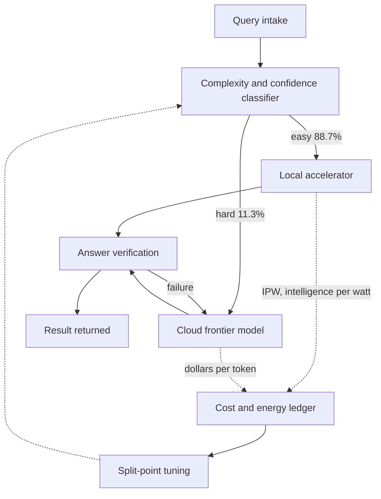

If you operate or plan GPU inference infrastructure, there is one number in this paper worth your time: routing 60-80% of queries to local models and sending only the rest to the cloud cuts both energy and cost by 60-80%.

*The IPW concept, abstracted: how much useful reasoning each watt produces.*

> 📄 **Full deep review (DOCX)**: [Download the detailed peer review on Google Drive](#).

## Why this post is worth your time

This post is for engineers who run K8s-based inference platforms or design on-prem AI infrastructure, where serving cost and power efficiency are the decision criteria. The reason to read it: the question "which queries go where" has stopped being a matter of preference and become a matter of measured numbers.

The paper's answer, in one line: local inference efficiency (IPW, intelligence per watt) improved 5.3x between 2023 and 2025; today's local systems answer 88.7% of single-turn chat and reasoning queries correctly; the hardest tail remains frontier-cloud territory; and a hybrid architecture that splits on complexity saves 60-80% of energy, compute, and cost versus cloud-only.

## Background

[Intelligence per Watt](https://arxiv.org/abs/2511.07885) (arXiv 2511.07885) is a study from Stanford, led by Jon Saad-Falcon and Avanika Narayan, done with Together AI. First released in November 2025 and updated through several revisions, it drew fresh attention on X in mid-September 2026.

The motivation is simple. Resource constraints, energy cost, and privacy have all pushed AI workloads toward local hardware (laptops, workstations). But nobody had a single number answering "if I move my workload local, what do I actually save?" Vendor figures (tokens per second, FLOPS, wattage) measure different axes, so no comparison was possible.

## What the paper measures: IPW

The paper's core is a metric called IPW (Intelligence Per Watt). The definition is one line:

> IPW = task accuracy delivered by the model ÷ power consumed by the accelerator running it

Where existing metrics each watch a different axis (accuracy, speed, price, raw compute), IPW folds model capability and hardware efficiency into one number. Run the same model on an iPhone 16 Pro, a workstation GPU, and a cloud accelerator, and you can line up their IPW side by side. At equal accuracy, the system that draws fewer watts wins.

Through this metric, the paper answers three questions:

1. What fraction of real queries can today's local hardware handle correctly?
2. How large is the efficiency gap between local and cloud, and where does it flip?
3. How much does a hybrid local-cloud router actually save?

## Evaluation design: 20+ local LLMs, 8 hardware platforms, ~1M real queries

The study is persuasive because it evaluates real usage patterns, not benchmark standards.

- **Models**: 20+ LLMs that run locally, in different sizes and precisions (FP16, FP8, FP4), across generations
- **Hardware**: 8 platforms, spanning the local accelerator spectrum from smartphones (especially the iPhone 16 Pro) to workstation GPUs
- **Queries**: roughly 1M real single-turn chat and reasoning questions. Real traffic distribution, not synthetic prompts
- **Measurement**: per-query accuracy and power consumption, combined into IPW

The "1M queries" scale matters because it captures the mean and the tail of the distribution at once, not a handful of cherry-picked workloads.

## Key results

### 88.7% of single-turn queries are answered correctly by local models

Today's local LLM configurations answer **88.7%** of single-turn chat and reasoning queries correctly. In 2023 that share was **23.2%**, and by 2025 it had reached **71.3%**. Over those two years, IPW itself improved **5.3x**, with model improvements contributing **3.1x** and hardware **1.7x**.

In other words, the local progress was driven more by "smarter models" than by "bigger silicon." Swapping to a newer small model on the same chip moves efficiency a lot.

### A smartphone beats a workstation GPU by 7x

At the same model and same precision, the **iPhone 16 Pro measured roughly 7x higher IPW than workstation GPUs**. Datacenter GPUs obviously lead in absolute throughput, but on the efficiency axis ("intelligence produced per watt") consumer silicon wins by a wide margin. It is the difference between a mobile SoC designed around power budgets and a datacenter GPU designed around its full-plate power rating.

### FP4 quantization: 3-3.5x less energy, about 2.5 accuracy points per step

Moving precision from FP16 to FP4 cuts inference energy by **3-3.5x**, at a cost of roughly **2.5 accuracy points per precision step**. Notably, a larger model quantized to FP4 sometimes beats a smaller model in FP16 on IPW. There are regions where "thin out a bigger model" is more efficient than "run a smaller model as-is."

### Hybrid routing: 60-80% savings

Classifying queries by complexity, sending the easy 88.7% to local and the hard tail to the cloud, saves **60-80% of energy, compute, and cost** versus cloud-only. The structure of the savings is clear: 88.7% of all queries are resolved on watts the local hardware already draws, so the cloud bill shrinks to the remaining 11.3%.

### The hardest 95% is still out of local's reach

The limit is quantified too. In the hardest slice of reasoning queries, roughly **95%** remained unsolved by local models. Multi-step reasoning, complex architecture comprehension, and long-context debugging still favor frontier cloud. That number is the split point for hybrid routing: local takes 88.7%, the cloud takes the tail.

## The hybrid routing architecture

The savings come not from "local is better" but from "the split point can now be set with numbers." The structure:

The key is that both axes feed one ledger. Local costs are watts; cloud costs are tokens. IPW acts as the common exchange rate. When the split point is tuned from this ledger rather than from gut feel, the 60-80% savings band holds.

## What this means for ThakiCloud

The paper touches three ThakiCloud products directly.

**Metis (Token Factory)**. Today's serving routing assigns queries by latency and dollars-per-token. IPW adds a "watts" axis as its justification. For customers who combine on-prem dedicated endpoints with cloud serverless, a query-distribution-based hybrid assignment has exactly the same structure as the paper's 60-80% savings. Adding an IPW axis to routing benchmarks is the next step.

**Aegis (on-prem)**. The most common question in on-prem proposals is "all our data stays internal, but can internal inference carry everything?" This paper gives it a quantitative answer. 88.7% of single-turn workloads run internally, and only the tail goes out by exception. "All on-prem" is no longer the design line; "88.7% on-prem plus hybrid egress" is. The 95%-unsolved limit on the hardest queries should be presented together, and that honesty is what makes the number credible.

**Maxis (quantization and distillation)**. The measured tradeoff of FP4, 3-3.5x energy at roughly 2.5 accuracy points per step, is a cross-check baseline for the NVFP4 quantization pipeline's expected accuracy loss. And the finding that "thin out a bigger model" can beat "run a smaller model as-is" points to co-optimizing model choice and quantization depth, not tuning them separately.

## Limitations and counterarguments

Do not extrapolate IPW measured on local hardware directly to datacenter serving. The paper shows consumer chips winning the efficiency race; datacenter GPUs still win absolute throughput, and multi-tenant, high-concurrency workloads have a different energy accounting than the per-query unit the paper measures.

88.7% is a single-turn figure. The real cost of agentic workloads comes from multi-step tool calls and long context retention, and that is precisely where local is weak (the hardest 95% unsolved). "Move the whole agent local" is not supported by this data.

Power measurement methodology deserves scrutiny. When the idle baseline was taken and how the load was pinned down can swing the IPW of the same hardware substantially. ThakiCloud's whitepaper work hit the same trap (baseline timing) when measuring token-level energy, so cite the measurement preconditions whenever you quote these numbers.

Finally, the 60-80% savings assume the cloud bills by tokens and local bills by power. Add amortization, facility power, and ops labor for the local fleet, and the savings narrow. Always show the conversion precondition with the number.

## Takeaways

What this paper hands practitioners is not one metric but a bundle of numbers that moves the routing decision up a level. Local answers 88.7% of single-turn queries; the hardest 95% is still the cloud's; and tuning the split point in between with an IPW ledger produces the 60-80% savings.

Two concrete next actions: add an intelligence-per-watt (IPW) axis next to dollars-per-token in your serving and routing benchmarks, and write the "88.7% internal plus hybrid egress" split point into your on-prem proposals. The local-versus-cloud comparison has stopped being a "faster/cheaper" tie and become a split-point problem with measured numbers.

## Sources

- [Intelligence per Watt (arXiv 2511.07885)](https://arxiv.org/abs/2511.07885)
- [Stanford Scaling Intelligence project page](https://scalingintelligence.stanford.edu/pubs/ipw/)
- [DeepLearning.AI The Batch: Stanford and Together AI researchers chart edge models' performance in intelligence per watt](https://www.deeplearning.ai/the-batch/stanford-and-together-ai-researchers-chart-edge-models-performance-in-intelligence-per-watt)
- [The paper's official site](https://www.intelligence-per-watt.ai/)
- First shared on X by [Rohan Paul (@rohanpaul_ai)](https://x.com/hjguyhan/status/2098745530331586869)

> 📄 **Full deep review (DOCX)**: [Download the detailed peer review on Google Drive](#).
