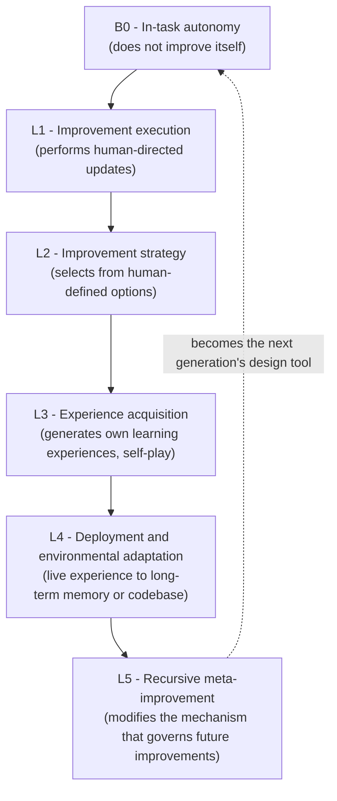

If you research models, or run your own agent and model pipelines and ask "who builds the next version, and how," take one frame from this paper: recursive self-improvement (RSI) is not a single jump. It is a ladder, B0 through L5, that measures how far an AI has handed over its own improvement process to itself. And the metric the paper proposes, the Headroom-Closed Index (HCI), has a clear message: static reasoning (math, graduate-level science) is already near the ceiling, while the interactive, agentic work that agents actually do (software engineering, search and terminal) is still below half.

*An abstract rendering of the recursive self-improvement loop: the model improving the mechanism that improves the model.*

> 📄 **Full deep review (DOCX)**: [Download the detailed peer review on Google Drive](#).

## Why read this

Read this if you are (1) an ML team that researches or serves frontier and small models, (2) an engineer designing self-evolution for an agent platform (skill and workflow improvement), or (3) a research or executive leader for whom AI safety and control are live questions. The reason is one thing: the question "what happens when an AI builds an AI" has moved from feeling to a problem you can stage and measure.

Reading the paper leaves two sentences. First, genuine RSI is the L5 stage, where the model modifies the mechanism that makes future improvements. Second, today's frontier systems sit well below that, mostly at B0 to L1, autonomous *within* a task rather than improving the task's maker. The ladder that separates those two sentences, and the number (HCI) that measures it, are the paper's real contribution.

## Overview

[The Last AI Built by Humans: Toward Genuine Recursive Self-Improvement](https://arxiv.org/abs/2609.11873) (arXiv 2609.11873) is a roughly 75-page paper published 2026-09-11. Led by Yi Duan, Ying Liu, and a large co-author list, it spans Chinese academic and industrial institutions. The affiliations named in the work include Tsinghua University, ByteDance, Shanghai AI Lab, Shanghai Jiao Tong University, ModelBest, Theseus Labs, Xiaohongshu (RedNote), and XianYuan Technology.

The title is deliberately strong. "The last AI built by humans" is a modern retelling of I. J. Good's 1965 prediction: once an intelligence explosion begins, every AI after it is made by the one before. But the substance of the paper is not that rhetoric. It is unpacking, in stages and metrics, what that storyline *requires* to hold.

## What "the last AI" precisely means

The paper's key term is *genuine* RSI. The adjective is doing real work. The paper defines genuine RSI as a closed loop that runs four steps.

1. Identify its own limitations
2. Propose and validate modifications
3. Retain the accepted changes
4. And, decisively, **influence how future improvements are generated, evaluated, selected, and consolidated**

Step four is the dividing line. Steps one through three are already largely done by current automated toolchains: a model that builds its own eval set, fixes its own code, and remembers its results is B0 to L3 territory. What makes it *genuine* is four, changing the mechanism that makes improvements, so the next cycle makes improvements better. It is "improving how you improve." That is L5. The title's "last AI" holds exactly there: from an L5 system onward, the design tool for subsequent generations is the prior AI's self-improvement mechanism, not a human.

## The 5 stages: B0 through L5

The paper divides autonomy into a baseline B0 and five levels L1 to L5, giving a shared language for "how far along are we." This ladder is the frame most likely to be cited in any RSI discussion.

| Level | Autonomy | What changes |
|-------|----------|-------------|
| **B0** | In-task autonomy | The AI acts autonomously *within* a task but does not improve itself. (Baseline, non-recursive) |
| **L1** | Improvement execution | The AI *performs* persistent improvement steps defined by external instruction. A human decides what to change. |
| **L2** | Improvement strategy | The AI *chooses* from, and applies, several improvement options a human defined. The strategy's menu is still human-owned. |
| **L3** | Experience acquisition | The AI *generates its own learning experiences*: adaptive task generation, self-play. |
| **L4** | Deployment and environmental adaptation | The AI adapts continuously in live deployment, distilling experience into long-term memory or the codebase without full retraining. |
| **L5** | Recursive meta-improvement | The AI persistently modifies the *mechanism itself* that governs future improvements (e.g., improving its own search algorithm). |

The difference between B0 and L5 is not "does it improve" but "does it change *how it improves*." L1 through L4 still operate inside a frame a human set; they are the stages that *sustain* the frame. L5 is where the frame itself is handed to the next generation.

Where a given frontier system sits on this ladder is the frame's practical use. Many coding and agent assistants are close to B0 (autonomous in-task, but they do not touch their own improvement mechanism). Automated fine-tuning and workflow-improvement pipelines are L1 to L2. Systems that run their own eval sets and self-play are L3. Systems that bank operational data into a ledger are L4. L5 is a point where no frontier system can yet credibly claim to have arrived.

## HCI: the number that splits ceiling from headroom

If the 5-level ladder is the *map* of "how far along are we," the Headroom-Closed Index (HCI) is the *instrument* for "where is the ceiling and where is the headroom." From the definition, it is one line.

> HCI = the share of the available performance gap in a given task that a model has already closed

A high ratio means the task is near saturation (ceiling); a low one means there is still a long way to go. As reported in the paper (2026 measurements), there is a clear split between static reasoning and interactive, agentic work.

| Task area | HCI (2026 report) | How to read it |
|-----------|-------------------|----------------|
| Advanced mathematics | 86.4 | Near saturation. Close to the ceiling of static reasoning |
| Graduate-level science | 85.8 | Near saturation. With math, the "already good" axis |
| Software engineering | 52.6 | Below half. Still large headroom |
| Search and terminal agents | 56.8 | Below half. Headroom on the interactive axis |

That split is the paper's substantive message. Models approach the ceiling on static, one-shot reasoning, but are still below half on work that keeps state, uses tools, and changes the environment. Read against the ladder, HCI backs up the static-reasoning axis as near L3 to L4 saturation, and the agentic axis as still stuck at B0 to L1. It points the answer to "which axis do we push RSI on first" not at the ceiling but at the headroom (agentic).

## The speed differs by domain

The paper argues that the rate of RSI varies by domain. Scientific discovery, embodied intelligence, software engineering, and healthcare each have different preconditions and evolve at different speeds. The same 5-level ladder applies, but "the time it takes to reach L4" differs by field.

This touches practice directly. A domain like healthcare, where feedback is expensive (the cost of an error is high) and validation is slow, will improve recursively on the conservative end. A domain like software, where feedback is cheap and trustworthy, can improve faster. The paper's core constraint, "the cost and reliability of feedback," is exactly the variable that creates this gap. An improvement is retained and reused only if the feedback loop that measures its effect is cheap enough and trustworthy enough.

## Implications for ThakiCloud products

The paper lands on two of ThakiCloud's product lines at once.

**Paxis (the agent platform)**. Paxis treats skills, workflows, policies, and audit as first-class resources in an agent control plane. Overlay the 5-level ladder onto Paxis's self-evolution (skill improvement, workflow redesign) and you can check where you currently stand. A skill that builds its own eval set (toward L3) and banks operational data into a ledger to fix the next skill (toward L4) is the direction the current Paxis loop points. The ladder turns that self-improvement loop from a *picture* into a *measured scale*. In particular, the L4 to L5 boundary, "modifying the policy mechanism that modifies skills," is the threshold where Paxis self-evolution moves from evolution (an agent that improves) to genuine self-improvement (an agent that changes the mechanism that makes it).

**Metis / ai-platform (serving and training infrastructure)**. The HCI split rewrites the serving-cost problem. As the static-reasoning axis approaches saturation, competition on that axis shifts from "a smarter model" to "cheaper serving." The agentic axis (the one with headroom) is still bottlenecked by model capability, so the serving infrastructure must extract that capability cheaply. The paper's feedback cost and reliability constraint is also a training-infrastructure problem. Moving from L3 (experience acquisition) to L4 (deployment adaptation) requires a pipeline that distills operational feedback into a ledger without retraining. The fact that ThakiCloud binds Kueue, serving, and eval infrastructure vertically is the substrate for the moment when "making the feedback loop cheap and trustworthy" becomes the RSI speed problem.

## Limits and counter-arguments

Hold a few things while reading this paper.

First, this is a *framework + metric + roadmap* paper, not an *execution* paper. As it says, it rests on industry practice and *preliminary* empirical evidence, and it offers no demonstration of an L5 system. "No one has reached L5 yet" and "L5 is defined like this" are different claims, and the paper makes the second. The title's strength (the last AI) is rhetoric that claims the standard of the second, not the attainment of the first.

Second, the HCI numbers (86.4 / 85.8 / 52.6 / 56.8) are the paper's own 2026 measurements. The values quoted here are as the paper reports them, and the absolute figures move with the measurement design (which task set, what was chosen as the ceiling). The *direction* (static reasoning near saturation) is solid; re-quoting a specific number like 86.4 is safer after checking the measurement setup in the paper body (HTML).

Third, "5 levels" gives you a language, but the boundaries between levels are fuzzy in real systems. A pipeline that is simultaneously L2 (strategy selection) and L3 (experience generation) is common, and "this system is L2, L3" is case-dependent. Use the ladder as a *checklist of questions* for diagnosing your own system, not as a strict measurement scale, and you are using it honestly.

Fourth, the safety argument is *inside* the paper. It names the core risks of RSI explicitly: capability growth outpacing human oversight, misalignment that compounds across cycles beyond control, and the loss of control itself. It cites that Anthropic and the 2026 International AI Safety Report have flagged this "loss of control" as a national-security-level risk. In other words, the paper does not hold RSI only as a goal to be achieved; it also asks what we lose if it happens. Read the title's hype against the body, and the two balance.

## Bottom line

"The last AI built by humans" is rhetoric, not a benchmark. What reading the paper leaves you with is two tools. One is the 5-level ladder (B0 to L5). It pins the threshold where an AI starts modifying the mechanism that makes future improvements, giving a shared language for where today's systems sit. The other is HCI. It hands you a map of headroom: static reasoning near the ceiling (math 86.4), the interactive axis where agents actually work still below half (software 52.6, search and terminal 56.8).

Three next steps. (1) Diagnose your own agent and model pipelines against the 5 levels, and pin one rung, "we are L1 to L2, next is L3 (our own eval set)." (2) Add HCI as an axis in your benchmark, measuring ceiling and headroom on static reasoning versus agentic work against your own workload distribution. (3) Put the L4 to L5 boundary, "modifying the mechanism that modifies improvements," on the agenda, and do not forget that the cost and reliability of the feedback loop is the bottleneck there. RSI is a ladder, not a leap, and the metric that measures headroom, not ceiling, tells you where the next step is.

## Sources

- [The Last AI Built by Humans: Toward Genuine Recursive Self-Improvement (arXiv 2609.11873)](https://arxiv.org/abs/2609.11873)
- [Official HTML version of the paper](https://arxiv.org/html/2609.11873v1)
- [AlphaXiv discussion page](https://www.alphaxiv.org/abs/2609.11873)
- First shared: [@askalphaxiv retweet via hjguyhan](https://x.com/hjguyhan/status/2099374190969368707) and [@Dr_Singularity "meanwhile in China"](https://x.com/hjguyhan/status/2099370443782402107)

> 📄 **Full deep review (DOCX)**: [Download the detailed peer review on Google Drive](#).
