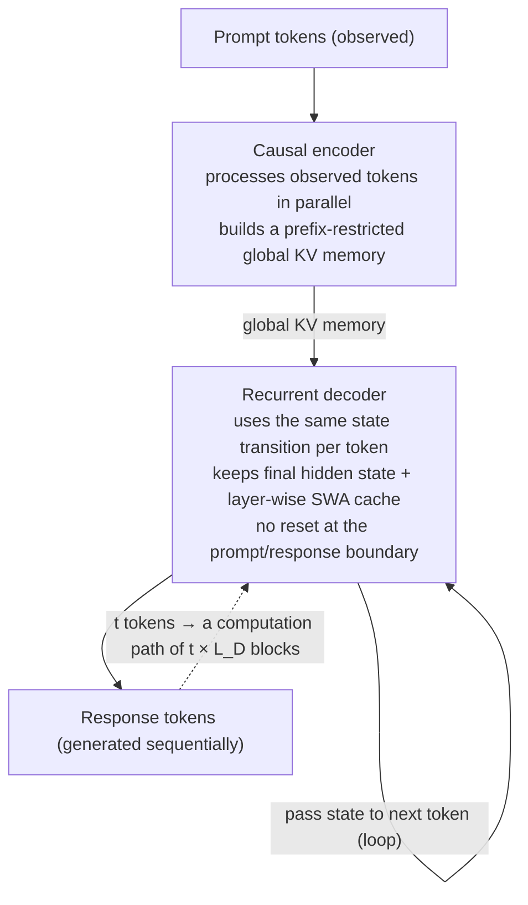

If you serve reasoning models, or you work hands-on with KV caches and prefill/decode disaggregation, you can understand why the Recurrent Looped Transformer (RLT) is getting attention in one sentence. The structure makes depth by "looping a fixed-depth decoder over tokens" rather than by stacking more layers, and it does so in a way that lines up exactly with the serving system's parallel (prefill) and sequential (decode) split.

*An abstract rendering of the encoder that processes observed tokens in parallel (top) and the looping decoder that accumulates depth sequentially by carrying state (bottom).*

## Why read this

This post is for (1) engineers who run LLM serving and inference infrastructure, (2) people weighing the cost of long-context and deep-reasoning workloads, and (3) researchers who want to see, structurally, where a new architecture differs from the standard Transformer. There is one reason to read it: the idea of "a transformer that gets deeper as it gets longer" has been presented not as vague rhetoric but as a concrete design specification that separates prefill and decode to match the hardware.

That said, one thing to flag up front. RLT is a **design specification with no benchmarks**. The author states explicitly that it omits throughput, latency, memory consumption, and comparisons against trained baselines. So this post focuses not on "how fast RLT is" but on "what RLT is trying to change, and why that matters from a serving perspective." Knowing why the numbers are missing is as important as waiting for the numbers.

## Overview

The [Recurrent Looped Transformer](https://yifanzhang-pro.github.io/recurrent-looped-tranformer/) is an architecture technical report proposed by Yifan Zhang, a Princeton graduate student, in collaboration with Mengdi Wang, Andrew Yao, and Quanquan Gu. It was released around September 12, 2026; the [author's project page](https://yifanzhang-pro.github.io/recurrent-looped-tranformer/) and [PDF](https://yifanzhang-pro.github.io/recurrent-looped-tranformer/Recurrent_Looped_Transformer.pdf) are the primary sources. Note that the report is not yet formally registered on arXiv, so we treat the [AlphaXiv discussion page](https://www.alphaxiv.org/abs/2609.recurrent-looped-transformer) and the [MarkTechPost coverage](https://www.marktechpost.com/2026/09/13/a-princeton-researcher-proposes-recurrent-looped-tranformer-rlt/) as secondary sources.

RLT names [YOCO (You Only Cache Once, arXiv 2405.05254)](https://arxiv.org/abs/2405.05254) as a precursor. Where YOCO proposed a self/cross decoder split in which "memory built by the encoder is reused by the decoder," RLT layers a **recurrent loop over the tokens** on top of that split. In other words, RLT stands one step beyond the idea of "build the KV cache once, and let depth accumulate along the time axis on top of it."

The timing matters. The serving battlefield today compresses into two axes. One is the KV cache becoming a memory bottleneck as long-context and agentic workloads grow. The other is prefill/decode disaggregation (PD) becoming a standard optimization. RLT tries to handle both of these inside the model architecture, which makes it readable not as "a new layer structure" but as "a model that follows serving's two natural modes." That reading runs through this post.

## What is this technology

RLT splits into two parts with clearly distinct roles.

**The causal encoder** processes the observed (known) tokens, i.e. the prompt, **in parallel**. In doing so it builds a **global KV memory** that is restricted to preceding tokens (prefix-restricted). Translated into serving language, this is the **prefill** stage: parallel, so it is handled quickly by the GPU's large matrix multiplications.

**The recurrent decoder** processes the generated tokens **sequentially**, passing the final hidden state and the **layer-wise sliding-window attention (SWA) cache** between tokens. The key point is that **this state is not reset at the boundary between prompt and response**. The same state transition is applied to prompt tokens and response tokens alike. Translated into serving language, this is the **decode** stage.

Connecting the two parts gives the diagram below.

This is where the phrase "unbounded temporal depth" comes from. Processing t tokens makes the computation path traverse **t × L_D** decoder blocks (L_D is the fixed decoder depth). The number of blocks executed per token stays constant, but as the sequence lengthens, computation expands along the time axis with no architectural depth cap. It is like running a 48-layer decoder t times, instead of building a 1000-layer model. The reference configuration the report presents is a 48-layer encoder plus a 48-layer decoder, running 96 logical blocks per token (decoder blocks include cross-attention), with shared attention and FFN weights.

Let us trace one step concretely. When a prompt arrives, the encoder processes all observed tokens in parallel and builds the global KV memory. Because it only attends to preceding tokens (prefix-restricted), the memory is in a "has seen the whole prompt at once" state. Now the decoder begins generating the response. To make the first response token, the decoder reads the encoder's global KV memory via cross-attention and keeps its own hidden state and layer-wise SWA cache carried over from the previous token. For the second response token, that state is not reset; it carries forward and runs the L_D layers one more turn. So generating t response tokens means the decoder has looped the L_D layers t times, which is the t × L_D computation path. Depth grows not by "passing through more layers at once" but by "repeating the same layers across more tokens."

In the standard Transformer, a token passes through a fixed L layers once. In RLT, a token passes through L_D layers, but those L_D layers become a **loop that carries state to the next token**. Depth moves from "space (layers)" to "time (number of tokens)."

## Three design principles

The report builds the architecture on three design principles. These are what turn RLT from "an interesting structure" into "an intended design."

**First, latent reasoning with unbounded temporal depth.** The premise is that the loop where the recurrent state (hidden state + SWA cache) accumulates is exactly "where reasoning happens." Moving depth to the time axis means that the more tokens the model generates, the deeper the latent computation it reaches. That is the essence of "deeper as it gets longer."

**Second, model-hardware co-design.** The parallel encoder workload (prefill) and the sequential decoder workload (decode) are separated structurally. This matches exactly what serving systems already do. Prefill is compute-dense and batched in parallel; decode is state-dependent and sequential. By elevating this separation from "a serving optimization" to "the nature of the model," RLT claims to make cross-sequence batching, memory reuse, and checkpointed training fall out naturally.

**Third, model-RL algorithm co-design.** Pretraining, SFT, rollout sampling, and current-policy replay all share the **same full state transition**. Because the state is not reset at the prompt boundary, the policy definition has no special case for "is this a prompt segment or a response segment." From the perspective of training reasoning models with RL, this is an important cleanup: the rollout (sampling) and the policy (the gradient target) are the same computation, so the train/inference mismatch is reduced structurally.

## How it differs from existing approaches

To understand RLT, it helps to see where it diverges from and continues three neighboring lines of work.

**Relation to the KV cache.** The standard Transformer decoder keeps the KV of every prior token, so the cache grows as O(sequence length × layers × dimension). RLT's encoder builds a prefix-restricted global KV memory once, and the decoder carries a **relatively fixed state** (hidden state + SWA cache) on top of that memory. The direction is to replace the "ever-growing KV cache" with "a once-built memory plus a bounded recurrent state." This shows how RLT extends YOCO's "cache once."

**Relation to looped transformers.** Running weight-tied layers many times (depth recursion) is already a known idea. RLT's difference is that it hangs the loop **over the tokens (the time axis)** and formalizes it as a hardware-friendly encoder/decoder split. It is "make the sequence deep over time" rather than "make a single token deep."

**Relation to state space models (SSM/Mamba).** The recurrent state makes RLT feel close to an SSM. But RLT keeps the attention structure (full attention + SWA) and carries that attention's state transition recurrently, so "recurrent-izing attention" is the accurate reading.

Summarizing the contrast with the standard decoder-only Transformer in one line. In standard decoder-only, every token passes through the same L layers and the KV cache keeps growing with sequence length. In RLT, observed tokens are compressed once into a global memory by a parallel encoder, and generated tokens loop a fixed L_D layers carrying a bounded recurrent state. The model's depth moves from "how many layers you stack" to "how many times you loop," and memory growth moves from "the KV cache" to "a fixed-size recurrent state."

## Implications for ThakiCloud products

This topic reads best through ThakiCloud's **Metis / ai-platform (serving and inference infrastructure)** lens.

**The model-side counterpart of prefill/decode disaggregation.** In serving systems, prefill (parallel, compute-dense) and decode (sequential, latency-sensitive) are already separated and placed on different GPUs or nodes as PD disaggregation. RLT puts those two separated workloads into the **model architecture itself as first-class citizens**. From a serving perspective, this is not "hardware following the model structure" but "the model structure formalizing the two natural modes of hardware (parallel/sequential)." It provides an architectural rationale for how Metis should place prefill and decode when serving inference workloads.

**The direction of KV-cache compression.** RLT's "once-built global KV memory plus bounded recurrent state" reads as an alternative to the endlessly growing KV cache. In long-context serving, where the KV cache is the memory bottleneck, separating encoder memory from the decoder recurrent state may simplify cache management and reuse. Because RLT has no measurements, whether it actually reduces the KV cache footprint is still an open question.

**The cost implication of "deeper as it gets longer."** The t × L_D computation path means that, as generation gets longer, total compute grows linearly. For workloads that need deep reasoning (agents, code, math) that depth can be a benefit, but for short responses it is unnecessary computation. From Metis's perspective, RLT is a design that decides, at the model-structure level, "which workloads get a deep loop," and it becomes one axis of the discussion about how to set the ceiling on inference cost.

## Limitations and counterarguments

Here are the things to hold onto when reading this report.

First, **there are no measurements**. The author explicitly excludes benchmarks, throughput, latency, memory, and comparisons against trained baselines. "Unbounded temporal depth" and "model-hardware co-design" are persuasive structural claims, but the report does not answer what benefit they deliver in quality or cost. To judge RLT's value, we need a comparison of inference quality and cost between RLT and a standard decoder-only Transformer at the same parameter scale. Right now it is a design that comes before that.

Second, **the depth-for-cost exchange deserves care.** The t × L_D path is both the benefit of "deeper as it gets longer" and the cost of "total compute grows linearly." Without a baseline standard structure to compare against, we cannot say for which workloads that exchange is a gain or a loss. That is exactly why "deeper as it gets longer" should not be read as an unconditional strength.

Third, **the loop's stability is open.** A recurrent structure that carries state across tokens needs a stability argument: over long generation, does the state diverge or start orbiting a fixed point? Keeping a local window via the layer-wise SWA cache is one way to address that, but the global behavior is hard to assert without measurements.

Fourth, **this is still a technical report not registered on arXiv**. It has not gone through peer review, and no code or weights are public, so it is not yet reproducible. The structure is clearly presented, but we are not at the stage where we can verify that it behaves as presented.

## Takeaways

RLT proposes an architecture that makes depth by **looping a fixed-depth decoder over tokens** instead of stacking more layers, and that aligns that loop exactly with serving's parallel (prefill) / sequential (decode) split. Observed tokens build one global KV memory via a parallel encoder, and generated tokens carry the hidden state + SWA cache without a boundary reset, accumulating t × L_D of computational depth. The three design principles (unbounded-depth latent reasoning, model-hardware co-design, model-RL co-design) show that this structure is intended, not incidental.

We leave three next actions. (1) If you are a serving engineer, draw on one page how your prefill/decode disaggregation setup maps onto RLT's "encoder memory + decoder recurrent state" split. (2) If you run reasoning workloads, set a branching criterion of "deep loop for long-generation workloads, shallow loop for short ones," and weigh it against RLT's t × L_D cost. (3) If you are a researcher, queue up the "RLT vs. standard decoder-only, quality and cost at the same scale" comparison to track the moment this report publishes measurements. The more a design spec is missing numbers, the more valuable it is to have the right questions ready before the numbers arrive.

## Sources

- [Recurrent Looped Transformer (author project page)](https://yifanzhang-pro.github.io/recurrent-looped-tranformer/)
- [Recurrent_Looped_Transformer.pdf](https://yifanzhang-pro.github.io/recurrent-looped-tranformer/Recurrent_Looped_Transformer.pdf)
- [AlphaXiv discussion page](https://www.alphaxiv.org/abs/2609.recurrent-looped-transformer)
- [MarkTechPost: A Princeton Researcher Proposes Recurrent Looped Transformer (RLT)](https://www.marktechpost.com/2026/09/13/a-princeton-researcher-proposes-recurrent-looped-tranformer-rlt/)
- [YOCO: You Only Cache Once (arXiv 2405.05254)](https://arxiv.org/abs/2405.05254)
- First shared: [@askalphaxiv retweet via hjguyhan](https://x.com/hjguyhan/status/2099369871079563566)
