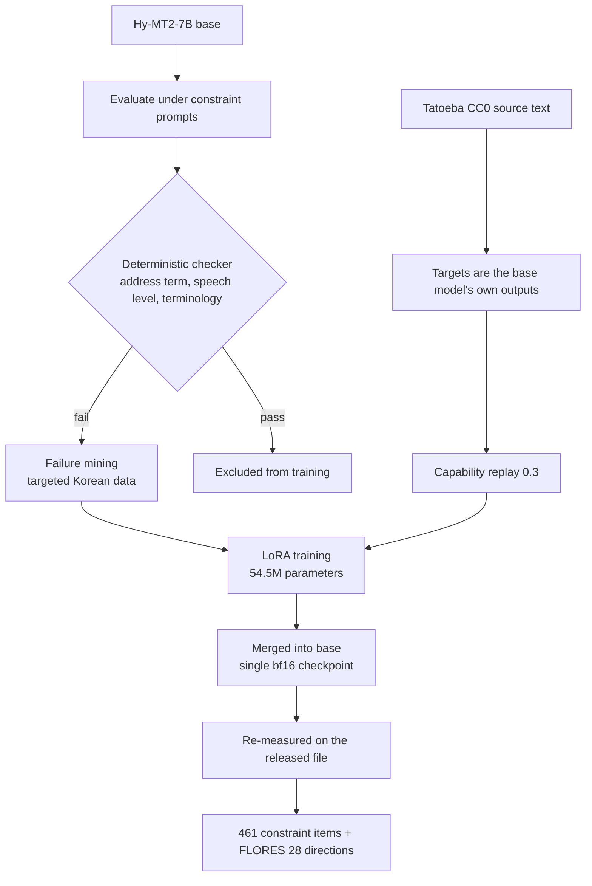

What goes wrong in Korean business translation is rarely accuracy. It is register. A mail meant for a director goes out in the tone you would use with a peer, and CAPEX, the word the finance team says every day, comes back as 자본지출. Every sentence is correct. Only the reader is uncomfortable.

We started from `tencent/Hy-MT2-7B` and built a model that fixes this one thing. Constraint compliance went from 23.9% to 98.9%, and multilingual quality across 28 translation directions stayed level with the base. This post records what we measured, including the places we were wrong. The model is released under Apache-2.0.

## The first number: it receives the instruction and ignores it

`tencent/Hy-MT2-7B` is already strong at multilingual translation, Korean included. So the first thing we did was not to measure translation quality. It was to give the model an instruction and count whether it complied.

The prompt looks like this: address the listener as `본부장님`, end every sentence in 합니다체. A deterministic checker then counts whether the requested address term appears exactly and whether the speech level is violated. We only counted what needs no human judgement.

At n=461, compliance was **23.86%**. Open the other 76% and the translations are not wrong. The sentence is fine and the requested address term is simply missing. When we hand-classified the failures, the count of wrong address terms was zero. Every failure was a **refusal to insert**. The model does not lack Korean honorifics; it declines to put something into the target that has no basis in the source.

We tested that reading with a minimal pair. To 58 sentences with no listener referent, we added two words, `for you`, giving the source an addressee slot. Compliance flipped from **3.4% to 100%**. Of 58 pairs, 56 converted and none reversed. For a model trained toward faithfulness, an address-term constraint is not a translation task. It is an insertion task.

## What actually changes

Rather than describe it, here are real evaluation outputs. Left is the base, right is K-MT, same prompt and the same greedy decoding.

The instruction asked for the address term `정 책임님` and 해요체.

> Source: CSAT held up pretty well even with the outage we had last week.
> Base: 지난주에 발생한 서비스 중단에도 불구하고 CSAT 점수는 꽤 양호한 수준을 유지했어요.
> K-MT: **정 책임님,** 지난주에 발생한 장애가 있었음에도 CSAT가 꽤 잘 유지되었어요.

Note that the base translation is not wrong. It just left out the address term it was told to use.

Next, the speech-level axis. The instruction asked for `팀장님` and 합니다체.

> Source: Did you finish reviewing the migration plan?
> Base: 이주 계획 검토를 마치셨**나요**, 팀장님?
> K-MT: 팀장님, 마이그레이션 계획 검토를 완료하셨**습니까**?

The base put the address term in and then slipped on the ending, closing in 해요체 when 합니다체 was requested. Address term and speech level are separate axes, so we count them separately.

The relationship axis changes the form itself. Address term `최 매니저`, direction superior to subordinate.

> Source: Escalate that urgent ticket to whoever is on call right now.
> Base: 지금 근무 중인 담당자에게 그 긴급한 티켓을 즉시 전달해 주세요.
> K-MT: **최 매니저,** 그 긴급 티켓을 지금 교대 중인 사람에게 전달해 주세요.

That is `최 매니저`, not `최 매니저님`. Superior to subordinate drops the honorific suffix, and the model uses the form it was handed instead of politening it on its own.

Terminology works the same way. Here `egress` was marked do-not-translate.

> Source: Cross-region egress alone accounted for 31% of last month's cloud bill.
> Base: 교차 지역 **외부 전송** 비용만으로도 31%를 차지했습니다.
> K-MT: 대표님, 지난달 클라우드 비용 중 교차 지역 **egress**만으로도 31%를 차지했습니다.

외부 전송 is not wrong in the dictionary sense. It is simply not what an infrastructure team says out loud, and a glossary is how you tell the model that.

We also measured the opposite direction. A model trained to insert address terms could learn to insert them everywhere, so we checked separately (n=296) whether it adds one when none was requested. It does not. That is why the number above is a compliance rate and not an insertion rate.

## Pouring in more data was not the answer

The first prescription anyone reaches for is more Korean data. We built that control too, training broadly on public parallel corpora and measuring with the same checker.

Across three seeds, compliance came out at **2.60%, 0.65%, and 1.74%**. That is below the untrained base at 23.9%. Broad Korean data does not fix this problem; it made it worse. Training that strengthens translation in general appears to crowd out instruction compliance, which is a different axis.

So we changed direction. Instead of pouring data in broadly, we found where the model actually fails and built targeted data there.

## Training setup: failure mining plus capability replay

The whole flow looks like this.



Two branches go in at once. The left is the ability we want to gain, the right is the ability we refuse to lose. The right branch is **replay**: train on Korean alone and the other languages collapse, so we keep showing the model the work it already did.

Here is what we did not expect. The thing that mattered was not what goes into replay. It was **where the replay source text comes from**.

## The replay source decides the outcome


Three configurations, read against two vertical axes at once: Korean constraint compliance, and the change in the 28-direction mean.

**Remove replay entirely** and Korean goes up, all the way to 99.6%. The FLORES 28-direction mean then drops by **0.430**. We gained Korean and lost multilingual, which for this project is a failure.

**Replace the replay source text with model-generated sentences** and multilingual holds. Korean constraint compliance instead falls by **1.66pp**, to 96.75%. That interval excludes zero.

Only the combination of **real human sentences as the source, with the base model's own outputs as the targets**, held both axes. We used the Tatoeba CC0 export as the source. Across three seeds: compliance 98.92 / 98.48 / 98.05%, FLORES delta +0.087 / +0.045 / +0.034, all three intervals excluding zero.

We will not state a mechanism as settled. The natural reading is that model-generated sentences occupy a narrow distribution already concentrated where that model is strong, which makes them a weak signal for preserving ability. That is inference on our part, not something we measured.

## A bigger model was not the answer either

We asked ourselves the obvious question: why not use a larger model from the same family as the teacher? So we measured the same items with a same-lineage 30B model.

The address-term axis improved, from 32.9% to 75.7%. The do-not-translate axis went the other way, from **59.8% down to 51.1%**. Capacity went up and one specific axis fell.

The clue is that both weak axes are **insertion** axes. A higher-capacity teacher from the same lineage inherits the student's faithfulness prior intact. It fails at what the student fails at, for the same reason, and therefore cannot teach it. Capacity is not what decides this; lineage is.

For reference, a model from a different lineage scored 98.9% on that same axis. What sets this axis is not parameter count but what data the model saw and how it was trained.

## What merging costs at release time

We trained with LoRA but released a **single bf16 checkpoint merged into the base**, not an adapter, because that is easier to pick up and run.

Merging is not free. The largest absolute LoRA delta sits around 1e-3, while the bf16 quantum near |W|≈0.5 is about 2e-3. On large weights the delta rounds away. Of 288 free-generation items, 33 (11.5%) diverge lexically from the adapter path.

So we decided not to use string equivalence as a gate. Rather than erect a gate that physically cannot pass, we **re-measured on the file we release**. Across the 461 constraint items, not a single verdict changed.

Semantic error did move, from 3.04% on the adapter to 3.69% merged, 14 to 17 of 461. At first we did not know whether that was real, so the model card said exactly that. Later we ran the same paired-item bootstrap (B=1000, seed 7) and got **+0.65pp [−0.65, +1.95]**, with McNemar's exact test over the 9 discordant pairs giving p=0.51. The merged file is not measurably worse.

One thing must stay clear. This is not the same as "no difference". Nine discordant pairs have no power to rule out a small one. What we can say stops at "not measurably worse".

## Results, and their limits

| Metric | Hy-MT2-7B (base) | K-MT-7B |
|---|---|---|
| Korean constraint compliance (n=461) | 23.86% | **98.92%** |
| Semantic error (independent judge) | 5.64% | 3.69% |
| WMT24++ EN→KO COMET-22 | 0.8874 | 0.8894 |
| FLORES EN→KO COMET-22 | 0.9100 | 0.9100 |
| FLORES 28-direction mean delta | reference | +0.085 |

Two limits.

**98.9% is a failure-mined in-domain number.** The eval set was mined from the base model's own failures and the training data came from the same mining pipeline, so the eval distribution and the training distribution share a root. That number cannot sit beside external benchmark scores, and the model card says so. We have designed a public out-of-domain benchmark but have not built it yet.

**The tie on general translation quality is a guardrail, not an achievement.** WMT24++ gives COMET-22 +0.0020 and the interval does exclude zero. It is also 0.2 COMET points, and across nine comparisons against the base, one crossing at α=0.05 is what chance produces. The range that table guarantees stops at "specializing for Korean did not break anything else".

Worth adding: WMT24++ and FLORES contain no items that instruct an address term or a speech level at all. The tie there is a fact that describes the benchmarks. It does not describe the model.

## Let code hold the verdict

Looking back, the decision that mattered most was not on the model side. It was evaluation.

Whether the address term matches, whether the speech level is violated, whether terminology is preserved: a **deterministic checker** counts all of it. No judge model is called. It reproduces, it is cheap, and above all it carries no self-favouring.

Only semantic preservation, which needs judgement, goes to a judge, and we picked that judge from a **different lineage** than the candidate. When two judges are used, we do not hide that they receive different instructions. One gets the rubric; the other gets the rubric plus calibration rules. Their κ is therefore not an inter-annotator agreement, and we use the intersection of the two verdicts only as a conservative lower bound.

One more gate runs right before release. Code blocks the upload if the model card still holds a placeholder, if an internal identifier slipped in, or if a data file ended up in the upload folder. A human reading down a checklist will eventually miss one.

## Running it yourself

Constraints are set in the prompt. Conditions go inside square brackets separated by `·`, and this is the exact format used in training and evaluation.

```python
from transformers import AutoModelForCausalLM, AutoTokenizer

mid = "ThakiCloud/K-MT-7B-v0.1"
tok = AutoTokenizer.from_pretrained(mid, trust_remote_code=True)
model = AutoModelForCausalLM.from_pretrained(mid, dtype="bfloat16",
                                             trust_remote_code=True, device_map="auto")

prompt = ("Please translate the following text into Korean. Note that the translation "
          "style must strictly conform to [종결어미는 합니다체로 통일 · 청자 호칭은 "
          "'본부장님'을(를) 사용]:\n"
          "Tell him the deployment finished and ask if we should roll back.")

text = tok.apply_chat_template([{"role": "user", "content": prompt}],
                               tokenize=False, add_generation_prompt=True)
out = model.generate(**tok(text, return_tensors="pt").to(model.device),
                     do_sample=False, max_new_tokens=256)      # greedy, same as evaluation
print(tok.decode(out[0], skip_special_tokens=True))
```

Relationship goes in as `화자와 청자의 관계는 부하→상사`, and terminology is passed by prepending a `Reference the following translations:` block. The `hunyuan_v1_dense` architecture needs `trust_remote_code=True`, and the chat template is the repo's own `chat_template.jinja`.

There is a reason decoding is pinned to greedy. This lineage ships `generation_config.json` defaulting to sampling (temperature 0.7, top_p 0.8), so evaluating as-is gives a different answer to the same item every run, and nothing reproduces or compares to published numbers. Evaluation decoding is safer nailed down and kept separate from the serving configuration.

## What this means for the ThakiCloud stack

This work rides two layers of our platform directly.

**Maxis (AI Training and Fine-tuning)** is the training layer. As this case shows, a company-specific translation model is decided by failure mining and capability-preservation design rather than data volume. Title systems and glossaries differ per company and are not something a general translation API can know. Running this same recipe against a customer's own address conventions and glossary is the shape of what we offer. With 54.5M trainable parameters and a single 7B checkpoint as the deliverable, the cost sits an order of magnitude away from building a foundation model.

**Metis (AI Inference and Token Factory)** is the serving layer. A single merged checkpoint deploys with no adapter management. At the 7B class a single GPU gives ample throughput, and translation is a workload whose call volume climbs the moment it is attached to an internal document pipeline, so the per-token price becomes the operating cost directly.

**Aegis (on-prem private cloud)** is the third axis. When the documents needing translation are HR records, contracts, or incident reports, those documents cannot leave the company. Receiving both training and serving inside an environment the data never exits is where this diverges from a general translation API.

## Reproduction and links

The model is public under Apache-2.0.

- Model: [ThakiCloud/K-MT-7B-v0.1](https://huggingface.co/ThakiCloud/K-MT-7B-v0.1)
- Base: [tencent/Hy-MT2-7B](https://huggingface.co/tencent/Hy-MT2-7B)
- Evaluation: [google/wmt24pp](https://huggingface.co/datasets/google/wmt24pp), FLORES-200

The model card carries the prompt format and the decoding settings, and those settings are what produced the numbers above. The general-quality table (WMT24++, FLORES) reproduces for anyone. The Korean constraint eval set is not released: it was mined from the base model's failures, so releasing it would let the next model be trained against it. The public out-of-domain benchmark now in design is planned to ship with its items.

If register has caused you more trouble than accuracy ever did, that is a fixable kind of problem.
