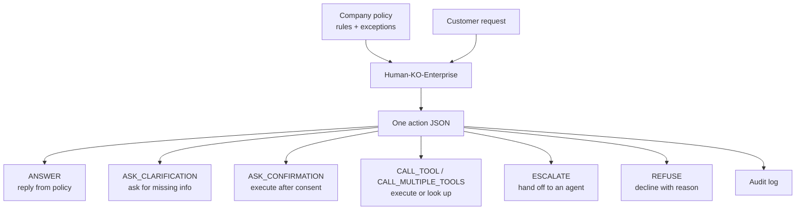
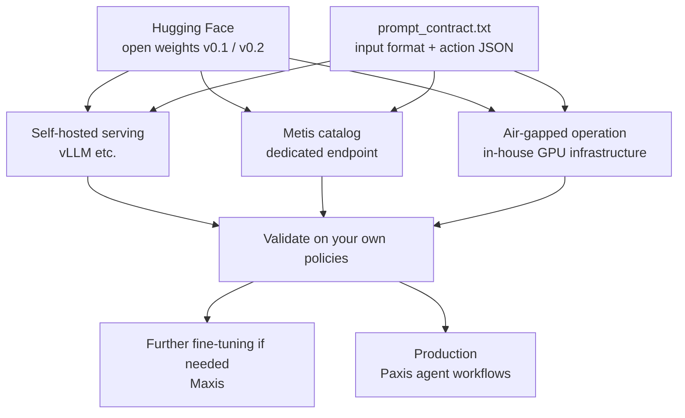

This post is for AI adoption leads and engineering leads at financial, public-sector, and service companies who want to automate customer support or internal work with agents in Korean. By the end you should be able to judge where and how to plug in a Korean model that decides, within company rules, whether to execute, ask a follow-up, get confirmation, hand off to a person, or refuse.

The genuinely hard part of an enterprise agent is not knowing the right answer to a question. It is choosing what to do with this request, right now, inside the company's rules and their exception clauses. A wrong answer can be corrected later. A payment executed without confirmation, or an account setting changed outside someone's authority, is an incident the moment it happens.

*Policy and request meet at one point and split into a single action.*

## What we released

On September 24, 2026, ThakiCloud published two models and one benchmark on Hugging Face.

- Model v0.1: [ThakiCloud/Qwen3.8-27B-Human-KO-Enterprise-v0.1](https://huggingface.co/ThakiCloud/Qwen3.8-27B-Human-KO-Enterprise-v0.1)
- Model v0.2: [ThakiCloud/Qwen3.8-27B-Human-KO-Enterprise-v0.2](https://huggingface.co/ThakiCloud/Qwen3.8-27B-Human-KO-Enterprise-v0.2)
- Benchmark: [ThakiCloud/EnterpriseOps-KO-Policy](https://huggingface.co/datasets/ThakiCloud/EnterpriseOps-KO-Policy) (2,414 items)

Both models are built on ThakiCloud/Qwen3.8-27B-Human-KO, a Korean writing-style model derived from Qwen/Qwen3.8-27B. The models and the benchmark are all Apache-2.0, so you can use them commercially, install them in-house, and train them further on your own data. The same models are also registered in ThakiCloud's Metis demo catalog (demo.thakicloud.net), so customers on our platform can serve them without moving weights around.

## The model does one thing

The model reads a company policy (rules plus exception clauses) together with a customer request, and returns one policy-compliant action as JSON. There are seven possible actions.

- `ANSWER`: respond using information in the policy.
- `ASK_CLARIFICATION`: ask for information needed to proceed.
- `ASK_CONFIRMATION`: get the customer's consent before executing.
- `CALL_TOOL`: execute or look something up with one tool.
- `CALL_MULTIPLE_TOOLS`: use several tools.
- `ESCALATE`: connect the customer to a human agent.
- `REFUSE`: say it cannot be done and give the reason.

For example, given the policy "overseas payments of 200,000 KRW or more are executed only after customer confirmation" and the request "pay 250,000 KRW on a Singapore website," the model does not execute the payment. It returns `ASK_CONFIRMATION`.

The point is that the output is an action, not a sentence. A model that writes free text such as "confirmation seems necessary" needs more code to interpret that sentence, and if the interpretation is wrong the payment can go through unconfirmed. When the action is always one of seven fixed values, the orchestrator uses it directly as a branch condition, writes the same JSON to the audit log, and routes confirmations and escalations into the approval flow. Decision, record, and control all live in one line.

*The model reads policy and request and emits one action as JSON; the orchestrator branches on that value and stores the same JSON in the audit log.*

## Five places enterprises can use it

These are the branch points an enterprise agent hits every day. For each one we give an example policy, the action the model picks, and what that action means for the business. The policy wording is illustrative.

### Checking amount limits

Say a banking support agent carries the policy "transfers above the single-transfer limit are executed only after the customer reconfirms the amount and recipient." When a customer asks for a transfer over the limit, the model returns `ASK_CONFIRMATION`. For a request under the limit, the same policy leads to `CALL_TOOL` and the transfer runs. The business value is simple: the limit decision arrives as an action value rather than a sentence in a prompt, so the orchestrator can enforce that no execution skips the confirmation step.

### Restricting actions by account status

Under the policy "dormant or suspended accounts may view information but change requests are not processed," a suspended customer asking to change a delivery address gets `REFUSE` with a reason. If the same customer asks about order history, the model calls the lookup tool. Rules where the same request must be handled differently depending on status trip up human agents too, so getting this decision consistently already narrows the variance in service quality.

### Asking when required information is missing

With the policy "refunds are accepted only when both the order number and the refund reason are provided," a customer who says only "refund the thing I bought last time" does not get a guessed order. The model returns `ASK_CLARIFICATION` and asks for the order number. Asking once more is far cheaper than refunding the wrong order, and the model treats that as the default.

### Refusing requests outside authority

A request the channel or role is not allowed to handle, such as "credit limit increases are not processed in the support channel," is blocked with `REFUSE`, ideally with the reason attached. Refusals must not be excessive, though. An agent that also refuses legitimate requests will end up unused. That is why the results below report refusal accuracy and over-refusal side by side.

### Handing off to a human agent

Under the policy "disputes, formal complaints, and suspected fraud reports go to a human agent immediately," the model does not try to resolve the case and returns `ESCALATE`. The orchestrator moves the case to the agent queue, and the JSON with the escalation reason shows up on the agent's screen and in the audit log. You can widen the scope of automation while pinning down, by policy, exactly where a person must step in.

Across all five, the model does not finish the job on your behalf. It picks the right branch in the workflow. Your tools and approval system do the execution; the model only decides, just before that, what should happen next.

## How to adopt it

**Serving.** Download the weights from Hugging Face and serve them with a standard open-model engine such as vLLM. ThakiCloud customers can skip that step, since the models are already in the Metis catalog, and call them through a dedicated endpoint.

**Prompt contract.** The model works best with a fixed input format. The benchmark repository includes `prompt_contract.txt`, which describes how to supply the policy and the request and what the action JSON looks like. We recommend aligning your production prompt to that contract first, then inserting your own policy text as is.

**Further fine-tuning on your policies.** Both models are Apache-2.0 open weights, so you can train them further on your own policies and real support scenarios. ThakiCloud's training platform Maxis offers a path for customers to run that additional fine-tuning on their own policies.

**Air-gapped operation.** In financial and public-sector environments where policy documents and customer requests cannot leave the network, you can download the weights and run everything inside your own network, on a private cloud or your own GPU infrastructure.

*Wherever you serve the weights, use the same prompt contract, validate on your own policies, then go to production or to further fine-tuning.*

## Why it matters

**Compliance.** Whether an agent follows company rules comes down to what it did with a given request. Narrowing the choice to seven actions shrinks the places where a violation can occur, and when one does happen, the wrongly chosen action is immediately visible.

**Auditability.** Because each action is a single JSON object, the decision lands in the audit log in structured form, and control points such as confirmation and escalation connect directly to the approval flow.

**Data sovereignty.** Policy documents and customer requests are exactly the data companies least want to send outside. With open weights you bring the model in-house, and the data behind each decision never passes through an external API.

**Cost.** The model is 27B in size and, because its job is narrowed to a single action choice, it emits only short JSON. Compared with sending every decision to a very large general-purpose model, this is a far more realistic size to operate on your own infrastructure. Actual cost depends on your traffic and hardware, so measure it in your own environment.

From ThakiCloud's perspective, this model is the "policy-compliance brain" of Paxis, our enterprise agent platform. It sits where business-automation agents on Paxis choose between executing, asking, confirming, and refusing while following company rules. Metis serves the model, and Maxis tunes it to a customer's own policies.

## Results

We measured the base model and both released models on the EnterpriseOps-KO Policy benchmark. Numbers are accuracy (%).

| Model | Overall | Refusal | Tool call | Exception not triggered | No exception |
|---|---|---|---|---|---|
| Base Human-KO | 95.6 | 97.1 | 79.4 | 90.3 | 97.2 |
| v0.1 | 97.2 | 97.1 | 80.5 | 96.6 | 99.4 |
| v0.2 | 97.6 | 99.2 | 79.2 | 94.9 | 96.4 |

Compared with the base model, errors dropped by 37% for v0.1 and 45% for v0.2. Each released checkpoint is the median of three seeds, so it reflects a typical run rather than a lucky one.

We also checked safety and general ability against the base model (about 100 items per category). Both models kept refusing harmful requests at 25 out of 25. Over-refusal of legitimate requests went from 0 to 1 out of 25 for v0.1 and from 0 to 2 out of 25 for v0.2. English and Korean knowledge, coding, and instruction following stayed statistically at the base model's level, and Korean knowledge on KMMLU rose from 63 to 68 for both models. Both also passed a memorization check confirming that model outputs do not reproduce the training data verbatim.

**Choosing between v0.1 and v0.2.** If your policies have many exception clauses and it matters to judge correctly that "the exception does not apply here," choose v0.1; it is stronger in the exception-not-triggered and no-exception columns. If blocking out-of-authority requests is the priority and you want the highest overall accuracy, choose v0.2; its 99.2% refusal score is the best of the three. v0.2 does over-refuse legitimate requests slightly more, so weigh that on channels where refusals are sensitive for customer experience.

**Limitations.** The hardest column is tool calling, where all three models sit around 80%. Getting both the right tool and the right arguments remains open work, and we recommend adding a verification step for tool calls on the orchestrator side. The benchmark is also built from synthetic scenarios, so do not treat its numbers as your production performance. Validate on your own policies and real requests before going live.

## How we built it

We applied LoRA supervised fine-tuning on synthetic Korean enterprise-policy scenarios on top of the Korean writing-style model Human-KO, then merged the adapter. Benchmark items were never used for training, and half of the benchmark's policy families are types that never appeared in training, so the benchmark measures generalization to unseen rules. We only released checkpoints that passed every criterion fixed in advance (three-seed mean, median-seed score alone, per-column floors) along with the safety, general-ability, and memorization gates.

Picking the next action inside company rules is the most basic condition for an enterprise agent to earn people's trust. Put a few of your own policies into the `prompt_contract.txt` format and run both models yourself. Where they get it right and where they miss will be the best evidence for your organization's adoption decision.
