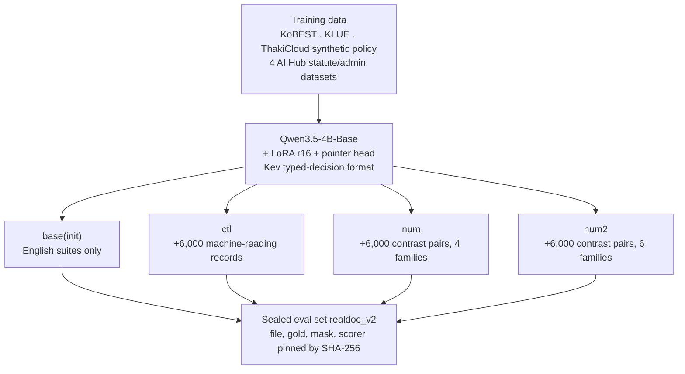
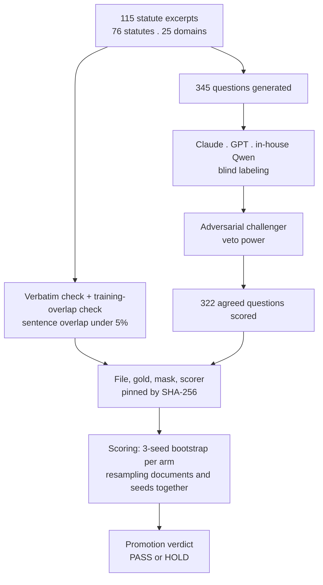

This post is for engineers who train domain decision models on small GPUs, especially teams that need to get numbers right inside Korean statutes or administrative excerpts. The short version: adding 6,000 contrast pairs whose gold answers are computed by code, not labeled by a human or another model, raised accuracy on a sealed evaluation set by 13.8 percentage points, and nearly all of that gain landed inside one question type that asks the model to reason about a number.

ThakiCloud released this model under the name K-Decision. It is a 4B Korean typed-decision model that takes a statute clause or an administrative excerpt together with a typed question and outputs calibrated probabilities instead of generating a sentence. The weights are on Hugging Face at `ThakiCloud/kd-4b-ko-v0` (https://huggingface.co/ThakiCloud/kd-4b-ko-v0), and the recommended adapter is `kotdaihubv2num2-s1`. The base model carries an Apache 2.0 license; only the weights are released, and several of the training datasets are not redistributed. This post covers how the model was trained, what the contrast pairs actually changed, and where they did not.

*A visual metaphor for the article's key idea.*

## A model that reads probabilities instead of generating text

The problem K-Decision solves is not free text generation but typed decision making. The input is a single text state, an excerpt copied verbatim from a statute or an administrative document, paired with one question in a predefined format. There are three question types. `choice` picks one option among several. `noul` assigns an independent yes or no to each label. `score` picks a rung on an ordinal or numeric scale. For all three types, instead of generating the next token, the model reads out a calibrated probability distribution in a single pass.

The architecture is Qwen3.5-4B-Base with a LoRA adapter at rank 16 and a pointer head on top. Output follows the Kev typed-decision format, and the readout is non-autoregressive rather than generative. The arm that appears most often in this post, base (init), is the Kev-4B recipe reproduced on top of Qwen3.5-4B-Base using English training suites only. In other words it is a starting point that has not seen a single line of Korean, and it serves as the baseline against which the other three arms are measured.

The Korean training layer consists of KoBEST and KLUE converted into typed decisions, a small ThakiCloud synthetic policy-question set, and four AI Hub (한국지능정보사회진흥원) datasets covering administrative and legal documents: machine reading comprehension for administrative documents, machine reading comprehension for financial and legal documents, advanced text analysis of legal and regulatory text, and text analysis of legal and regulatory documents such as judgments and terms of service. All four are used for training only and are not redistributed, and the same holds for KoBEST and KLUE. On top of this shared layer, three arms diverge. The ctl arm received an additional 6,000 machine-reading records of the same size. The num arm received 6,000 contrast pairs built from four numeric families. The most recent arm, num2, received 6,000 contrast pairs built from six numeric families. The control arm exists for one reason: to separate whether a gain comes from the specific nature of contrast pairs, or simply from having 6,000 more examples of any kind.

*The path from data to evaluation. All four arms share the same architecture and the same Korean training layer, and diverge only in the final 6,000-example increment.*

## Contrast pairs whose gold answer is computed by code, not by a person

The core of the num2 arm is 6,000 program-generated contrast pairs. A contrast pair is two nearly identical documents that differ in exactly one number, where that difference flips the correct answer. If a cap amount is written in 원 in one document and in 만원 in the other, that single unit conversion is enough to flip whether the cap is exceeded, from yes to no or the reverse. The six numeric families are unit conversion between 원 and 만원, day arithmetic, fractions, cap exceedance, reduction denominators, and interest-rate arithmetic. The gold answer for each pair is not labeled by a person or scored by another model; it is computed by code at the moment the pair is generated, which removes label noise from the source.

The earlier num arm used only four of these six families. The current num2 arm uses all six. Both versions hold the total number of contrast pairs fixed at 6,000, so the move from num to num2 adds diversity across families rather than more data. This design lets the results below be read along two separate axes: the gain from the nature of contrast-pair data itself (num and num2 versus ctl), and the additional gain from widening coverage from four families to six (num2 versus num).

## What counts as evidence: 322 sealed documents decide

realdoc_v2, the evaluation set behind these numbers, consists of 115 excerpts copied verbatim from real statutes, spanning 76 statutes across 25 domains. There are 345 questions in total, of which 322 are actually scored. That subset of 322 is defined by agreement: three model families, Claude, GPT, and an in-house Qwen model, label each question blind to one another, and only questions where all three agree are kept. An adversarial challenger sits on top of that agreement with veto power; if the challenger objects to a question the three families agreed on, it is dropped.

The documents themselves are checked as well. Each excerpt is verified against an independently refetched copy of the source page, and sentence-level overlap with the training data is checked to stay at or below 5 percent. Before any model is scored, the evaluation file, the gold answers, the mask, and the scorer are all pinned by SHA-256 hash. This seal is used exactly once per promotion decision; design choices are made on separate development sets instead. One question is worth roughly 0.31 percentage points. One limit worth stating plainly: the gold labels for these 322 questions were not validated by a human, they were set by consensus across three model families, and that fact should stay in view whenever these results are interpreted.

*The gate that decides what counts as evidence. Resampling documents and seeds together is the fix described in the methodology section below.*

## The gap that survives is in numeric questions

Overall realdoc_v2 accuracy is 79.0 percent for base, 88.0 percent for ctl, 92.2 percent for num, and 92.7 percent for num2 (one published seed reaches 92.9 percent). Paired differences across three seeds, with 95 percent confidence intervals, are shown below.

| Comparison | Difference | 95% CI |
|---|---|---|
| num2 vs base | +13.8pp | [10.2, 17.6] |
| num2 vs ctl | +4.8pp | [2.1, 7.7] |
| num2 vs num | +0.5pp | [-1.3, 2.4], not significant |

The first thing worth reading off this table is that num2 does not differ significantly from num on overall realdoc_v2 accuracy. Widening coverage from four numeric families to six does not move the overall score much. The other two comparisons are different: both num2 versus ctl and num2 versus base have confidence intervals that stay clear of zero. The nature of contrast-pair data beats simply adding more data of any kind.

But this overall number blends question types together, which hides where the gain actually came from. Split by type, the picture changes completely. Base scored 96.3 percent on `choice` and 86.8 percent on `noul`; all three Korean-trained arms reach 97 percent or more on both, so these two types are solved by Korean data alone and barely separate the arms. `score` keeps the gap alive: 57.4 percent for base, 65.7 percent for ctl, 77.8 percent for num (seed 1). The 4.8-point margin between ctl and the contrast-pair arm most plausibly comes from `score`.

*Left: realdoc_v2 accuracy by arm. Right: accuracy on numeric families never seen during training.*

Since `score` questions are mostly numeric judgments, the next question is whether this training generalizes. Answering that requires numeric families that were never templated during training. On that held-out set, overall accuracy is 53.1 percent for base, 59.7 percent for ctl, 71.1 percent for num, and 75.8 percent for num2. Breaking that down by family, compound calculation shows base at 46.8 percent, ctl at 61.0 percent, num at 56.8 percent, and num2 at 64.8 percent, an 8.0-point lead for num2 over num (CI [5.5, 10.5]), confirmed again across three seeds as a 5.06-point lead over ctl (CI [2.56, 7.83]). Age arithmetic shows a similar pattern, with num2 ahead of num by 5.3 points (CI [3.2, 7.7]). Per-unit calculation shows num2 ahead of num by 0.8 points, but that difference is not significant.

Interest-rate arithmetic is a different story. Despite 1,032 training examples covering it, in-family accuracy after training still sits around 51 percent. That means the model has not learned the compound operation of multiplying an amount by a rate and dividing by 365 days. Set against the clear gains in the other five families, this failure reads as a problem with that specific operation's structure rather than a shortage of data.

OOD-v2, a synthetic out-of-distribution set with 1,510 questions across 298 contrast-pair clusters and 10 domains, shows num2 ahead of base overall by 10.8 points (CI [8.16, 13.30]). `choice` moves by 2.8 points (CI [-0.73, 6.37]), which establishes non-inferiority within 1 point, while `noul` moves up by 1.4 points (CI [-1.27, 4.07]) without yet establishing non-inferiority within 1 point. One caveat matters here: the `score` items in OOD-v2 overlap the numeric distribution seen during training, so this overall gain should not be read as evidence of out-of-distribution generalization on its own.

On ko_reviewed, a set of 124 Korean policy-snippet questions, num2 actually scored 1.9 points below base, though the confidence interval [-5.42, 1.68] spans zero and is not significant. On the earlier development set realdoc_v1 (57 questions, 20 excerpts), kd num seed 1 reached 98.2 percent, the TypeSafe Jev API reached 97.4 percent in a single zero-shot run, and an in-house Qwen3.8-27B NVFP4 model prompted zero-shot reached 80.4 percent. This sample is too small to use as grounds for ranking any of these systems against each other.

## What went wrong the first time we counted contrast pairs

One methodological mistake is worth a short note. The first promotion verdict treated the two halves of each contrast pair as independent samples and ignored variance across training seeds. That made the confidence interval look tighter than it actually was, and a PASS verdict was called on that basis. An external review caught the problem, and after clustering pairs together and resampling across both documents and seeds, the verdict for `noul` flipped to HOLD. Every number in this post already reflects that corrected method. The lesson generalizes beyond this one model: when scoring contrast pairs, never count the two halves of a pair as independent samples, and always fold seed-to-seed variance into the confidence interval. Skipping either one is enough to overclaim.

## Implications for ThakiCloud's products

This work touches all three product lenses. Through the Maxis lens, K-Decision is a concrete case for the pipeline of training and distilling small domain models directly. Designing a training signal whose gold answer is computed by code, as the contrast pairs do here, lets a team target a specific failure mode, in this case numeric judgment, without paying for human labeling. Through the Metis lens, a 4B model with a LoRA adapter is cheap to serve. Because the readout is non-autoregressive rather than generative, latency stays low, which makes it practical to run large volumes of statute or terms-of-service judgments at low cost.

The most direct connection is to Paxis. Paxis is ThakiCloud's core product for automating enterprise digital work with AI agents, and those agents operate under human approval and audit. An agent that has to render an auditable decision grounded in a regulation needs more than free-text generation; it needs calibrated probabilities and traceable reasoning it can log. The typed-decision approach K-Decision demonstrates, fixed question types answered with probability distributions rather than prose, fits that auditability requirement directly. Placing a small typed-decision model like this inside the judgment layer of a regulation-aware Paxis skill lets the audit log carry both the verdict and its confidence, without calling a large model on every single decision.

## Limits and counterarguments

A few limits should stay attached to these results. First, the gold labels for realdoc_v2 were not validated by a human; they were set by blind consensus across three model families, and any shared bias across those three families could be baked directly into this evaluation set. Second, some operations resist learning even with more than a thousand training examples, as interest-rate arithmetic shows; contrast-pair data is not a universal fix. Third, the overall gain on OOD-v2 should not be overread as pure out-of-distribution generalization, since its `score` items partially overlap the training distribution. Fourth, on ko_reviewed, num2 actually scored below base, and even though that gap is not statistically significant, it should not be hidden behind a narrative of consistent wins across every set. Fifth, it is worth restating that num2 does not significantly beat num on overall realdoc_v2 accuracy; the benefit of widening from four numeric families to six shows up clearly only in specific held-out families such as compound and age calculations, and the overall average does not fully capture that improvement. None of this makes the model useless. It means knowing precisely which question types and which numeric families it can be trusted on.
