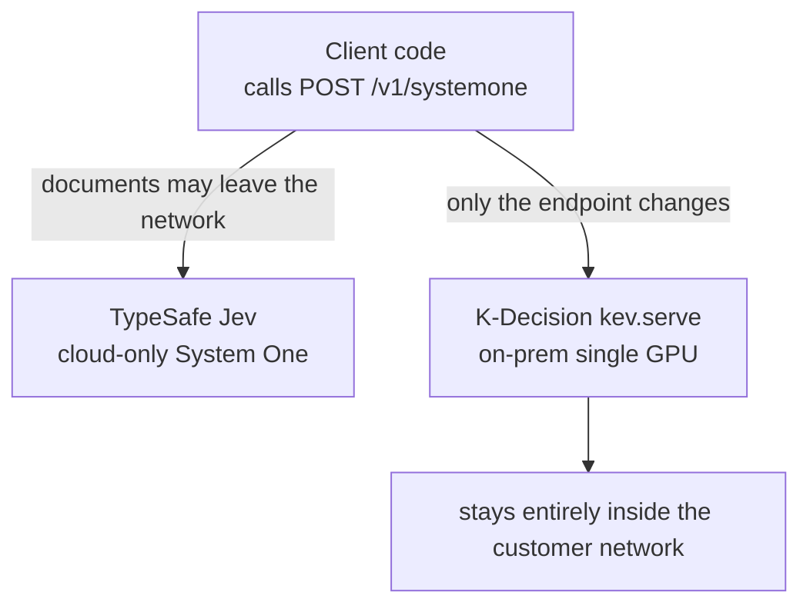
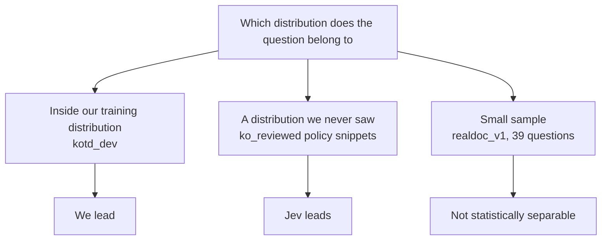

This post is for engineering leads at Korean enterprises in finance, public sector, and insurance who are evaluating decision APIs. The short version: TypeSafe's Jev created the decision model category, a model that takes state and a typed question and returns calibrated probabilities instead of text, and ThakiCloud built a Korean, on-prem counterpart that exposes the same API shape so we could run the same questions through both. Some sets we win, some we lose, and one decisive comparison is still missing.

How this model was trained and what the contrast pairs actually changed is covered in the earlier post, [Teaching a 4B Model to Judge Numbers in Korean Statutes](/tech-blog/en/research/k-decision-4b-numeric-contrast-pairs/). This post puts that model next to Jev.


*A visual metaphor for the article's key idea.*

## A new category: the decision model

Jev is System One, a decision model TypeSafe released on September 15, 2026. Instead of generating free text, it takes a document state and several typed questions and outputs calibrated probabilities directly. There are three question types. `choice` picks one option among several. `noul` assigns an independent yes or no to each label. `score` picks a rung on an ordinal or numeric scale. Jev is available only as a cloud API, and a handful of English-focused open clones already exist, but there was no Korean-language version.

The format is why this category matters. A free-text generation model can produce an answer, but there is no clean way to log how confident that answer was; a sentence like "it looks like yes" does not distinguish a 51 percent judgment from a 99 percent one, and a human reviewer has to re-read and re-interpret the text to recover that. A decision model fixes the question type up front and answers only with a probability distribution, so the verdict and its confidence land in the audit log together. For automated workflows that have to justify a decision against a regulation, that difference is not cosmetic.

It is also worth noting that Jev created this category first. English open-source clones have already tried to reproduce the System One format, but all of them target English documents. None handle Korean statutes or administrative text, with their dense Sino-Korean legal terminology and particle-heavy sentence structure. That is the gap K-Decision tries to fill.

## Why we matched the API shape

ThakiCloud built the Korean, on-prem version of this category under the name K-Decision. It is kd-4b-ko-v0, a reproduction of Jared Palmer's open recipe (`jaredpalmer/kev-4b`) on top of Qwen3.5-4B-Base with a LoRA adapter at rank 16 and a pointer head. The weights are on Hugging Face at `ThakiCloud/kd-4b-ko-v0`, and the recommended adapter is `kotdaihubv2num2-s1`.

One design choice was deliberate. The serving layer, `kev.serve`, exposes `POST /v1/systemone`, so code written against Jev's API can point at our endpoint by changing only the URL. Here is what a request and its answer actually look like, copied from the server schema (`kev/api.py`).

```json
POST /v1/systemone
{
  "state": {"document": "Article 61 (Old-age pension eligibility) (1) A subscriber with 10 or more years ..."},
  "questions": {
    "q1": {"type": "choice", "instructions": "When does the pension start in this case?",
           "criteria": {"a": "age 60", "b": "age 62", "c": "age 65"}},
    "q2": {"type": "noul", "instructions": "Can the payment be deferred?"}
  }
}

→ {"q1": {"type": "choice", "choice": "c", "confidence": 0.93,
          "probabilities": {"a": 0.02, "b": 0.05, "c": 0.93}},
   "q2": {"type": "noul", "noul": 0.97}}
```
*Values are illustrative; field names and structure are exactly the server schema.*

One request carries one document state and several questions, and each question comes back as a probability distribution. Our server inherits this format from the Kev recipe, which was designed to follow TypeSafe's System One format (`POST /v1/systemone`), so code that calls TypeSafe's API directly only needs a new URL. One difference is worth stating. In this comparison we reached Jev through the Vercel AI Gateway, which uses a different wrapper (`/v1/evaluate`) and rejects `score` questions with more than 10 rungs; code written against the gateway needs its path and response parsing adjusted once.

The reason to match this shape precisely is simple. Many customers in finance, insurance, public sector, and defense in Korea cannot send documents, or even excerpts, outside their own network. Since Jev exists only as a cloud API, those customers need a version of the same API shape that runs entirely inside their network on a single GPU. API compatibility, meaning no rewritten client code, only a swapped endpoint, is meant to remove the switching cost almost entirely.



*The same request shape can go to either destination depending on the deployment. The code does not change.*

## Same questions, three sets, head to head

We ran the same questions through our model, using three training seeds, and Jev, run once per set because of the free-tier rate limit, on three separate sets. Confidence intervals resample documents and, on our side, training seeds together.

| Set | Ours (num2) | Jev | Difference |
|---|---|---|---|
| Korean statute excerpts realdoc_v1, the 39 questions Jev accepted | 98.8% | 97.4% | +2.6pp [0, 8.6], not significant (about one question) |
| Korean policy snippets ko_reviewed, 119 questions | 83.1% | 93.3% | -8.4pp [-14.9, -2.5], Jev significantly better |
| Korean benchmark tasks, KoBEST plus KLUE, kotd_dev, 1,981 questions | 87.7% | 81.8% | +6.0pp [4.2, 7.8], but this favors us since it is in-distribution for our model |

The first row already hides a catch worth noting. Jev's gateway rejected any `score` question with more than 10 rungs on its scale, so only 39 of the 57 statute questions in realdoc_v1 could even be compared; the other 18 never entered the contest. On a different profile measured earlier, Jev's weakest type was also `score`, at 71.4 percent on 62 meta questions. Our num2 adapter targets exactly that type, the numeric judgments inside `score` questions. On a separate, sealed 322-question statute set, num2 gained 13.8 percentage points over base (CI [10.2, 17.6]), and the previous post showed that the gap to a same-size control that survives is in `score` questions.

The third row deserves the same honesty. kotd_dev converts KoBEST and KLUE into typed decisions, and our model trained directly on that data. So the +6.0 points there is a comparison that structurally favors us. A fair reading has to weight the second row, the policy-snippet set we never trained on, more heavily.

And on that second row, Jev won. On the 119 ko_reviewed questions we scored 83.1 percent against Jev's 93.3 percent, and the confidence interval stays clear of zero, which makes the gap significant. Accepting that gap plainly is part of the point of this post.

Summarized in one line: we win where we trained directly, Jev wins where we never saw the distribution, and the sets with small samples do not separate the two systems statistically. That pattern is not surprising. Different training coverage should produce different out-of-coverage performance. The real question is not whether this pattern exists but how fast that coverage gap can close.


*Our reading of the three sets in terms of distance from the training distribution; the causal claim is not yet tested.*

## Is the gap capacity, or just missing coverage

There is one clue that separates a capacity ceiling from a coverage gap. A different adapter of ours, kotdsyn-s1, trained on a small synthetic policy-question set built by the same generator as ko_reviewed, scores 93.5 percent on that same ko_reviewed set, which is effectively tied with Jev's 93.3 percent (+1.7pp, CI [-4.1, 7.4]).

That single result does not rule out a capacity limit on its own, but it does support the hypothesis that coverage explains most of the gap. If num2 had seen more data with the texture of policy questions, a meaningful part of that 8.4-point gap likely would have closed. We want to state plainly that this remains a hypothesis rather than a confirmed result.

This lines up with a pattern from the previous post. On the 322-question statute set, num2's margin over the same-size control opened up mainly on `score` questions, the numeric ones. ko_reviewed demands more than numeric judgment; it requires the style and logical structure of policy documents more broadly, and num2's weakness there is plausibly explained by never having seen enough training data with that particular texture. kotdsyn-s1's result is a first signal that even a small nudge in that direction closes most of the gap.

## What is not measured yet

The most decisive comparison has not happened yet. That is running Jev against our sealed 322-question statute set, realdoc_v2, excerpts spanning 76 statutes and 25 domains with the file, gold answers, mask, and scorer all pinned by SHA-256. The previous post already closed the comparison across our own arms on that set. Running Jev against the same set would put both systems on the same solid footing, but as of this writing that run has not been made. It is the next measurement to take.

We did measure our latency this time. Serving bf16 on one H100 and sending the 115 sealed statute requests one at a time (one excerpt with about three questions each), we got p50 115 ms and p95 189 ms once kernels were warm. The first pass, with warm-up included, had p50 210 ms, and fp32 serving had p50 358 ms. Our target was p50 under 100 ms inside the customer network, so on an H100 in bf16 we are about 15 ms short. Switching to bf16 cost two of 322 questions (fp32 0.929, bf16 0.922). These are single-stream latencies with no concurrent requests, not throughput. We are not quoting a Jev latency figure at all. The access we had was a rate-limited free tier, and a number measured under that condition would say nothing more than "this is a cloud API."

## Why on-prem is a requirement, not an option

Many finance, insurance, public sector, and defense customers in Korea cannot send documents, whole or excerpted, outside their own network. Since Jev exists only as a cloud API, it is not even a candidate for customers under that constraint. K-Decision was designed to run entirely inside the customer network on a single GPU, and that constraint is as much the reason this project exists as the API compatibility is.

There is a related constraint on the data side. Weights trained on AI Hub (한국지능정보사회진흥원) data may be published, but the data itself may not leave the country. So K-Decision releases weights only and does not redistribute some of the datasets used in training. On-prem deployment and the data export restriction come from unrelated reasons, but they point in the same direction.

Put those two constraints side by side and it becomes clear why K-Decision needs to exist for reasons beyond "it is better at Korean." Training the same API shape outside the cloud, on data that cannot leave the country, and serving it so it never leaves the customer network, is the minimum bar this category's Korean-market version has to clear. Accuracy comparisons are a second question that only matters once that bar is cleared.

## Implications for ThakiCloud's products

This work sits at the center of Paxis and reaches into two other product lenses. Paxis is ThakiCloud's central product for automating enterprise digital work with AI agents, and an agent that has to justify a decision against a regulation needs calibrated probabilities and traceable reasoning in its audit log, not free text. Placing a decision model like K-Decision in the judgment layer of a Paxis agent gives that agent the same API shape Jev pioneered, together with a verdict and confidence it can log, without ever sending a document outside the network.

Through the Maxis lens, training a small decision model like this directly inside a customer's own network is itself a product capability. Maxis supports training, fine-tuning, and distillation running inside the customer's network, and K-Decision's training pipeline is a concrete instance of that. Through the Metis lens, a 4B model with a LoRA adapter keeps serving costs low. And Aegis speaks most directly to the customers this whole comparison is about: those in finance, insurance, public sector, and defense who cannot let documents leave an air-gapped or fully on-prem deployment.

## Limits and next steps

A few things need to stay attached to this comparison before it is taken at face value. First, most of the Jev comparison rests on a single run per set. Our side resamples across three training seeds, but Jev could not be rerun under the free-tier limit, which leaves Jev's side of the comparison with effectively no confidence interval of its own. Second, the loss on ko_reviewed is real and statistically significant; the hypothesis that more coverage would close it is a hypothesis, not a confirmed result. Third, the most decisive comparison, Jev against realdoc_v2, has not been run, and the conclusions here stay provisional until it is. Fourth, we measured only our own latency (single stream on an H100); Jev's was never measured under comparable conditions, so latency should be read as our absolute number, not as a ranking.

What comes next is clear: run Jev against realdoc_v2 on the sealed benchmark, add ko_reviewed-style policy-question data to the num2 training layer and check whether the gap actually closes. Latency is 15 ms short of the 100 ms p50 target, so serving optimization follows. Until those two land, the comparisons in this post should be read as an interim report, not a final verdict.

The pipeline a customer would actually run, bringing their own documents through Maxis training and a Metis serving endpoint, is covered next in [A Korean Decision Model Trained on Maxis and Served on Metis](/tech-blog/en/llmops/k-decision-maxis-metis-pipeline/).
