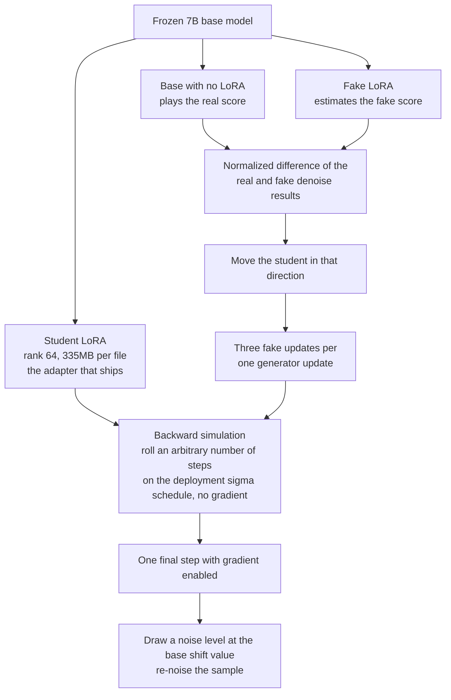

For teams running image generation in production and watching the GPU bill climb, here is the short version: dropping a single LoRA adapter onto Qwen-Image-2.1 takes 40 sampling steps down to 8, or even 5, and quality comes out ahead of the original rather than behind it. We released both adapters on [Hugging Face](https://huggingface.co/ThakiCloud/Qwen-Image-2.1-FewStep-v0.1), with supporting material in the [collection](https://huggingface.co/collections/ThakiCloud/qwen-image-21-few-step-distillation-6ab84f9aeaeed75d3a78e38a).

## What we shipped

Qwen-Image-2.1 is a 7B single-stream DiT paired with a Qwen3-VL-8B text encoder, and a single checkpoint handles both text-to-image generation and editing with up to 10 reference images. What we built leaves that model untouched and adds two new rank-64 LoRA adapters on top, 335 MB each. One targets 8 steps, the other 5. Both ship under the Qwen Research License, non-commercial.

<!-- nlm-visual -->

*Infographic generated by NotebookLM from the sources.*

## Why this problem is interesting

The trigger for this work was PrunaAI's release of Pruna-Qwen-Image-2.1 on September 23, a 5-step and 8-step LoRA claiming up to 6.3x speedup. The only disclosure was "based on DMD" and a note that their v0.1 falls short of base quality. No quality numbers accompanied the release. We opened the published safetensors header ourselves and found rank 64 with the same 7 target modules per block as our own setup. What stood out more was the sigma schedule: computing the 8-step sigma list showed it was simply a uniform grid pushed through a shift value of 2, and that value is exactly the base scheduler's own dynamic shift at 1024x1024 resolution (exp(mu)=2.0). It is not an optimized schedule; it is the scheduler's default carried over unchanged.

There is a second detail worth calling out. Qwen-Image-2.1's own recommended recipe already runs 40 steps with CFG turned off (true_cfg_scale set to 1). The base model is already guidance-distilled, so being "CFG-free" is not a differentiator anyone can claim credit for. The real cost sits elsewhere: the teacher still has to run one full forward pass per call, and the actual problem is how far you can collapse those 40 iterations.

## How we trained it

We built our own DMD2 trainer on top of diffusers. One frozen 7B base model carries two LoRA branches on top: the student that actually ships, and a fake-score branch. The base model without any LoRA attached plays the role of the real score.

The core mechanic is backward simulation. The student rolls forward along the deployment sigma schedule for a randomly chosen number of steps with no gradient, then takes one final step with gradient enabled. It is then re-noised at a noise level drawn using the base model's own shift value, and the normalized difference between what the fake and real branches denoise to becomes the direction the student moves in. The fake branch gets updated three times for every one update of the generator.

The whole loop, at a glance:

The full run was 1,200 generator updates at a global batch size of 4, at 1024 squared resolution. It fit on a single B200 with 42 GB of memory. The 8-step v2 run took 2.7 hours on one B200; the first 8-step attempt took 1.5 hours on two.

Training used 33,000 prompts in total: detailed FLUX-style prompts under an MIT license, short SD-style prompts, and synthetic text-rendering prompts in English, Korean, and Chinese. In v1, text-rendering prompts made up 24% of the mix, and abstract prompts like "insight" pushed the model into painting nonsense text into the image. Dropping that share to 8% in v2 fixed it.

## One bug worth a paragraph

At one point during training the student branch stopped receiving any gradient at all. The cause was torch.autocast: it caches the bf16 cast of a leaf weight for the entire autocast region. The teacher rollout call runs under no_grad and casts first, and that cached tensor then gets silently reused when the student's own forward pass runs, quietly detaching the graph. The fix was making every call cast explicitly instead of relying on the cache.

## What the numbers actually show

We evaluated on 500 prompts: 200 stratified from PartiPrompts, 200 from DrawBench, and 100 text-rendering prompts split across English, Korean, and Chinese. Everything ran at 1024 squared with a fixed seed per prompt on a single B200. The metrics were PickScore, CLIP-H, and OCR accuracy judged by Qwen3-VL-8B.

| Setup | PickScore | CLIP-H | OCR accuracy | CER |
|---|---|---|---|---|
| Base, 40 steps | 22.31 | 35.02 | 95% | 3.2% |
| Base, 8 steps, no adapter | 21.47 | 34.24 | 81% | 9.6% |
| Pruna, 8 steps | 22.02 | 35.00 | 91% | 4.4% |
| Ours, 8 steps (v2) | 22.47 | 34.66 | 99% | 0.5% |
| Base, 5 steps | 21.35 | 34.29 | 82% | 10.2% |
| Pruna, 5 steps | 21.94 | 35.10 | 87% | 6.2% |
| Ours, 5 steps | 22.34 | 34.35 | 99% | 0.1% |

Our 8-step adapter wins on PickScore against Pruna's 8-step in 68% of head-to-head comparisons, and against the 40-step base in 59%. The 95% bootstrap confidence interval puts the margin over Pruna-8 at +0.38 to +0.53, and the margin over base-40 at +0.09 to +0.23. Our 5-step adapter still wins against Pruna's 8-step 69% of the time on PickScore, meaning it beats a competitor running three more steps than it does.

## How fast is it

All numbers are on a single B200 at 1024 squared, batch size 1, bf16, including text encoding and VAE decode.

| Setup | Time per image | Speedup |
|---|---|---|
| Base, 40 steps | 3.69 s | 1.0x |
| 8 steps, unfused | 0.92 s | 4.0x |
| 8 steps, fused | 0.82 s | 4.5x |
| 8 steps, fused + torch.compile | 0.66 s | 5.5x |
| 5 steps, unfused | 0.62 s | 5.9x |
| 5 steps, fused | 0.56 s | 6.6x |
| 5 steps, fused + torch.compile | 0.45 s | 8.2x |

One thing worth being honest about: the unfused numbers (0.92 s, 0.62 s) are essentially identical to Pruna's own unfused figures measured in the same harness (0.94 s, 0.64 s). The speedup beyond that point, from 4.0x to 5.5x and from 5.9x to 8.2x, comes entirely from kernel fusion and torch.compile, and that gain is available to any LoRA adapter, ours or Pruna's, running on the same stack.

## Where it still falls short

CLIP-H comes in 0.3 to 0.8 lower than both Pruna and the base model. On the PartiPrompts subset the gap essentially disappears (32.95 versus 32.93), but it widens on DrawBench and on the text-rendering slice. Part of that is likely PickScore rewarding the higher-contrast images DMD-style training tends to produce. The OCR evaluation also shares templates and a word pool with the training prompts, so some of the text-rendering gain may be partly in-distribution rather than a generalization win. We did not train or evaluate the editing path, the multi-reference capability the base model supports. Everything here was validated at 1024 squared only, using automated metrics exclusively, and the license remains non-commercial.

## The ThakiCloud angle

On our Metis inference stack, this changes a single GPU from producing one image every 3.69 seconds to one every 0.45 to 0.66 seconds, which means 5 to 8 times more images per GPU in the same window. Just as important, the training itself was cheap: a single GPU, a few hours, and a recipe we can point at the next image model that comes along and reuse without rebuilding it from scratch. Commercial serving still requires sorting out a separate license with Qwen, and we want that stated plainly rather than glossed over.

<!-- nlm-visual -->

*Infographic generated by NotebookLM from the sources.*

## What's next

We're setting up a real-score CFG augmentation arm to close the CLIP-H gap, along with a proper evaluation of the editing path and a LongText-Bench pass for longer text rendering.
