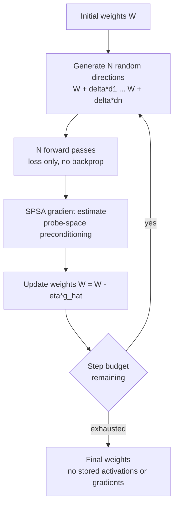

*Forward-only training with no stored activations, gradients, or optimizer state.*

> 📄 **Full deep review (DOCX)**: [Download the detailed peer review on Google Drive](https://drive.google.com/file/d/1bnsK_ar3q_a9JMWakJ9eGADVrb2OfRo9/view).

## Who this is for

ML engineers who train models on GPUs, and infrastructure owners who judge "will this job fit on this card" by memory numbers, should read this. The conclusion up front: zero-order optimization (ZOO) is no longer a "fine-tune an LLM on a laptop" trick. It has become an approach that **recomputes the memory budget**. The two Stanford papers published this week show, with numbers, a path to training OPT-30B in place on a single A100 without backprop (2609.38095) and a path to scaling ZOO pretraining by sharding experts (2609.37899). But there is still no evidence that ZOO replaces backprop for frontier-scale pretraining. What ZOO changes is not "who trains" but "which memory the training fits into."

## Overview

Samip Dahal (@industriaalist), a researcher at Stanford CRFM, posted on X on September 28 that he had found a way to pretrain transformers with zero-order optimization and no backprop, arguing that many core assumptions in optimization research are wrong and teasing "(paper out soon)." ([tweet](https://x.com/industriaalist/status/2104664427396276565))

One day after that tweet, two papers on exactly this topic were published on arXiv on September 29.

- [Probe-Space Preconditioning for Fast and Stable Zero-Order Training](https://arxiv.org/abs/2609.38095) (arXiv 2609.38095), by Francois Chaubard, Mykel J. Kochenderfer, Chris Ré
- [Scaling Zero-Order Pretraining through Model Sharding](https://arxiv.org/abs/2609.37899) (arXiv 2609.37899), by the same three authors

Both papers are by Stanford authors and share the premise that ZOO is relevant to forward-only hardware and non-differentiable losses. The tweet does not confirm that it points at these two papers specifically (it only says "paper out soon"). This post reads the current position of ZOO pretraining from the two papers' verified numbers, as the only public output matching the same direction, timing, and lab ecosystem. Samip Dahal is also a co-author of [q0: Primitives for Hyper-Epoch Pretraining](https://arxiv.org/abs/2606.03938), published in June.

## What is zero-order optimization

Standard deep learning training, backpropagation, uses **first derivatives (gradients)**. A forward pass produces activations and loss, a backward pass propagates that loss into gradients over the weights, and the optimizer updates. Computing gradients means re-walking the entire computation graph and applying every operator's derivative. That process comes back as three memory items: stored activations, gradient tensors, and optimizer state (Adam keeps first and second moments per weight).

Zero-order optimization **estimates the gradient from loss values alone**. It perturbs the weights in random directions, observes how the loss changes, and infers the gradient direction from those changes. No derivative is computed, so no backward path through the computation graph is needed, and the three memory items (activations, gradients, optimizer state) all disappear. That is what "inference-mode training" means.

The representative algorithm is SPSA (Simultaneous Perturbation Stochastic Approximation, Spall 1992). Getting a gradient estimate for all parameters from just two forwards per step (perturbed +1, -1) is a result from stochastic approximation in control theory. More recently, MeZO (Malladi et al., 2023) showed a path to fine-tuning LLMs without backprop, and ZOO started being treated as "a practical path, not a novelty." But ZOO has one structural obstacle: **the variance of the gradient estimate grows in proportion to the number of perturbed dimensions**. Ten times the model means a geometrically larger probe count for the same-quality estimate. This week's two papers answer that obstacle on "convergence rate" (2609.38095) and "scaling" (2609.37899), respectively.

## Backprop's memory tax

The starting point of both papers is backprop's memory cost. The abstract of 2609.38095 gives concrete numbers. Training OPT-30B with Adam requires about 600GB of GPU memory (assumptions: batch size 8, sequence length 2048). ZOO, in contrast, trains in **inference-mode**: about 60GB for the same model. No activations to store, no gradients, no optimizer state.

The gap matters because memory is the first constraint on today's GPUs. 600GB demands a distributed run across many cards, or a checkpointing trade-off (recomputation). At 60GB, "layering training onto the card that serves" becomes memory-feasible. The other ZOO application sites are forward-only hardware and non-differentiable losses: where gradients cannot be computed, ZOO is effectively the only path.

*The ZOO training loop. The backprop path (stored activations, gradient propagation, optimizer state) is all omitted. 1.5-SPSA from 2609.38095 adds one "clean forward" per step at stage D to build a diagonal preconditioner.*

## First paper: probe-space preconditioning (1.5-SPSA)

2609.38095 evaluates two things to close the gap where "ZOO's convergence lags backprop."

First, **re-allocating the compute budget**. Existing ZOO training has followed backprop's formula (many steps, small batches) as-is. The paper shows that moving the budget from "many steps" to "few steps, but many probes (perturbations) per step in a large effective batch" lets 1SPSA converge better than existing zero-order methods (MeZO et al.) with less training compute. The backprop intuition that "more training steps is better" does not hold in ZOO. That is the part that best matches Samip's tweet line that "many core assumptions in optimization research are completely wrong."

Second, **1.5-SPSA**. The "1.5" in the name means adding one "clean forward" per step. Unlike 1SPSA, which only sees perturbed forwards, it computes the loss once more without perturbation each step and builds a diagonal preconditioner in probe-space. This matrix down-weights updates along high-curvature directions, lifting both convergence rate and final quality. The extra cost is one forward per step, not the gradient path (stored activations + backward path).

Benchmarks run on six post-training datasets across the Qwen3 and OPT model families, and the abstract reports SOTA results over previous ZOO solvers "with far fewer optimization steps." The most striking number is OPT-13B: on SST-2, 1.5-SPSA reaches 3.1% higher accuracy than both MeZO and backprop, in **70 steps versus MeZO's 100,000**. The step counts differ by a factor of 1,400, so "per-step quality" and "per-compute quality" must be read separately (the Limitations section covers this).

A practical path is secured as well. Combining an 8-bit packed random generator, Triton fused unpack/apply kernels, and distributed parallelism, the paper reaches **in-place training of OPT-30B on an A100, a commodity GPU**. That is the number behind "30B training on a single serving GPU."

## Second paper: scaling pretraining with SOMA

2609.37899 answers ZOO's fundamental obstacle: **gradient variance grows in proportion to the perturbed dimension**. The larger the model, the more probes are needed geometrically for an equally good estimate, which blocks large-model training. The paper's proposal is SOMA (Sharded Optimization Mixture of Assemblies).

- N experts train **independently**, each with SPSA on its own of N data clusters.
- Experts do **not exchange gradients, activations, or optimizer state**.
- The separable loss (each expert's loss is decoupled) removes cross-expert perturbation noise. The trade-off: no jointly learned representation across domains.

Experiments ran at 8.44M parameters over a 150 aggregate GPU-hour budget (estimated RTX 5090 basis), with the full study estimating about 80,000 GPU-hours. Key results:

| Condition | 8.44M test nats/byte | WikiText-103 (frozen) |
|---|---|---|
| SOMA N=2, 64 probes | 1.76 | 2.07 |
| Monolithic SPSA, 64 / 256 / 1024 probes | 2.00~2.11 | 2.25~2.36 |
| EGGROLL | 2.21 | 2.49 |

The paper proves that, on a fixed separable objective, independent losses reduce relative gradient variance to about 1/N of a shared-loss estimator's. Running N=4 with equal-size blocks over three seeds, independent losses lower test loss by 0.035 nats/byte versus summed losses after 1,000 updates.

The interesting part is on the inference side. At similar model size with top-k routing (k=4), SOMA N=256 delivers 2.36M tokens/s versus 257k for N=8 (about 9.19x, including routing), with a lower test loss (1.68 versus 1.71). But N=256 spends 59.9x the aggregate training compute.

The reason this structure overlaps MoE (expert) inference is that training-time expert independence translates directly into routing efficiency at inference. The larger N, the smaller each expert, and top-k routing activates only some of the parameters per token (four experts here). "Model size" may be the same, but the parameters actually computed per step are limited by routing. SOMA buys this routing inference with a training-time cost (59.9x aggregate). It is buying inference bandwidth, not training efficiency. Both papers release all training and evaluation code plus checkpoints.

## Implications for ThakiCloud ai-platform

ThakiCloud's ai-platform sits on the side that runs training workloads on Kubernetes. ZOO changes the variables in three computations there.

First, **jobs placed per memory budget**. From Maxis's (the training product) perspective, whether the same GPU hosts one backprop job or one ZOO job is a difference in memory footprint. 600GB versus 60GB is the number that decides "can a serving card also train." In Kueue-based GPU scheduling, a job's memory spec is a first-order condition for queue admission, and ZOO pulls that spec down a notch.

Second, **the viability of forward-only hardware**. Training without gradients sketches a path to layering training onto serving-only hardware. "Serving and training on the same chip" changes in both memory and exclusivity in environments where ZOO holds. ai-platform's on-prem and sovereign environments are exactly where customers exist who cannot separate serving from training.

Third, **SOMA's communication contract**. No gradient exchange between experts redefines the network cost of data-parallel training. Where ZeRO-style systems "split state across storage," SOMA "does not exchange in the first place." In multi-node training where the network is the bottleneck (small clusters, on-prem), that difference is concrete.

## Limitations and counterarguments

Check whether this post has looked too favorably on ZOO.

- **Scale.** The SOMA experiments are at 8.44M parameters. The OPT-30B in 2609.38095 shows a **memory path** to in-place training, not proof of mathematical superiority at frontier scale above 30B. "Replacing backprop" is still a memory story, not a quality-or-scale story.
- **Transformers.** Samip's tweet says "pretrain transformers," but the sharding paper (SOMA) experiments on LSTM experts. The transformer-side ZO results stop at 2609.38095's post-training (Qwen3, OPT).
- **Comparison conditions.** "70 steps versus MeZO's 100,000" is a comparison whose step counts differ. Re-measuring per compute (equal FLOPs, equal memory-time) is the fairer comparison.
- **Cost.** The 9.19x inference bandwidth at N=256 must be read with the 59.9x training cost. It is a re-arrangement of the cost structure, not an efficiency gain.
- **The memory comparison baseline.** 600GB versus 60GB is under the assumptions stated in the abstract (batch size 8, sequence length 2048, Adam). The backprop side also has memory-reduction techniques (activation checkpointing, 8-bit optimizer state), so 600GB is the "unreduced baseline." ZOO's advantage over a reduced backprop is smaller, and the honest framing is ZOO as "one axis of the memory-compute trade-off," not "the only path."

## Takeaways

The two Stanford papers published this week lift ZOO from "a niche for fine-tuning" to "a memory-budget variable for pretraining." The number of training OPT-30B in place on a single A100 is the story that the serving/training boundary splits on memory. SOMA, which removes gradient exchange via expert sharding, shows that the training contract of network-bound small clusters can change. The practical takeaway for ThakiCloud is one: in the next GPU training capacity plan, **put ZOO into the variables when recomputing memory footprint as a first-order condition**. The moment quality superiority at frontier scale is proven, this post's "Limitations" section needs updating.

## Sources

- [Samip Dahal (@industriaalist) tweet, 2026-09-28](https://x.com/industriaalist/status/2104664427396276565)
- [Probe-Space Preconditioning for Fast and Stable Zero-Order Training (arXiv 2609.38095)](https://arxiv.org/abs/2609.38095)
- [Scaling Zero-Order Pretraining through Model Sharding (arXiv 2609.37899)](https://arxiv.org/abs/2609.37899)
- [q0: Primitives for Hyper-Epoch Pretraining (arXiv 2606.03938)](https://arxiv.org/abs/2606.03938)

> 📄 **Full deep review (DOCX)**: [Download the detailed peer review on Google Drive](https://drive.google.com/file/d/1bnsK_ar3q_a9JMWakJ9eGADVrb2OfRo9/view).
