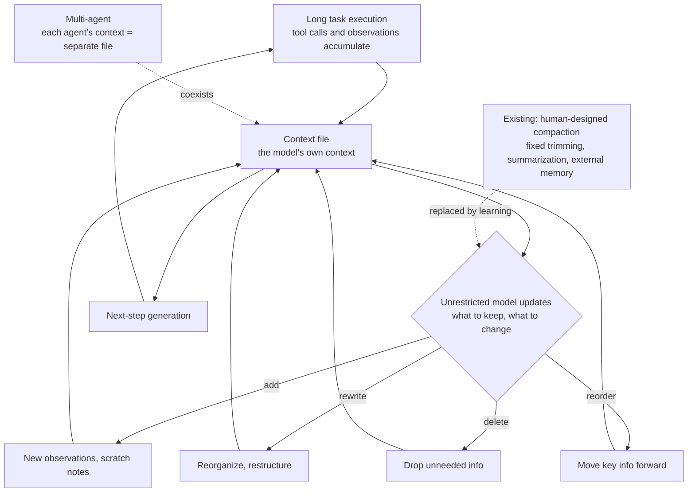

If you design context management for agents, or you run RL post-training on open models, this paper is worth your time. The conclusion up front: context management is becoming another layer where hand-designed heuristics lose to general learning. A Context Language Model (CLM) that treats its own context as a file it can rewrite freely beats the best human-designed compaction strategy on both accuracy and compute.

*The article's core concept, visualized.*

## Overview

Rich Sutton's Bitter Lesson is a well-known observation: in the long run, approaches that scale compute generically outperform those built on human-specific domain knowledge. The era of hand-tuning one technique at a time ended in search, in games, and in translation, and it has been moving through the stack layer by layer.

Context management appears to be the next layer. In September 2026, Meta's Facebook Research published Context Language Models (CLMs) with Rulin Shao et al. as authors (coverage also cites University of Washington as a collaborating affiliation). The paper is arXiv 2609.37725, and the official code repository is open at facebookresearch/context-language-models.

The claim is simple. If you treat the model's context as a file and let the model make unrestricted updates to it, you outperform any human-designed context-management strategy. Existing approaches — compaction, fixed trimming and summarization heuristics, external memory systems — all follow the pattern "the harness decides." CLMs invert it: "the model decides."

## In Plain Terms

A desk analogy makes it easy. In the classic agent, paperwork piles up on the desk until staff (the harness) come in to tidy it. Which files get summarized, which get thrown away, which get moved to a cabinet (external memory) — all decided by staff rules. The rules work for a while, but every time the nature of the case changes, the rules must be rewritten.

CLMs change who does the tidying. The person handling the paperwork (the model) tidies their own desk. Important notes go to the front, already-used files get folded to one side, files no longer needed get discarded. No tidying principle is set in advance; instead, sessions in which the work went well are rewarded for "how the desk was kept," and the model learns the principle itself.

Moving from staff-tidying to self-tidying changes two things. First, tidying happens inside the flow of work, so it carries situational judgment. Second, desk maintenance moves into training, so new kinds of cases require fewer rule rewrites. That second point is exactly what the Bitter Lesson is pointing at.

For agent workloads the stakes are significant. Agents run long tasks. Tool-call results accumulate, intermediate state changes, and early instructions collide with later observations. Who governs the context, and how, determines task success. From a ThakiCloud vantage point the implications split two ways: for Paxis, the agent control plane that treats skills, tools, policies and audit logs as first-class resources, it is a context-management policy design question; for Maxis, the training infrastructure that runs RL jobs on K8s, it is a new training objective.

## What Context Language Models Are

A CLM is a language model that manages its own context natively. The keyword is native. In existing approaches, context management happens outside the model. When a turn grows long, the harness summarizes, trims older messages, or retrieves needed information and stitches it back in. The model merely consumes the result.

CLMs instead treat the context as a document the model writes. The model may do all of the following to its own context:

- **Add**: new observations, tool results, scratch notes.
- **Rewrite**: reorganize and restructure existing content.
- **Delete**: drop information that is no longer needed.
- **Reorder**: move what matters for the next step forward.

These updates are unrestricted. No harness rule says which part must change or when. The model decides what to keep and what to discard.

Three points make this interesting.

First, it works zero-shot. Without additional training, applying the paradigm on top of an existing model reportedly outperforms SOTA context-management strategies. In-context learning and online reinforcement learning can push it further.

Second, the context-maintenance policy becomes a learning objective. In RL training, "which information to keep, when to compact" connects directly to the reward. Compaction stops being an inference-time heuristic and becomes a training-time objective.

Third, it extends to multi-agent settings. Several agents' contexts coexist as separate files. Each agent maintains its own file and interacts with the others as needed. According to coverage, in multi-agent settings the models kept context size low while maintaining in-context scoreboards — an emergent behavior. They were also reported to create internal "notes" while rewriting and to perform numerous in-place edits while suppressing context growth.

*The core CLM structure: context as a file the model updates, replacing human-designed heuristics with a learned maintenance policy.*

## The Reported Results

The numbers below come from the paper and coverage, not from ThakiCloud replication.

The headline result: zero-shot CLMs reportedly beat SOTA context-management strategies by 11.4% accuracy while using 21.5% fewer FLOPs, on the BrowseComp-Plus benchmark at 21k context. That is not just "more accurate" — it is "more accurate and cheaper" at the same time.

Online RL amplifies it. On Qwen3.5-9B, performance improved 47.6% with 12% fewer FLOPs, per the reports. The zero-shot paradigm gain is further extended by training. The fact that this number comes from a 9B-class open model shows CLMs are not a fixture of large closed models only.

BrowseComp-Plus is a benchmark that requires finding answers in a fixed, human-verified corpus of roughly 100k documents (median document length 5,179 words) instead of live web search — a measure of a web agent's context-management ability. Notably, in the paper's retriever-tool setting every method used at most 512 context tokens. The gains, in other words, come from how context is maintained, not from how much of it can be held.

Supplementary results cover TerminalBench 2.1, TBLite, and BrowseComp-Plus at various model sizes (Appendix F). This is not a single-benchmark finding.

## ThakiCloud Product Implications

**Paxis lens**: Paxis treats Skills, Tools, Policies, and Audit Logs as first-class resources in its agent control plane. The CLM "context file" is the next item on that list. How an agent maintains its own context is, like skill selection or tool calling, first-class behavior that should be constrained by policy and traced by audit. If a model rewrites its context freely, the rewrite history becomes the core of the audit log. You can only retrospectively diagnose errors caused by self-editing if you can track which observation was compacted into which note, and which information was deleted. The multi-agent context-file coexistence structure sits directly on Paxis's DAG multi-agent orchestration: when each agent's context is a separately managed file, the dependencies and versions between files become part of the orchestration state.

**ai-platform (Maxis) lens**: "RL with context compaction as the training objective" is exactly the kind of post-training experiment Maxis runs. Standing up an RL job on a Qwen3.5-9B-class model with a context-maintenance objective on K8s and the Kueue GPU queue is a self-contained experiment. If the paper's reported 12% FLOPs reduction holds, the payoff is dual: lower training cost and lower inference-time prefill load. From a serving vantage point, prefill is the source of cache-miss cost, so a model that keeps its context short and dense moves the serving unit price directly. If you queue this experiment, the reward design must score context size and task success together. Rewarding size alone produces a model that over-discards; rewarding success alone lets context bloat again.

## Limitations and Counterarguments

The Bitter Lesson is a powerful frame, but this paper does not complete it. The evidence is a single paper, on a bounded set of benchmarks — BrowseComp-Plus, TerminalBench 2.1, TBLite. Generalization to production agent workloads (harnesses with hundreds of tool schemas, multi-hour sessions, state synchronized with external systems) is unverified [estimate].

CLMs introduce new failure modes. If the model rewrites its context, the rewrite can corrupt information: self-contradictions can seep in, critical observations can be deleted, and notes can drift from the source data. With classic compaction, a summarization heuristic made the decisions, so it was easier to trace what got summarized. With CLMs, the model's autonomous judgment makes it more expensive to retrospectively find what was edited wrong. The community has openly asked what happens when a session's context falls into self-contradiction.

The RL path (Qwen3.5-9B +47.6%) costs training compute. The zero-shot path (+11.4%) requires no extra training but presumes a capable base model. Which path nets out on which workload needs workload-level measurement. Remember also that the results come from a 512-token context setting. In this paper, CLM gains come from "how the given context is maintained," not "how long the context can be." Context extension and context maintenance are being treated at different layers.

Finally, the concrete tokenization of the "file update" mechanism and training details (the exact reward form, data composition) could not be fully verified within the scope of coverage and the abstract we confirmed. The repository is open, so anyone reproducing it should verify these details first [estimate].

## Takeaways

Context management was the most hand-designed layer of agent engineering. When to summarize, which messages to keep, what to offload to external memory: harness engineers decided all of it with heuristics. CLMs say the Bitter Lesson has reached this layer too: let the model manage its context as a file it owns, and it beats human-designed SOTA on both accuracy and compute.

Three next actions.

First, teams running agents should watch facebookresearch/context-language-models. If the zero-shot path ships with code, attaching an experiment to an existing harness is immediately feasible.

Second, from the Paxis vantage point, it is time to prototype treating context as a first-class resource. Designing policy gates and audit logs that trace a model's context rewrites will be the core of agent trustworthiness in a world where CLMs spread.

Third, from the Maxis vantage point, consider queuing an RL experiment with a context-maintenance objective. Reward size and success together, and replicate — or extend — the paper's reported numbers on a Qwen3.5-9B-class model.

In one line: the hand that designs context is starting to move from the harness engineer to the model itself.

## Sources

- Paper: [Context Language Models (arXiv 2609.37725)](https://arxiv.org/abs/2609.37725) · [HTML full text](https://arxiv.org/html/2609.37725v1)
- Official code: [facebookresearch/context-language-models](https://github.com/facebookresearch/context-language-models)
- Hugging Face Papers: [2609.37725](https://huggingface.co/papers/2609.37725)
- Benchmark: [BrowseComp-Plus (arXiv 2508.06600)](https://github.com/texttron/BrowseComp-Plus)
- Coverage: [mpost.io — Meta presents CLMs](https://mpost.io/meta-presents-context-language-models-ai-agents-that-edit-their-own-memory-outperform-fixed-harnesses-at-lower-compute-cost/) · [AGI Hunt — Context Language Models](https://agihunt.info/en/p/1a0f26bccfa7564452fa31a3ba6)
