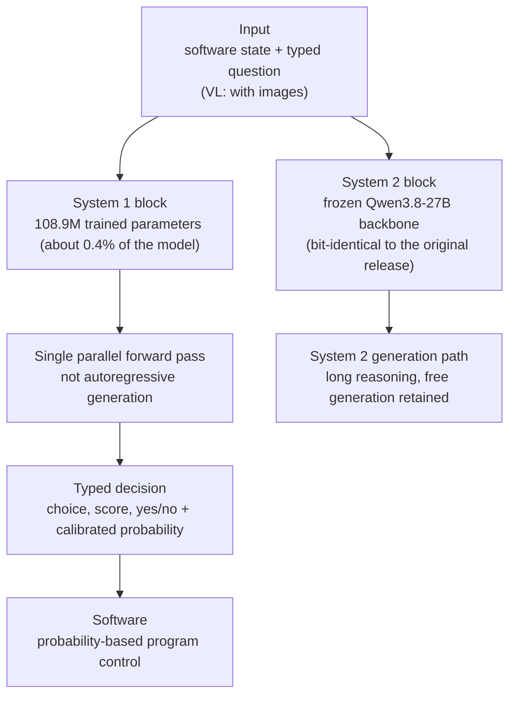

If you design the inference cost of agent workflows, or you are a platform engineer facing the problem of "cut LLM calls without losing judgment quality," look at this model. The conclusion up front: the JEV-27B(-VL) released by AutoTrust AI in late September 2026 is not a language model that "writes answers" but a model that "makes decisions." For typed questions it returns choice, score, or yes/no with calibrated probabilities, and that decision comes out of a single parallel forward pass rather than autoregressive generation. If this class of model can replace the frontier LLM call at each decision point, the dominant variable of agent inference cost changes.

## Overview

On September 29, 2026, AutoTrust AI released JEV-27B as Apache-2.0 open weights. The PR Newswire headline carries the model's identity as-is: "an open decision model for self-hosted AI agents." The day after (September 30), the multimodal extension JEV-27B-VL appeared, and AutoTrust introduced it as "the world's first open-weight, near-SOTA multimodal decision model" (vendor claim).

JEV is a concept from TypeSafe AI. TypeSafe's Jev is called a "System 1 model," and the name comes from Kahneman's (Daniel Kahneman) split between fast intuitive judgment (System 1) and slow analytic judgment (System 2). TypeSafe defines Jev as a "frontier intelligence function call." Instead of generating chat text, it makes decisions inside software.

The open-weight 27B model carrying this concept is JEV-27B, and the version that can also take images is JEV-27B-VL.

## What Is a System 1 Decision Model

A decision in a classic LLM takes a detour. Ask "which is right, A or B," and the model generates sentences while holding the conclusion inside them. It writes dozens of tokens, states no probability, and the output is natural language you must parse.

A Jev-class model skips this path. The input is three things. (1) the current state of the software, (2) predefined typed questions, (3) a candidate set. The output is (4) a typed answer (choice, score, yes/no) with (5) calibrated probability attached. Because it is a structured value rather than natural language, downstream software can use it as a branching condition without parsing.

Two mechanical differences matter. First, the **single parallel forward pass**. Instead of generating tokens one by one autoregressively, the decision is computed in one pass. TypeSafe claims this structure is "40 to 200 times faster than frontier LLMs" (vendor number). Second, **RLCD (Reinforcement Learning with Calibrated Decisions) training**. The training objective is not "generate the correct sentence" but "emit a calibrated probability distribution." Learning the distribution where 0.83 must actually be right 83% of the time is the core of this training.

The hosted version (TypeSafe Jev) opened its API on September 21, 2026. The price is $0.042 per 1M input tokens, with free output, because the output is a structured value and not subject to token billing (per coverage).

## JEV-27B and JEV-27B-VL

AutoTrust's open release puts this concept at 27B scale under an Apache-2.0 license. It is on Hugging Face (autotrust/JEV-27B, autotrust/JEV-27B-VL, autotrust/JEV-9B), and AutoTrust introduces the model on the HF blog under the theme "fast, calibrated decisions, and full reasoning."

The architecture is dual-block. Per the Hugging Face model card, the **System 2 block is Qwen3.8-27B**, frozen bit-identical to the original release. The **System 1 block is 108.9M trained parameters**, about 0.4% of the whole model. In other words, it did not retrain the full 27B model. It layered a "decision circuit" on top of a frozen backbone. AutoTrust names this composition the **Blocks of Experts (BoE) recipe** (per the tweet).

The training cost is striking if you take the reports at face value: **about 9.2 hours on a single NVIDIA B200**, because only the 0.4% decision circuit was trained, not the 27B model. The teacher is the published output distribution of TypeSafe's hosted closed model, Jev 1.13.

The feature of JEV-27B-VL is not "multimodal." It is that **a decision model takes image input**. AutoTrust introduces the VL version as "a decision model that learned to see without a single image of training" (vendor claim, unverified). A third-party tool, the jev-multimodal repository, provides CUDA inference, Choice/Noul/Score operators, ordered image input, PDF/ASR extraction, and provenance/freshness handling, with the note that "hosted Jev remains text-only, and local visual decision-making is supported."

## Reported Numbers

This post does not run the model (see "Reproduction attempt" below). Every number is therefore a reported value from AutoTrust, TypeSafe, or third-party coverage, and has not been independently verified.

| Item | Reported number | Reporter |
|---|---|---|
| JEV-27B benchmark average (6 suites) | 84.07% | AutoTrust |
| System 1 trained parameters | 108.9M (about 0.4% of the model) | AutoTrust (HF model card) |
| Training time | about 9.2 hours, single B200 | AutoTrust |
| JEV-9B inference latency | about 90ms single, about 2.5ms batched (single B200) | AutoTrust (HF model card) |
| JEV-9B throughput | about 14,400 decisions/sec (single B200) | AutoTrust (HF model card) |
| TypeSafe Jev API price | $0.042 per 1M input tokens, output free | TypeSafe (per coverage) |
| Speed claim | 40 to 200x faster than frontier LLMs | TypeSafe |

## Reproduction Attempt

Reproduction failed in this session: it could not be run. The 27B-class model is unsuitable for local (laptop) execution, and the weights are not yet mirrored to the internal S3, so the cluster serving path was outside the scope of this intraday run. A follow-up single-GPU B200 serving smoke and measured decision latency/probability calibration are planned, and their results will update the "Reported Numbers" section with actual measurements.

## Ecosystem

The Jev concept is not implemented by AutoTrust alone. Third-party open source has already appeared.

**Open-Jev** (Zefan-Cai/Open-Jev-27B-v1.1): a repository that "gives your app a decision with probabilities. Supply context, questions, and candidates, and get typed probabilities directly without autoregressive generation."

**Valen** (Liuziyu77/Valen): "Train a Jev-like multimodal model by yourself. System One Model, now with vision."

**jev-multimodal**: a CUDA-based local inference tool covering Choice/Noul/Score operators, image input, and PDF/ASR extraction.

The configuration where the hosted closed model (TypeSafe Jev) competes with open reimplementations (Open-Jev and others) shows that this concept is expanding from a "product" into a "model class."

## ThakiCloud Product Implications

**Paxis lens**: Paxis is ThakiCloud's Agent-Native Cloud (the control plane for agent platforms), routing every agent action through a policy gate and audit log. A policy-gate verdict is essentially a decision problem: "approve this tool call?", "does this skill fit this intent (BM25 selection among 960 skills)?", "pass this execution result?". Today such verdicts usually go out as frontier LLM calls: dozens of tokens, no probability, text.

The System 1 decision model is the alternative at that point. Reformed as a typed question (candidates: [approve, reject, escalate]) with probability outputs, the gate verdict becomes a structured value and the cost becomes "per decision" billing instead of probabilistic token billing. If the reported numbers (about 90ms single, 14,400 decisions/sec, JEV-9B basis) hold, the economics differ from using a frontier LLM at "every-request" points like policy gates.

**ai-platform (Metis) lens**: JEV-27B is a typical target for self-hosted 27B serving. Apache-2.0 license, single-B200 training, frozen backbone plus small decision block. It stands up on Metis' K8s, Kueue, and vLLM serving, and the configuration where multiple agent workflows access the same decision model under multi-tenant isolation holds.

On the training side, Maxis enters the story. The composition of training only the System 1 block (0.4%, 108.9M) in 9.2 hours (reported) is an example of the "layer a specific function circuit instead of fine-tuning the whole model" paradigm. If this pattern extends to customer workloads, Maxis' GPU queues and checkpoint management apply as-is.

From the on-prem perspective, the PR headline's "self-hosted AI agents" is the core. To keep the decision-making model in-house, you must move the model serving in-house as well. This connects directly to ThakiCloud's on-prem/sovereign (Aegis) line.

## Limitations and Counterarguments

**Source of the numbers**: every number in this post is from the vendors (AutoTrust, TypeSafe) or their press releases. Which six benchmarks, under what evaluation protocol the 84.07% was measured, and on what workload the 40 to 200x claim was measured are not confirmed in public material.

**"near-SOTA" and "world's first"**: "the world's first open-weight near-SOTA multimodal decision model" is AutoTrust's introduction. Because AutoTrust opened the "decision model" category itself, it can be first within that scope. It is a different comparison target than the outside of the category (ordinary VQA/multimodal LLMs).

**The unverified VL claim**: the mechanism behind "learned to see without a single image of training" is not confirmed in public material. If the frozen backbone (Qwen3.8-27B) already carries multimodal ability, the VL version may simply be "connecting a vision input to the decision circuit." Whether true or false, the phrasing "saw without training" should be read carefully.

**Open reimplementations differ**: Open-Jev and Valen are third-party reimplementations, and their architecture and training data are not identical to the autotrust release. When dealing with "the JEV concept," keep three layers apart: hosted TypeSafe Jev, AutoTrust open releases, and third-party reimplementations.

**Calibration is not accuracy**: a calibrated probability means "it is right as often as it says," not "the probability is right." The ceiling of decision quality remains bound to the teacher model's output distribution. Because the open model reproduces a closed teacher via distribution learning, there is no public data on how quality degrades in domains the teacher lacks (new domains, new question types).

## Summary

The question JEV-27B(-VL) poses is not "a better generation model" but "a model that hands down judgments." Agent systems make more decisions than they generate: tool selection, policy verdicts, evaluation, routing, branching. If every one of those points spends a frontier LLM's tokens, the dominant cost of agent economics becomes "per decision."

The System 1 decision model appears to be the path that lowers that dominant cost. Frozen backbone plus small trained block, single parallel pass, calibrated probability output, Apache-2.0. The fact that a hosted API, a 27B open weight, a multimodal extension, and third-party reimplementations all appeared in the same late-September week shows this class moving from the lab to the market.

If you run an agent platform, the next action is one thing: list the verdict points in your workflow that go out as a frontier LLM call on every request, and pick the ones that can be reformed into typed questions with calibrated probability answers. That is where the System 1 decision model goes.

## Sources

- [AutoTrust JEV-27B-VL (Hugging Face model card)](https://huggingface.co/autotrust/JEV-27B-VL)
- [AutoTrust JEV-27B (Hugging Face)](https://huggingface.co/autotrust/JEV-27B)
- [AutoTrust JEV-9B (Hugging Face)](https://huggingface.co/autotrust/JEV-9B)
- [AutoTrust HF blog: JEV-27B, fast calibrated decisions and full reasoning](https://huggingface.co/blog/autotrust/autotrustjev-27b-fast-calibrated-decisions-and-ful)
- [PR Newswire: AutoTrust AI Releases JEV-27B, an open decision model for self-hosted AI agents](https://www.prnewswire.com/news-releases/autotrust-ai-releases-jev-27b-an-open-decision-model-for-self-hosted-ai-agents-302891720.html)
- [RuntimeWire: AutoTrust AI JEV-27B self-hosted decision model](https://runtimewire.com/article/autotrust-ai-jev-27b-self-hosted-decision-model)
- [TypeSafe AI: Introducing System One models and Jev](https://typesafe.ai/blog/introducing-system-one-models-and-jev)
- [victordibia.com: How Jev works, calibrated decision models (PDF)](https://victordibia.com/papers/jev.pdf)
- [Zefan-Cai/Open-Jev (GitHub)](https://github.com/Zefan-Cai/Open-Jev)
- [Liuziyu77/Valen (GitHub)](https://github.com/Liuziyu77/Valen)
- AutoTrust's JEV-27B-VL introduction tweet (RT): [x.com/hjguyhan/status/2105806027711226319](https://x.com/hjguyhan/status/2105806027711226319)
