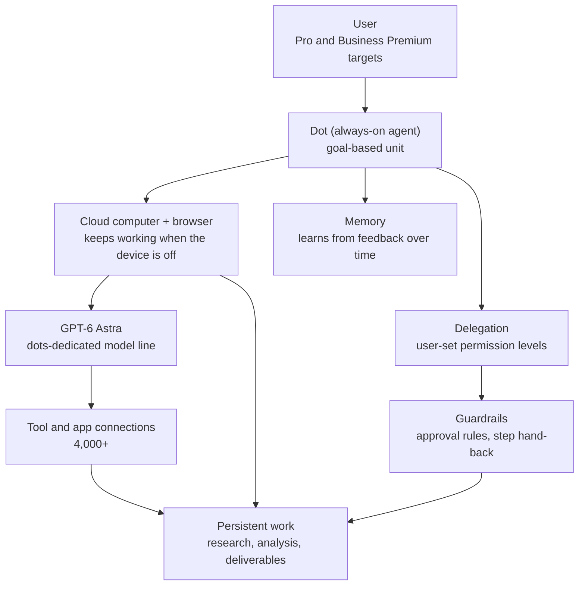

If you design agent platforms, or you are an engineer wondering whether your team can run agents that work 24/7, read this. The conclusion up front: Dots, announced by OpenAI at DevDay on September 29, 2026, is a design that changes the basic unit of an agent from "conversation" to "goal." Each dot gets its own cloud computer and browser, and keeps working even when the user's device is off. And the real weight of this design sits not in model performance but in the operational layers beneath it: resources, memory, delegation, guardrails, and approval.

*The core concept of Dots, visualized.*

## Overview

OpenAI unveiled Dots at DevDay 2026 (September 29, 2026). The official introduction is short and clear. "Dots are frontier intelligence that have your back. Powered by GPT-6 Astra, they have their own cloud computer, learn from feedback over time, and can work towards your goals 24/7." The ChatGPT product page describes them as "remarkably capable, always-on agents built to handle everything."

At the same DevDay, OpenAI also announced the GPT-6.1 Sol model, a ChatGPT collaborative workspace, and plan changes. Dots is OpenAI's answer to the question of where an agent should live. The answer is simple: not on the user's computer, but on OpenAI's cloud, assigning each agent a dedicated computer and browser.

Third-party analysis followed quickly. Developer monokern mapped the Dots architecture into "agents, models, tools, memory, delegation, guardrails, and the revenue layer," calling it "insane" for building a 24/7 AI company. TechCrunch described Dots as "bubbly agentic avatars" that pursue user-defined goals in the background, and DataCamp covered permissions, eligible plans, and launch limits.

## What Dots Are

The essence of Dots is a "persistent executor." A classic chatbot follows a request-response structure: the user sends a message, the model answers, and when the conversation ends, the state is gone. Dots inverts this flow. According to OpenAI's official docs (learn.chatgpt.com), "your dot lives in the cloud and has its own computer and browser. You can reach it and it can keep working even when your computer is off. It can research, analyze data, prepare..."

Three points matter. First, a dot has an identity. It is not a conversation partner but an executing subject with a name. Second, the dot's runtime is independent of the user's device. The browser and the computer are cloud resources, and the end of the user's session does not end the dot's work. Third, a dot works in units of goals. Given a goal like "prepare the report due today," it decomposes the work across multiple sessions and drives it forward.

The official emphasis on "learning from feedback over time" is the memory layer. A dot is described as a structure that does not stop at one correction but accumulates repeated feedback to adjust its behavior.

## The Layers of an Always-On Architecture

Cross-referencing monokern's frame (agents, models, tools, memory, delegation, guardrails, revenue) with the official docs and press coverage, Dots decomposes into the following layers.

**Model layer**: GPT-6 Astra powers Dots. GPT-6.1 Sol was announced at the same event, but the Dots documentation consistently refers to Astra. The existence of a dedicated agent model line suggests a design intent to separate "chat models" from "work models."

**Runtime layer**: one cloud computer and one browser per dot. This is what elevates Dots from "agents" to "permanent workers." State (browser tabs, downloads, working folders) persists across the dot's lifetime, not across a session.

**Tool layer**: 4,000+ tool and app connections are reported. Dots inherits the existing ChatGPT connector ecosystem as-is, because an always-on agent needs external tool access to actually do work.

**Memory layer**: "learning from feedback over time" reads two ways. Long-term memory maintained across sessions, and behavioral adjustment that accumulates user corrections ("don't do this," "do that like this"). Either way, memory is a property attached at the dot level.

**Delegation and guardrail layer**: users set permission levels, and specific rules can require approval before execution or hand a step back to the user. Practical guides from DataCamp and BenchLM return to this point repeatedly. Autonomy and control are tuned as a ratio, not a boundary.

**Operations (revenue) layer**: the initial rollout targets Pro and Business Premium plans in specific markets (what monokern calls the "revenue layer"). An always-on agent is a workload that consumes compute 24/7, so pricing and usage limits are part of the design.

**User experience layer**: another layer that recurs in coverage and hands-on guides. TechCrunch described Dots as "bubbly agentic avatars" that pursue user-defined goals in the background long-term. The avatar is a device that visually signals a dot is not a conversation partner but a resident subject. The official docs' "you can reach it" is the other side of the same story. A dot does not exist only inside the chat window. It is designed as an independent subject you can go to and check on at any time during work. Hands-on guides like Eesel detail the approval flow. When a user sets a rule, the agent requests approval at the step that matches the rule, or returns the work to the user. Autonomous execution and human oversight are tuned as a ratio, not a line.

## Implications for ThakiCloud Products

The direction Dots shows is relevant to both of ThakiCloud's product lines.

**Paxis lens**: Paxis is ThakiCloud's Agent-Native Cloud, the control plane for agent platforms. It treats Skills, Tools, Policies, and Audit Logs as first-class resources, selects from 960+ skills via BM25, runs them in isolated sandboxes, and routes every action through a policy gate and audit log. If Dots sets the expectation in the consumer market that "the unit of an agent is a goal," the enterprise question adds one more: "Does that goal work on our infrastructure, under our policies?"

Paxis shares three structures with Dots. First, persistent execution (always-on). Just as Dots places dots on cloud computers, Paxis agents run goal-based, without sessions, via NL cron and event triggers. Second, delegation and approval. Dots' user-set permission levels and Paxis' policy gate are different answers to the same question: how much authority does an autonomous agent get? Third, tool and skill inheritance. Dots' 4,000 connectors and Paxis' skill harness share the premise that "for an agent to actually work, tool access comes first."

Push the structure one notch further and the correspondence becomes clear. Dots' "cloud computer + browser" is a long-lived runtime operated by OpenAI, while Paxis' isolated sandbox is a long-lived runtime operated by the customer. Dots' "approval rules" are set by the user inside the ChatGPT UI, while Paxis' "policy gate + audit log" is an organization-level policy resource under version control. Dots' "4,000 connectors" are tool access inside the OpenAI ecosystem, while Paxis' MCP connectors (including OAuth auto-reconnect) are access to customer-designated systems. The toolset solving the same problem is similar, different, and owned by a different subject.

The difference is equally clear. Dots is a closed runtime hosted by OpenAI. Paxis is a platform on infrastructure the customer operates (their own K8s cluster, on-prem, sovereign environments). For a company that wants a "24/7 AI company," the decision variable becomes this difference: runtime sovereignty.

**ai-platform lens**: Dots' cloud computer is an agent runtime operated by OpenAI. Bring the same class of workload onto your own infrastructure, and the inference layer underneath is ThakiCloud's ai-platform (Metis): K8s and Kueue-based GPU orchestration, vLLM serving, multi-tenant isolation.

Always-on agent workloads differ from classic chat services in cost structure. An always-on agent is a steady (flat) profile: many entities running for a long time at low urgency. Steady workloads favor elastic scaling, batch queuing, and low-cost model routing. That is the domain of ai-platform. Dots' operations layer (plans, limits) resolves this cost problem through pricing. Self-serving resolves the same problem through infrastructure optimization.

## Limitations and Counterarguments

Before reading Dots favorably, there are points worth checking.

**Closedness**: Dots cannot be self-hosted. The model (Astra), the runtime (cloud computer), and the tool connectors are all OpenAI-owned. A "24/7 AI company" exists only on OpenAI's terms (plans, markets, usage limits).

**Scope**: the initial rollout is limited to Pro and Business Premium in specific markets. How enterprise requirements like contract terms, SSO, auditing, and data residency are handled is not yet clear.

**Unverified architecture detail**: monokern's layer decomposition is a third-party frame. Beyond the official docs saying a dot "has its own computer and browser," the concrete memory structure, the representation of delegation policy, and the internal mechanics of guardrails are not public. The layer decomposition in this post stands on that premise (third-party frame plus official-doc cross-check).

**The cost of autonomy**: always-on means perpetual compute. An agent that works 24/7 earns 24/7. OpenAI designed this with plans and limits, but for the customer a bookkeeping problem arises between "the work the agent does for me" and "the compute the agent consumes."

**Data residency**: the dot's browser tabs, downloads, and feedback-learning data all remain on OpenAI's cloud. For the "learning from feedback over time" design to hold, that feedback must accumulate in OpenAI's environment. The moment personal or confidential data enters a dot's work, a data-residency problem appears. How this point is handled (deletion, residency, exclusion from training) is not confirmed in public material.

**Observability depth**: you can see what a dot does. You have low visibility into what judgment it used to do it. Only the step that requests approval is exposed, and whether the in-between reasoning, tool selection, and state changes are provided in an auditable form is not confirmed in public material. In enterprise environments this observability depth is a core security-review item.

**Counterargument**: on the other hand, the runtime is merely "long-lived compute + browser + state," so it does not have to be entrusted to OpenAI. The same structure can be reproduced with long-lived Kubernetes pods, a headless browser, and an external state store, and that is exactly what Paxis does. Dots' value lies in planting a "new expectation," not a "new technology," in the market, and an implementation that satisfies that expectation is not unique.

## Summary

Dots is OpenAI's answer to "agents that never sleep." And the core of that answer is not the model but where the model lives (cloud computer), what it touches (tools, memory), and the control over what it does (delegation, guardrails).

If you build an agent platform, take three things. First, model state at the "subject (agent)" level, not the "session" level. Second, treat approval and delegation policy as first-class resources, not prompts. Third, always-on workloads are steady-profile inference-cost problems, so design the serving layer for them.

One-line conclusion: now that the unit of an agent has moved from conversation to goal, the next decision variable is "where to put it."

## Sources

- [OpenAI: Introducing dots](https://openai.com/index/introducing-dots/)
- [ChatGPT: Dots feature page](https://chatgpt.com/features/dots/)
- [ChatGPT Learn: Meet dots (docs)](https://learn.chatgpt.com/docs/dots)
- [BetaNews: OpenAI launches dots, always-on agents in ChatGPT](https://betanews.com/article/openai-dots-agents-chatgpt/)
- [CodersEra: OpenAI Dots Explained (2026)](https://codersera.com/blog/openai-chatgpt-dots-guide-2026/)
- [Business Standard: OpenAI DevDay 2026 (Dots, GPT-6.1 Sol, workspace, plans)](https://www.business-standard.com/technology/tech-news/openai-devday-2026-dots-gpt-6-1-sol-codex-developer-tools-126093000396_1.html)
- [DataCamp: OpenAI Dots: Always-On Agents in ChatGPT, Explained](https://www.datacamp.com/blog/openai-dots)
- [Vellum: Official OpenAI Dots Breakdown](https://www.vellum.ai/blog/official-openai-dots-breakdown)
- [Unite AI: OpenAI rolls out dots agents powered by GPT-6 Astra](https://www.unite.ai/openai-rolls-out-dots-agents-powered-by-gpt-6-astra-in-chatgpt/)
- [BenchLM: Dots Guide (permissions and limits)](https://benchlm.ai/blog/posts/openai-dots-guide)
- monokern's Dots architecture mapping tweet (RT): [x.com/hjguyhan/status/2105808960737661351](https://x.com/hjguyhan/status/2105808960737661351)
