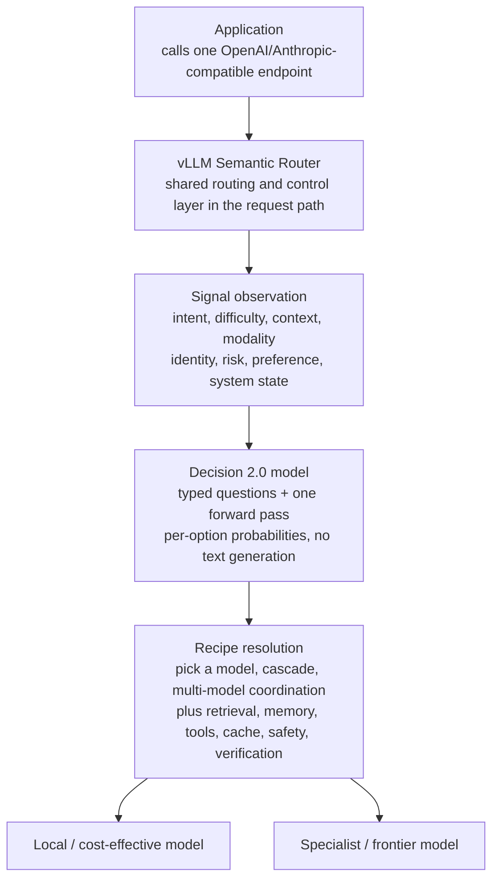

## Who should read this

If you are a platform engineer designing Mixture-of-Models systems, or a developer who has hard-coded "which model handles this request" in application code and dreads every model swap, read this. The conclusion in one line: **the layer that delegates request-routing decisions to small models is now open source, and the decision models behind it are open weights in every size from 0.6B to 27B.** vLLM's Semantic Router and the Decision 2.0 family answer "which capability path should this request take" with a single forward pass, typed questions, and a probability per option.

## Overview

The vLLM project announced "Decision 2.0: our newest state-of-the-art decision models, open in every size from 0.6B to 27B" on October 3, 2026 (per the tweet). The models in the Hugging Face vllm-sr collection are the decision engine of vLLM Semantic Router (GitHub: vllm-project/semantic-router), a routing and control layer.

Semantic Router carries the slogan "make your Mixture-of-Models programmable." In the words of its official docs, applications call one stable OpenAI- or Anthropic-compatible endpoint while the serving layer chooses, or composes, the capability path for each request. The project pulls the "who runs which model, when" problem out of every client and into a shared layer inside the request path.

This post does not re-explain the decision-model concept itself (System 1, calibrated probabilities, typed output). Our [AutoTrust JEV-27B post](/tech-blog/en/research/jev-27b-vl-open-decision-model/) from October 2 covered that concept and its expansion into a model class. This one goes one level up: the layer that programs routing with decisions, and the open-weight family that actually runs it.

## What is vLLM Semantic Router

Start with the problem the docs describe, and the need for the layer becomes visible. Modern AI applications rarely depend on one interchangeable model. Some requests want a fast local model, some a specialist or frontier model, and some need retrieval, memory, tools, or verifiers working together. Those paths span cloud, data center, and edge, and each carries different tradeoffs in capability, latency, cost, and trust. The right choice also changes per request, per user, per session, and per current infrastructure state.

The trouble begins when each application encodes that choice in its own code. Product code gets coupled to the current model fleet, the same routing logic repeats across clients, and the choices become hard to change, explain, or evaluate as the system grows. Semantic Router moves the decision into a shared layer in the request path. The layer observes the signals in front of it: intent, difficulty, context, modality, identity, risk, preference, and system state. It then resolves a stable entrypoint to an isolated recipe.

A recipe can do eight things: pick one model, escalate through a cascade, coordinate a bounded multi-model workflow, or attach behaviors such as retrieval, memory, tool filtering, caching, safety checks, and verification. The application keeps one familiar API while the capability path behind it evolves freely.



*The request flow through Semantic Router. The application knows only one endpoint; signal observation and recipe resolution happen inside the routing layer, driven by a Decision 2.0 model.*

The Decision 2.0 model sits at the "read the signals, resolve the recipe" step. Routing judgment becomes typed questions instead of natural-language reasoning: "which class is this request", "should it escalate", "which tool set". The returned probability values become branch conditions directly.

## The Decision 2.0 model family

The family comes in five sizes. Matching the tweet's "open in every size from 0.6B to 27B", the vllm-sr collection on Hugging Face holds Decision-2.0-Kai-0.6B, Decision-2.0-Eos-0.8B, Decision-2.0-Sol-2B, Decision-2.0-Lux-9B, and Decision-2.0-Vega-27B. All are Apache-2.0, and all use Qwen3-family backbones.

| Model | Parameters | Context | Backbone (relation) |
|-------|-----------|---------|---------------------|
| Kai-0.6B | 0.60B | 8,192 | Qwen3-0.6B-Base (finetune) |
| Eos-0.8B | 0.8B | [estimate] | Qwen3 family |
| Sol-2B | 2B | [estimate] | Qwen3 family |
| Lux-9B | 9B | [estimate] | Qwen3 family |
| Vega-27B | 29.37B | 32,768 | Qwen3.8-27B (adapter) |

The model cards I could verify give numbers for the two ends: the 0.6B Kai and the 27B Vega. Benchmarks for the three middle sizes were not directly confirmable from public cards, so they are marked [estimate].

The Kai-0.6B card says: JevArena 48.6, top of its size class, ahead of the four other same-size models compared. Over Decision 1.0 Kai it gains +12.7 on JevArena and +9.8 on the Jev Decision Index. Latency is a median 4.9 ms per single-question request on a single GPU. The Vega-27B card says: JevArena 74.0, top of the four same-size models compared, statistically level with AutoJev-27B (72.1), and +11.2 on the Jev Decision Index over Lux-9B. Median 71.4 ms per single-question request on a single GPU.

```python
import json

from transformers import AutoModel

model = AutoModel.from_pretrained(
    "vllm-sr/Decision-2.0-Vega-27B", trust_remote_code=True
)
result = model.system_one(
    state="The order arrived damaged yesterday. The customer has "
          "a receipt and asks for a replacement today.",
    questions={
        "route": {
            "type": "choice",
            "instructions": "Which team should handle this request?",
            "criteria": {
                "returns": "Refunds, replacements and damaged deliveries",
                "billing": "Payments, invoices and charges",
                "technical": "Product setup and faults",
            },
        },
        # noul (yes/no) and score questions can be added to the same input
    },
)
```

*Model-card quickstart. `system_one` takes a state and a bundle of typed questions and returns per-option probabilities.*

The interface's core is `system_one`. The input is the software's current state (text or JSON) plus a bundle of questions to answer together. Questions come in three types: choice (pick one of several), noul (yes/no), and score (rate on a scale). You can put choice, yes/no, and score questions about the same input in one call and get a probability for every option in a single forward pass. The answer is a probability distribution, not generated text, so downstream code can use the probabilities as branch conditions without parsing.

Install commands per the model cards: `pip install "transformers>=5.17" torch safetensors peft` for Vega-27B, and the same without `peft` for Kai-0.6B. ONNX conversions are available from the onnx-community org.

## Benchmark numbers

The numbers below are copied from the model cards. All are manufacturer (vllm-sr) reported figures, not independent reproductions.

| Item | Kai-0.6B | Vega-27B |
|------|----------|----------|
| JevArena | 48.6 (top of size class) | 74.0 (top of size class) |
| Reference point | Decision 1.0 Kai | AutoJev-27B (72.1) |
| Generation-over-generation | +12.7 JevArena, +9.8 Jev Decision Index | +11.2 Jev Decision Index over Lux-9B |
| Latency per single-question request (median, single GPU) | 4.9 ms | 71.4 ms |

JevArena is the benchmark of the decision-model category that TypeSafe's Jev ecosystem opened. AutoTrust's JEV-27B uses the same metrics, and the appearance of "AutoJev-27B" as a reference point here means multiple open-weight players are now competing on the same benchmark within this category. The 4.9 ms for 0.6B and 71.4 ms for 27B are the physical basis for the claim that "you do not need a frontier LLM at every decision point".

## Implications for ThakiCloud

**ai-platform (Metis) lens**: Semantic Router sits immediately in front of the serving stack, the same position where Metis provides multi-tenant model endpoints on K8s, Kueue, and vLLM serving. The docs' "SemanticRouter CRD" entry is symbolic of this: if the routing layer itself can be deployed as a Kubernetes resource, it slots into Metis's deployment fabric as one more component. That the decision models start at 0.6B matters at this point. Placing Kai-0.6B on small nodes, at the edge, or on cost-first paths, and escalating only the hard judgments to Vega-27B or a frontier model, makes the serving cost curve variable, shaped by request difficulty rather than fixed by the largest model in the fleet.

**Paxis lens**: Paxis is the Agent-Native Cloud control plane that routes every agent action through policy gates and audit logs. Those policy gate judgments ("allow this tool call", "pass this execution result") are decision problems by nature. The same logic from the JEV post applies, with one difference Decision 2.0 adds: size choice. If the decision model that owns a gate judgment can be sized between 0.6B and 27B to fit workload scale and budget, agent platform operating cost becomes a variable you tune per request instead of a fixed value. Signal-based routing and Paxis policy gates are the same problem, "where does this action go", solved at different layers.

## Limits and counterarguments

**Missing numbers for the middle sizes**: The model cards I verified were the 0.6B (Kai) and 27B (Vega). Benchmarks and context lengths for Eos-0.8B, Sol-2B, and Lux-9B were not directly confirmable from public material, so they are marked [estimate]. The "open in every size" narrative does not mean all five sizes are fully documented.

**JevArena is endogenous**: JevArena belongs to the ecosystem of the category it measures. "Top of its size class" is a rank inside that ecosystem, and the exchange rate against conventional inference benchmarks (MMLU, HumanEval family) is not confirmable from public material.

**Manufacturer-reported figures**: The latency (4.9 ms, 71.4 ms) and JevArena scores are vllm-sr model-card figures. The GPU type, batch size, and hardware are not specified, so read them as reference until independently reproduced.

**The quality ceiling of "decisions"**: A calibrated probability means "it is right as often as it says", not "it is right". Recipe resolution quality is only as good as signal observation. Misread signals send requests down the wrong path no matter how fast the decision model is.

## Wrap-up

The question Decision 2.0 asks is the same as the one in the JEV post: "a model that makes judgments", not "a better generator". The difference this time is that the model sits inside a layer. At request routing, the decision point every MoM system cannot avoid, a structure of typed questions, a single forward pass, and per-option probabilities now lives.

If you run an agent platform or MoM serving, the next action is one: list where the "which model path per request" logic lives today and how it is written. If it is if-else, consider Semantic Router's signal observation. If the judgment is a frontier LLM call, consider which size of Decision 2.0 could replace it. Being open from 0.6B to 27B means the cost and quality of that judgment become something you tune on your own infrastructure.

## Sources

- [vllm-sr Decision 2.0 (Hugging Face collection)](https://huggingface.co/collections/vllm-sr/decision-20-6ab7cf7bdfb506bf8269cb00)
- [vllm-sr/Decision-2.0-Vega-27B (model card)](https://huggingface.co/vllm-sr/Decision-2.0-Vega-27B)
- [vllm-sr/Decision-2.0-Kai-0.6B (model card)](https://huggingface.co/vllm-sr/Decision-2.0-Kai-0.6B)
- [vLLM Semantic Router (GitHub: vllm-project/semantic-router)](https://github.com/vllm-project/semantic-router)
- [vLLM Semantic Router official docs (Intro)](https://vllm-sr.ai/docs/intro/)
- [arXiv 2603.04444: vLLM Semantic Router: Signal Driven Decision Routing for Mixture-of-Modality Models](https://arxiv.org/abs/2603.04444)
- ThakiCloud tech blog: [The 27B that only decides: JEV-27B-VL and System 1 decisions in open weights](/tech-blog/en/research/jev-27b-vl-open-decision-model/)
- Xunzhuo Liu's Decision 2.0 announcement (RT): [x.com/hjguyhan/status/2106396837322391941](https://x.com/hjguyhan/status/2106396837322391941)
