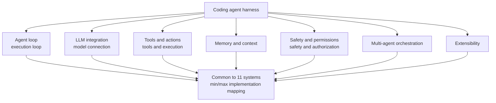

## Why Read This

If you build coding agents directly, or maintain the harness (loop, tools, context, safety structure) of an existing agent, you should read this paper. To state the conclusion first: **the Wavestone AI Lab study, which read roughly 4 million lines of code across 11 production coding agents, showed not that "agents are built with a framework" but that "each agent designs the 7 canonical subsystems directly by hand."** No agent runtime imports a general-purpose agentic framework such as LangChain, LangGraph, or AutoGen, and no system uses vector embeddings for code search.

> 📄 **Full deep review (DOCX)**: [Download the detailed peer review on Google Drive](https://drive.google.com/file/d/19-1vi1UPRvdsJbKB-zAvPTnhczUB6-IM/view).

## Overview

On October 5, 2026, a tweet making the rounds read, "This might be the most useful paper on AI agents this year." It was about Wavestone AI Lab's paper "Harness Engineering," whose full title is "Harness Engineering: Anatomy, Architecture, and Evolution of Coding Agents," with the subtitle "A Source-Code Study of Eleven Systems."

The paper's metadata goes like this: arXiv 2609.00006, v1 submitted on 2026-07-15, fields cs.SE and cs.MA. It runs 83 pages with 7 figures and 18 tables, and the comment field reads "the second, substantially expanded edition of the April study." The four authors are Paul Barbaste, Tristan Darrigol, Germain Vu, and Tom Wiltberger.

The paper's subjects are 11 coding agents actually running in production: Claude Code, Codex CLI, Gemini CLI, Mistral Vibe, OpenHands, Aider, Mini-SWE-Agent, Hermes, Pi, OpenCode, and OpenClaw. Databricks' Omnigent is added as a meta-harness comparison point, bringing the coverage to 12 trees. The methodology is reading, not execution. The authors inspected dependency manifests, grepped imports across three languages (Python, TypeScript, Rust), and repeated that inspection twice at 3-month intervals (April and July 2026 pins).

## What Kind of Study Is This

The core frame is 7 canonical subsystems. Well-built agents all stand on these 7 skeletons.

The body of the paper maps the "observed minimal implementation" and the "maximal implementation" along these 7 axes. It reads the code to judge where each system stands on these axes, what is missing, and what is excessive.

The largest finding is what the paper calls the twin absence, two of them.

First, the absence of frameworks. Across roughly 4 million lines, no agent runtime imports a general-purpose agentic framework. The scope covers 8 families: LangChain, LangGraph, AutoGen, CrewAI, Pydantic AI, Genkit, Semantic Kernel, and Google ADK. This is the result of double verification, dependency manifest inspection plus 3-language import grep, done twice at 3-month intervals across 12 trees including the meta-harness.

Second, the absence of vector search. All 11 systems avoid vector embeddings for code search. Every one relies on ripgrep, tree-sitter, glob, auto-discovered Markdown context files (AGENTS.md, CLAUDE.md, CONTEXT.md), LSP diagnostics, and git status injection. The only default embedding configuration is OpenClaw's memory-core (sqlite-vec KNN + FTS5/BM25), and even that is conversation-memory only.

## Key Findings

**Skills overtook MCP on adoption rate.** SKILL.md-based skills exist in 9/11 systems, while MCP exists in 8/11. The April edition was a 6/8 tie, and Pi's stance of "skills present, MCP absent" broke that balance. This is a signal that the center of gravity in agent extension is moving from the subprocess protocol (MCP) toward file-based skills (markdown + tool mapping).

**ACP has penetrated 6/11 systems in three roles.** The Agent Client Protocol handles the editor-agent boundary, harness hosting, and cross-vendor A2A. The representative case is OpenHands running Claude Code, Codex, and Gemini CLI as interchangeable step backends, and A2A is exclusive to Gemini CLI.

**Scale does not guarantee quality.** Mini-SWE-Agent's roughly 50-line linear loop (100-line scaffold, bash as the single tool) reports 74%+ on SWE-Bench Verified, while the much larger Codex codebase reports 69.1%. The paper explicitly notes that both are self-reports, that the model, evaluation run, and deployment configuration differ, so a direct comparison is impossible, but the direction, "bigger code does not mean stronger," is clear. In the same vein, the size-implies-sandbox correlation is also refuted. Hermes and OpenCode are large in the corpus yet have 0 OS-level isolation, while Codex and Gemini CLI provide bubblewrap+seccomp, Seatbelt, and Job Objects as native cross-platform sandboxing. Safety investment is a choice, not a consequence of scale.

**Convergence has become imitation.** This is the result of the 90-day longitudinal observation. Codex adopted Claude Code's hook vocabulary verbatim, and OpenHands adopted Codex's plugin manifest format. Deferred tool loading grew from 1 system to 3, and read-only plan mode grew from 2 to 4 (provider-native). The paper even estimates that the half-life of pattern diffusion is on the order of weeks. Over the same period, Codex's Rust workspace grew by nearly 2x (621K lines to roughly 1.12M lines, 89 to 126 crates), and Mistral Vibe grew +77% (35.6K to 63K lines).

**Omnigent, the first meta-harness.** Omnigent, which Databricks open-sourced in June 2026 (Apache 2.0, v0.4.0, roughly 312K lines of production Python), normalizes 23 canonical harness adapters (+16 aliases) behind a common API and orchestrates 5 of the 11 corpus harnesses behind a single API. This is evidence that the layer of agents orchestrating agents has begun to exist in earnest.

**The 90-line scaffold.** The paper's practical deliverables are 13 cross-cutting observations, 29 design patterns (17 from the April edition + 12 new), 18 design recommendations, and a 90-line Python minimum viable harness scaffold (Listing 3). This scaffold directly implements 10 of the 18 recommendations, with 0 framework dependencies, 0 RAG, 0 vector store, 0 multi-agent, and 0 sandbox. It is published inline in the paper body, not in an external repository.

## Implications for ThakiCloud Products

Paxis is ThakiCloud's Agent-Native Cloud, a platform that treats harness design itself as a first-class resource. The paper's 7 canonical subsystems correspond almost 1:1 to Paxis's layer composition: loop, tools, context, safety, orchestration, extensibility. The fact that Paxis chose the path of designing the harness itself rather than wrapping a framework goes in the same direction as the independent choices of 11 production systems, and in that sense this paper provides external grounding for our architecture judgment.

Second is the skills-first observation. Paxis selects from 960+ skills by BM25 and runs them in isolated sandboxes. The paper's report that "skills adoption 9/11 overtook MCP 8/11" is a signal that our platform's choice aligns with the market's direction of travel. File-based skills (markdown + tool mapping) mesh well with version control, auditing, and policy gates, for the same reason as Paxis's first-class resource design for Audit Logs.

Third is the implication of the "weekly half-life" observation. If cross-vendor pattern diffusion is this fast, keeping up with new patterns is not a competitive advantage but a maintenance cost. The right direction for Paxis's design is to anchor on the stable skeleton of 7 canonical subsystems while rapidly absorbing the surface patterns on top of it (hook vocabulary, manifest formats) as policy-as-configuration. This also matches the flow the paper observed, "policy moving from prompt prose into configuration."

Finally, the 90-line scaffold is reference material that can be used directly as a baseline for internal minimal harnesses or smoke tests. In defining "the minimal skeleton of an agent" with 0 framework, 0 RAG, and 0 vector store, it shares the same philosophy as our team's thin harness, fat skills principle.

## Limitations & Counterarguments

This paper is a source-code reading study, not a runtime measurement study. How fast any system is lies outside the paper's claims, and every benchmark number is a self-report from the system itself. That is why numbers like Mini-SWE-Agent 74%+ versus Codex 69.1% should not be read as a competitive ranking.

The weakest link in reproducibility is, as the paper itself acknowledges, that the Claude Code analysis is based on a 2026-03 public circulation source snapshot. It is not an official release, and it may have diverged from the already substantially evolved shipping binary (2.1.206).

The framework-absence finding is strong but structurally conservative. Internal forks, plugin loads via dynamic imports, and transpiled distributions were not tracked, so "no one visibly imports them" is the accurate phrasing, not "nobody really uses them."

The comparison method is also independent. The 11 systems were not run head-to-head on a common task set; each was read independently. The paper is aware that a direct execution comparison would cost one more step.

One more point that deserves the reader's attention: the paper discloses that it was written with the substantial assistance of Anthropic's Claude (in compliance with ACL/NeurIPS/ICML/IEEE disclosure policies). Knowing this relationship helps when reading "findings about Claude Code."

Landscape events (market capture, acquisition news, and the like) are based on vendor announcements, release notes, and repository metadata as of 2026-07-10, and the paper explicitly states that these, unlike the corpus claims, are not source-verified.

## Takeaways

The answer to building agents was not "which framework to use" but "how to design the 7 subsystems." The 11 production systems converged on strikingly similar skeletons without frameworks, across different languages and organizations, and that convergence has now become imitation, spreading on a weekly half-life.

Two things are recommended as the next step: using the 13 observations and 29 patterns as a checklist to inspect your own harness, and using the 90-line scaffold as the baseline to find "which axes are missing from our harness." The most practical legacy this paper leaves is not the framework but those 7 questions.

## Sources

- Paper (arXiv abs): https://arxiv.org/abs/2609.00006
- PDF: https://arxiv.org/pdf/2609.00006v1
- HTML: https://arxiv.org/html/2609.00006
- Related tweet (2026-10-05): https://x.com/hjguyhan/status/2107064959188492787

> 📄 **Full deep review (DOCX)**: [Download the detailed peer review on Google Drive](https://drive.google.com/file/d/19-1vi1UPRvdsJbKB-zAvPTnhczUB6-IM/view).
