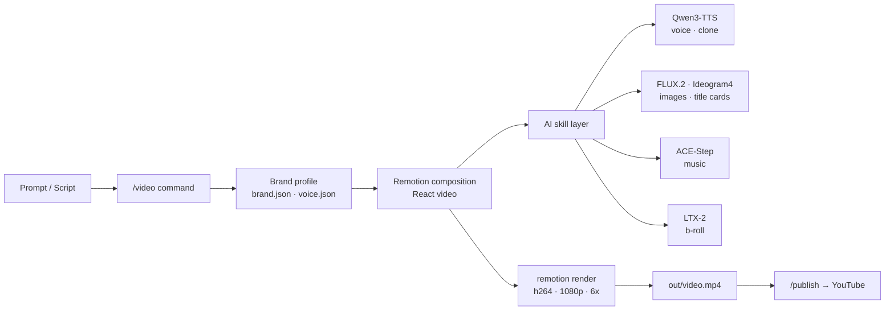

*An automated video pipeline, rendered as light particles assembling into ordered frames.*

## Overview

Video production has long required dedicated editors and a human touch. Recently, though, a pattern has taken hold where, just as coding agents write code, video is described in code and rendered. `digitalsamba/claude-code-video-toolkit` puts that pattern on top of Claude Code. As of its release it shows roughly 1.6k GitHub stars, 268 forks, and 182 commits, under the MIT license.

The core idea is simple. You describe a video project with Remotion, a React-based framework; you delegate the generation of assets such as voice, images, music, and b-roll to open-source AI models; and you tie the whole process together with Claude Code's slash commands and skills. The user creates a project from a template with a single `/video`, configures cloud GPU, storage, and voice with `/setup`, and then moves on to rendering.

ThakiCloud runs a Kubernetes-based AI/ML SaaS platform and deals with GPU workloads every day. Video rendering and generative asset synthesis are textbook GPU-bound jobs, and in a multi-tenant environment how you allocate resources is the cost. So this toolkit is worth reading not just as a content tool but as one example of the workload type our platform handles. In this post I first show what happened when I actually cloned and ran the toolkit, then discuss what it means from a platform point of view.

## What this tool is

claude-code-video-toolkit turns Claude Code into a video production workstation. It helps to think of it in three layers.

The first is the slash-command layer. `/setup` interactively walks you through first-time configuration such as cloud GPU, file transfer, and voice. `/video` creates and opens projects, and `/scene-review` helps with scene-by-scene review in Remotion Studio. Beyond these, there are commands for each stage of production: `/brand`, `/template`, `/generate-voiceover`, `/voice-clone`, `/redub`, `/record-demo`, `/publish`, and more. `/publish` uploads a finished video to YouTube and auto-fills metadata from `project.json`.

The second is the skill layer. These bundle domain knowledge so Claude Code can handle it deeply: remotion (React-based video framework), elevenlabs (audio), ffmpeg (media processing), playwright-recording (browser demo recording), frontend-design (visual design), qwen-edit (image editing), ideogram4 (image generation with strong in-image text), acestep (music), ltx2 (text/image-driven video clips), moviepy (Python video composition), and runpod (cloud GPU), for eleven skills in total.

The third is the template and brand layer. `templates/` includes sprint-review, sprint-review-v2, product-demo, and concept-explainer-short for 9:16 vertical shorts. `brands/` defines brand profiles holding colors, fonts, and voice settings, which are applied automatically when you create a project with `/video`. The diagram below shows how these three layers connect into a single pipeline.



The cost structure stands out in particular. The toolkit is designed so that generative assets such as voice (Qwen3-TTS), images (FLUX.2), and music (ACE-Step) depend on open-source models rather than commercial APIs. You deploy the models to your own cloud GPU account and run them at cost. For storage it points to Cloudflare R2's free tier (10GB, zero egress), and for compute to Modal's Starter plan with $30/month of free credit. This self-hosting-first choice maps precisely to the platform perspective discussed later.

## Installation and integration

The documented quick start is as follows: clone the repository, optionally install Python dependencies, and open Claude Code.

```shell
git clone https://github.com/digitalsamba/claude-code-video-toolkit.git
cd claude-code-video-toolkit
python3 -m pip install -r tools/requirements.txt   # Optional: AI voiceover, image gen, music, moviepy examples
claude                                              # Open Claude Code inside the toolkit
```

Then, inside Claude Code, you configure cloud GPU, storage, and voice interactively for about five minutes with `/setup`, and create your first project with `/video`. The requirements are Node.js 18+ and Claude Code; Python 3.9+ is recommended for AI tools. FFmpeg is optional.

What matters here is that there is a separate path to verify rendering immediately, with no setup. `examples/hello-world` is a minimal example that needs no API keys at all. I followed this path exactly and ran it for real.

```shell
cd examples/hello-world
npm install
npm run render
```

Looking at `hello-world`'s `package.json`, the render script is `npx remotion render src/index.ts SprintReview out/video.mp4`, and the dependencies are the Remotion 4.0.425 line and React 18. In other words, it bakes a React composition straight into video without any external model calls.

## Real experiment results

I ran the verification inside an isolated git worktree, and every number is taken directly from the run log. The environment was Apple Silicon (arm64), Node.js 24.1.0, and npm 11.3.0.

First, dependency installation. `npm install` added 230 packages and took about 3.5 seconds. The audit did report 10 vulnerabilities (7 moderate, 3 high), which I revisit in the limitations section.

In the render step, Remotion downloads Chrome Headless Shell once on the first run. In this run it downloaded about 90.2MB, a one-time cost. Bundling and composition followed. The composition was `SprintReview`, the codec h264, concurrency 6x, and it rendered all 750 frames. The log left the note "Cached bundle. Subsequent renders will be faster," making clear that subsequent runs are faster thanks to the bundle cache.

From a cold state, the wall-clock time for `npm run render`, including the download, bundling, rendering, and encoding, was 18.4 seconds. The final output was an h264 video at 1920x1080 resolution, 30fps, 25.0 seconds long, and 2.15MB (2,152,829 bytes), including an AAC audio track. Not a single API key was used.


*Per-stage wall-clock time of the hello-world 1080p render pipeline, measured with zero API keys.*

In short, with no separate setup, a single 1080p video was in hand within about 30 seconds of cloning. That was even faster than the example's "renders in 2 minutes" description, but since this can vary with hardware and network conditions, you should not take the number as absolute. What matters is that the barrier to entry is that low.

## Applying it to the ThakiCloud Kubernetes AI/ML SaaS platform

This toolkit is interesting because it structurally resembles the workloads our platform handles. Video rendering and generative asset synthesis are both GPU-bound batch jobs, with a pattern of using resources in short, intense bursts before returning to idle. ThakiCloud queues and prioritizes GPU jobs with Kueue on top of Kubernetes and serves models with vLLM and others. The Modal/Daytona-style serverless persistence the toolkit recommends, where the environment hibernates when idle and wakes on request, solves the same resource-efficiency problem we pursue with Kueue, just at a different layer.

The points worth highlighting are cost and self-hosting. The toolkit is designed to run open-weight models such as Qwen3-TTS, FLUX.2, and ACE-Step on your own GPU at cost rather than via commercial APIs. This aligns exactly with ThakiCloud's direction of treating on-premises and self-hosting as strengths. When a customer wants to operate generative workloads multi-tenant in a high-security environment without sending data or models outside, our platform can naturally accommodate this kind of video and media pipeline as well.

The internal use angle is clear too. The sprint-review and product-demo templates are artifacts engineering organizations produce repeatedly. If you wrap this video generation as Kubernetes jobs and put them on a Kueue queue, you can move heavy rendering from developers' laptops to a shared GPU pool processed by priority. The fact that the toolkit itself is tied to Claude Code is a constraint, but peeling off just the Remotion render stage and containerizing it makes it straightforward to place on our batch infrastructure.

## Limitations and counterpoints

There are clear weaknesses alongside the strengths. First, dependency security. Even the minimal example's `npm install` reported 10 vulnerabilities (including 3 high). To put it into production you need dependency auditing and pinning first, and it is safer to enforce this as a gate in your automation pipeline.

Second, the scope of the word "free." What works immediately without API keys is template-based rendering. To use generative assets such as voice, images, music, and b-roll, you ultimately have to deploy models to your own cloud GPU, and from that point on compute cost and operational burden appear. "Free" means running it yourself at cost, not that there is no cost.

Third, tool coupling. This workflow is strongly coupled to Claude Code. As convenient as the slash-command and skill abstractions are, there is an aspect of dependence on a specific agent environment. Fortunately the core rendering is handled by Remotion, an independent framework, so if needed you can separate that part and move it to a different orchestration.

Fourth, Remotion describes video in React. This can be a barrier for designers and non-developers, and handling complex motion graphics in code can take more effort than a dedicated editor. In the end this toolkit fits best with teams already comfortable handling video in code.

To sum up, claude-code-video-toolkit is a good starting point for code-friendly video automation. The experience of producing a 1080p video within 30 seconds with no API keys is a clear strength, and its open-source-model, self-hosting philosophy aligns well with our platform's direction. That said, you need to weigh the real cost of the generative asset stage, dependency security, and tool coupling together for a balanced judgment.

## Sources

- GitHub: [digitalsamba/claude-code-video-toolkit](https://github.com/digitalsamba/claude-code-video-toolkit)
- Remotion: [remotion.dev](https://www.remotion.dev/)
- Test environment: Apple Silicon (arm64), Node.js 24.1.0, npm 11.3.0 / all numbers extracted directly from run logs.
