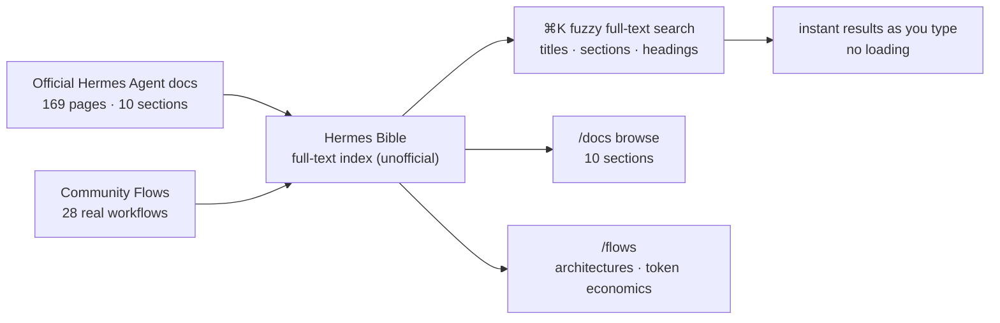

*Indexed search, rendered as many document nodes converging into a single bright point.*

## Overview

The more powerful an agent framework becomes, the more, paradoxically, its documentation gets in the way. As features grow quickly, doc pages swell into the hundreds, and finding the one line you actually need becomes ever harder. Hermes Agent, which Nous Research released in February 2026, is no exception. The official docs are well organized but vast, and on top of that the practical know-how the community shares is scattered across X (Twitter) and elsewhere.

`Hermes Bible` (hermesbible.com) is an unofficial community site that takes this problem head-on. It indexes every page of the official Hermes Agent docs along with real workflows built by the community in one place, and offers full-text search with a single keystroke. The site itself clearly states that it is "unofficial, community-built, and not affiliated with Nous Research."

ThakiCloud runs a Kubernetes-based AI/ML SaaS platform and internally handles more than 1,000 skills and many operational rules. So the question of "how do you make a vast body of agent knowledge searchable" is a daily concern for us too. In this post we look at what Hermes Bible contains and how, how it differs from the official docs, and the implications from our platform's perspective.

## What this site is

Hermes Bible's core function is indexing and search. The site holds 169 pages of Hermes Agent docs split into 10 sections: Getting Started (6 pages including installation, quickstart, and learning path), Core Features (45 pages including features overview, tools, the skills system, and the curator), Messaging Platforms (30 pages including the messaging gateway, Telegram, Discord, and Slack), Secrets (2 pages), Skills, Using Hermes (15 pages including CLI, TUI, configuration, and configuring models), and more.

Search is invoked with ⌘K and is a full-text fuzzy search across every page title, section, and heading. According to the site, results appear as you type with no loading or waiting. The aim is the experience of finding the exact location in vast docs in seconds with a single keyword. The diagram below shows how the site unifies the official docs and community workflows into a single search surface.

The differentiator is the Flows library. Beyond the official docs, it gathers 28 real multi-agent automation workflows that the community actually built. Each workflow is organized so you can search, study, and adapt it, including the full architecture, token economics, and orchestration patterns. For example, one piece introduces the Hermes dashboard (localhost:9119) that "nobody talks about but I open every day" as an operating surface for keeping a 24/7 agent healthy, covering Sessions, MCP, Skills, Cron, Analytics, Logs, and System. Another, "The 15 Levels of Hermes Agent Usage," lays out everything from your first one-shot prompt to automating a business across multiple profiles, together with token economics, and notes that it was verified against Hermes Agent v0.17.0.

For reference, Hermes Agent itself is an MIT-licensed project from Nous Research, showing roughly 200k GitHub stars, 35.7k forks, and over 12,000 commits as of this writing. It advertises a "closed learning loop" in which the agent creates skills from experience, improves them during use, and models the user across sessions. Hermes Bible can be seen as the community's response to keeping up with this fast-evolving project.

## Implications from the ThakiCloud platform perspective

Seeing Hermes Bible not as a mere search site but as a pattern makes it a direct lesson for us. ThakiCloud internally operates more than 1,000 skills and operational rules, which is exactly the same "searchability of vast knowledge" problem the Hermes Agent docs face. In fact, our platform already has a BM25-based skill-search gate that surfaces candidates on every work turn. Hermes Bible's instant ⌘K full-text search illustrates well, from the user-experience side, the very proposition that "as knowledge grows, search is productivity."

The Flows concept is especially interesting. If the official docs explain features, Flows share practical recipes that weave those features together, complete with architecture and token economics. This is exactly the same idea as ThakiCloud treating skills and rules as "capability products packaged together with failure cases, gotchas, and verified scaffolding." When you accumulate knowledge as reusable workflows that bind input, processing, output, and error recovery rather than single prompts, the value of search and sharing finally compounds.

There is an operational touchpoint too. Just as the Hermes dashboard gathers Sessions, Cron, Skills, Analytics, and Logs on one screen to manage a 24/7 agent, we likewise design operations toward making unattended loops and scheduled jobs visible through a central registry. In a fast-evolving agent system, seeing at a glance "what is running right now and what it reads and writes" is the prerequisite for stable operation.

## Limitations and counterpoints

The clearest limitation is that it is unofficial. Hermes Bible is a community project unaffiliated with Nous Research, so there is no guarantee that the indexed content always matches the latest official docs. Hermes Agent is a fast-moving project with over 12,000 commits. An unofficial index inherently lags, and especially in areas like security-sensitive configuration or secrets management you must treat the official docs as the final reference.

Second, you should consider that the official docs already provide machine-friendly entry points. The official Hermes Agent docs offer `/llms.txt` (about 17KB), which indexes every page with a short description, and `/llms-full.txt` (about 1.8MB), which concatenates everything into one file. For loading docs wholesale into an LLM, this official path is more authoritative and stable. In other words, Hermes Bible's strength lies purely in the experience of a human searching quickly and browsing community workflows.

Third, there is the general risk of external dependence. If a company blog or operational doc pulls a third-party site into its core flow, links can break when that site disappears or changes direction. Hermes Bible is best used as an auxiliary tool for discovery and learning, and it is not appropriate to treat it as the single source of truth for our internal operations.

To sum up, Hermes Bible is a well-made community asset that helps people keep up with the knowledge of a fast-evolving agent framework. That said, you need the balance of recognizing its inherent unofficial lag and external dependence while keeping the official docs as the reference point. Above all, the very pattern it demonstrates, "make vast agent knowledge searchable, and shareable as practical workflows," is the most valuable implication for a platform like ours that operates large-scale skills and rules.

## Sources

- Hermes Bible: [hermesbible.com](https://www.hermesbible.com/)
- Hermes Agent (Nous Research): [github.com/NousResearch/hermes-agent](https://github.com/NousResearch/hermes-agent)
- Official docs: [hermes-agent.nousresearch.com/docs](https://hermes-agent.nousresearch.com/docs/)
