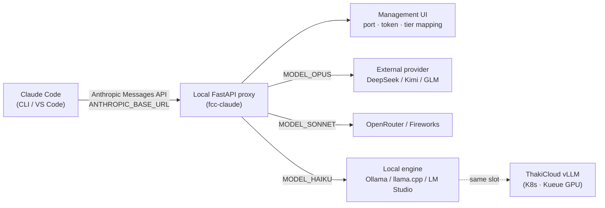

## Overview

Over the past few days, timelines have been flooded with posts about "a GitHub repo that lets you use Claude Code for free forever." Strip away the clickbait headline and the reality is straightforward: this is not a free hack but a **proxy that routes a coding agent's model traffic**. Specifically, the `Alishahryar1/free-claude-code` repository intercepts Anthropic Messages API requests sent by the Claude Code CLI and VS Code extension, then forwards them to external providers such as DeepSeek, Kimi, Qwen, and GLM (Z.ai), or to local inference engines such as Ollama, llama.cpp, and LM Studio.

The reason this topic belongs on the ThakiCloud blog is not that it is "free." It is that a coding agent no longer needs to be locked to a specific model vendor and **can run on top of open-weight models that the customer controls directly**. For a K8s-based AI/ML SaaS platform that treats on-premises deployment and data sovereignty as core values, this proxy pattern shows the most practical path to running a coding agent on top of models we serve with vLLM.

This post sets aside the "free" framing, analyzes the proxy's actual architecture and configuration approach, then honestly covers how this pattern can be applied to our platform and what its limitations and risks are.

## What This Tool Is

The core of free-claude-code is simple. Claude Code is designed to let you swap the API endpoint via the `ANTHROPIC_BASE_URL` environment variable. This tool exploits that by spinning up a small local **FastAPI proxy** and pointing Claude Code's requests at it. The proxy receives incoming requests in Anthropic Messages format, converts them to the format expected by the configured target provider, forwards them, and then converts the responses back into Anthropic format.

In other words, the client (Claude Code) believes it is talking to Anthropic, but the actual inference is performed by a completely different model. The client protocol stays intact, so Claude Code itself is never modified. This "protocol-compatible proxy" approach is a pattern shared by the claude-code-router family of tools; free-claude-code adds a management UI and several provider presets on top of that foundation.

Supported providers are those that use Anthropic Messages-style transport. Based on the published README, these include OpenRouter, DeepSeek, Kimi (Moonshot), Fireworks AI, Z.ai (GLM family), and the local engines LM Studio, llama.cpp, and Ollama. Each provider has a slightly different model list URL and transport convention, and the proxy absorbs those differences.

The most interesting feature is **tier-based routing**. Claude Code internally distinguishes between three tiers when making calls: Opus for heavy reasoning, Sonnet for general tasks, and Haiku for lightweight tasks. In the free-claude-code management UI you can assign `MODEL_OPUS`, `MODEL_SONNET`, and `MODEL_HAIKU` to different providers and models independently. For example, you can send heavy tasks to DeepSeek's reasoning model while sending lightweight tasks to a small local Ollama model, achieving a cost and performance split. This idea is exactly the same principle we use when routing subagents across Haiku, Sonnet, and Opus tiers.

## Architecture: Where the Proxy Intercepts

The full flow works as follows. The management UI handles proxy configuration, and the server restarts when runtime settings change. The `fcc-claude` launcher reads the current port and auth token managed by the UI each time it runs. If proxy authentication is left empty, the launcher injects only `ANTHROPIC_AUTH_TOKEN=fcc-no-auth` to pass Claude Code's local login check, and the proxy treats an empty auth as disabled.

The diagram below shows where requests are intercepted.



The critical component is the conversion layer. Requests from Claude Code follow the Anthropic Messages schema (system prompt, messages array, tool_use blocks, and so on). When the target uses an OpenAI-compatible or proprietary format, such as DeepSeek or Qwen, the proxy must map the message structure and tool-call conventions to that format. If the mapping is incomplete, tool calls (file editing, bash execution, and other core Claude Code features) break silently. As the repo's issue tracker shows, some Claude Code versions ignore `ANTHROPIC_BASE_URL` or have connections refused, confirming that the conversion layer and version compatibility are the weakest link in this pattern.

## Installation and Integration

The installation flow described in the public README is: clone the repo, configure the models you want to use, resolve common port conflicts, and obtain a single launcher (`claude.bat` or `fcc-claude`) that you can drop into any project folder to run Claude Code immediately. Conceptually it looks like this:

```bash
# 1) Clone the repo
git clone https://github.com/Alishahryar1/free-claude-code.git
cd free-claude-code

# 2) Start the proxy + management UI (local FastAPI server)
#    Configure provider API keys and per-tier models in the UI.
#    Example: MODEL_OPUS=deepseek/..., MODEL_SONNET=..., MODEL_HAIKU=ollama/...

# 3) Set environment variables so Claude Code points at the local proxy
export ANTHROPIC_BASE_URL="http://127.0.0.1:<port-managed-by-ui>"
export ANTHROPIC_AUTH_TOKEN="fcc-no-auth"   # passes local login check when auth is disabled

# 4) Run Claude Code as normal — inference is handled by the routed model
claude
```

From a self-hosting perspective, the most important piece is local engine integration. The README uses llama.cpp as an example: keep or update `LLAMACPP_BASE_URL` in the management UI, then set `MODEL` to a local model slug prefixed with `llamacpp/`. The same approach lets you point at Ollama or LM Studio endpoints. One step further, and you can put **our OpenAI-compatible endpoint served by vLLM on K8s** in that local endpoint slot.

> Honest disclosure: in the environment where this post was written, we could not route a complete coding session end-to-end to measure latency and cost numbers, due to constraints around external provider API keys and the isolated sandbox. For that reason, the sections below contain no fabricated benchmark figures. What we verified covers the repo's architecture, the provider list, the configuration approach, and the known failure modes revealed by public issues.

## What We Verified and What We Could Not

What we verified: First, this tool is not a free crack but an Anthropic Messages API-compatible proxy, and it does not patch Claude Code itself. Second, the provider pool includes local engines (Ollama, llama.cpp, LM Studio), making a fully self-hosted configuration possible without any external provider. Third, the Opus, Sonnet, and Haiku tiers can be routed independently to different models.

What we could not verify: quality and latency under real coding workloads. How faithfully open-weight models follow Claude Code's tool-call conventions, and whether context management stays stable across long agent loops, depends heavily on the model and the quality of the conversion layer. User-reported figures such as "over 20,000 users" cited in some references come from secondary sources (introduction tweets) and are [estimated], not values we confirmed directly.

## Implications and Application for the ThakiCloud K8s AI/ML SaaS Platform

Where this pattern is meaningful for our platform is clear. Coding agents are among the most powerful LLM use cases, and they also handle the most sensitive data: source code, internal configuration, and secrets. Customers in regulated industries or the public sector cannot allow this data to leave to an external model vendor. The proxy pattern solves exactly this problem: the client continues using the familiar Claude Code interface while inference is performed by a model inside the customer's boundary.

Mapped onto the ThakiCloud stack, the configuration looks like this. Kueue queues GPU resources, vLLM serves open-weight models (such as Qwen or DeepSeek families) on an OpenAI-compatible endpoint, and a compatible proxy such as free-claude-code sits in front of that to route internal developers' Claude Code traffic to it. In a multi-tenant environment, different tenants can be mapped to different models and different isolation boundaries. Routing heavy refactoring tasks to a larger model and routine autocomplete-style tasks to a smaller model directly reduces GPU costs.

What is worth highlighting is that none of this requires new infrastructure from us. vLLM serving, multi-tenant isolation on K8s, and Kueue-based GPU scheduling are already core components of the platform. Adding a single proxy layer completes the product angle of "a coding agent that runs inside the customer's boundary." This configuration satisfies on-premises deployment, cost efficiency, and data sovereignty simultaneously, which is a direct selling point for customers who cannot send code to an external model API.

## Limitations and Counterarguments

There is no reason to be purely optimistic. The biggest weakness is the quality gap. Claude Code's agent behavior is tuned to the tool-use capabilities of Anthropic's models. Routing to open-weight models can reduce tool-call accuracy, long-context coherence, and success rates on complex multi-step tasks. If the conversion layer fails to absorb subtle differences in tool-call conventions, file edits or command executions fail silently. As the public issues demonstrate, version compatibility is also a constant maintenance burden.

The second concern is governance. Adopting a tool that spreads under a "free" framing as a company standard creates a new data leakage path where internal code flows to external free providers. The real value of this pattern is realized safely only when routing to **self-hosted endpoints**, not to external free providers. In other words, the same tool must be framed as "run on our models" rather than "use for free."

The third counterargument involves model vendor licenses and terms of service. Regardless of which provider traffic is sent to, that provider's terms must be followed, and using this approach to circumvent client terms creates separate legal and ethical problems. If ThakiCloud were to productize this pattern, the target would clearly have to be legally permissive open-weight models and self-served endpoints.

In conclusion, free-claude-code is far more useful when read as a **proxy pattern that decouples the model layer of a coding agent from the client** than when read through the "free Claude Code" headline. That decoupling is what enables self-hosting, data sovereignty, and cost routing, and it is precisely the area where ThakiCloud excels.

## Sources

- free-claude-code (Alishahryar1): [https://github.com/Alishahryar1/free-claude-code](https://github.com/Alishahryar1/free-claude-code)
- free-claude-code README: [https://github.com/Alishahryar1/free-claude-code/blob/main/README.md](https://github.com/Alishahryar1/free-claude-code/blob/main/README.md)
