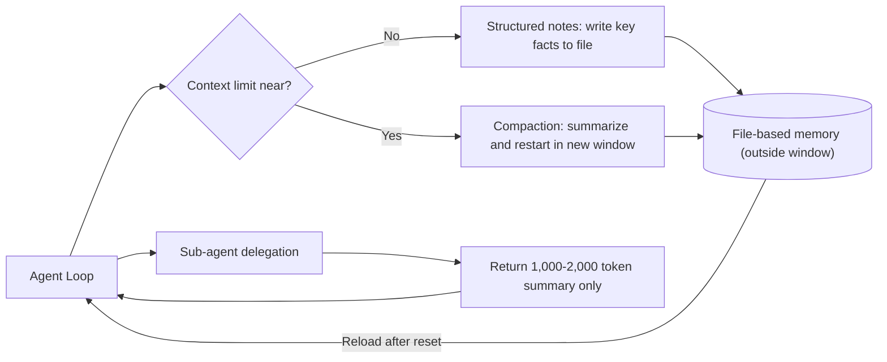

Anyone who has run LLM agents for extended periods hits the same wall. As conversations grow longer, agents start forgetting commitments made earlier and ignoring rules established at the start. The common prescription is "a bigger context window will fix it." That diagnosis is wrong. The real problem is not the size of the window but how the tokens inside it are managed - that is context engineering. This post covers four proven techniques for helping long-running agents work beyond context limits, and shows how ThakiCloud has woven them into real agent operations.

## Overview

Context engineering is the next step beyond prompt engineering. Where prompt engineering focused on what words to write, context engineering is about which tokens to fill a model's limited attention budget with at inference time. Everything is in scope: system instructions, tool definitions, MCP, external data, and the full message history. Agents generate new data with every loop iteration, and that information must be refined periodically.

Why save tokens? LLMs lose focus past a certain point, just like people do. The degradation in a model's ability to accurately recall information as token count grows is called context rot. It appears in every model, to varying degrees. The root cause is the transformer architecture: every token attends to every other token, so n tokens produce n-squared relationships. The longer the context, the more diluted the attention budget becomes. Context is therefore not infinite storage - it is a finite resource. The goal is finding the minimum set of high-signal tokens most likely to produce the desired output.

## The Structure of the Agent Memory Problem

A long-running task must maintain coherence and goal-directedness across a sequence of actions that far exceeds the context window - think large codebase migrations or multi-hour research sessions. Simply piling everything into the window collapses under context rot. The answer is moving information out of the window and pulling it back only when needed. The diagram below shows the skeleton of this approach.



The goal of this structure is simple: isolate detailed working context outside the window and keep only the high-signal tokens needed for decisions inside the main agent's window.

## The Four Techniques

### Compaction

Compaction summarizes the context window when it approaches its limit and restarts a new window from that summary. It is the first lever for improving long-range coherence. The key is a high-fidelity summary: dense compression of the window's contents lets the agent continue with minimal performance degradation. Claude Code, for example, implements this by passing the message history to the model to summarize and compress the most important details. Done well, the agent continues its work with practically no interruption.

### Structured Note-taking

Structured note-taking means the agent writes key information to a file outside the context window during work, and reads it back later. Even after a context reset, the agent reads its own notes and picks up a multi-hour task where it left off. This cross-reset coherence makes long-range strategies possible that would otherwise require holding everything in the window at once. The principle is the same as a person taking notes during a meeting and recovering context from those notes at the next meeting.

### Sub-agent Architecture

Sub-agents are another path around context limits. Instead of one agent carrying the entire project state, specialized sub-agents take on narrow tasks with clean context windows. The main agent orchestrates at a high level; sub-agents handle deep technical work or exploration. Each sub-agent can range widely using tens of thousands of tokens, but returns only a refined summary of 1,000 to 2,000 tokens to the main agent. Detailed exploration context stays isolated inside the sub-agent, and the main agent's window stays clean and focused on decisions.

### File-based Memory Tools

Alongside the Sonnet 4.5 release, Anthropic opened file-based memory tools as a public beta on the Claude developer platform. These tools use the file system to store information outside the context window and make it easy to reference later. With them, agents can build a knowledge base over time, maintain project state across sessions, and reference prior work without holding everything in the window. If the first three techniques are principles, this tool is their implementation wrapped in a standard interface.

## Comparison with Simpler Approaches

To see the value of these techniques, it helps to compare them with common alternatives. The first alternative is stuffing everything into a large context window. It is simple, but it collapses under context rot, and re-reading the entire history every turn makes costs grow linearly. The second alternative is vector-search-based RAG. RAG is strong for pulling in external knowledge, but awkward for handling state that the agent itself created during work - intermediate decisions, progress, self-written notes. RAG is optimized for reading, not for writing and updating.

File-based memory and structured notes fill that gap, because they provide a state store the agent can write to, update, and read back after a reset. A related principle is just-in-time retrieval: rather than loading all information into the window up front, the agent holds only lightweight identifiers - file paths, index entries - and reads the full content only when it is actually needed. Compaction, notes, sub-agents, and just-in-time retrieval are not mutually exclusive; they compound when used together.

## How ThakiCloud Applies This

These four techniques are not abstract theory. They are the backbone of the agent operations ThakiCloud runs every day. Our internal agent harness implements a file-based memory architecture in three layers. A `MEMORY.md` index loaded every session holds one-line pointers; detailed facts live in `memory/topics/`; long work records go in `memory/sessions/`. Loading only the index into context and pulling detail on demand is precisely the combination of structured note-taking, file-based memory, and just-in-time retrieval.

The index looks roughly like this - a collection of one-line pointers:

```markdown
- [Model Routing](feedback_model_routing.md) - sub-agent model stacking: low-cost for exploration, mid-tier for implementation, high-cost for architecture
- [Hermes Ecosystem](project_hermes_ecosystem.md) - installation record for the standalone agent framework
```

Each entry holds one fact per file, with links to other memory files from within the body. A session reads only this index, and expands the body of a relevant entry only at the moment it is needed. When new facts appear, existing files are updated. Memory that turns out to be wrong is deleted. This hygiene prevents corrupted notes from propagating.

Sub-agent delegation follows the same pattern. Full codebase scans or large searches are not done in the main context; they are delegated to a low-cost-model sub-agent that returns only a summary of conclusions. Never dumping the raw output into the main context matches exactly what Anthropic describes: "sub-agents return only a 1,000-to-2,000-token summary." This prevents the cache re-read cost of the main session from growing linearly.

Compaction is also embedded in operational discipline. We keep context usage below 40% and recommend running manual compaction before it hits 60%. Compressing with an intentional focus before auto-compaction kicks in produces higher fidelity. In a multi-tenant environment this is not just a quality concern but a cost concern. A massive context re-read on every turn makes cache-read tokens a large fraction of total cost. Treating context as a finite resource is the path to lower per-inference cost.

From a platform perspective, agent memory is a core capability ThakiCloud needs to run long-lived agents for multiple customers reliably on shared infrastructure. An agent that maintains state across sessions while keeping its context light is itself a deployable product. The ability to isolate this memory layer per tenant on a Kubernetes-based multi-tenant platform is a key differentiator in what we offer.

## Limitations and Counterarguments

Every technique has costs. Compaction loses information in the summarization step. Choosing poorly what to discard can derail later work. High-fidelity summarization is itself a hard problem, and results depend heavily on the quality of the summarization prompt.

Structured notes and file-based memory propagate corruption when notes go wrong. A fact written incorrectly to a file gets treated as truth by every subsequent session. That means a gate for what gets written into memory is necessary, along with hygiene work to clean up stale facts.

Sub-agents become overhead when the boundaries of delegation are drawn wrong. Delegating single-file edits or simple lookups to a sub-agent adds dispatch cost rather than saving context. Delegation is a tool for main-context hygiene, not the default for every task.

Finally, it is worth acknowledging honestly that as models get smarter, the need for these prescriptions decreases. Already, stronger models exhibit more autonomy with less prescriptive engineering. Even so, the principle of treating context as a finite resource will remain even as capability grows. The specific techniques may evolve, but the direction of conserving attention budget stays valid.

## Sources

- Anthropic, "Effective context engineering for AI agents" (2025-09-29): [https://www.anthropic.com/engineering/effective-context-engineering-for-ai-agents](https://www.anthropic.com/engineering/effective-context-engineering-for-ai-agents)
- Anthropic, Memory and Context Management Cookbook: [https://platform.claude.com/cookbook/tool-use-memory-cookbook](https://platform.claude.com/cookbook/tool-use-memory-cookbook)
